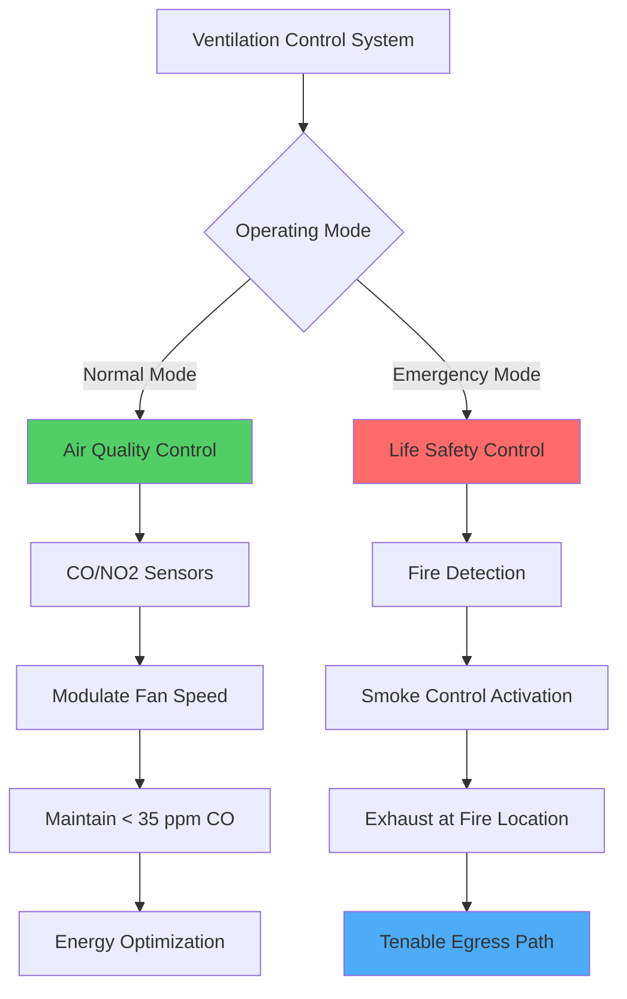

Enclosed vehicular facilities present unique ventilation challenges due to continuous emission of combustion products and particulates from internal combustion engines. Unlike conventional buildings where occupant-generated loads dominate, these spaces require ventilation systems specifically designed to dilute toxic gases, remove particulate matter, and provide life-safety protection during fire emergencies.

## Fundamental Ventilation Physics

The dilution of contaminants in enclosed vehicular spaces follows mass balance principles. For a control volume with uniform mixing, the contaminant concentration rate of change is:

$$\frac{dC}{dt} = \frac{G - Q \cdot C}{V}$$

Where:
- $C$ = contaminant concentration (ppm or mg/m³)
- $G$ = generation rate (volume/time or mass/time)
- $Q$ = ventilation airflow rate (m³/s)
- $V$ = space volume (m³)

At steady-state ($\frac{dC}{dt} = 0$), the required ventilation to maintain concentration $C_{max}$ is:

$$Q_{required} = \frac{G}{C_{max}}$$

This relationship drives all ventilation rate calculations for vehicular facilities, with generation rate $G$ determined by traffic volume, vehicle type distribution, and emission factors.

## Types of Vehicular Contaminants

Vehicular emissions contain multiple hazardous constituents requiring control:

| Pollutant | Primary Source | Health Effect | Typical Limit | Detection Method |
|-----------|---------------|---------------|---------------|------------------|
| Carbon Monoxide (CO) | Incomplete combustion | Hemoglobin binding, asphyxiation | 35 ppm (1-hr) | Electrochemical sensor |
| Nitrogen Dioxide (NO₂) | High-temperature combustion | Respiratory irritation | 0.5 ppm (1-hr) | Chemiluminescence |
| Particulate Matter (PM2.5) | Diesel exhaust, tire/brake wear | Respiratory/cardiovascular | 35 μg/m³ (24-hr) | Optical/gravimetric |
| Volatile Organics (VOCs) | Unburned hydrocarbons | Carcinogenic, odor | Variable | Photoionization |

**Carbon monoxide** traditionally serves as the index pollutant for gasoline-powered vehicle fleets because it correlates with other combustion products and has well-established detection technology. The CO generation rate per vehicle is:

$$G_{CO} = \sum_{i} (n_i \cdot EF_i \cdot S_i)$$

Where $n_i$ is vehicle count by type, $EF_i$ is emission factor (g/km), and $S_i$ is travel speed. Modern diesel-heavy fleets require **NO₂ and PM monitoring** as these emissions have different generation profiles than CO.

## Facility-Specific Design Requirements

### Road Tunnels

NFPA 502 *Standard for Road Tunnels, Bridges, and Other Limited Access Highways* establishes ventilation requirements based on tunnel length, grade, traffic volume, and emergency scenarios.

**Normal ventilation** maintains air quality during routine operation. The required airflow for longitudinal tunnels is:

$$Q = \frac{G_{total}}{C_{allowable} - C_{ambient}} + Q_{makeup}$$

Longitudinal ventilation uses jet fans to create unidirectional flow, effective for tunnels under 1 km with grades under 3%. The critical velocity to prevent smoke backlayering during fire is approximately:

$$V_{critical} = K \cdot (g \cdot H \cdot Q_{fire})^{1/3}$$

Where $K$ is empirical coefficient (typically 0.6-0.8), $g$ is gravitational acceleration, $H$ is tunnel height, and $Q_{fire}$ is heat release rate.

**Transverse and semi-transverse systems** use supply and exhaust ducts with multiple ports, providing better air quality control for longer tunnels but requiring significant infrastructure.

### Parking Garages

ASHRAE Standard 62.1 and the International Mechanical Code provide prescriptive requirements, typically 0.075 cfm/ft² (75 L/s per 1000 m²) of floor area, equivalent to 6 air changes per hour for standard ceiling heights.

**Demand-controlled ventilation (DCV)** reduces energy consumption by modulating fan speed based on CO sensor readings, typically controlling to 25-35 ppm average concentration. The energy savings factor is:

$$SF = 1 - \frac{t_{occupied}}{t_{total}} \cdot \frac{C_{design}}{C_{limit}}$$

Natural ventilation through wall openings can provide code-compliant ventilation for above-grade facilities when total opening area equals 2.5% of floor area, distributed on at least two opposite walls. The effective natural ventilation rate depends on wind speed and thermal buoyancy:

$$Q_{natural} = C_d \cdot A \cdot \sqrt{2 \cdot g \cdot H \cdot \frac{\Delta T}{T_{avg}}}$$

Where $C_d$ is discharge coefficient (0.6-0.65), $A$ is opening area, and $\Delta T$ is inside-outside temperature difference.

### Bus Terminals and Maintenance Facilities

These facilities experience higher emission loading than parking garages due to larger diesel engines and extended idling periods. Design criteria include:

- **Higher ventilation rates**: 1.5-2.5 cfm/ft² (150-250 L/s per 1000 m²)
- **Source capture**: Local exhaust at tail pipes during maintenance (300-500 cfm per vehicle)
- **Stratification management**: Diesel exhaust is warmer than ambient, creating ceiling accumulation requiring high-level exhaust

The effective exhaust capture efficiency for source capture systems is:

$$\eta = \frac{Q_{capture}}{Q_{capture} + 10 \cdot V_{crossdraft} \cdot A_{source}}$$

Highlighting the importance of minimizing cross-drafts in maintenance areas.

## Normal vs Emergency Ventilation Modes

Ventilation systems for enclosed vehicular facilities operate in distinct modes:

**Normal mode** prioritizes energy efficiency while maintaining acceptable air quality:
- Variable speed operation based on sensor feedback
- Minimum ventilation during low-occupancy periods
- Economizer operation when ambient conditions favorable

**Emergency mode** prioritizes life safety during fire events:
- Override to full capacity or specific fire mode sequence
- Smoke exhaust from fire zone at rates of 6-10 air changes per hour
- Pressurization of egress routes to prevent smoke infiltration
- Maintain temperatures below 60°C in egress paths

The transition between modes occurs automatically upon fire alarm activation, with manual override capability for fire command centers.

## Design Considerations and System Selection

Selection of ventilation strategy depends on multiple factors:

**Longitudinal systems** (jet fans):
- Lower capital cost
- Minimal space requirements
- Effective for shorter tunnels
- Limited air quality control
- Challenged by congested traffic (zero velocity)

**Transverse/semi-transverse systems**:
- Superior air quality control
- Effective for all tunnel lengths
- Higher capital and space requirements
- Better emergency mode control
- Higher maintenance complexity

**Hybrid approaches** combine longitudinal normal mode operation with transverse emergency exhaust, balancing cost and performance.

Critical design parameters include:
- **Traffic volume and composition**: Determines contaminant generation
- **Grade**: Affects vehicle emissions and natural stratification
- **Length**: Influences system selection and emergency egress time
- **Ambient conditions**: Affects natural ventilation potential and thermal loads
- **Local code requirements**: May mandate specific approaches or safety factors

Modern facilities increasingly incorporate **real-time air quality monitoring** with dynamic control algorithms that optimize energy consumption while ensuring compliance with exposure limits. Integration with traffic management systems allows predictive control based on expected vehicle counts rather than reactive response to concentration increases.

**Fire detection and suppression integration** represents the critical life-safety component, with ventilation system control sequences developed through computational fluid dynamics (CFD) modeling of fire scenarios to ensure tenable conditions during evacuation and firefighting operations.

