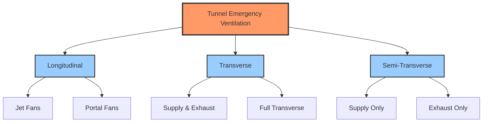
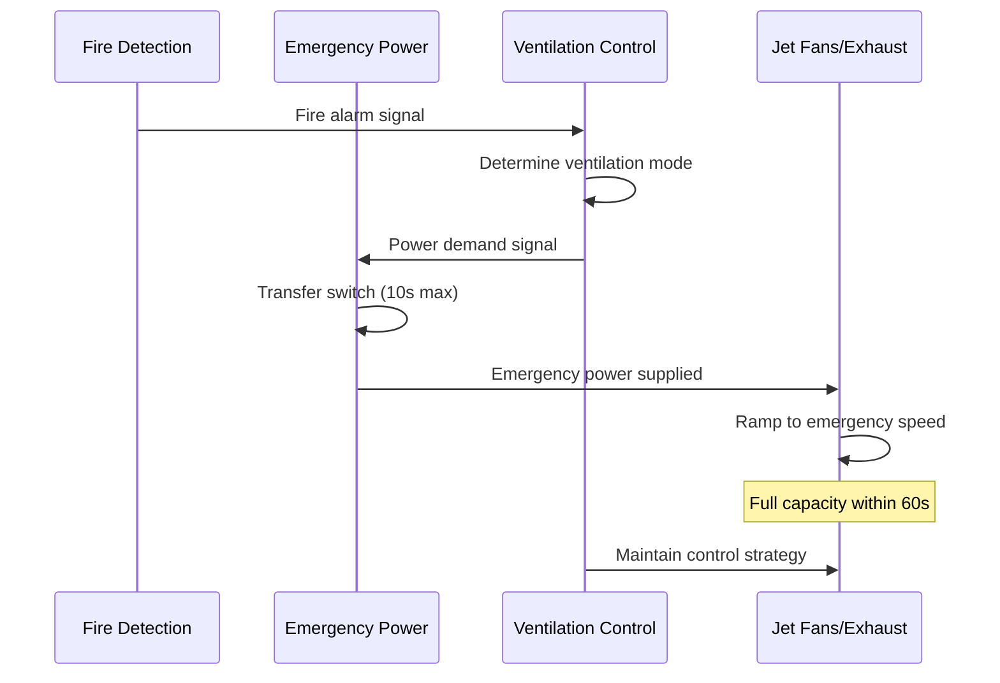

# Emergency Ventilation Systems for Tunnels

Emergency ventilation systems in vehicular tunnels serve a singular critical objective: maintaining tenable conditions that enable safe egress during fire emergencies. Unlike normal ventilation systems that manage air quality and remove vehicle emissions, emergency systems must control smoke movement through powerful fluid dynamics principles while maintaining integration with fire detection, suppression, and power infrastructure.

## Life Safety Objectives

The primary life safety objectives for tunnel emergency ventilation are stratified by time and location:

1. **Upstream protection**: Maintain smoke-free conditions in the direction of egress travel
2. **Tenable environment**: Limit smoke layer descent, CO concentration, visibility reduction, and radiant heat exposure
3. **Firefighter access**: Enable emergency responders to approach the fire location
4. **Property protection**: Secondary objective to minimize fire spread and structural damage

NFPA 502 establishes that emergency ventilation must maintain visibility of at least 30 ft (10 m) in egress paths and limit CO concentrations below 1,400 ppm for exposure durations under 30 minutes.

## Smoke Control Strategies

### Critical Velocity Method

For longitudinal ventilation systems, the critical velocity represents the minimum airflow velocity required to prevent backlayering of smoke against the airflow direction. The Memorial Tunnel Fire Ventilation Test Program established the fundamental relationship:

$$V_c = K \left(\frac{gHQ}{\rho_a C_p T_a A}\right)^{1/3}$$

Where:
- $V_c$ = critical velocity (m/s)
- $K$ = dimensionless constant (0.61 for zero-grade tunnels)
- $g$ = gravitational acceleration (9.81 m/s²)
- $H$ = height of smoke layer below ceiling (m)
- $Q$ = fire heat release rate (kW)
- $\rho_a$ = ambient air density (kg/m³)
- $C_p$ = specific heat of air (1.005 kJ/kg·K)
- $T_a$ = ambient absolute temperature (K)
- $A$ = tunnel cross-sectional area (m²)

For a typical highway tunnel with 50 MW fire (passenger vehicle), critical velocity ranges from 2.5 to 3.5 m/s depending on tunnel geometry and grade.

### Ventilation System Types

| System Type | Smoke Control Method | Typical Application | Control Complexity |
|-------------|---------------------|---------------------|-------------------|
| Longitudinal | Critical velocity maintenance | Short tunnels (<1,500 m) | Low |
| Transverse | Distributed extraction | Long tunnels, high traffic | High |
| Semi-transverse | Point extraction or dilution | Medium tunnels | Medium |

### Point Extraction Systems

Point extraction systems utilize strategically located exhaust points to remove smoke near the fire source. The required extraction rate follows:

$$\dot{m}_e = \frac{Q}{C_p \Delta T_e}$$

Where:
- $\dot{m}_e$ = exhaust mass flow rate (kg/s)
- $Q$ = fire heat release rate (kW)
- $\Delta T_e$ = temperature rise of extracted smoke (typically 200-400 K)

Effective point extraction requires damper actuation within 60 seconds of fire detection to capture smoke before significant stratification breakdown occurs.

## Integration with Fire Detection and Suppression

### Detection System Interface

Emergency ventilation activation depends on rapid fire detection through multiple sensor technologies:

**Detection Technology Comparison:**

| Sensor Type | Response Time | False Alarm Rate | Tunnel Suitability |
|-------------|---------------|------------------|-------------------|
| Linear heat detection | 30-90 seconds | Very Low | High |
| CCTV with video analytics | 15-45 seconds | Medium | High |
| CO differential | 60-180 seconds | Medium | Medium |
| Flame detection (IR/UV) | 5-15 seconds | Low | Medium |

The ventilation control system must receive discrete alarm signals from the fire alarm control panel (FACP) and initiate the appropriate emergency mode without manual intervention. NFPA 502 requires automatic activation with manual override capability.

### Suppression System Coordination

Water-based fire suppression systems (deluge, water mist) introduce critical interactions with ventilation:

- **Water mist cooling**: Reduces buoyancy, causing smoke logging if ventilation velocities are insufficient
- **Spray momentum**: High-velocity water droplets can disrupt smoke stratification
- **Steam generation**: Adds mass flow to smoke layer, potentially overwhelming extraction capacity

The ventilation system design must account for suppression system operation, typically requiring 20-30% increased airflow capacity to maintain control.

## Emergency Power Requirements

Tunnel emergency ventilation systems require standby power with specific performance criteria:

**NFPA 502 Emergency Power Standards:**

- Transfer time: 10 seconds maximum from power loss to emergency supply
- Fuel capacity: Minimum 4 hours full-load operation
- Automatic weekly testing with failure annunciation
- Load capacity: 100% of emergency ventilation demand plus life safety lighting

Generator sizing must account for simultaneous starting inrush currents when multiple large fans activate. Typical diversity factor is 0.75 for systems with more than 4 fans.

## Control System Reliability

The ventilation control system constitutes a critical life safety system requiring high reliability:

**Reliability Architecture:**

- **Redundancy**: Dual programmable logic controllers (PLCs) with hot standby failover
- **Communication**: Redundant fiber optic networks with automatic switchover
- **Power**: Dual power feeds from separate emergency power sources
- **Sensors**: Multiple sensors per zone with voting logic (2-out-of-3)

Mean Time Between Failures (MTBF) for the complete control system should exceed 50,000 hours with single-point failure tolerance.

Control algorithms must execute mode changes smoothly to avoid pressure transients that can destratify smoke. Ramp rates for fan speed changes should not exceed 10% per second.

## Testing and Commissioning

### Functional Performance Tests

Commissioning of emergency ventilation systems requires progressive verification:

1. **Component verification**: Individual fan performance curves, damper stroke time, sensor calibration
2. **Subsystem testing**: Zone control verification, mode transition sequences
3. **Full-system cold smoke tests**: Non-fire tracer gas testing to verify airflow patterns
4. **Hot smoke test (if required)**: Controlled fire testing under regulatory observation

The critical velocity test procedure involves:
- Establish target longitudinal velocity
- Deploy smoke tracers at multiple locations
- Verify zero backlayering over 10-minute stabilization period
- Document velocity profile across tunnel cross-section

### Acceptance Criteria

| Parameter | NFPA 502 Requirement | Verification Method |
|-----------|---------------------|---------------------|
| Activation time | ≤60 seconds from alarm | Time-stamped sequence of events |
| Critical velocity achievement | Design value ±10% | Velocity traverse measurements |
| Backlayering distance | Zero with design fire | Smoke visualization |
| Control system response | Mode change within 30s | Logic simulation testing |
| Emergency power transfer | ≤10 seconds | Simulated power failure |

Annual testing must verify continued compliance with original acceptance criteria. Any modifications to tunnel geometry, traffic patterns, or ventilation equipment require engineering re-evaluation of the emergency ventilation adequacy.

## Conclusion

Tunnel emergency ventilation systems represent the intersection of fluid dynamics, fire science, and control system engineering. The physics-based design approach centered on critical velocity and smoke extraction ensures that these systems fulfill their life safety mission while integrating seamlessly with detection, suppression, and emergency power infrastructure. Rigorous testing and commissioning validate that theoretical design translates to reliable real-world performance when lives depend on it.
