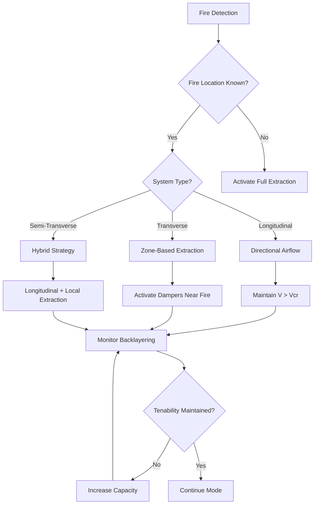
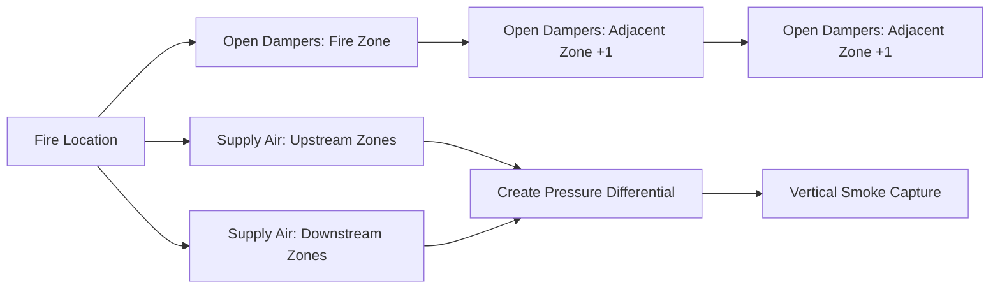
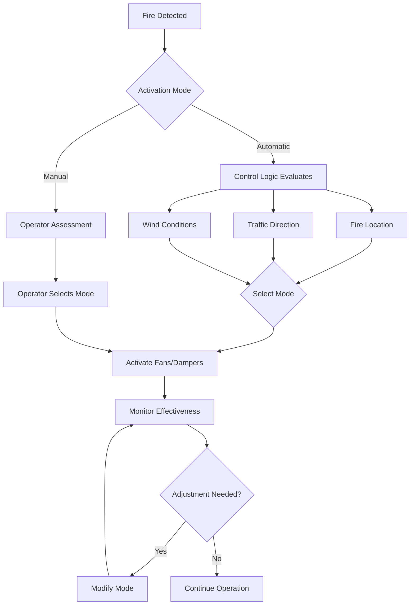

Emergency ventilation modes represent critical fire life safety systems that activate upon detection of fire conditions within vehicular tunnels. Unlike normal ventilation that maintains air quality and removes vehicle emissions, emergency modes prioritize smoke control to maintain tenability for occupant egress and provide firefighter access paths. The selection and implementation of emergency ventilation strategies depend fundamentally on tunnel geometry, traffic patterns, and the physics of buoyant smoke movement.

## Smoke Movement Physics in Fire Conditions

Fire-generated smoke behaves as a buoyant plume driven by temperature differential and momentum. The volumetric smoke production rate scales with fire heat release rate according to:

$$\dot{V}_s = 0.071 \cdot \dot{Q}_c^{1/3} \cdot (z - z_0)^{5/3}$$

where $\dot{V}_s$ is smoke volume flow rate (m³/s), $\dot{Q}_c$ is convective heat release rate (kW), $z$ is height above fire source (m), and $z_0$ is virtual origin height. This relationship demonstrates that smoke production increases rapidly with fire intensity, requiring proportional ventilation capacity.

In tunnel configurations, smoke stratification occurs when buoyancy forces exceed mixing forces from ventilation. The critical velocity to prevent smoke backlayering in longitudinal systems is:

$$V_{cr} = K_1 \cdot K_g \cdot \left(\frac{g \cdot \dot{Q}_c \cdot H}{C_p \cdot \rho_{\infty} \cdot T_{\infty} \cdot W}\right)^{1/3}$$

where $K_1$ is a dimensionless factor (typically 0.606), $K_g$ accounts for grade effects, $g$ is gravitational acceleration (9.81 m/s²), $H$ is tunnel height (m), $W$ is tunnel width (m), $C_p$ is specific heat of air (1.005 kJ/kg·K), $\rho_{\infty}$ is ambient air density (kg/m³), and $T_{\infty}$ is ambient temperature (K).

## Emergency Mode Classification

### Longitudinal Emergency Ventilation

Longitudinal systems establish unidirectional airflow along the tunnel axis to prevent smoke backlayering upstream of the fire. This approach relies on maintaining airflow velocity above the critical velocity throughout the affected tunnel section.

**Operational Characteristics:**

| Parameter | Typical Range | Design Basis |
|-----------|--------------|--------------|
| Critical Velocity | 2.5-3.5 m/s | 100-300 MW HRR |
| Response Time | 30-120 seconds | Fan acceleration |
| Smoke Confinement | Downstream only | Physics-based |
| Tenable Length | 100-400 m upstream | CFD validation |

The momentum equation governing longitudinal flow with heat addition from fire is:

$$\frac{dP}{dx} = -\rho \cdot V \cdot \frac{dV}{dx} - \rho \cdot g \cdot \sin(\theta) - \frac{f \cdot \rho \cdot V^2}{2 \cdot D_h} + \frac{\dot{Q}_c}{A \cdot C_p \cdot T}$$

This relationship shows that maintaining velocity requires overcoming pressure losses from acceleration, gravitational effects on grade, wall friction, and thermal expansion from heat addition.

### Transverse Emergency Ventilation

Transverse systems extract smoke through ceiling-mounted dampers or exhaust points located near the fire, while supplying fresh air at roadway level. This configuration creates a vertical airflow pattern that captures smoke before significant longitudinal spread.

**Extraction Zone Configuration:**

The required extraction rate per unit tunnel length is determined by:

$$\dot{V}_{extract} = \frac{\dot{Q}_c}{C_p \cdot \rho_{\infty} \cdot (T_{smoke} - T_{\infty})} + V_{makeup} \cdot A_{tunnel}$$

where $T_{smoke}$ is smoke layer temperature (typically 400-600°C near fire) and $V_{makeup}$ is makeup air velocity at roadway level (0.5-1.5 m/s).

## Fire Location Detection Impact

Emergency mode effectiveness depends critically on accurate fire location detection. Modern systems employ multiple detection technologies:

| Detection Method | Response Time | Location Accuracy | Reliability Factor |
|------------------|---------------|-------------------|-------------------|
| Linear Heat Detection | 10-30 seconds | ±10 m | High (0.95-0.99) |
| Video Image Detection | 20-60 seconds | ±20 m | Medium (0.85-0.95) |
| Air Sampling (VESDA) | 30-90 seconds | ±50 m | High (0.90-0.98) |
| CO Detection Array | 60-180 seconds | ±100 m | Medium (0.80-0.90) |

Inaccurate location detection can result in smoke extraction from incorrect zones, potentially drawing smoke through occupied escape routes. The probability of correct mode selection $P_{correct}$ relates to detection accuracy through:

$$P_{correct} = 1 - \left(\frac{\Delta x_{error}}{L_{zone}}\right) \cdot e^{-\lambda \cdot t_{response}}$$

where $\Delta x_{error}$ is location error, $L_{zone}$ is ventilation zone length, $\lambda$ is fire growth rate (s⁻¹), and $t_{response}$ is system response time.

## Fan Reversal Capabilities

Reversible jet fans or main ventilation fans enable adaptation to fire location relative to portal positions. The reversal process involves:

1. **Deceleration Phase**: Reduce running fans to zero speed (15-45 seconds)
2. **Starter Changeover**: Switch motor electrical connections (5-15 seconds)
3. **Acceleration Phase**: Ramp fans to target speed in reverse direction (30-90 seconds)

Total reversal time typically ranges from 60-180 seconds, during which airflow velocity may drop below critical velocity, allowing temporary smoke backlayering. The momentum change required is:

$$\Delta (m \cdot V) = \rho \cdot A \cdot L \cdot (V_{final} - V_{initial})$$

For a 1000 m tunnel section reversing from +3 m/s to -3 m/s, this represents substantial fluid momentum that cannot be changed instantaneously.

## Automatic versus Manual Activation

**Comparison of Control Strategies:**

| Aspect | Automatic Control | Manual Control |
|--------|------------------|----------------|
| Response Time | 30-90 seconds | 120-300 seconds |
| Mode Accuracy | 92-98% (algorithm dependent) | 85-95% (operator dependent) |
| Adaptability | Limited to programmed scenarios | High flexibility |
| Reliability | Dependent on sensor network | Dependent on operator presence |
| NFPA 502 Compliance | Satisfies rapid response requirement | Requires backup automation |

NFPA 502 mandates automatic initiation of emergency ventilation within a timeframe that prevents untenable conditions in egress paths. Purely manual systems typically cannot meet this requirement due to detection delays and operator decision time. Best practice implementations use automatic activation with manual override capability, allowing operators to modify the emergency mode based on real-time video surveillance and fire department coordination.

## Mode Selection Decision Matrix

The optimal emergency mode depends on tunnel-specific factors:

| Tunnel Characteristic | Preferred Mode | Rationale |
|----------------------|----------------|-----------|
| Length < 500 m | Natural ventilation or longitudinal | Simple, cost-effective |
| Length 500-1500 m | Longitudinal with jet fans | Critical velocity achievable |
| Length > 1500 m | Transverse or semi-transverse | Smoke confinement limits |
| Bidirectional traffic | Transverse | Unpredictable fire location |
| Steep grade (>4%) | Transverse or uphill longitudinal | Grade aids smoke movement |
| High traffic volume | Transverse with zone control | Maximizes tenable egress area |

Emergency ventilation mode selection fundamentally balances the physics of smoke movement, system reliability requirements, and life safety objectives to create tenable conditions for occupant evacuation and emergency responder access during tunnel fire incidents.
