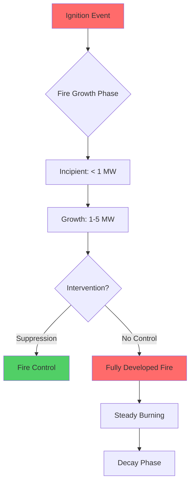
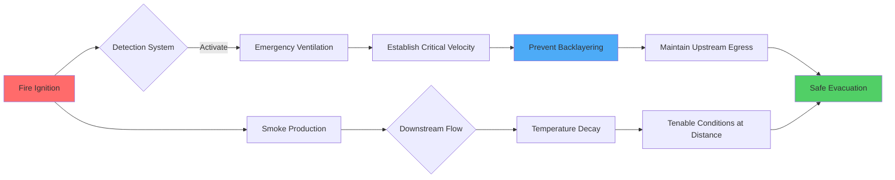

## Design Fire Heat Release Rate

The heat release rate (HRR) defines the thermal energy output from a fire and drives all tunnel ventilation design calculations. HRR directly determines convective heat transfer to air, buoyancy-driven smoke flow, and required ventilation capacity.

### Fire Size Categories

Design fire scenarios are classified by vehicle type and cargo, with HRR values established through full-scale fire tests and incident data analysis.

| Vehicle Type | Design HRR | Basis | NFPA 502 Reference |
|--------------|-----------|-------|-------------------|
| Passenger car | 5 MW | Single vehicle fire | Section 4.3.1 |
| Bus | 20-30 MW | High fuel load, multiple seats | Section 4.3.2 |
| Heavy goods vehicle (HGV) | 20-100 MW | Cargo dependent | Section 4.3.3 |
| Tanker fire | 200-300 MW | Hydrocarbon pool fires | Special analysis required |

The passenger car design fire of 5 MW represents peak burning with all combustible materials (seats, plastics, fuel) involved. Modern vehicles with increased plastic content may approach 8-10 MW, but 5 MW remains the industry standard for design.

HGV fires exhibit wide variability based on cargo. A tractor-trailer carrying inert goods produces approximately 20 MW, while flammable cargo (furniture, packaged goods) can reach 50-100 MW. The 100 MW scenario represents a severe credible event used for life safety system design.

## Fire Growth Characteristics

Fire growth follows predictable patterns based on ignition source strength and fuel arrangement. The t-squared fire model describes growth rate.

### T-Squared Fire Model

The heat release rate increases proportionally to time squared during the growth phase:

$$Q(t) = \alpha t^2$$

where:
- $Q(t)$ = heat release rate at time $t$ (kW)
- $\alpha$ = fire growth coefficient (kW/s²)
- $t$ = time from ignition (s)

Growth coefficients are classified by burning intensity:

| Growth Rate | α (kW/s²) | Time to 1 MW | Application |
|-------------|-----------|--------------|-------------|
| Slow | 0.00293 | 585 s (~10 min) | Difficult ignition materials |
| Medium | 0.0117 | 293 s (~5 min) | Wood pallets, ordinary combustibles |
| Fast | 0.0466 | 147 s (~2.5 min) | Upholstered furniture, stacked goods |
| Ultrafast | 0.1874 | 73 s (~1.2 min) | Flammable liquids, high-surface-area plastics |

Vehicle fires typically exhibit fast growth for passenger cars (plastic interiors, upholstery) and medium-to-fast growth for HGVs depending on cargo accessibility.

The time to reach design HRR determines detection requirements and available egress time:

$$t_{design} = \sqrt{\frac{Q_{design}}{\alpha}}$$

For a 5 MW passenger car fire with fast growth:

$$t_{design} = \sqrt{\frac{5000}{0.0466}} = 328 \text{ s} \approx 5.5 \text{ min}$$

This growth period establishes the timeframe for occupant notification, decision-making, and evacuation initiation.

## Smoke Production and Mass Flow

Combustion generates smoke at rates proportional to HRR and fuel composition. The smoke production rate drives volumetric flow requirements for ventilation systems.

### Convective Heat Release

Only the convective portion of total HRR contributes to smoke buoyancy and temperature rise:

$$Q_c = \chi_c Q_{total}$$

where $\chi_c$ is the convective fraction (typically 0.6-0.7 for vehicle fires).

### Smoke Mass Flow Rate

The mass flow rate of smoke at the fire source is calculated from convective heat release:

$$\dot{m} = \frac{Q_c}{c_p \Delta T}$$

where:
- $\dot{m}$ = smoke mass flow rate (kg/s)
- $Q_c$ = convective HRR (kW)
- $c_p$ = specific heat of air (1.005 kJ/kg·K)
- $\Delta T$ = temperature rise above ambient (K)

For a 5 MW passenger car fire with $\chi_c = 0.7$ and $\Delta T = 600$ K:

$$\dot{m} = \frac{0.7 \times 5000}{1.005 \times 600} = 5.8 \text{ kg/s}$$

Converting to volumetric flow at average smoke temperature (300°C above ambient):

$$\dot{V} = \frac{\dot{m}}{\rho} = \frac{5.8}{0.62} \approx 9.4 \text{ m}^3/\text{s} = 19,900 \text{ cfm}$$

This represents the minimum extraction rate required to remove smoke at the production rate, without accounting for backlayering prevention.

## Critical Velocity for Backlayering Control

Critical velocity is the minimum longitudinal air velocity required to prevent smoke from traveling upstream against the ventilation flow (backlayering). Backlayering blocks escape routes and must be prevented.

### Physical Basis

Smoke rises due to buoyancy from thermal expansion. Longitudinal airflow exerts drag force on the smoke plume. Critical velocity occurs when drag force equals buoyancy force, confining smoke to the downstream side.

The buoyancy force per unit volume:

$$F_b = \rho_{\infty} g \left(1 - \frac{T_{\infty}}{T_s}\right)$$

The drag force from airflow:

$$F_d = \frac{1}{2} \rho_{\infty} C_d v^2$$

### Memorial Tunnel Critical Velocity Equation

Based on full-scale fire tests in the Memorial Tunnel (1995), the critical velocity is:

$$V_{crit} = K_1 K_g \left(\frac{Q}{W}\right)^{1/3}$$

where:
- $V_{crit}$ = critical velocity (m/s)
- $K_1$ = dimensional constant = 0.606 for SI units
- $K_g$ = grade factor accounting for tunnel slope
- $Q$ = convective HRR (kW)
- $W$ = tunnel width (m)

For tunnels with grade:

$$K_g = \left(1 + 0.04G\right)^{0.5}$$

where $G$ is the grade in percent (positive for uphill flow direction).

### Design Example

For a 10 m wide tunnel, 3% upward grade, 5 MW fire ($Q_c = 3.5$ MW):

$$K_g = \sqrt{1 + 0.04(3)} = \sqrt{1.12} = 1.058$$

$$V_{crit} = 0.606 \times 1.058 \times \left(\frac{3500}{10}\right)^{1/3} = 0.641 \times 7.05 = 4.52 \text{ m/s}$$

Design velocity typically includes a safety factor of 1.25-1.5:

$$V_{design} = 1.25 \times 4.52 = 5.65 \text{ m/s} \approx 1,115 \text{ fpm}$$

| Fire Size (MW) | Tunnel Width (m) | Critical Velocity (m/s) | Design Velocity (m/s) |
|----------------|------------------|------------------------|----------------------|
| 5 (car) | 8 | 4.9 | 6.1 |
| 5 (car) | 12 | 4.2 | 5.3 |
| 20 (HGV) | 8 | 7.4 | 9.3 |
| 20 (HGV) | 12 | 6.4 | 8.0 |
| 100 (HGV) | 12 | 11.3 | 14.1 |

Critical velocity increases with fire size (HRR^1/3 relationship) and decreases with tunnel width. Wider tunnels require lower velocities due to reduced smoke layer velocity and buoyancy effects.

## Tenable Conditions and Evacuation Criteria

Tenability defines environmental conditions survivable by evacuating occupants. Design limits ensure occupants can reach safety before conditions become untenable.

### Tenability Limits

| Parameter | Tenable Limit | Basis |
|-----------|---------------|-------|
| Temperature | 60°C at 2 m height | Thermal tolerance, respiratory pain |
| Visibility | 10 m | Wayfinding, reduced walking speed |
| CO concentration | 1,500 ppm for 30 min | Incapacitation threshold |
| Oxygen depletion | 15% O₂ | Cognitive impairment onset |

Temperature at head height (2 m) is the primary design criterion. The smoke layer temperature decreases with distance from the fire due to heat loss to tunnel surfaces and air entrainment.

### Temperature Decay

Longitudinal ventilation cools smoke through mixing and surface heat transfer. Empirical correlations from tunnel fire tests:

$$\Delta T(x) = \Delta T_{max} \exp\left(-\frac{x}{L_d}\right)$$

where:
- $\Delta T(x)$ = temperature rise at distance $x$ from fire (K)
- $\Delta T_{max}$ = maximum temperature rise at fire location (K)
- $L_d$ = decay length constant (m)

Decay length depends on ventilation velocity and tunnel geometry. Higher velocities increase turbulent mixing and heat transfer, shortening $L_d$.

Maintaining longitudinal velocity above critical velocity ensures smoke-free egress paths upstream of the fire, while controlling downstream temperature through sufficient airflow and distance.

## Design Fire Location Scenarios

Fire location relative to tunnel geometry and emergency exits determines ventilation strategy and performance requirements.

**Midpoint Fire**: Maximum distance to exits in both directions. Critical for naturally ventilated tunnels or systems with bidirectional flow capability.

**Near Portal Fire**: Asymmetric egress with one short and one long escape path. Ventilation direction must be selected to protect the longer path.

**Near Cross-Passage**: Reduced travel distance but requires coordination between tunnel bores if ventilation creates pressure differentials.

Fire location uncertainty requires robust ventilation systems capable of controlling smoke regardless of fire position within the protected zone. NFPA 502 requires analysis of multiple fire scenarios to verify adequate protection.
