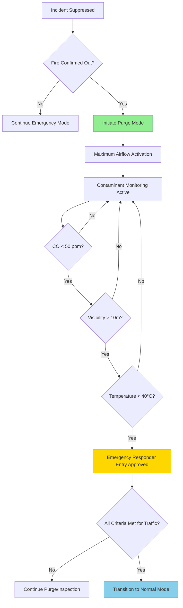
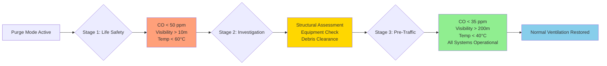

## Overview

Purge ventilation represents the final phase of tunnel emergency ventilation, transitioning from active smoke control to complete contaminant removal and restoration of normal atmospheric conditions. This mode maximizes air exchange to eliminate residual combustion products, restore visibility, and establish safe conditions for emergency responders and eventual traffic resumption.

The purge process involves complex fluid dynamics where contaminated air must be systematically displaced by fresh air while maintaining positive pressure gradients to prevent recontamination from adjacent zones.

## Fundamental Physics of Purge Ventilation

### Mass Balance and Dilution Theory

The purge process follows first-order decay kinetics for contaminant concentration reduction. The fundamental relationship governing contaminant removal is:

$$C(t) = C_0 \cdot e^{-\frac{Q}{V} \cdot t}$$

Where:
- $C(t)$ = contaminant concentration at time $t$ (ppm or mg/m³)
- $C_0$ = initial contaminant concentration
- $Q$ = volumetric airflow rate (m³/s)
- $V$ = tunnel volume (m³)
- $t$ = purge time (s)

The air change rate $N$ (ACH) is defined as:

$$N = \frac{Q}{V} \times 3600 \text{ (ACH)}$$

### Exponential Dilution Model

For practical applications, the number of air changes required to achieve a target concentration reduction follows:

$$n = -\ln\left(\frac{C_f}{C_0}\right)$$

Where $n$ is the number of theoretical air changes needed to reduce concentration from $C_0$ to $C_f$.

For 99% contaminant removal: $n = -\ln(0.01) = 4.6$ air changes

For 99.9% removal: $n = 6.9$ air changes

**Critical consideration:** These calculations assume perfect mixing, which never occurs in tunnel geometries. A mixing efficiency factor $\eta_m$ (typically 0.6-0.8) must be applied:

$$n_{actual} = \frac{n_{theoretical}}{\eta_m}$$

## Purge Mode Operational Strategies

### Longitudinal Purge Configuration

Maximum unidirectional airflow flushes contaminants toward portals. Velocity requirements:

$$V_{purge} = 1.5 \text{ to } 3.0 \text{ m/s}$$

Lower than emergency mode velocities (3-5 m/s) to reduce energy consumption while maintaining effective plug flow.

### Transverse/Semi-Transverse Purge

Supply and exhaust systems operate at maximum capacity. The effective air change rate is:

$$N_{effective} = \frac{Q_{supply} + Q_{exhaust}}{2V} \times 3600 \times \eta_m$$

For redundancy, both supply and exhaust operate even though theoretical calculations might suggest one system suffices.

## Time to Clear Calculations

### Standard Tunnel Purge Time

Given tunnel parameters:
- Length: $L = 1000$ m
- Cross-sectional area: $A = 50$ m²
- Volume: $V = 50,000$ m³
- Purge airflow: $Q = 150$ m³/s
- Required reduction: 99% (4.6 air changes)
- Mixing efficiency: $\eta_m = 0.7$

**Calculation:**

Air change rate:
$$N = \frac{150 \times 3600}{50,000} = 10.8 \text{ ACH}$$

Time per air change:
$$t_{AC} = \frac{3600}{10.8} = 333 \text{ seconds} = 5.55 \text{ minutes}$$

Required air changes:
$$n_{actual} = \frac{4.6}{0.7} = 6.57$$

**Total purge time:**
$$t_{purge} = 6.57 \times 5.55 = 36.5 \text{ minutes}$$

## Contaminant Monitoring During Purge

### Critical Parameters and Thresholds

| Parameter | Measurement Location | Emergency Responder Threshold | Traffic Resumption Threshold | Monitoring Frequency |
|-----------|---------------------|-------------------------------|------------------------------|---------------------|
| Carbon Monoxide (CO) | Multiple points every 100m | < 50 ppm | < 35 ppm | Continuous |
| Visibility (extinction coefficient) | Portal and mid-tunnel | > 10 m | > 200 m | Continuous |
| Temperature | Ceiling level | < 60°C | < 40°C | Continuous |
| Carbon Dioxide (CO₂) | Representative points | < 5000 ppm | < 1000 ppm | Every 5 min |
| Particulate Matter (PM₂.₅) | Exhaust points | < 500 μg/m³ | < 35 μg/m³ | Every 5 min |
| Oxygen (O₂) | Multiple zones | > 19.5% | > 20.5% | Continuous |

**Spatial distribution requirement:** NFPA 502 recommends monitoring points spaced no more than 150 m apart for tunnels longer than 300 m.

### Visibility Restoration Physics

Smoke optical density follows the Beer-Lambert law:

$$I = I_0 \cdot e^{-K \cdot L}$$

Where:
- $I$ = transmitted light intensity
- $I_0$ = incident light intensity
- $K$ = extinction coefficient (m⁻¹)
- $L$ = path length (m)

Visibility distance $S$ (distance at which objects become discernible) relates to extinction coefficient:

$$S = \frac{C}{K}$$

Where $C$ is a contrast constant (typically 2-3 for illuminated objects, 8 for self-luminous objects).

For traffic resumption requiring 200 m visibility:

$$K_{max} = \frac{3}{200} = 0.015 \text{ m}^{-1}$$

## Return to Normal Operation Criteria

### Multi-Tiered Clearance Approach

**Tier 1 - Emergency Responder Entry (10-15 minutes target):**
- Primary focus: life safety for rescue operations
- Reduced visibility acceptable with proper PPE
- Elevated CO tolerable for short-duration SCBA operations

**Tier 2 - Maintenance Personnel Entry (30-45 minutes target):**
- Equipment inspection and damage assessment
- Respiratory protection still required but less stringent
- Visibility must support detailed visual inspection

**Tier 3 - Traffic Resumption (60+ minutes typical):**
- Full atmospheric restoration
- No respiratory protection required
- Normal visibility for safe vehicle operation
- All life safety systems verified operational

## NFPA 502 Purge Mode Requirements

Key specifications from NFPA 502 Standard for Road Tunnels, Bridges, and Other Limited Access Highways:

**Section 7.7 - Emergency Ventilation System Design:**
- Purge mode shall provide capacity to achieve 6 air changes per hour minimum
- Contaminant monitoring required during all phases of emergency operation
- Ventilation system transition to purge mode shall occur automatically or by operator command within 2 minutes

**Section 7.8.4 - Purge Ventilation Capacity:**
- System shall maintain longitudinal velocity sufficient to prevent backlayering during transition
- Minimum purge airflow: greater of 6 ACH or flow producing 1.5 m/s velocity

**Critical design note:** Purge capacity often governs fan sizing despite emergency mode receiving primary design focus.

## Advanced Purge Optimization

### Variable Speed Purge Strategy

Rather than operating at constant maximum capacity, intelligent control modulates airflow based on real-time contaminant measurements:

$$Q_{controlled}(t) = Q_{max} \times \left(0.3 + 0.7 \times \frac{C(t)}{C_{threshold}}\right)$$

This approach reduces energy consumption by 30-40% while maintaining adequate clearance rates as concentration drops.

### Zoned Purge for Long Tunnels

Tunnels exceeding 2 km benefit from sequential zone purging rather than simultaneous full-length purge. Each zone achieves clearance criteria before the next zone initiates maximum purge, reducing peak electrical demand.

## Practical Implementation Considerations

**Fan surge prevention:** Sudden transition from high-pressure emergency mode to purge mode risks fan surge. Control sequences must include 30-60 second ramp periods.

**Thermal stratification disruption:** Residual hot gases accumulate at the ceiling. Purge mode must maintain sufficient velocity to break stratification and ensure complete upper-level clearance.

**Portal effects:** Contaminated air exiting portals may recirculate if meteorological conditions create low-pressure zones at tunnel entrances. Portal air curtains or perimeter monitoring prevents recontamination.

**Electrical capacity:** Purge mode may represent peak electrical demand if all fans operate simultaneously. Load management strategies coordinate fan startup sequences.

---

**Related Topics:**
- [Emergency Ventilation Control Sequences](../control-sequences/)
- [Smoke Management Strategies](../smoke-management/)
- [Tunnel Fire Dynamics](../tunnel-fire-scenarios/)
