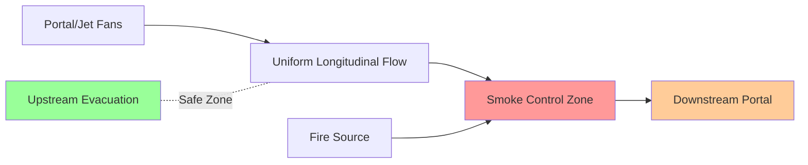
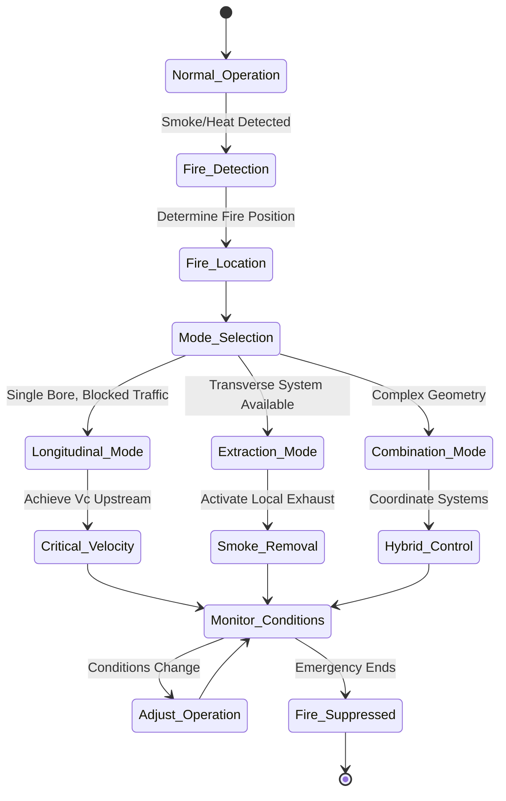

Tunnel smoke control represents one of the most critical life safety challenges in HVAC engineering. During a fire event, the buoyancy-driven smoke flow couples with forced ventilation to create complex fluid dynamics that determine occupant survival. The primary objective is maintaining tenable egress conditions upstream of the fire while preventing smoke backlayering.

## Fundamental Smoke Physics

Fire-generated smoke possesses buoyancy due to its lower density relative to ambient air. The buoyancy force per unit volume is:

$$F_b = g(\rho_a - \rho_h)$$

where $\rho_a$ is ambient air density and $\rho_h$ is hot gas density. This buoyant force drives smoke stratification and vertical movement. In a tunnel, longitudinal air velocity can control smoke migration direction, but the interaction between buoyancy and forced flow determines smoke behavior.

The heat release rate (HRR) from a fire governs smoke production rate and temperature rise. NFPA 502 specifies design fire sizes ranging from 20 MW for passenger vehicles to 100+ MW for heavy goods vehicles. The convective heat release rate $Q_c$ (typically 70% of total HRR) determines the mass flow rate of smoke:

$$\dot{m}_{smoke} = \frac{Q_c}{c_p \Delta T}$$

where $c_p = 1.005 \text{ kJ/kg·K}$ is specific heat of air and $\Delta T$ is temperature rise above ambient.

## Critical Velocity Concept

Critical velocity $V_c$ represents the minimum longitudinal air velocity required to prevent smoke backlayering (upstream smoke migration) in a tunnel fire. Below critical velocity, buoyancy-driven smoke movement overcomes the forced airflow, causing smoke to spread against the ventilation direction. This creates untenable conditions for evacuees upstream of the fire.

The Memorial Tunnel Fire Ventilation Test Program established empirical correlations for critical velocity. For normal tunnel grades, the fundamental relationship is:

$$V_c = K_1 \left(\frac{Q^*}{A}\right)^{1/3}$$

where $Q^* = Q_c / (\rho_\infty c_p T_\infty \sqrt{g H} A)$ is the dimensionless heat release rate, $A$ is tunnel cross-sectional area, $H$ is tunnel height, $\rho_\infty$ is ambient air density, $T_\infty$ is ambient temperature, and $K_1 \approx 0.606$ for most tunnel configurations.

For tunnel grades, the critical velocity adjusts according to:

$$V_c(\theta) = V_c(0) \left(1 + 0.0385 \theta \right)^{-0.5}$$

where $\theta$ is grade in percent. Uphill grades reduce required critical velocity because buoyancy and ventilation act together; downhill grades increase it as they oppose buoyancy-driven flow.

## Longitudinal Ventilation Systems

Longitudinal ventilation uses jet fans or portal fans to create uniform air velocity throughout the tunnel length. The system operates on momentum transfer principles: high-velocity jets from fan nozzles entrain tunnel air, creating bulk flow.

Jet fan thrust $T$ relates to induced airflow through the thrust coefficient:

$$Q_{induced} = \frac{V_c \cdot A}{\eta_{system}}$$

where $\eta_{system}$ accounts for tunnel friction, blockage, and fan arrangement efficiency (typically 0.65-0.85). Each jet fan contributes thrust according to:

$$T = \dot{m}_{jet}(V_{jet} - V_{tunnel}) + A_{jet}(P_{jet} - P_{tunnel})$$

The momentum term dominates; pressure term is negligible for subsonic flows.

NFPA 502 requires longitudinal systems to achieve critical velocity within design fire scenarios while maintaining tenable conditions downstream of the fire. The system must account for traffic blockage effects, which can reduce effective tunnel area by 30-50% and locally increase required velocities.

## Transverse and Semi-Transverse Ventilation

Transverse ventilation systems provide independent supply and exhaust through ducts running the tunnel length, with distributed injection and extraction points. This configuration enables localized smoke control and maintains tenable conditions in both directions from the fire.

| System Type | Air Supply | Smoke Exhaust | Advantages | Limitations |
|-------------|-----------|---------------|------------|-------------|
| Full Transverse | Duct to ceiling | Duct from ceiling/floor | Excellent smoke control, bidirectional egress | High capital cost, space requirements |
| Semi-Transverse (Supply) | Duct to ceiling | Portal exhaust | Good smoke dilution, lower cost | Limited smoke extraction |
| Semi-Transverse (Exhaust) | Portal supply | Duct from ceiling | Effective smoke removal | Requires sufficient makeup air |
| Longitudinal | No ducts | Portal exhaust | Lowest cost, simple operation | Unidirectional egress only |

In a full transverse system, smoke extraction occurs through ceiling-level exhaust ports. The volumetric exhaust rate per unit length must exceed local smoke production to prevent smoke layer descent:

$$\dot{V}_{exhaust/m} > \frac{\dot{m}_{smoke}}{\rho_{smoke} \cdot L_{active}}$$

where $L_{active}$ is the length of activated exhaust zone (typically 60-120 m centered on fire).

Transverse systems create a neutral pressure plane in the tunnel. Below this plane, fresh air supply maintains positive pressure; above it, exhaust creates negative pressure to capture smoke. The location of this plane critically affects smoke capture efficiency.

## Emergency Operation Modes

NFPA 502 mandates automatic fire detection and emergency ventilation activation. Emergency operation modes adapt ventilation strategy to fire location, magnitude, and traffic conditions.

Key operational principles:

**Tenability Maintenance**: Emergency ventilation must maintain visibility >10 m, temperature <60°C, and CO concentration <1400 ppm in egress paths for the required safe egress time (RSET). NFPA 502 specifies minimum 6 minutes for short tunnels, longer for extended tunnels.

**Smoke Stratification**: Excessive ventilation velocity disrupts thermal stratification, mixing smoke downward and reducing visibility. For longitudinal systems, velocities should not exceed $1.5 \times V_c$ to maintain stratification benefits.

**Traffic Congestion Response**: Stopped traffic significantly alters aerodynamics. Blockage ratio $\beta = A_{vehicles}/A_{tunnel}$ can reach 0.3-0.5, requiring higher fan output to achieve target velocities through restricted cross-section:

$$V_{required} = \frac{V_c}{1-\beta}$$

**Incident Location Adaptation**: Fire near portals may allow natural ventilation assisted by fans. Mid-tunnel fires in long tunnels require maximum ventilation capacity. System design must accommodate worst-case fire location.

**Coordinate with Suppression**: Water-based fire suppression reduces HRR but generates steam, temporarily increasing smoke volume. Ventilation systems must handle this transient load increase.

The smoke layer interface height above the roadway determines egress viability. For a stratified layer with heat release rate $Q_c$:

$$z_{interface} \approx 0.166 Q_c^{2/5}$$

Maintaining $z_{interface} > 2.5 \text{ m}$ ensures visibility for evacuees. Transverse exhaust systems provide superior control of interface height compared to longitudinal systems, which primarily control smoke migration direction rather than vertical extent.