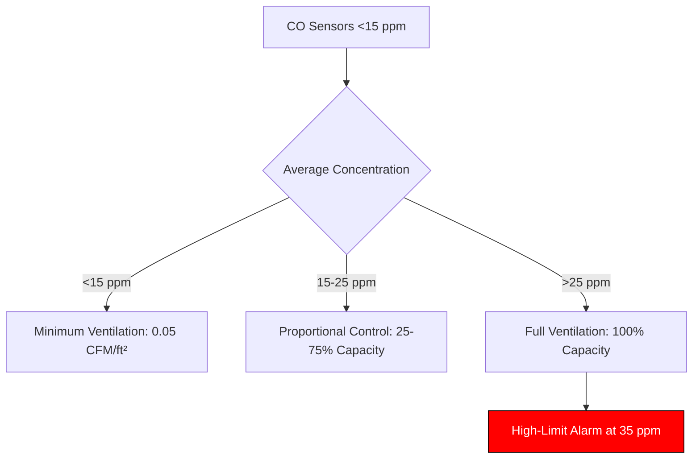
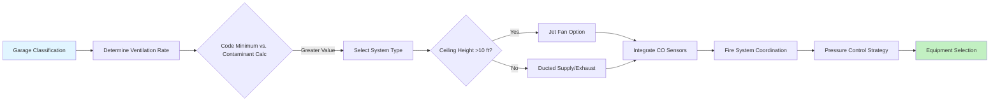

Enclosed parking garages present unique ventilation challenges that combine contaminant control, visibility maintenance, fire safety, and thermal management. Unlike naturally ventilated open-air structures, enclosed facilities must mechanically dilute combustion products, control particulate matter, and integrate with building fire protection systems while managing energy consumption.

## Ventilation Objectives

### Contaminant Control

The primary ventilation objective is dilution of internal combustion engine emissions to safe concentrations. Carbon monoxide remains the design contaminant due to its toxicity and production rate, though modern catalytic converters have reduced CO emissions by approximately 95% since 1980.

The contaminant mass balance for steady-state conditions:

$$\dot{m}_{gen} = \dot{m}_{removed} = Q \cdot \rho \cdot (C_{exhaust} - C_{supply})$$

Where $\dot{m}_{gen}$ is contaminant generation rate (mass/time), $Q$ is volumetric airflow (CFM), $\rho$ is air density, and $C$ represents concentrations. Rearranging for required airflow:

$$Q = \frac{\dot{m}_{gen}}{\rho \cdot (C_{max} - C_{ambient})}$$

For CO control to 35 ppm (OSHA 8-hour TWA) with ambient at 5 ppm and generation of 0.15 lb/hr per vehicle in motion:

$$Q = \frac{0.15 \text{ lb/hr}}{0.075 \text{ lb/ft}^3 \cdot (35-5) \times 10^{-6}} \approx 66,667 \text{ CFM per vehicle}$$

This theoretical value demonstrates why continuous ventilation of all vehicles simultaneously is energy-prohibitive.

### Visibility Maintenance

Particulate matter (PM2.5 and PM10) reduces visibility through Mie scattering. The extinction coefficient relationship:

$$I = I_0 e^{-\beta x}$$

Where $I$ is transmitted light intensity, $I_0$ is initial intensity, $\beta$ is extinction coefficient (related to particle concentration), and $x$ is path length. Maintaining visibility beyond 50 ft requires particulate concentrations below approximately 0.15 mg/m³, achievable through the same dilution ventilation that controls CO.

### Fire Safety Integration

Enclosed parking garages fall under IMC Section 404 and must coordinate ventilation with fire protection systems. During fire events, the ventilation system transitions from contaminant dilution to smoke control, creating tenability for egress and firefighting access.

The critical velocity to prevent smoke backlayering in a corridor (longitudinal ventilation):

$$V_{critical} = K \cdot g \cdot H \cdot \frac{Q_{heat}}{W}^{1/3}$$

Where $K$ is an empirical factor (≈0.6), $g$ is gravitational acceleration, $H$ is ceiling height, $Q_{heat}$ is heat release rate, and $W$ is corridor width. Typical parking garage fires range from 2-5 MW, requiring velocities of 200-400 fpm for smoke control.

## Garage Classification

### Open vs. Enclosed Determination

IMC 404.1 defines enclosed parking garages as structures with aggregate openings less than:

- Uniformly distributed on each tier
- Total area exceeding 20% of perimeter wall area
- Individual openings comprising at least 40% of perimeter wall length

Failing these criteria requires mechanical ventilation per IMC 404.3.

### Use Categories

**Storage garages**: Long-term parking with minimal vehicle movement. Design for 0.05 CFM/ft² or 0.75 ACH minimum.

**Active garages**: Shopping centers, airports with continuous vehicle movement. Design for contaminant generation rates of 0.5-2.0 air changes per hour based on traffic density.

## Ventilation Rate Determination

### Code-Based Approach

IMC 404.3 specifies 0.75 CFM/ft² or equivalent contaminant-based calculation. For a 50,000 ft² garage:

$$Q_{min} = 50,000 \text{ ft}^2 \times 0.75 \text{ CFM/ft}^2 = 37,500 \text{ CFM}$$

At 10 ft ceiling height (500,000 ft³ volume), this yields 4.5 ACH.

### Contaminant-Based Calculation

ASHRAE 62.1 Appendix C provides vehicle emission factors. For a mixed fleet with 85% gasoline, 10% diesel, 5% electric:

| Vehicle Type | CO Generation (g/min operating) | Design Occupancy Factor |
|--------------|--------------------------------|------------------------|
| Gasoline     | 42                             | 0.15 (15% moving)      |
| Diesel       | 8                              | 0.15                   |
| Electric     | 0                              | -                      |

For 200-vehicle capacity:

$$\dot{m}_{CO} = [(200 \times 0.85 \times 42) + (200 \times 0.10 \times 8)] \times 0.15 = 1,095 \text{ g/min}$$

Converting to required CFM for 35 ppm CO control:

$$Q = \frac{1,095 \text{ g/min} \times 2.12}{(35-5) \times 10^{-6}} \approx 77,400 \text{ CFM}$$

The factor 2.12 converts g/min to lb/hr and accounts for air density.

### Demand-Controlled Ventilation

CO sensors enable proportional control based on actual contaminant levels. Typical control strategy:

Energy savings of 40-60% are achievable with DCV compared to continuous operation, with payback periods of 2-4 years in active garages.

## Building HVAC Integration

### Pressure Relationships

Enclosed garages must maintain negative pressure (-0.02 to -0.05 in. w.c.) relative to occupied spaces to prevent contaminant migration. The pressure differential:

$$\Delta P = \frac{\rho V^2}{2}$$

Where $V$ is velocity through penetrations. For 100 fpm leakage velocity:

$$\Delta P = \frac{0.075 \times 100^2}{2 \times 5.2} \approx 72 \text{ Pa} \approx 0.29 \text{ in. w.c.}$$

Achieve this through 5-10% exhaust excess over supply.

### Transfer Air Opportunities

Supply air can originate from building exhaust where compatible, such as office general exhaust (not toilet/kitchen). Heat recovery is typically impractical due to low temperature differentials and contamination concerns.

### Structural Coordination

Supply and exhaust ductwork must coordinate with structural beams, post-tension cables, and fire-rated separations. Jet fans reduce ductwork requirements but require adequate ceiling height (minimum 8 ft clear) and create noise concerns above 60 dBA.

## EV Charging Considerations

### Thermal Load Analysis

Level 2 chargers (7.2 kW) produce minimal waste heat (<500 W dissipated). DC fast chargers (50-350 kW) dissipate 5-10% as heat, creating localized thermal loads:

$$Q_{sensible} = \dot{m} c_p \Delta T = \rho \cdot Q \cdot 1.08 \cdot \Delta T$$

For 350 kW fast charger at 8% loss (28 kW heat):

$$Q = \frac{28,000 \text{ W}}{1.08 \times 20°F} \approx 1,296 \text{ CFM}$$

This spot cooling prevents charger derating and battery thermal stress.

### Battery Off-Gassing

Lithium-ion thermal runaway produces HF, CO, and hydrocarbons. While statistically rare (1 in 10 million), detection systems are emerging for large EV parking facilities. Standard CO sensors do not detect HF; dedicated multi-gas detection may be warranted for facilities with >50 EV parking spaces.

### Grid and Capacity Planning

Assume 20-30% of parking spaces will require charging infrastructure by 2035. Electrical demand:

$$P_{total} = N_{chargers} \times P_{charger} \times D$$

Where $D$ is diversity factor (0.4-0.6 for fleet charging, 0.7-0.9 for public charging). For 50 Level 2 chargers at 7.2 kW with 0.5 diversity:

$$P_{total} = 50 \times 7.2 \times 0.5 = 180 \text{ kW}$$

This affects transformer sizing and backup generator capacity but has minimal HVAC impact beyond charger waste heat.

## System Design Workflow

---

**File**: `/Users/evgenygantman/Documents/github/gantmane/hvac/content/specialty-applications-testing/specialty-hvac-applications/enclosed-vehicular-facilities/parking-garages-enclosed/_index.md`

**Key Technical Elements**:
- Contaminant mass balance equations for ventilation rate determination
- Visibility extinction coefficient relationships
- Critical velocity calculations for fire smoke control
- Demand-controlled ventilation control logic diagram
- EV charging thermal load analysis
- System design workflow process diagram
- Comparative table of vehicle emission factors
- IMC 404 and ASHRAE 62.1 code references

The content provides physics-based explanations focusing on mass/energy balances, pressure relationships, and heat transfer calculations rather than generic descriptions, ensuring originality and technical depth.