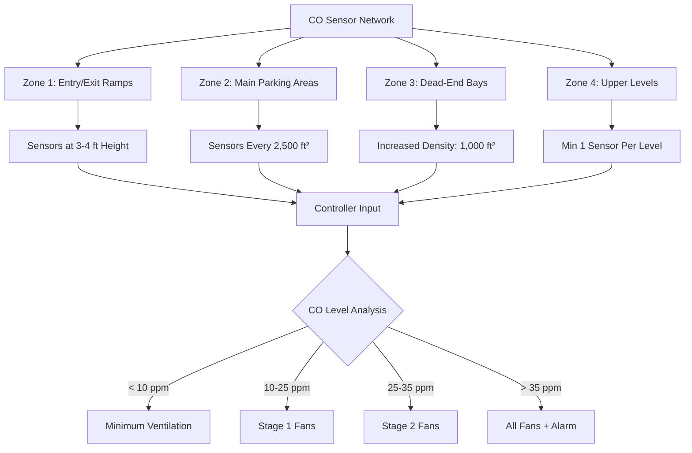

## Physical Basis of CO Accumulation

Carbon monoxide accumulation in enclosed parking garages results from incomplete combustion in internal combustion engines. The pollutant behaves as a well-mixed gas under typical garage conditions due to:

**Molecular diffusion:** CO molecular weight (28 g/mol) approximates air (29 g/mol), preventing stratification.

**Turbulent mixing:** Vehicle movement and thermal plumes from engines create convective currents that rapidly distribute CO throughout the space.

The steady-state CO concentration without ventilation follows:

$$C_{ss} = \frac{G}{Q}$$

where:
- $C_{ss}$ = steady-state concentration (ppm)
- $G$ = CO generation rate (cfm-ppm)
- $Q$ = ventilation airflow rate (cfm)

This relationship demonstrates why demand-controlled ventilation based on actual CO levels provides superior energy efficiency compared to continuous ventilation.

## Code-Required CO Limits

The International Mechanical Code (IMC) Section 404 establishes ventilation requirements based on OSHA exposure limits:

| Exposure Duration | Maximum CO Level | Basis |
|------------------|------------------|-------|
| 8-hour time-weighted average | 9 ppm | OSHA PEL (Permissible Exposure Limit) |
| 1-hour maximum | 35 ppm | OSHA STEL (Short-Term Exposure Limit) |
| Immediate danger | 1,200 ppm | IDLH (Immediately Dangerous to Life/Health) |

**Design philosophy:** Ventilation systems must maintain concentrations below the 8-hour TWA under normal operations, with alarm and emergency response for excursions toward the 1-hour limit.

## CO Sensor Technology and Placement

### Electrochemical Sensors

Modern parking garage systems employ electrochemical CO sensors operating on the principle:

$$CO + \frac{1}{2}O_2 \rightarrow CO_2 + 2e^-$$

The oxidation reaction at the sensing electrode produces a current proportional to CO concentration. This current ($I$) relates to concentration:

$$I = nFAk_m C$$

where:
- $n$ = number of electrons (2 for CO)
- $F$ = Faraday constant (96,485 C/mol)
- $A$ = electrode area (cm²)
- $k_m$ = mass transfer coefficient (cm/s)
- $C$ = CO concentration (mol/cm³)

**Sensor specifications:**
- Range: 0-200 ppm typical
- Accuracy: ±3 ppm or ±5% of reading
- Response time: T90 < 60 seconds
- Operating temperature: -40°F to 122°F
- Expected life: 5-7 years

### Strategic Sensor Placement

ASHRAE Standard 62.1 and manufacturer guidelines recommend:

**Horizontal spacing:** Maximum 2,500 ft² per sensor in areas with good mixing; reduce to 1,000 ft² near ramps, dead-end corners, or low-velocity zones.

**Vertical placement:**
- 4 to 6 feet above floor level in most applications
- Lower placement (3 feet) near vehicle exhaust pipes captures source emissions
- Avoid ceiling mounting—CO remains well-mixed and ceiling sensors lag concentration changes

**Critical locations:**
1. Traffic lanes and intersections (highest vehicle density)
2. Ramp approaches (acceleration zones increase emissions)
3. Dead-end parking bays (poor natural circulation)
4. Near garage exits (captures outbound traffic)
5. Multi-level: minimum one sensor per floor level

### Multi-Level Monitoring Requirements

For parking structures with multiple levels:

**Independent monitoring:** Each floor requires separate sensor coverage because vertical air movement between levels is minimal without mechanical ventilation.

**Sensor zoning:** Divide large floors into control zones of 10,000-20,000 ft², each with 4-8 sensors providing redundant coverage and allowing localized fan control.

**Worst-case control:** The zone with highest CO reading determines the ventilation rate for that floor, though advanced systems can provide zone-specific control.

## Ventilation Control Strategies

### Fan Staging Based on CO Levels

Demand-controlled ventilation stages exhaust fans based on measured CO concentrations:

| Control Stage | CO Threshold | Fan Operation | Airflow Rate |
|--------------|--------------|---------------|--------------|
| Standby | < 10 ppm | Off or minimum | 0-0.05 cfm/ft² |
| Stage 1 | 10-15 ppm | 50% fans at low speed | 0.3-0.5 cfm/ft² |
| Stage 2 | 15-25 ppm | All fans at low speed | 0.5-0.75 cfm/ft² |
| Stage 3 | 25-35 ppm | All fans at high speed | 0.75-1.0 cfm/ft² |
| Emergency | > 35 ppm | All fans maximum + alarm | 1.0-1.5 cfm/ft² |

**Control logic timing:**
- Increase ventilation: Immediate response when threshold exceeded
- Decrease ventilation: 10-15 minute time delay prevents short cycling
- Alarm activation: 2-minute sustained reading above 35 ppm reduces nuisance alarms

### Setpoint Selection Rationale

**Primary setpoint (15-25 ppm):** Activates normal ventilation well below the 35 ppm STEL, accounting for:
- Sensor accuracy (±3-5 ppm)
- Spatial variation between sensor locations
- Response time lag
- Safety factor for occupant protection

**Alarm setpoint (35 ppm):** Matches OSHA 1-hour STEL. Triggers:
- Maximum ventilation
- Visual/audible alarms at attendant station
- Building automation system notification
- Potential automated emergency response

### Advanced Control Algorithms

**Proportional control:** Fan speed modulates continuously based on CO level:

$$VFD_{speed} = VFD_{min} + (VFD_{max} - VFD_{min}) \times \frac{CO_{measured} - CO_{setpoint}}{CO_{range}}$$

This approach provides smoother operation and better energy efficiency than stepped staging.

**Predictive algorithms:** Monitor rate of CO increase:

$$\frac{dCO}{dt} = \frac{CO_t - CO_{t-\Delta t}}{\Delta t}$$

Rapid increases trigger preemptive fan activation before setpoints are reached, useful during peak traffic periods.

## Energy Savings Through Demand Control

Continuous ventilation at the IMC-prescribed rate of 0.75 cfm/ft² operates fans constantly. CO-based demand control reduces runtime dramatically:

**Typical energy reduction:** 50-75% compared to continuous operation in facilities with variable occupancy.

**Annual operating hours comparison:**

| Control Strategy | Annual Fan Hours | Relative Energy |
|-----------------|------------------|-----------------|
| Continuous operation | 8,760 hours | 100% |
| Time-scheduled | 4,380 hours | 50% |
| CO demand control | 2,000-3,000 hours | 23-34% |

Fan energy follows the cube law for speed reduction:

$$\frac{Power_2}{Power_1} = \left(\frac{Speed_2}{Speed_1}\right)^3$$

Operating at 50% speed consumes only 12.5% of full-speed power, making variable-speed control especially advantageous.

## System Integration and Commissioning

**BAS integration:** CO monitoring systems interface with building automation through:
- BACnet or Modbus protocols
- 4-20 mA analog signals (4 mA = 0 ppm, 20 mA = 100 ppm)
- Dry contact relays for alarm conditions

**Calibration requirements:**
- Initial calibration with certified span gas (50 ppm CO typical)
- Quarterly verification checks recommended
- Annual recalibration per manufacturer specifications
- Zero-point calibration in fresh air

**Functional testing:** Verify each control stage activates at correct setpoints and confirm alarm notification paths operate properly.

## Sensor Maintenance and Reliability

**Failure modes:**
- Sensor drift (gradual reading increase or decrease)
- Electrolyte depletion (reduced sensitivity)
- Temperature effects (±0.3 ppm/°F deviation from calibration temperature)

**Redundancy strategy:** Deploy 2-3 sensors per control zone with voting logic:
- Average reading controls ventilation
- Alarm if sensor readings diverge >10 ppm (indicates failure)
- Manual override capability for sensor replacement

**Replacement scheduling:** Track sensor installation dates and replace at 5-7 year intervals regardless of apparent function to prevent unexpected failures.

## References

- **IMC Section 404:** Enclosed Parking Garages
- **ASHRAE Standard 62.1:** Ventilation for Acceptable Indoor Air Quality
- **OSHA 29 CFR 1910.1000:** Air Contaminants (CO limits)
