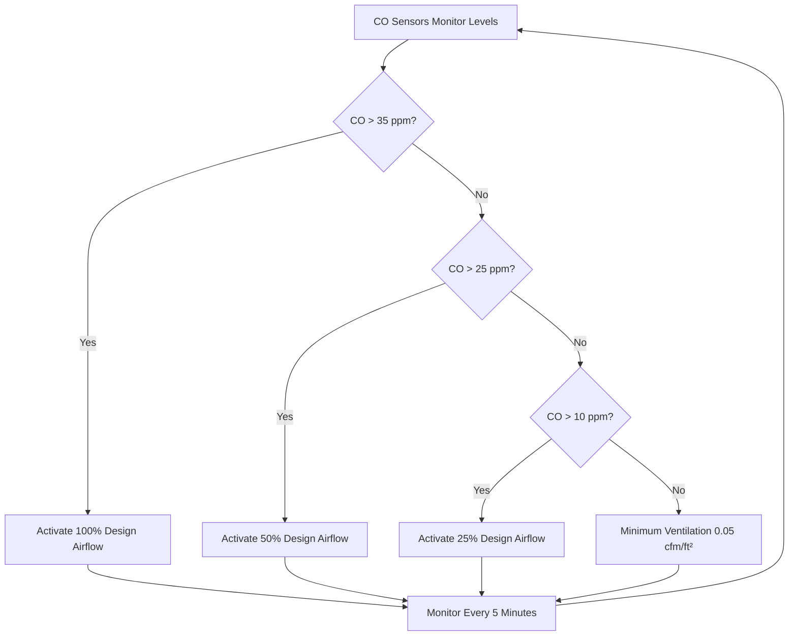
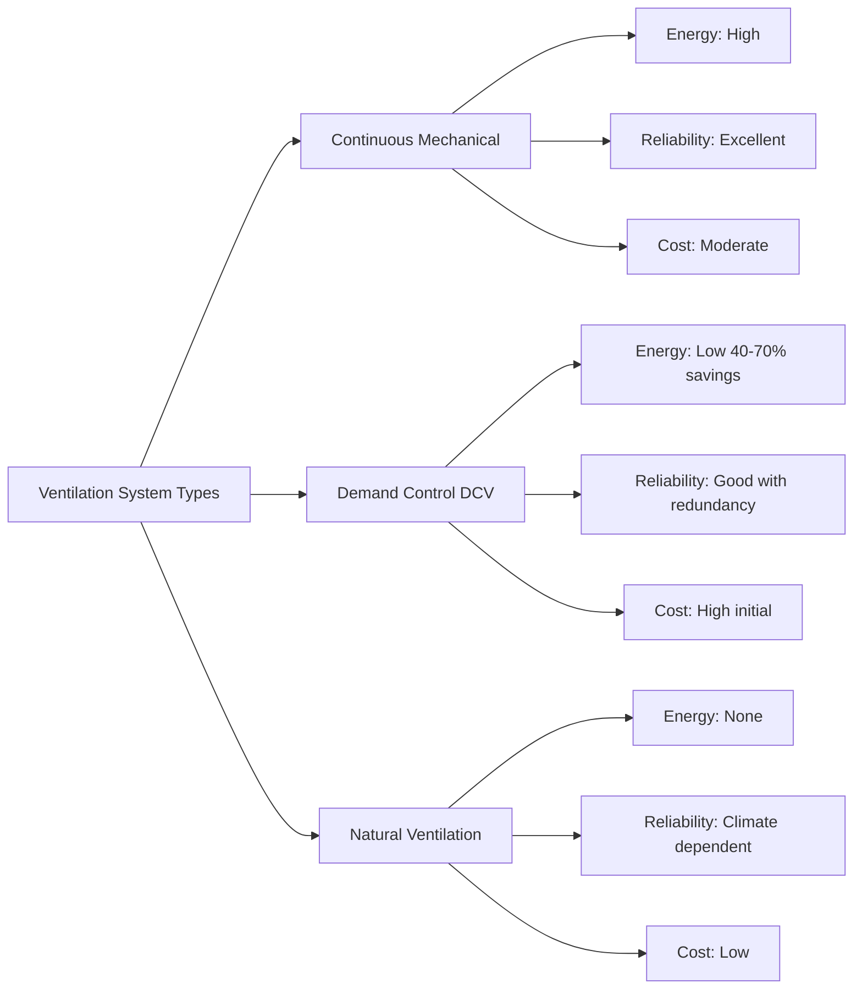

## Overview

Enclosed parking garage ventilation systems address the fundamental challenge of removing vehicular emissions—primarily carbon monoxide (CO), nitrogen dioxide (NO₂), and particulate matter—while maintaining acceptable indoor air quality. The physics of contaminant dispersal in these confined spaces requires engineered mechanical ventilation systems that account for emission rates, occupancy patterns, and thermal stratification effects.

## Contaminant Generation Physics

Vehicle emissions in parking garages follow concentration dynamics governed by mass balance principles. The steady-state CO concentration can be expressed as:

$$C_{ss} = \frac{G}{Q \cdot \eta}$$

Where:
- $C_{ss}$ = steady-state concentration (ppm)
- $G$ = contaminant generation rate (cfm·ppm or L/s·ppm)
- $Q$ = ventilation airflow rate (cfm or L/s)
- $\eta$ = mixing efficiency factor (0.7-0.9 for parking garages)

The generation rate depends on vehicle activity:

$$G = N_v \cdot E_v \cdot t_r \cdot f_c$$

Where:
- $N_v$ = number of vehicles per hour
- $E_v$ = emission rate per vehicle (typically 1.5 cfm CO per vehicle)
- $t_r$ = residence time in garage (minutes)
- $f_c$ = cold start factor (1.5-3.0 for cold engines)

## IMC Ventilation Requirements

The International Mechanical Code (IMC Section 404) establishes baseline ventilation rates for enclosed parking garages:

| Facility Type | Ventilation Rate | Code Reference |
|---------------|------------------|----------------|
| Enclosed parking garages | 0.75 cfm/ft² (3.8 L/s·m²) | IMC 404.1 |
| Enclosed parking garages with CO monitoring | Variable based on CO levels | IMC 404.1 Exception |
| Repair garages | 1.5 cfm/ft² (7.6 L/s·m²) | IMC 403.3 |

ASHRAE 62.1 Table 6-1 specifies:
- **Enclosed parking garages**: 0.75 cfm/ft² of floor area
- **Parking garages with demand control**: Reduced rates when CO < 25 ppm

## Demand Control Ventilation Strategy

Demand control ventilation (DCV) reduces energy consumption by modulating airflow based on real-time contaminant levels rather than operating at continuous design rates. The control logic follows:

### CO Monitoring Sensor Placement

Sensor locations must capture worst-case concentration zones. Physics dictates that CO, being slightly lighter than air (molecular weight 28 vs 29 for air), exhibits minimal buoyancy effect but accumulates in low-flow regions. Optimal placement:

1. **Vertical position**: 3-5 ft (0.9-1.5 m) above floor—breathing zone height
2. **Horizontal spacing**: Maximum 5,000 ft² (465 m²) per sensor
3. **Critical locations**:
   - Dead-end aisles
   - Exit ramp queuing areas
   - Low ceiling zones
   - Areas with poor air circulation

Sensor response time affects control stability. First-order sensor dynamics:

$$C_{sensor}(t) = C_{actual} \cdot (1 - e^{-t/\tau})$$

Where $\tau$ = sensor time constant (typically 30-60 seconds for electrochemical CO sensors)

## Exhaust System Design

### Airflow Rate Calculation

The required exhaust airflow combines area-based and vehicle-based methods:

**Area Method:**
$$Q_{area} = 0.75 \cdot A_{floor}$$

**Vehicle Method:**
$$Q_{vehicle} = N_{spaces} \cdot f_{peak} \cdot q_{vehicle}$$

Where:
- $A_{floor}$ = garage floor area (ft²)
- $N_{spaces}$ = total parking spaces
- $f_{peak}$ = peak hour factor (0.15-0.20 for typical garages)
- $q_{vehicle}$ = airflow per active vehicle (7,500 cfm typical)

Use the greater of the two calculations.

### Thermal Stratification Effects

Temperature gradients create buoyancy-driven flows that affect ventilation effectiveness. The Richardson number quantifies stratification:

$$Ri = \frac{g \cdot \beta \cdot \Delta T \cdot H}{U^2}$$

Where:
- $g$ = gravitational acceleration (32.2 ft/s²)
- $\beta$ = thermal expansion coefficient (1/T_abs)
- $\Delta T$ = temperature difference between levels (°F)
- $H$ = ceiling height (ft)
- $U$ = characteristic velocity (ft/s)

For $Ri > 1$: Strong stratification—buoyancy dominates
For $Ri < 0.1$: Weak stratification—forced convection dominates

## Makeup Air Systems

Exhaust-only systems create negative pressure that must be balanced with makeup air to prevent:
- Backdrafting of combustion appliances
- Door operation difficulties (pressure > 0.3 in. w.c.)
- Uncontrolled infiltration

### Makeup Air Requirements

Makeup air should equal 90-100% of exhaust air to maintain slight negative pressure (-0.02 to -0.05 in. w.c.) for odor control:

$$Q_{MA} = Q_{exhaust} - Q_{infiltration}$$

Infiltration rate estimation:

$$Q_{infiltration} = A_{openings} \cdot v_{wind} \cdot C_d$$

Where:
- $A_{openings}$ = total opening area (ft²)
- $v_{wind}$ = wind velocity (fps)
- $C_d$ = discharge coefficient (0.6-0.65)

### Makeup Air Distribution

Proper distribution prevents short-circuiting between supply and exhaust:

| Distribution Method | Characteristics | Application |
|---------------------|-----------------|-------------|
| Perimeter low sidewall | Even distribution, minimal ductwork | Open garages, mild climates |
| Overhead duct system | Controllable distribution | Cold climates, multiple levels |
| Dedicated makeup air units | Heating/cooling capability | Extreme climates |
| Natural openings | No operating cost | Suitable only for mild climates |

## System Comparison

## Design Considerations

### Fan Selection

Exhaust fans must handle corrosive environments. Selection criteria:

1. **Material resistance**: Epoxy-coated or stainless steel for CO and moisture
2. **Motor type**: TEFC (Totally Enclosed Fan Cooled) for contaminated air
3. **Efficiency**: Meet AMCA 205 energy efficiency standards
4. **Redundancy**: N+1 configuration for systems > 50,000 cfm

### Pressure Relationships

Maintaining proper pressure zones prevents migration of contaminants:

$$\Delta P = \frac{\rho \cdot v^2}{2 \cdot g_c} + \rho \cdot g \cdot \Delta z$$

Static pressure targets:
- Parking garage: -0.02 to -0.05 in. w.c. relative to outdoors
- Stairwells/elevators: +0.03 to +0.05 in. w.c. relative to garage

## Energy Optimization

DCV energy savings calculation:

$$E_{savings} = (Q_{design} - Q_{average}) \cdot h_{annual} \cdot \Delta P \cdot \frac{1}{\eta_{fan}}$$

Where:
- $Q_{design}$ = full design airflow (cfm)
- $Q_{average}$ = average DCV airflow (cfm)
- $h_{annual}$ = annual operating hours
- $\Delta P$ = system pressure (in. w.c.)
- $\eta_{fan}$ = combined fan and motor efficiency

Typical DCV systems achieve 40-70% energy reduction compared to continuous operation, with payback periods of 2-5 years depending on local energy costs and usage patterns.

## Commissioning Requirements

Functional performance testing must verify:

1. Airflow rates achieve ±10% of design at all control sequences
2. CO sensors calibrated to ±5 ppm accuracy
3. Control response time < 10 minutes from setpoint change to 90% airflow change
4. Makeup air tracking maintains pressure within ±0.02 in. w.c. of setpoint
5. Emergency override activates 100% ventilation on fire alarm

Proper enclosed parking garage ventilation design integrates code compliance, physics-based calculations, and energy-efficient control strategies to maintain safe air quality while minimizing operational costs.
