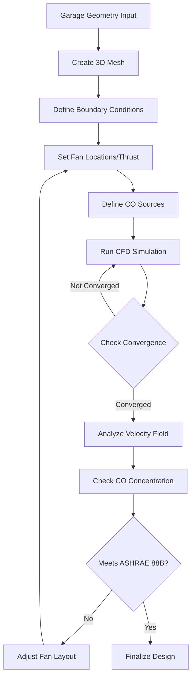
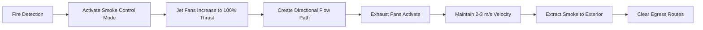
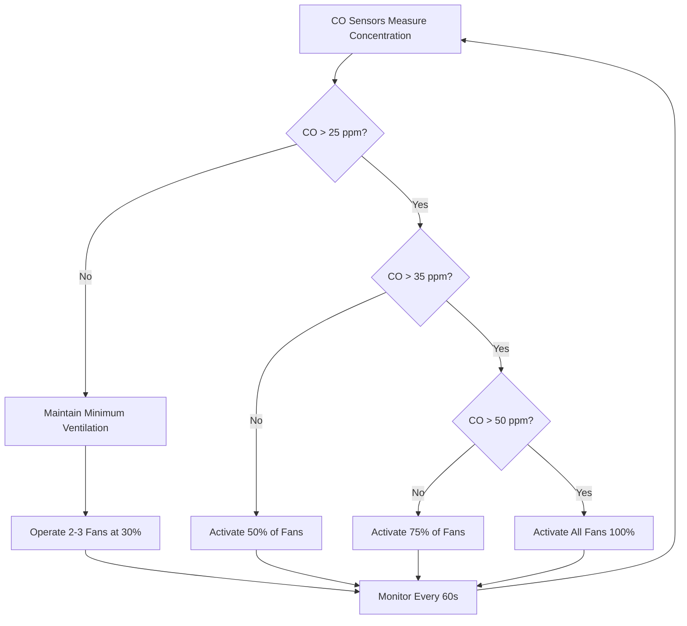

## Impulse Ventilation Principle

Jet fan systems operate on the impulse ventilation principle, transferring momentum from high-velocity air jets to the larger mass of stagnant garage air. Unlike ducted systems that physically transport air through ductwork, jet fans induce bulk air movement through momentum exchange, creating directed airflow paths that dilute and remove contaminants.

The fundamental physics relies on conservation of momentum. A jet fan produces a narrow, high-velocity jet that entrains surrounding air through turbulent mixing. The momentum transfer occurs continuously along the jet trajectory, with the jet velocity decaying while the influenced air volume increases.

**Key operational advantages:**
- Eliminates ductwork and associated installation costs
- Provides low-headroom ceiling installation (8-12 inches typical)
- Enables flexible airflow patterns through strategic fan placement
- Reduces structural loads compared to ducted systems
- Allows visual inspection of entire ventilation system

## Jet Fan Thrust and Throw Calculations

Jet fan performance is quantified by thrust (force imparted to air) and throw (distance the jet maintains effective velocity). Thrust represents the rate of momentum change and is the primary design parameter.

**Thrust calculation:**

$$F = \rho Q (V_j - V_a)$$

Where:
- $F$ = thrust force (N or lbf)
- $\rho$ = air density (kg/m³ or lb/ft³)
- $Q$ = volumetric flow rate (m³/s or cfm)
- $V_j$ = jet discharge velocity (m/s or ft/min)
- $V_a$ = approach velocity (typically zero for stationary installation)

For standard conditions ($\rho$ = 1.2 kg/m³), this simplifies to:

$$F = 1.2 \times Q \times V_j$$

**Jet throw distance** depends on discharge velocity, nozzle diameter, and ambient turbulence:

$$L = K \times D \times \frac{V_j}{V_{terminal}}$$

Where:
- $L$ = throw distance (m or ft)
- $K$ = empirical coefficient (typically 5-8)
- $D$ = nozzle diameter (m or ft)
- $V_{terminal}$ = minimum effective velocity (typically 1 m/s or 200 ft/min)

### Momentum Flux Calculation

The momentum flux diminishes along the jet path due to entrainment and turbulent diffusion. At distance $x$ from the nozzle:

$$V_x = V_j \times \frac{D}{K_e \times x}$$

Where $K_e$ is the jet expansion coefficient (0.08-0.12 for free jets).

| Jet Fan Size | Thrust (N) | Flow Rate (m³/s) | Discharge Velocity (m/s) | Typical Spacing (m) |
|--------------|------------|------------------|--------------------------|---------------------|
| Small        | 40-60      | 1.5-2.5          | 25-30                    | 15-20               |
| Medium       | 80-120     | 3.0-4.5          | 28-35                    | 20-30               |
| Large        | 150-250    | 5.0-8.0          | 30-40                    | 30-40               |

## CFD Modeling for Fan Placement

Computational fluid dynamics (CFD) modeling is essential for optimizing jet fan layouts in complex garage geometries. CFD solves the Navier-Stokes equations numerically to predict three-dimensional velocity and contaminant concentration fields.

**Critical modeling parameters:**
1. Turbulence model (k-ε or k-ω for parking garage applications)
2. Boundary conditions (fan thrust, wall friction, inlet/exhaust locations)
3. Contaminant source terms (CO emission rates from vehicles)
4. Mesh resolution (minimum 0.5 m for adequate jet capture)

**Design verification criteria:**
- Average velocity >0.25 m/s (50 ft/min) throughout occupied zones
- No stagnant zones with velocity <0.1 m/s
- CO concentration <50 ppm maximum (ASHRAE 88B)
- Uniform contaminant dilution without short-circuiting

## Smoke Control Capabilities

Jet fan systems provide effective smoke control during fire emergencies by creating defined airflow paths that contain and extract smoke. The system operates in two modes: normal ventilation and emergency smoke extraction.

**Smoke control operating principle:**

During fire conditions, jet fans create a high-velocity air current (2-3 m/s) that establishes a pressure differential, preventing smoke backflow and directing combustion products toward designated exhaust points. This maintains tenable conditions in egress paths.

**Thrust requirement for smoke control:**

$$F_{smoke} = \rho A V^2 + \Delta P \times A$$

Where:
- $\Delta P$ = pressure differential across smoke boundary (typically 25-50 Pa)
- $A$ = cross-sectional area of airflow path (m²)
- $V$ = required air velocity (2-3 m/s per NFPA 92)

**NFPA 92 compliance requirements:**
- Minimum 2 m/s (400 ft/min) air velocity in smoke zone
- Smoke layer interface maintained above 2.5 m (8 ft)
- Tenable conditions for 20-minute egress duration
- Redundant fan operation (N+1 minimum)

## Energy Savings vs Ducted Systems

Jet fan systems deliver significant energy savings compared to traditional ducted ventilation through reduced fan power, eliminated duct losses, and demand-controlled operation.

**Energy comparison framework:**

Ducted system power:
$$P_{duct} = \frac{Q \times \Delta P_{total}}{\eta_{fan} \times \eta_{motor}}$$

Where $\Delta P_{total}$ includes duct friction, fittings, and terminal losses (typically 500-1200 Pa).

Jet fan system power:
$$P_{jet} = n \times P_{fan} \times DF$$

Where:
- $n$ = number of jet fans
- $P_{fan}$ = individual fan power (0.5-2.0 kW typical)
- $DF$ = duty factor (0.3-0.6 for CO-based control)

| Parameter | Ducted System | Jet Fan System | Savings |
|-----------|---------------|----------------|---------|
| Installed fan power (kW) | 45-60 | 25-35 | 40-45% |
| Average operating power (kW) | 30-40 | 12-18 | 55-60% |
| Annual energy (MWh) | 260-350 | 105-160 | 60-65% |
| Duct heat gain/loss (kW) | 8-15 | 0 | 100% |
| Maintenance access | Limited | Full | N/A |

Energy savings derive from:
1. **Elimination of duct pressure losses** (60-70% of ducted system resistance)
2. **Reduced air volume requirements** (momentum transfer vs. bulk transport)
3. **Demand-controlled operation** based on real-time CO sensing
4. **No thermal losses** through ductwork in unconditioned spaces

## CO Sensor Integration

Carbon monoxide sensors enable demand-controlled ventilation, operating jet fans only when contaminant levels require dilution. This variable-speed operation optimizes energy consumption while maintaining air quality.

**Sensor placement strategy:**
- Minimum one sensor per 2000 m² (20,000 ft²) floor area
- Located in areas of highest vehicle concentration
- Mounted 1.5-2.0 m (5-6.5 ft) above floor (CO density ≈ air)
- Away from exhaust discharge points to avoid false readings

**Control algorithm:**

$$N_{fans} = \left\lceil \frac{C_{measured} - C_{setpoint}}{C_{threshold}} \times N_{total} \right\rceil$$

Where:
- $C_{measured}$ = current CO concentration (ppm)
- $C_{setpoint}$ = target CO level (typically 25 ppm per IMC Section 404.1)
- $C_{threshold}$ = control deadband (5-10 ppm)
- $N_{total}$ = total installed jet fans

**IMC Section 404.1 requirements:**
- Maximum 50 ppm CO concentration (ASHRAE 62.1 allows 9 ppm for continuous exposure)
- Minimum 0.75 cfm/ft² (3.8 L/s·m²) ventilation rate
- Automatic control based on contaminant sensing or occupancy
- Manual override capability for maintenance

**Advanced control strategies:**
- Predictive algorithms based on historical usage patterns
- Zone-specific fan activation for localized high CO areas
- Integration with building management systems (BACnet/Modbus)
- Trending and alarming for system performance verification

Jet fan systems represent a paradigm shift from volumetric air transport to momentum-based air management, achieving superior energy performance while reducing installation costs and space requirements in enclosed parking facilities.
