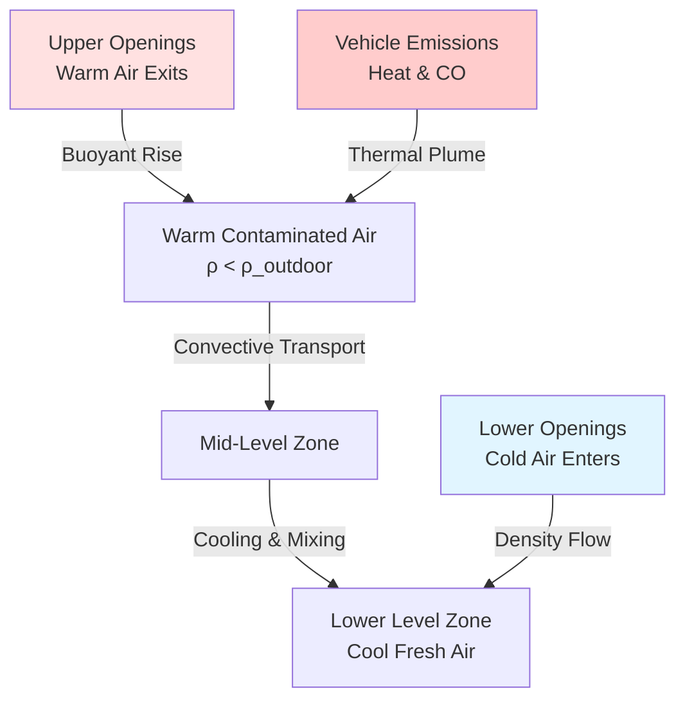

Natural ventilation offers an energy-efficient alternative to mechanical exhaust systems for parking garages, leveraging wind pressure and thermal buoyancy to dilute and remove vehicle emissions. The International Mechanical Code (IMC) Section 404.1 establishes criteria for open parking garages that qualify for natural ventilation in lieu of mechanical systems.

## Open Parking Structure Definition

An open parking garage, as defined by IMC 404.1, must have uniformly distributed openings on two or more sides comprising at least 20% of the total perimeter wall area at each tier. The minimum dimension of openings must be 30 inches, measured perpendicular to the wall. This definition recognizes that properly designed openings create sufficient air exchange through natural forces to maintain acceptable air quality without mechanical assistance.

The 20% opening requirement derives from empirical data on contaminant dilution rates and wind penetration effectiveness. Below this threshold, dead zones form where carbon monoxide concentrations exceed safety limits during peak traffic periods.

## Minimum Opening Requirements

The IMC specifies two parallel requirements for natural ventilation openings:

| Requirement | Value | Code Reference |
|-------------|-------|----------------|
| Perimeter wall opening ratio | ≥20% per tier | IMC 404.1 |
| Minimum opening dimension | 30 inches | IMC 404.1 |
| Distribution | Two or more sides | IMC 404.1 |
| Floor area opening ratio | ≥2.5% total floor area | Alternative calculation |

The total opening area $A_o$ must satisfy:

$$A_o \geq 0.20 \times A_w$$

where $A_w$ represents the total perimeter wall area for each parking tier. This ensures adequate penetration of external air across the full depth of the parking floor.

## Cross-Ventilation Design

Effective cross-ventilation requires proper alignment of inlet and outlet openings to maximize airflow penetration depth. The average air velocity through the garage space depends on wind speed, opening configuration, and internal resistance:

$$v_{int} = C_d \times v_{wind} \times \sqrt{\frac{A_{inlet}}{A_{cross}}}$$

where:
- $C_d$ = discharge coefficient (typically 0.6-0.65 for parking garage openings)
- $v_{wind}$ = external wind velocity at building height
- $A_{inlet}$ = effective inlet opening area
- $A_{cross}$ = garage cross-sectional area perpendicular to flow

The pressure difference driving cross-ventilation arises from wind impact on the building facade:

$$\Delta P = 0.5 \times \rho_{air} \times C_p \times v_{wind}^2$$

where $C_p$ represents the pressure coefficient difference between windward and leeward faces (typically 0.5 to 0.8 for rectangular buildings).

## Wind-Driven Ventilation

Wind-driven ventilation dominates natural air exchange in low-rise parking structures and during moderate temperature conditions. The volumetric flow rate through the structure depends on opening geometry and wind characteristics:

$$Q = C_d \times A_{eff} \times v_{wind}$$

The effective opening area $A_{eff}$ accounts for the combined resistance of inlet and outlet paths:

$$\frac{1}{A_{eff}^2} = \frac{1}{A_{inlet}^2} + \frac{1}{A_{outlet}^2}$$

This relationship reveals that balanced inlet and outlet areas maximize airflow. Asymmetric opening configurations reduce ventilation effectiveness significantly.

## Buoyancy-Driven Ventilation (Stack Effect)

When outdoor temperatures differ from garage temperatures, thermal buoyancy generates vertical airflow independent of wind. This stack effect becomes critical during calm conditions and cold weather when contaminants tend to stratify.

The buoyancy pressure difference between inlet and outlet elevations is:

$$\Delta P_{stack} = \rho_{out} \times g \times h \times \left(1 - \frac{T_{out}}{T_{in}}\right)$$

where:
- $\rho_{out}$ = outdoor air density (kg/m³)
- $g$ = gravitational acceleration (9.81 m/s²)
- $h$ = vertical distance between openings (m)
- $T_{out}$, $T_{in}$ = absolute temperatures (K)

The resulting ventilation rate from stack effect alone:

$$Q_{stack} = C_d \times A \times \sqrt{2 \times g \times h \times \frac{\Delta T}{T_{avg}}}$$

This mechanism maintains minimum ventilation during summer nights and winter conditions when wind-driven flow decreases.

## Hybrid Natural-Mechanical Systems

Many jurisdictions permit hybrid systems that combine natural openings with supplemental mechanical exhaust. These designs activate mechanical fans only when natural ventilation proves insufficient, typically determined by CO monitoring or seasonal schedules.

The mechanical supplementation required depends on the shortfall between natural capacity and code-mandated air change rates:

$$Q_{mech} = Q_{required} - Q_{natural}$$

Common hybrid configurations include:

| System Type | Description | Activation Strategy |
|-------------|-------------|---------------------|
| CO sensor controlled | Mechanical fans engage above CO setpoint | 25-50 ppm threshold |
| Temperature compensated | Fans operate during low wind/temperature conditions | Wind <2 m/s or ΔT <2°C |
| Peak demand | Mechanical assist during rush hours | Time-scheduled operation |
| Perimeter natural + core mechanical | Natural ventilation at building edges, mechanical in interior | Continuous zoned operation |

Hybrid systems offer 40-70% energy savings compared to full mechanical ventilation while maintaining code compliance year-round. The sizing of mechanical components typically ranges from 50-75% of the capacity required for fully mechanical systems.

## Design Verification

Natural ventilation performance should be validated through computational fluid dynamics (CFD) analysis or scale model testing for complex geometries. Key verification parameters include:

- Air change rate per hour (minimum 6 ACH per IMC for mechanical systems as reference)
- Maximum CO concentration at breathing height
- Percentage of floor area with air velocity <0.15 m/s (stagnant zones)
- Seasonal variation in ventilation effectiveness

Local amendments to the IMC may impose additional requirements, particularly in regions with low prevailing wind speeds or high pollution levels. Some jurisdictions mandate mechanical backup regardless of opening percentages or require CO monitoring systems in naturally ventilated garages.
