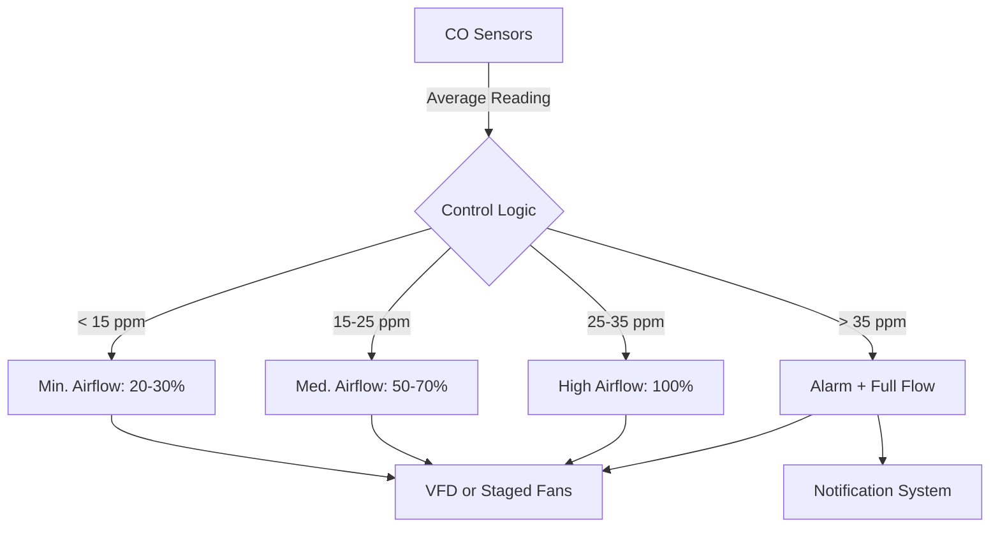

## Code-Mandated Ventilation Approaches

The International Mechanical Code and ASHRAE 62.1 establish two primary methodologies for enclosed parking garage ventilation. The selection between these approaches fundamentally impacts system capital cost, operating energy, and control complexity.

### Prescriptive Continuous Ventilation

The baseline requirement mandates a continuous mechanical ventilation rate of **0.75 CFM per square foot** of garage floor area. This method represents a conservative approach that assumes constant worst-case occupancy and vehicle activity. The physical basis derives from empirical studies correlating typical vehicle emissions with dilution requirements to maintain carbon monoxide concentrations below 35 ppm averaged over an 8-hour period.

For a garage with area $A_{\text{floor}}$ in square feet, the required airflow becomes:

$$Q_{\text{req}} = 0.75 \times A_{\text{floor}} \quad \text{[CFM]}$$

This approach eliminates the need for gas detection equipment but results in continuous full-flow operation regardless of actual vehicle activity. The energy penalty becomes substantial for garages with intermittent use patterns.

### CO-Based Demand-Controlled Ventilation

Performance-based ventilation systems modulate airflow in response to measured carbon monoxide concentrations. This approach recognizes that contaminant generation varies dramatically with vehicle count, engine type, and dwell time. The energy savings potential ranges from 50% to 85% compared to continuous operation, depending on usage patterns.

The ventilation control algorithm maintains CO concentrations below code-specified thresholds by adjusting fan speed or staging multiple exhaust fans. The relationship between generation rate and required ventilation follows mass balance principles:

$$Q = \frac{G_{\text{CO}}}{\left(C_{\text{set}} - C_{\text{ambient}}\right)} \times k$$

Where:
- $Q$ = required ventilation rate [CFM]
- $G_{\text{CO}}$ = CO generation rate [CFM of CO]
- $C_{\text{set}}$ = setpoint concentration [ppm]
- $C_{\text{ambient}}$ = outdoor CO concentration [ppm]
- $k$ = unit conversion factor

## Contaminant Dispersion Physics

Vehicle exhaust contains carbon monoxide, nitrogen dioxide, hydrocarbons, and particulate matter. The dispersion behavior determines optimal sensor placement and exhaust point locations.

### Buoyancy-Driven Stratification

Hot exhaust gases (typically 150°F to 400°F) initially exhibit positive buoyancy relative to garage air. However, rapid mixing with ambient air reduces this temperature differential within 3 to 6 feet of the tailpipe. The buoyancy flux parameter governs the transition from momentum-dominated to buoyancy-dominated flow:

$$\Gamma = \frac{g \beta Q_{\text{heat}}}{c_p \rho_{\text{air}} T_{\text{ambient}}}$$

Where $g$ is gravitational acceleration, $\beta$ is the thermal expansion coefficient, $Q_{\text{heat}}$ is the sensible heat release rate, $c_p$ is specific heat, and $\rho_{\text{air}}$ is air density.

For typical parking garage conditions, CO behaves as a neutrally buoyant gas after initial mixing. This necessitates exhaust intake locations distributed throughout the breathing zone rather than concentrated at the ceiling.

### Dead Zones and Short-Circuiting

Inadequate air distribution creates stagnant zones where contaminants accumulate. The effective air change rate in these regions drops below the nominal garage-wide value. Supply air jet penetration depth determines mixing effectiveness:

$$x_{\text{throw}} = k_{\text{jet}} \cdot d_0 \cdot \sqrt{\frac{V_0}{V_{\text{term}}}}$$

Where $x_{\text{throw}}$ is the distance to terminal velocity $V_{\text{term}}$, $d_0$ is the discharge diameter, $V_0$ is the initial velocity, and $k_{\text{jet}}$ is an empirical constant (typically 5 to 7 for round jets).

## Exhaust System Design Strategies

### Ducted Exhaust Configuration

Dedicated exhaust ductwork with strategically positioned inlets provides superior contaminant capture compared to unducted ceiling fans. Key design parameters include:

| Parameter | Typical Range | Design Consideration |
|-----------|---------------|----------------------|
| Exhaust inlet height | 8 to 10 ft AFF | Above vehicle roofline, within breathing zone |
| Inlet spacing | 60 to 80 ft | Based on jet throw calculations |
| Duct velocity | 1800 to 2500 FPM | Minimize pressure drop while maintaining self-cleaning |
| Exhaust discharge | 10 ft above roof | Prevent re-entrainment into building intakes |

The pressure drop through the exhaust system determines fan power requirements:

$$\Delta P_{\text{total}} = \Delta P_{\text{duct}} + \Delta P_{\text{inlets}} + \Delta P_{\text{fittings}}$$

Each component contributes according to velocity pressure relationships, with total pressure loss typically ranging from 1.5 to 3.0 inches water column for well-designed systems.

### Supply Air Distribution

Supply air serves two functions: replaces exhausted air and promotes mixing to prevent dead zones. Common distribution methods include:

1. **Perimeter louvers with natural air infiltration** - Minimal cost but poor mixing control
2. **Ducted supply with ceiling diffusers** - Better mixing but higher installation cost
3. **Jet fans for air circulation** - Supplements primary ventilation by improving distribution

The supply-to-exhaust airflow ratio typically ranges from 0.95 to 1.0, maintaining slight negative pressure to prevent contaminant migration to adjacent spaces.

## Gas Monitoring System Design

### Sensor Placement Methodology

CO and NO₂ sensors must represent average garage conditions while capturing localized peaks. The recommended approach divides the garage into zones based on:

- Floor area per sensor (typical: 5,000 to 10,000 sq ft per sensor)
- Traffic patterns and vehicle density
- Geometric constraints (columns, ramps, dead-end zones)

Vertical placement at 4 to 6 feet above finished floor captures breathing zone concentrations. Avoid locations directly adjacent to vehicle exhaust pipes or supply air diffusers, which create unrepresentative readings.

### Control Setpoints and Response

Standard control sequences employ multi-stage or variable-speed fan control:

The control algorithm includes time delays (typically 2 to 5 minutes) to prevent excessive cycling while maintaining responsive contaminant control. Sensor drift and calibration requirements necessitate quarterly verification against reference instruments.

## System Operational Considerations

### Energy Optimization

Fan power consumption follows the cube law relationship with airflow reduction:

$$P_{\text{fan}} \propto Q^3$$

Reducing airflow to 40% of design during low-occupancy periods decreases fan power to approximately 6% of full-load consumption. Annual energy savings for demand-controlled ventilation systems typically justify 2 to 4 year payback periods in garages with variable occupancy patterns.

### Cold Weather Operation

Freezing outdoor air introduction can create ice formation and thermal discomfort. Strategies include:

- Reduce minimum airflow during unoccupied periods
- Utilize destratification fans to leverage vehicle heat
- Provide perimeter heating at supply openings

The heat loss rate determines supplemental heating requirements:

$$Q_{\text{heat}} = \dot{m} c_p \left(T_{\text{set}} - T_{\text{outdoor}}\right) = 1.08 \times \text{CFM} \times \Delta T \quad \text{[BTU/hr]}$$

## Code Compliance Summary

| Requirement | IMC Section | ASHRAE 62.1 | Key Provision |
|-------------|-------------|-------------|---------------|
| Minimum ventilation rate | 404.1 | 5.14.4 | 0.75 CFM/sf continuous or CO-based |
| CO alarm threshold | 404.1 | - | 35 ppm 8-hr average, 200 ppm 1-hr |
| Natural ventilation option | 404.2 | - | Minimum 2.5% of floor area, distributed |
| Mechanical exhaust discharge | 501.3 | - | 10 ft from property line/openings |

Performance-based design requires documentation demonstrating equivalent or superior contaminant control compared to prescriptive methods. This typically involves computational fluid dynamics modeling or commissioning measurements verifying adequate mixing and contaminant removal throughout the space.

---

**References**: IMC 2021 Section 404; ASHRAE 62.1-2022 Section 5.14.4; ASHRAE Fundamentals (2021) Chapter 15
