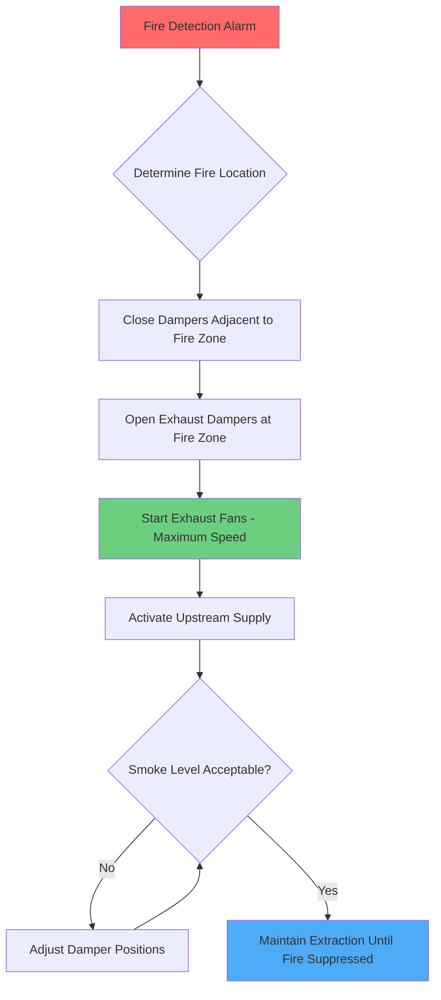

Emergency ventilation systems represent the most critical life safety component in enclosed vehicular tunnels. During fire events, these systems must control smoke movement to maintain tenable egress conditions while managing heat release rates that can exceed 100 MW in heavy vehicle fires.

## Fire Dynamics in Tunnel Environments

Tunnel fires create unique thermodynamic conditions governed by confined geometry and buoyancy-driven flows. The heat release rate (HRR) determines smoke production and ceiling jet temperatures:

$$Q = \dot{m}_f \cdot \Delta H_c \cdot \chi$$

where $Q$ is the heat release rate (kW), $\dot{m}_f$ is the fuel mass burning rate (kg/s), $\Delta H_c$ is the heat of combustion (kJ/kg), and $\chi$ is the combustion efficiency.

The buoyant smoke layer rises and forms a ceiling jet with velocity:

$$u_{max} = 0.96 \left(\frac{Q}{H}\right)^{1/3}$$

where $u_{max}$ is maximum ceiling jet velocity (m/s) and $H$ is the height above the fire source (m). This stratified flow behavior drives emergency ventilation strategy selection.

## Critical Velocity Concept

Critical velocity ($V_{cr}$) represents the minimum longitudinal air velocity required to prevent smoke backlayering against the ventilation flow direction. This parameter governs longitudinal system design and derives from force balance between buoyant smoke momentum and ventilation airflow momentum.

The Memorial Tunnel Fire Ventilation Test Program established the widely-adopted correlation:

$$V_{cr} = K_g \cdot K_1 \left(\frac{g \cdot H \cdot Q}{C_p \cdot \rho_{\infty} \cdot T_{\infty} \cdot A}\right)^{1/3}$$

where:
- $V_{cr}$ = critical velocity (m/s)
- $K_g$ = grade factor = $(1 + 0.0387 \cdot G)$ for uphill grades
- $K_1$ = dimensionless constant ≈ 0.606
- $g$ = gravitational acceleration (9.81 m/s²)
- $H$ = tunnel height (m)
- $Q$ = heat release rate (kW)
- $C_p$ = specific heat of air (1.005 kJ/kg·K)
- $\rho_{\infty}$ = ambient air density (kg/m³)
- $T_{\infty}$ = ambient temperature (K)
- $A$ = tunnel cross-sectional area (m²)

NFPA 502 specifies design fire sizes ranging from 20 MW (passenger car) to 100 MW (heavy goods vehicle) with corresponding critical velocities typically 2.5-3.5 m/s for level tunnels.

## Longitudinal Ventilation Systems

Longitudinal systems establish unidirectional airflow throughout the tunnel length using jet fans mounted at the ceiling or in niches. This configuration pushes smoke downstream from the fire location.

### Operating Principles

Jet fans impart momentum to tunnel air through high-velocity discharge jets. The thrust force generated equals:

$$F = \dot{m} \cdot \Delta V = \rho \cdot Q_{fan} \cdot (V_{jet} - V_{tunnel})$$

where $F$ is thrust force (N), $\dot{m}$ is mass flow rate (kg/s), $Q_{fan}$ is fan volumetric flow (m³/s), $V_{jet}$ is jet discharge velocity (m/s), and $V_{tunnel}$ is existing tunnel velocity (m/s).

Multiple jet fans operate in stages to achieve critical velocity while accounting for:
- Momentum decay along tunnel length
- Traffic blockage effects
- Portal pressure differentials
- Grade-induced pressure changes

### Advantages and Limitations

**Advantages:**
- Lower initial capital cost
- No ductwork required
- Simpler construction in existing tunnels
- Effective for uni-directional traffic

**Limitations:**
- Smoke travels significant distance downstream
- Fire location uncertainty complicates pre-planning
- Traffic congestion affects performance
- Limited effectiveness in bi-directional tunnels

## Transverse Ventilation Systems

Transverse systems employ dedicated supply and exhaust ducts running the tunnel length with dampers or ports at regular intervals. This configuration provides localized smoke extraction regardless of fire location.

### System Configurations

Three primary arrangements exist:

| Configuration | Supply | Exhaust | Application |
|---------------|--------|---------|-------------|
| **Semi-Transverse Supply** | Duct ports | Portal/natural | Uphill grades, fresh air delivery |
| **Semi-Transverse Exhaust** | Portal/natural | Duct ports | Downhill grades, smoke removal |
| **Full Transverse** | Duct ports | Duct ports | Bi-directional, longest tunnels |

### Emergency Smoke Extraction

During fire events, the system activates exhaust ports nearest the fire location while closing adjacent ports to maximize extraction efficiency. The required volumetric extraction rate derives from:

$$\dot{V}_{exhaust} = \frac{Q}{\rho \cdot C_p \cdot \Delta T}$$

where $\dot{V}_{exhaust}$ is the exhaust volumetric flow rate (m³/s) and $\Delta T$ is the temperature rise of exhaust air above ambient (K).

NFPA 502 recommends exhaust rates of 150-250 m³/s per extraction point for design fire scenarios, adjusted for:
- Fire size and intensity
- Smoke layer stratification height
- Tunnel cross-sectional area
- Desired smoke clearance rate

### Control Strategies

Automated control sequences respond to fire detection signals:

1. **Detection Phase**: Heat, smoke, or CO sensors identify fire location
2. **Isolation Phase**: Dampers isolate fire zone within 60 seconds
3. **Extraction Phase**: Exhaust fans activate to maximum capacity
4. **Pressurization Phase**: Upstream supply maintains positive pressure
5. **Monitoring Phase**: Continuous sensor feedback adjusts damper positions

## Egress Path Protection

Maintaining tenable conditions in egress routes constitutes the primary objective of emergency ventilation. Tenability criteria per NFPA 502 require:

| Parameter | Limit | Basis |
|-----------|-------|-------|
| Visibility | > 10 m | Wayfinding capability |
| Temperature | < 60°C | Thermal tolerance |
| CO Concentration | < 1400 ppm | 30-min exposure limit |
| Radiant Heat Flux | < 2.5 kW/m² | Skin tolerance |

### Smoke-Free Egress Corridors

For tunnels with cross-passages to adjacent bore or emergency egress corridors, ventilation systems must maintain positive pressure differentials:

$$\Delta P = \frac{1}{2} \rho V^2 \left(\frac{A_{opening}}{A_{corridor}}\right)^2$$

Typical pressure differentials range from 25-75 Pa to prevent smoke infiltration through doorways. Supply airflow rates to egress corridors typically provide 20-30 air changes per hour.

## System Performance Validation

Computational Fluid Dynamics (CFD) modeling validates emergency ventilation performance before construction. Models solve the Navier-Stokes equations with combustion source terms and radiation heat transfer:

$$\frac{\partial \rho}{\partial t} + \nabla \cdot (\rho \mathbf{u}) = 0$$

$$\frac{\partial (\rho \mathbf{u})}{\partial t} + \nabla \cdot (\rho \mathbf{u} \otimes \mathbf{u}) = -\nabla p + \nabla \cdot \boldsymbol{\tau} + \rho \mathbf{g}$$

Validation criteria include:
- Critical velocity achievement under design HRR
- Smoke layer height maintenance above 2.5 m
- Egress path visibility and temperature limits
- System response time < 120 seconds

Full-scale commissioning tests verify installed system performance using tracer gases or controlled smoke releases to measure:
- Actual critical velocity vs. design value
- Smoke clearance rates
- Pressure differentials at cross-passages
- Control system response accuracy

## Design Considerations

Emergency ventilation system selection depends on multiple factors:

**Tunnel Length and Geometry:**
- Longitudinal effective for tunnels < 1000 m
- Transverse required for longer tunnels
- Cross-sectional area affects critical velocity

**Traffic Characteristics:**
- Uni-directional enables longitudinal systems
- Bi-directional requires transverse extraction
- Heavy vehicle percentage determines design HRR

**Grade and Alignment:**
- Uphill grades reduce required critical velocity
- Downhill grades increase ventilation demand
- Curves create non-uniform flow patterns

**Integration with Fire Suppression:**
- Water spray systems alter smoke temperature
- Deluge systems require increased exhaust capacity
- Foam systems may reduce ventilation effectiveness

Emergency ventilation remains a specialized engineering discipline requiring integration of fire dynamics, fluid mechanics, and life safety analysis. Proper design following NFPA 502 guidelines ensures tunnel users can safely egress during the most severe fire scenarios.
