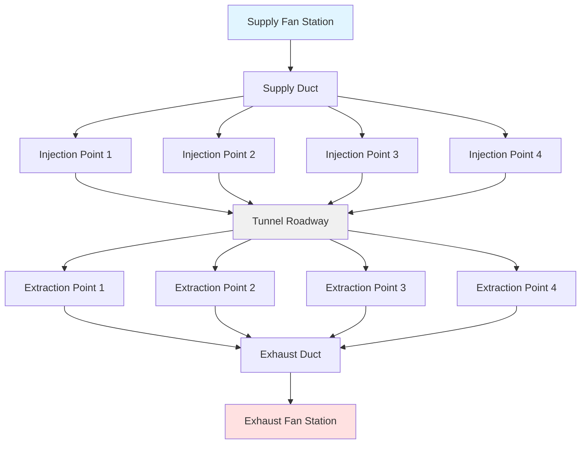
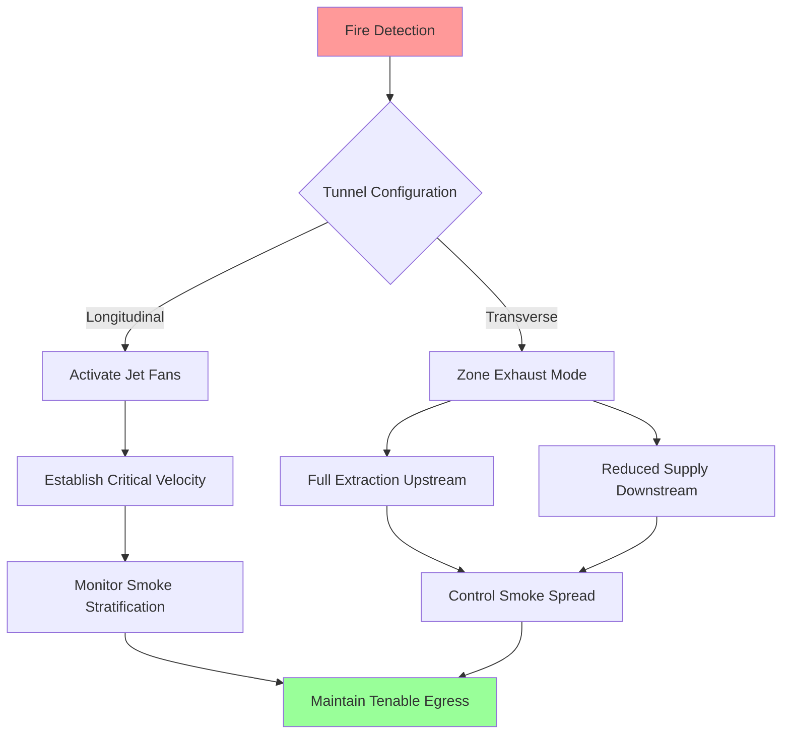

## Fundamental Ventilation Requirements

Vehicle tunnel ventilation systems address two distinct operational regimes with fundamentally different physics and performance criteria. Normal operation focuses on continuous dilution of internal combustion engine emissions and maintenance of acceptable visibility. Emergency operation prioritizes life safety through smoke control and tenable egress conditions during fire events.

The mass balance governing contaminant accumulation in a tunnel section establishes the baseline ventilation requirement:

$$\dot{m}_{gen} = \dot{m}_{removed} + \frac{dM}{dt}$$

For steady-state operation, the accumulation term vanishes, and the required volumetric flow rate becomes:

$$Q = \frac{E \cdot N \cdot L}{C_{max} - C_{ambient}}$$

where $E$ represents emission rate per vehicle (g/s), $N$ is traffic density (vehicles/km), $L$ is tunnel length (m), and $C_{max}$ is the maximum allowable contaminant concentration (ppm or mg/m³).

## Road Versus Rail Tunnel Considerations

Road and rail tunnels present distinct ventilation challenges rooted in their operational characteristics:

| Parameter | Road Tunnels | Rail Tunnels |
|-----------|--------------|--------------|
| Traffic pattern | Continuous, variable speed | Intermittent, scheduled |
| Emission profile | Distributed sources | Concentrated at locomotives |
| Piston effect | Minimal (vehicle speed < 100 km/h) | Significant (train blockage ratio 0.6-0.8) |
| Fire load | Multiple independent sources | Single concentrated source |
| Egress strategy | Walk to portals or cross-passages | Remain in train or controlled evacuation |
| Ventilation control | Continuous modulation | Event-based activation |

Rail tunnels benefit substantially from the piston effect, where train movement induces airflow proportional to:

$$Q_{piston} = v \cdot A_{train} \cdot \beta$$

where $v$ is train velocity, $A_{train}$ is the train cross-sectional area, and $\beta$ is the blockage ratio (typically 0.6-0.8 for metro systems). This natural ventilation mechanism can provide 60-80% of required normal ventilation in many rail applications.

## Ventilation System Configurations

### Natural Ventilation

Natural ventilation relies on pressure differentials created by thermal buoyancy, wind effects at portals, and traffic-induced piston effects. The buoyancy-driven flow is governed by:

$$\Delta P = \rho \cdot g \cdot h \cdot \frac{\Delta T}{T_{avg}}$$

Natural ventilation remains viable only for short tunnels (typically L < 300 m for road, L < 500 m for rail) with low traffic volumes and favorable portal elevation differences. The Froude number characterizes the transition from natural to forced ventilation requirements:

$$Fr = \frac{v}{\sqrt{g \cdot h \cdot \frac{\Delta T}{T_{avg}}}}$$

### Longitudinal Ventilation

Longitudinal systems establish unidirectional airflow parallel to traffic direction using jet fans mounted in the tunnel ceiling or sidewalls. The momentum injection from a jet fan array creates bulk air movement through:

$$\Delta P_{total} = \sum_{i=1}^{n} \frac{\rho \cdot v_{jet,i}^2 \cdot A_{jet,i}}{A_{tunnel}} - \Delta P_{friction}$$

The friction pressure drop over tunnel length $L$ follows the Darcy-Weisbach relationship:

$$\Delta P_{friction} = f \cdot \frac{L}{D_h} \cdot \frac{\rho \cdot v^2}{2}$$

where $f$ is the friction factor (typically 0.015-0.025 for concrete tunnels) and $D_h$ is the hydraulic diameter.

Longitudinal systems excel in simplicity and capital cost but create several operational constraints. Contaminants travel the full tunnel length before discharge, portal emissions concentrate at a single location, and emergency smoke control requires maintaining critical velocity to prevent backlayering.

### Transverse and Semi-Transverse Ventilation

Transverse systems employ separate supply and exhaust ducts running the tunnel length with distributed injection and extraction points. Semi-transverse variants use either supply-only or exhaust-only ducts combined with portal flow.

The pressure distribution in a supply duct with uniform extraction follows:

$$\frac{dP}{dx} = -f \cdot \frac{\rho \cdot v(x)^2}{2 \cdot D_h} - \rho \cdot v(x) \cdot \frac{dv}{dx}$$

The second term represents momentum loss through lateral extraction. Achieving uniform air distribution requires careful duct sizing and damper configuration to maintain pressure head along the duct length.

## Design Criteria and Standards

NFPA 502 (Standard for Road Tunnels, Bridges, and Other Limited Access Highways) and ASHRAE Handbook establish quantitative performance criteria:

| Contaminant | Normal Operation Limit | Emergency Operation Limit | Averaging Period |
|-------------|------------------------|---------------------------|------------------|
| Carbon monoxide (CO) | 50 ppm | 400 ppm (tenability) | 15 minutes |
| Nitrogen dioxide (NO₂) | 1 ppm | 25 ppm (tenability) | 15 minutes |
| Visibility (extinction coefficient) | > 0.005 m⁻¹ | > 0.1 m⁻¹ (4 m visibility) | Instantaneous |
| Temperature | < 40°C | < 60°C (tenable limit) | — |

Tunnel length and traffic volume establish the baseline ventilation demand. The traffic factor $TF$ combines these parameters:

$$TF = \frac{N_{vehicles} \cdot L}{3600 \cdot v_{avg}}$$

where $N_{vehicles}$ is hourly traffic volume and $v_{avg}$ is average vehicle speed (m/s).

## Emergency Operation and Critical Velocity

Fire scenarios transform ventilation requirements from dilution to smoke control. The critical velocity $v_{cr}$ represents the minimum longitudinal airflow required to prevent smoke backlayering:

$$v_{cr} = K \cdot \left(\frac{g \cdot Q_{fire} \cdot H}{A \cdot \rho \cdot c_p \cdot T_0}\right)^{1/3}$$

where $Q_{fire}$ is fire heat release rate (kW), $H$ is tunnel height, $A$ is cross-sectional area, and $K$ is a dimensionless coefficient (typically 0.6-0.8 accounting for tunnel geometry).

For a design fire of 100 MW in a typical highway tunnel (50 m² cross-section, 5 m height), critical velocity typically ranges from 2.5-3.5 m/s.

Transverse systems offer superior emergency performance by extracting smoke directly above the fire location, limiting contamination spread to adjacent tunnel sections. The extraction rate required to capture smoke before it reaches the tunnel ceiling follows:

$$Q_{exhaust} = K \cdot P \cdot \sqrt{\frac{Q_{fire}}{P}}$$

where $P$ is the fire perimeter and $K$ ranges from 0.3-0.5 depending on extraction configuration.

The fundamental physics governing tunnel ventilation—mass transport, momentum transfer, and buoyancy-driven stratification—remains consistent across applications. System selection balances capital cost, operational complexity, and the specific safety requirements of each installation.

