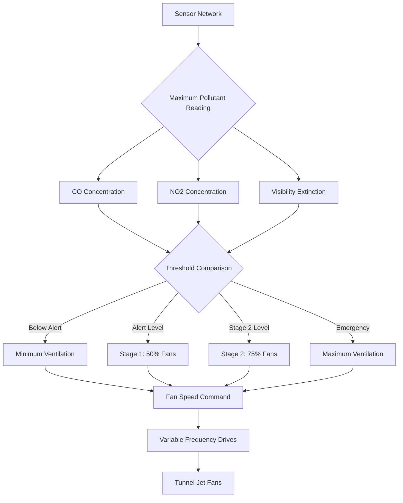

## Overview

Air quality monitoring in enclosed vehicular facilities serves as the sensory feedback mechanism for demand-based ventilation control. The primary pollutants requiring continuous measurement are carbon monoxide (CO), nitrogen dioxide (NO₂), and visibility-reducing particulates. These monitoring systems directly interface with ventilation fan controls to maintain safe breathing conditions and adequate visual range for vehicle operation.

## Carbon Monoxide Monitoring

### CO Sensor Technology

Modern tunnel CO sensors employ electrochemical or infrared absorption technology. Electrochemical cells generate current proportional to CO concentration through redox reactions at electrode surfaces:

$$\text{CO} + \text{H}_2\text{O} \rightarrow \text{CO}_2 + 2\text{H}^+ + 2e^-$$

The electrical current produced is directly proportional to CO concentration, typically measured in parts per million (ppm). Infrared sensors operate on the principle that CO molecules absorb specific wavelengths in the infrared spectrum (4.6 μm), with absorption intensity following Beer-Lambert law:

$$I = I_0 e^{-\alpha C L}$$

Where:
- $I$ = transmitted light intensity
- $I_0$ = initial light intensity
- $\alpha$ = absorption coefficient
- $C$ = CO concentration
- $L$ = optical path length

### Sensor Network Design

NFPA 502 requires CO monitoring at intervals not exceeding 300 feet in roadway tunnels. Sensor placement follows these principles:

**Horizontal Spacing**: Sensors positioned to detect localized pollution pockets before they exceed threshold levels. The mixing time for pollutant dispersion is governed by turbulent diffusion:

$$\frac{\partial C}{\partial t} = D_t \frac{\partial^2 C}{\partial x^2} + v \frac{\partial C}{\partial x}$$

Where $D_t$ represents turbulent diffusivity and $v$ is the mean airflow velocity.

**Vertical Placement**: CO density (1.25 g/L at STP) approximates air density (1.29 g/L), resulting in neutral buoyancy. Sensors install at breathing zone height (4-6 feet above roadway) to measure driver exposure accurately.

**Sampling Method**: Point sampling versus averaged sampling over multiple locations determines control stability. Averaged readings reduce false alarms from transient spikes but may delay response to developing conditions.

| Sensor Type | Response Time | Accuracy | Maintenance Interval | Typical Life |
|-------------|--------------|----------|---------------------|--------------|
| Electrochemical | 30-90 seconds | ±5 ppm | 6 months | 2-3 years |
| Infrared (NDIR) | 10-30 seconds | ±2 ppm | 12 months | 10+ years |

### Control Setpoints

Typical CO control thresholds for ventilation activation:

- **Alert Level**: 35 ppm (8-hour TWA occupational limit)
- **Stage 1 Activation**: 50 ppm
- **Stage 2 Activation**: 70 ppm
- **Emergency Level**: 100 ppm (increased airflow to maximum)

The relationship between ventilation rate and CO concentration assumes steady-state dilution:

$$Q = \frac{G}{C - C_0}$$

Where:
- $Q$ = required ventilation rate (CFM)
- $G$ = pollutant generation rate (ppm·CFM)
- $C$ = target CO concentration
- $C_0$ = outdoor air CO concentration

## Visibility Monitoring

### Transmissometer Technology

Visibility meters (transmissometers) measure atmospheric light extinction coefficient ($b_{ext}$) by projecting a collimated light beam across the tunnel width and measuring transmitted intensity. The fundamental relationship is:

$$\frac{I}{I_0} = e^{-b_{ext} \cdot L}$$

The extinction coefficient relates directly to visibility distance through Koschmieder's equation:

$$V = \frac{-\ln(\epsilon)}{b_{ext}} \approx \frac{3.912}{b_{ext}}$$

Where $\epsilon$ is the contrast threshold (typically 0.02 for human vision).

### Physical Basis of Opacity

Light extinction in tunnel atmospheres results from Mie scattering by diesel particulates (0.1-1.0 μm diameter). The scattering efficiency peaks when particle diameter approaches the wavelength of visible light (0.4-0.7 μm), creating maximum visibility reduction per unit mass.

The mass concentration of particulates relates to extinction through:

$$b_{ext} = Q_{ext} \cdot \rho_p \cdot A_c$$

Where:
- $Q_{ext}$ = extinction efficiency (dimensionless)
- $\rho_p$ = particle density
- $A_c$ = particle cross-sectional area per unit volume

### Installation Requirements

Transmissometers install with:
- **Path length**: 30-50 meters typical (full tunnel width)
- **Mounting height**: Above vehicle envelope, protected from spray
- **Alignment tolerance**: ±0.5 degrees maximum
- **Light source**: LED or laser (880 nm infrared common to avoid sun interference)

| Visibility Range | Extinction Coefficient | Ventilation Response |
|------------------|----------------------|---------------------|
| >400 m | <0.01 m⁻¹ | Normal operation |
| 200-400 m | 0.01-0.02 m⁻¹ | Stage 1 ventilation |
| 100-200 m | 0.02-0.04 m⁻¹ | Stage 2 ventilation |
| <100 m | >0.04 m⁻¹ | Maximum ventilation |

## Nitrogen Dioxide Monitoring

### NO₂ Formation and Significance

Nitrogen dioxide forms through oxidation of nitric oxide (NO) emitted during combustion:

$$2\text{NO} + \text{O}_2 \rightarrow 2\text{NO}_2$$

This reaction is slow at ambient temperatures but accelerates in the presence of ozone and sunlight. NO₂ is more toxic than CO at equivalent concentrations and causes respiratory irritation at levels above 1 ppm.

### Sensor Technology

NO₂ sensors typically use chemiluminescence or electrochemical detection. The chemiluminescence method reacts NO₂ with luminol, producing light proportional to concentration. Electrochemical sensors operate similarly to CO cells but with selective electrodes sensitive to NO₂.

### Control Integration

NO₂ control thresholds:
- **Alert**: 1 ppm
- **Activation**: 3 ppm
- **Emergency**: 5 ppm (NIOSH ceiling limit)

## Integrated Ventilation Control

### Control Logic Architecture

Air quality monitoring systems feed into hierarchical control algorithms:

### Control Algorithm

The control system determines required ventilation rate by comparing multiple pollutant measurements:

$$Q_{required} = \max\left(Q_{CO}, Q_{NO_2}, Q_{vis}, Q_{min}\right)$$

Where each component represents the airflow needed to maintain that parameter within limits. The system responds to the most demanding condition.

### Time Constants and Response

Ventilation system response involves multiple time delays:

1. **Sensor response**: 30-90 seconds
2. **Control processing**: 1-5 seconds
3. **Fan acceleration**: 20-60 seconds to full speed
4. **Air mass transport**: $\tau = L/v$ where $L$ is tunnel length

Total system time constant for a 1000-foot tunnel at 15 fps airflow:

$$\tau_{total} = \tau_{sensor} + \tau_{fan} + \frac{1000 \text{ ft}}{15 \text{ fps}} \approx 90 + 40 + 67 = 197 \text{ seconds}$$

This 3-minute lag requires conservative setpoints to prevent excursions above health limits during transient events.

## System Commissioning and Calibration

### Calibration Requirements

**CO Sensors**: Calibrate against certified gas standards (50 ppm and 100 ppm) every 6 months. Verify zero point with filtered air.

**Transmissometers**: Calibrate using neutral density filters with known transmittance values. Verify optical alignment and clean windows monthly.

**NO₂ Sensors**: Calibrate against 1 ppm and 5 ppm standards every 6 months. Cross-sensitivity to NO must be verified below 10%.

### Performance Verification

Commission systems with smoke tests or controlled CO releases to verify:
- Sensor detection at each location
- Control system response timing
- Proper staging of ventilation equipment
- Alarm annunciation and data logging

The monitoring system serves as the critical feedback loop enabling energy-efficient, demand-based ventilation while maintaining occupant safety within the unique constraints of enclosed vehicular spaces.

## Standards and References

**NFPA 502**: Standard for Road Tunnels, Bridges, and Other Limited Access Highways
- Section 7.4: Environmental monitoring requirements
- Section 7.5: Air quality control thresholds
- Appendix D: Ventilation system design criteria

**ASHRAE**: No direct standards for tunnel ventilation, but psychrometric principles apply to moisture and temperature effects on sensors.
