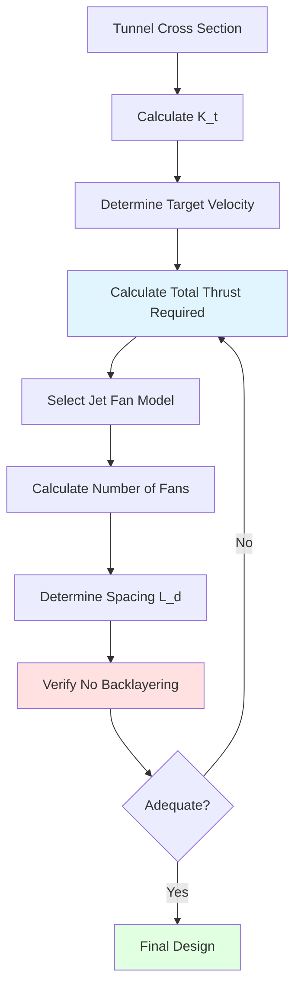
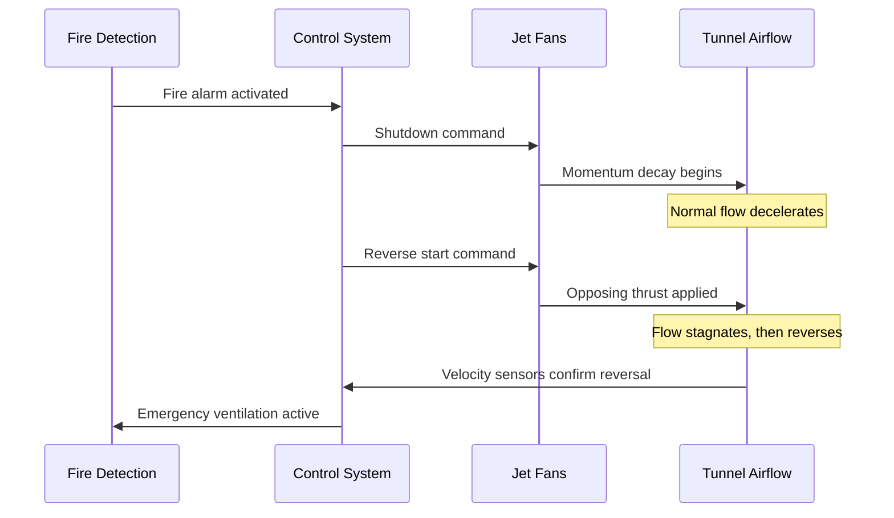

## Introduction

Jet fans provide longitudinal ventilation in vehicular tunnels by imparting momentum to the tunnel air stream without requiring costly ductwork. These axial-flow devices generate thrust through momentum transfer, accelerating a column of air that entrains surrounding tunnel air to create bulk flow. Unlike traditional ducted systems, jet fans mount directly in the tunnel crown, offering installation flexibility and reduced capital costs for tunnels exceeding 1000 feet in length.

## Thrust Generation and Momentum Transfer

Jet fan performance relies on Newton's second law applied to fluid flow. The thrust force $F_t$ generated by a jet fan equals the rate of momentum change imparted to the air:

$$F_t = \dot{m}(V_e - V_i) = \rho A_e V_e(V_e - V_i)$$

where $\dot{m}$ is mass flow rate, $V_e$ is exit velocity, $V_i$ is inlet velocity, $\rho$ is air density, and $A_e$ is exit area.

For stationary installations where $V_i \approx 0$, this simplifies to:

$$F_t = \rho A_e V_e^2$$

The Saccardo nozzle effect amplifies this thrust by 15-25% through diffuser action. A properly designed venturi configuration at the fan discharge creates pressure recovery that increases effective momentum transfer. The expansion angle must not exceed 7° to prevent flow separation; optimal designs use 4-6° total included angle.

The thrust coefficient $C_t$ characterizes nozzle effectiveness:

$$C_t = \frac{F_{actual}}{F_{theoretical}} = \frac{F_{actual}}{\rho A_e V_e^2}$$

High-efficiency Saccardo nozzles achieve $C_t = 1.15$ to $1.25$, compared to $C_t = 1.0$ for un-nozzled fans.

## System Thrust Requirements

Total thrust needed depends on tunnel aerodynamic resistance and target air velocity. The tunnel resistance force $F_r$ is:

$$F_r = \frac{1}{2}\rho V^2 A_t K_t$$

where $V$ is bulk air velocity, $A_t$ is tunnel cross-sectional area, and $K_t$ is the tunnel resistance coefficient.

The resistance coefficient combines skin friction and form losses:

$$K_t = \frac{f L}{D_h} + \sum K_{local}$$

where $f$ is the Darcy friction factor (0.015-0.025 for concrete tunnels), $L$ is tunnel length, $D_h$ is hydraulic diameter, and $\sum K_{local}$ accounts for portals, bends, and grade changes.

NFPA 502 requires sufficient capacity to maintain minimum critical velocity during fire scenarios—typically 3-4 m/s (600-800 fpm) to prevent backlayering of smoke against traffic flow.

## Jet Fan Spacing and Placement

Optimal spacing balances thrust distribution against installation costs. The momentum diffusion length $L_d$ determines effective spacing:

$$L_d = \frac{A_t}{P_t} \cdot \frac{V}{V_e} \cdot C_e$$

where $P_t$ is tunnel perimeter and $C_e$ is an entrainment coefficient (typically 0.1-0.15).

Fans spaced closer than $L_d$ operate in the developing jet region, reducing efficiency. Spacing beyond $2L_d$ creates velocity stratification. Practical installations use spacing of 100-200 feet (30-60 m) depending on tunnel geometry and thrust requirements.

Installation height affects entrainment patterns. Crown mounting at 80-90% of tunnel height maximizes air entrainment while maintaining clearance. Centerline mounting is preferred; offset installations create asymmetric flow patterns that reduce effective thrust by 10-15%.

## Reversible Operation for Emergency Ventilation

Fire emergencies require rapid flow reversal to extract smoke or prevent contamination of evacuation routes. Reversible jet fans accomplish this through motor reversal or variable-pitch blades, achieving full reverse thrust within 60-90 seconds.

The flow reversal process involves three phases:

1. **Deceleration Phase**: Existing momentum decays as fans shut down ($t = 0$ to $t_1$)
2. **Reversal Initiation**: Fans restart in opposite direction, creating opposing jets ($t = t_1$ to $t_2$)
3. **Flow Establishment**: Bulk flow reverses and stabilizes ($t = t_2$ to $t_3$)

Total reversal time depends on tunnel length and resistance:

$$t_{total} = \frac{\rho L A_t V}{F_{net}} + t_{fan}$$

where $t_{fan}$ is fan mechanical reversal time (30-45 seconds for modern units).

## Fire-Rated Jet Fans

Fire-rated jet fans must operate in temperatures up to 250°C (482°F) or 400°C (752°F) depending on NFPA 502 classification. Critical design features include:

| Component | Standard Fan | Fire-Rated (250°C) | Fire-Rated (400°C) |
|-----------|--------------|-------------------|-------------------|
| Motor Insulation | Class F (155°C) | Class H (180°C) with cooling | Oversized Class H with forced cooling |
| Impeller Material | Aluminum alloy | Heat-treated aluminum | Stainless steel or titanium |
| Bearing Type | Sealed ball | High-temp grease, externally cooled | Ceramic or high-temp steel |
| Housing | Carbon steel | Stainless steel 304 | Stainless steel 316 or ceramic coating |
| Duration Rating | N/A | 60-120 minutes | 120-240 minutes |

Motor cooling relies on external air ducted from cooler tunnel sections or dedicated cooling fans that activate during fire scenarios. Heat transfer from the motor to cooling air is:

$$Q = \dot{m}_c c_p (T_{out} - T_{in}) = \frac{P_{motor}}{\eta_{cooling}}$$

where $\dot{m}_c$ is cooling air mass flow rate and $\eta_{cooling}$ is cooling system effectiveness (0.7-0.85).

## Installation Considerations

Crown mounting requires structural analysis of suspension loads. Dynamic loading includes:

- Static weight: 500-2000 kg per fan unit
- Thrust reaction force: Equal and opposite to rated thrust
- Vibration loading: Frequency typically 20-60 Hz at blade pass frequency

Isolation mounts must attenuate vibration while resisting thrust loads. Spring isolators with 1-2 inches deflection provide 90-95% isolation at operating frequencies.

Electrical supply must account for simultaneous starting during emergency operation. Inrush current reaches 6-8 times full load for direct-on-line starting; soft-starters reduce this to 3-4 times but increase start time.

## Noise Control

Jet fans generate broadband noise from turbulent mixing and tonal components at blade pass frequency. Sound power level correlates with fan power:

$$L_w = 10 \log_{10}(P_{fan}) + C_{fan}$$

where $C_{fan}$ ranges from 35-45 dB depending on design quality.

Mitigation strategies include:

- **Acoustic cladding**: Perforated metal with mineral wool absorption (NRC 0.7-0.9)
- **Low-tip-speed designs**: Larger diameter at reduced RPM reduces noise by 3-6 dB per 10% speed reduction
- **Silencer sections**: Add-on diffusers with absorptive lining, 10-15 dB attenuation
- **Optimized blade count**: 7 or 9 blades distribute tonal energy across more frequencies

Tunnel reverberation amplifies noise; absorption treatment of tunnel walls within 50 feet of fan installations reduces reflected sound by 5-8 dB.

## Operational Efficiency

Jet fan efficiency $\eta_j$ represents thrust delivered per unit power consumed:

$$\eta_j = \frac{F_t \cdot V}{\frac{P_{fan}}{\rho A_t}}$$

Typical values range from 0.5-0.7 for standard designs; optimized high-efficiency units achieve 0.7-0.85. Power consumption for a tunnel system is:

$$P_{total} = \frac{n \cdot F_t \cdot V}{\eta_j}$$

where $n$ is the number of operating fans.

Variable frequency drives enable staging based on traffic density and air quality, reducing annual energy consumption by 30-50% compared to constant-speed operation.

## Conclusion

Jet fan systems provide economical, flexible longitudinal ventilation for vehicular tunnels through direct momentum transfer. Proper design requires accurate thrust calculations accounting for tunnel resistance, careful spacing to optimize entrainment, and fire-rated construction for emergency operation. The Saccardo nozzle effect and reversible capability enhance performance while crown mounting and acoustic treatment address installation constraints. Compliance with NFPA 502 ensures life safety during fire scenarios through adequate critical velocity maintenance and rapid flow reversal capability.
