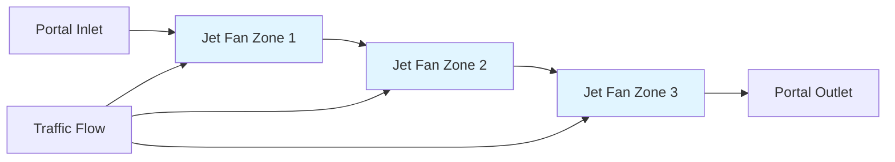
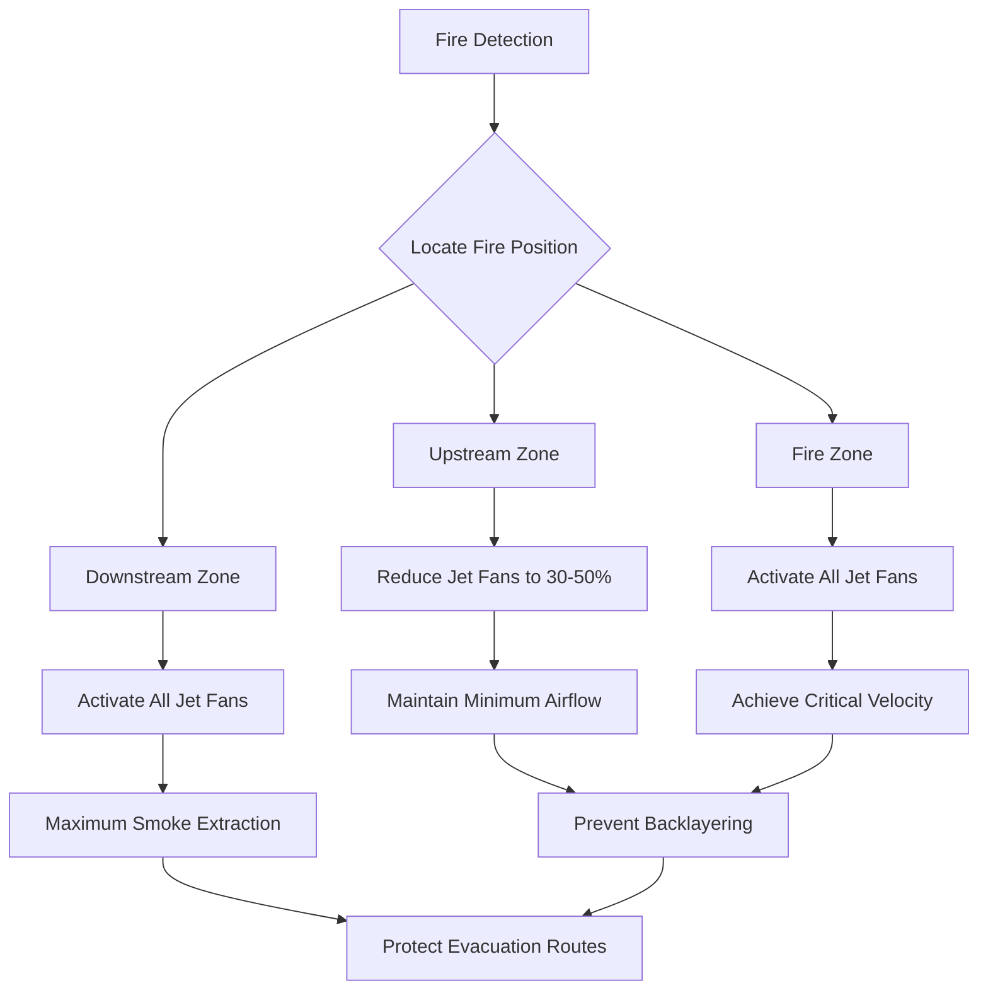

## Longitudinal Ventilation Fundamentals

Longitudinal ventilation systems create unidirectional airflow through the entire length of a tunnel, moving air from one portal to the other. This approach relies on imparting momentum to the air mass rather than physically moving air through ducts. The system exploits the tunnel geometry itself as the air distribution pathway, making it the most cost-effective solution for tunnels under 3,000 ft (914 m) in length.

The fundamental principle involves adding thrust to overcome system resistance and maintain sufficient air velocity to dilute vehicle emissions during normal operation and control smoke movement during fire emergencies. The total thrust requirement depends on tunnel aerodynamic resistance, traffic-induced drag, grade effects, and required air velocity.

## Jet Fan Design and Thrust Mechanics

Jet fans operate on the momentum transfer principle described by Newton's second law. A jet fan accelerates air through an impeller, discharging it at high velocity. The momentum change imparts thrust to the surrounding tunnel air, gradually accelerating the bulk airflow.

### Thrust Calculation

The theoretical thrust produced by a single jet fan is:

$$T = \dot{m}(V_j - V_t) = \rho A_j V_j(V_j - V_t)$$

Where:
- $T$ = thrust force (N or lbf)
- $\dot{m}$ = mass flow rate through jet fan (kg/s or lbm/s)
- $V_j$ = jet discharge velocity (m/s or ft/s)
- $V_t$ = tunnel air velocity (m/s or ft/s)
- $\rho$ = air density (kg/m³ or lbm/ft³)
- $A_j$ = jet fan discharge area (m² or ft²)

The effective thrust accounting for installation losses and jet decay is:

$$T_{eff} = \eta_i \cdot T = \eta_i \cdot \rho A_j V_j(V_j - V_t)$$

Where $\eta_i$ = installation efficiency factor (typically 0.85-0.95 depending on mounting configuration and clearances).

### Jet Fan Efficiency

The aerodynamic efficiency of the jet fan itself relates input power to momentum added:

$$\eta_{jet} = \frac{\dot{m}(V_j - V_t)}{P_{motor}} = \frac{\rho A_j V_j(V_j - V_t)}{P_{motor}}$$

Modern axial jet fans achieve aerodynamic efficiencies of 50-60% when operating at design conditions. Two-stage fans can exceed 65% efficiency.

## System Thrust Requirements

The total thrust required to maintain longitudinal airflow accounts for multiple resistance components:

$$T_{total} = T_{friction} + T_{grade} + T_{portal} + T_{traffic}$$

### Tunnel Friction Resistance

Friction resistance follows the Darcy-Weisbach relationship adapted for tunnel flows:

$$T_{friction} = f \cdot \frac{L}{D_h} \cdot \frac{\rho V_t^2}{2} \cdot A_t$$

Where:
- $f$ = friction factor (dimensionless, typically 0.015-0.025 for concrete tunnels)
- $L$ = tunnel length (m or ft)
- $D_h$ = hydraulic diameter (m or ft), $D_h = \frac{4A_t}{P}$
- $A_t$ = tunnel cross-sectional area (m² or ft²)
- $P$ = tunnel perimeter (m or ft)

The friction factor depends on tunnel surface roughness and Reynolds number. For concrete tunnels with standard finishes, $f = 0.020$ is commonly used.

### Grade Effect

Buoyancy forces due to tunnel grade either assist or oppose airflow:

$$T_{grade} = \rho g A_t L \sin(\theta)$$

Where:
- $g$ = gravitational acceleration (9.81 m/s² or 32.2 ft/s²)
- $\theta$ = tunnel grade angle (radians or degrees)

For small angles: $\sin(\theta) \approx \tan(\theta) = \frac{\text{rise}}{\text{run}}$

Positive grade (uphill in flow direction) requires additional thrust; negative grade (downhill) provides assisting force.

### Portal Losses

Entrance and exit losses at tunnel portals:

$$T_{portal} = K_p \cdot \frac{\rho V_t^2}{2} \cdot A_t$$

Where $K_p$ = portal loss coefficient (typically 1.0-1.5 depending on portal geometry).

### Traffic-Induced Drag

Vehicle traffic creates additional resistance through skin friction and form drag:

$$T_{traffic} = 0.5 \rho C_d A_v n V_{rel}^2$$

Where:
- $C_d$ = vehicle drag coefficient (typically 0.6-0.8)
- $A_v$ = average vehicle frontal area (m² or ft²)
- $n$ = number of vehicles in tunnel
- $V_{rel}$ = relative velocity between vehicle and air

This component varies significantly with traffic density and composition.

## Piston Effect

The piston effect describes the airflow induced by moving vehicles. As vehicles traverse the tunnel, they displace air forward and create following currents, effectively acting as moving pistons. This phenomenon significantly influences longitudinal ventilation system design and operation.

### Piston Effect Quantification

The volumetric flow induced by a single vehicle:

$$Q_{piston} = V_{vehicle} \cdot A_{blockage} \cdot \eta_{drag}$$

Where:
- $V_{vehicle}$ = vehicle speed (m/s or ft/s)
- $A_{blockage}$ = effective blockage area, typically 0.7-0.8 of vehicle frontal area
- $\eta_{drag}$ = drag effectiveness factor (0.5-0.7)

For typical passenger vehicles at highway speeds (100 km/h or 62 mph), the piston effect can generate 40-60 m³/s (85,000-127,000 CFM) per vehicle.

### Traffic Flow Impact

During heavy unidirectional traffic, the cumulative piston effect can exceed the design ventilation flow, potentially creating over-ventilation in the traffic direction and under-ventilation in the return direction. NFPA 502 requires consideration of bidirectional traffic scenarios where piston effects partially cancel.

| Traffic Condition | Piston Effect Impact | Ventilation Strategy |
|------------------|---------------------|---------------------|
| Light traffic, single direction | Minimal, ~10% of design flow | Normal jet fan operation |
| Heavy unidirectional traffic | Significant, 50-100% of design | Reduce or stop jet fans |
| Congested bidirectional | Canceling effects | Full jet fan operation |
| Stopped traffic (incident) | Zero piston effect | Maximum ventilation capacity |

## Normal Operation Air Velocity

ASHRAE recommends and NFPA 502 specifies longitudinal air velocities during normal operation based on emissions control requirements:

- Minimum: 2.0 m/s (400 ft/min) for effective pollutant dilution
- Maximum: 11 m/s (2,200 ft/min) to prevent excessive vehicle resistance and driver discomfort

The design velocity typically ranges from 3-6 m/s (600-1,200 ft/min) based on:
- Traffic volume and composition
- Tunnel length and geometry
- Emission generation rates (CO, NO₂, particulates)
- Ambient portal conditions

### Contaminant Dilution

The required air velocity for contaminant control:

$$V_t = \frac{E_{total}}{C_{limit} \cdot A_t - C_{ambient}}$$

Where:
- $E_{total}$ = total emission generation rate (mass/time)
- $C_{limit}$ = allowable concentration limit
- $C_{ambient}$ = ambient portal concentration

## Critical Velocity for Fire Safety

Critical velocity represents the minimum longitudinal air velocity required to prevent smoke backlayering during a tunnel fire. Backlayering occurs when buoyant hot gases overcome the longitudinal airflow and propagate upstream, creating hazardous conditions for evacuation.

### Critical Velocity Formula

The Memorial Tunnel Fire Ventilation Test Program (1995) established the widely-adopted critical velocity correlation:

$$V_{critical} = K \cdot \left(\frac{gHQ}{A_t \rho C_p T_{amb}}\right)^{1/3}$$

Where:
- $K$ = dimensionless coefficient (typically 1.0-1.2)
- $g$ = gravitational acceleration (9.81 m/s²)
- $H$ = tunnel height (m)
- $Q$ = heat release rate (kW)
- $A_t$ = tunnel cross-section (m²)
- $C_p$ = specific heat of air (1.005 kJ/kg·K)
- $T_{amb}$ = ambient temperature (K)

For practical application with heat release rate in MW:

$$V_{critical} \approx 1.53 \left(\frac{Q_{MW}}{A_t}\right)^{1/3} \text{ m/s}$$

### Design Fire Scenarios

NFPA 502 categorizes design fires by heat release rate:

| Fire Category | Heat Release Rate | Representative Vehicle | Critical Velocity (10 m² tunnel) |
|--------------|-------------------|----------------------|----------------------------------|
| Small passenger vehicle | 5 MW | Car, motorcycle | 2.6 m/s (510 ft/min) |
| Passenger vehicle | 20 MW | Sedan, SUV | 4.1 m/s (810 ft/min) |
| Bus/Large vehicle | 30 MW | Bus, moving van | 4.7 m/s (925 ft/min) |
| Heavy goods vehicle | 50-100 MW | Tractor-trailer | 5.8-7.3 m/s (1,140-1,435 ft/min) |

Most tunnel designs target 50-100 MW fires, requiring critical velocities of 6-8 m/s (1,200-1,600 ft/min).

### Grade Effects on Critical Velocity

Tunnel grade modifies the required critical velocity:

$$V_{critical,grade} = V_{critical,level} + K_g \cdot \tan(\theta)$$

Where $K_g$ = grade factor (empirically 0.05-0.10). Uphill grades increase requirements; downhill grades reduce them.

## Emergency Fire Operation

During fire emergencies, longitudinal systems operate in distinctly different modes than normal ventilation:

### Operational Strategies

1. **Full Longitudinal Flow**: All jet fans operate to push smoke downstream, maintaining critical velocity throughout tunnel length. Evacuees move upstream against flow in fresh air.

2. **Zoned Operation**: Jet fans divided into control zones, with upstream fans at reduced capacity to minimize smoke spread while downstream fans maximize extraction.

3. **Reversal Capability**: Some systems can reverse flow direction based on fire location relative to portals, always pushing smoke toward nearest exit.

### Control System Integration

Modern systems integrate:
- Heat and smoke detectors (every 50-100 m per NFPA 502)
- CO/visibility monitors
- CCTV with automatic incident detection
- Emergency communication systems
- Automated jet fan control algorithms
- Manual override from control center

The control system must achieve full emergency ventilation capacity within 120 seconds of fire detection per NFPA 502 requirements.

## Jet Fan Arrangement and Spacing

Proper jet fan placement maximizes thrust efficiency and ensures uniform velocity development:

### Longitudinal Spacing

Jet fans typically spaced 200-400 m (650-1,300 ft) apart, grouped in clusters of 2-4 units. The optimal spacing balances:
- Jet mixing and momentum transfer length
- Electrical distribution infrastructure
- Maintenance access requirements
- Capital cost optimization

### Installation Height

Jet fans mounted 0.3-0.5 m (1.0-1.6 ft) below tunnel ceiling to:
- Maximize clearance for oversized vehicles
- Position discharge in upper smoke layer during fires
- Minimize acoustic impact on vehicle occupants

### Thrust Distribution

Total thrust distributed uniformly along tunnel length prevents velocity gradients and ensures effective contaminant control:

$$n_{fans} = \frac{T_{total}}{T_{fan,rated}} \cdot SF$$

Where $SF$ = safety factor (typically 1.2-1.5) accounting for degradation and future traffic increases.

## Performance Verification

Commissioning tests validate system performance:

1. **Cold Flow Testing**: Measure actual air velocities at multiple cross-sections using anemometer grids or tracer gas studies. Verify design velocity achieved within ±10%.

2. **Thrust Measurement**: Hot-wire anemometry in jet fan discharge to confirm rated thrust output.

3. **Emergency Response Testing**: Demonstrate transition to emergency mode within specified time limits.

4. **Smoke Testing**: Visual verification using non-toxic smoke generators to confirm smoke control and absence of backlayering at design critical velocity.

NFPA 502 requires full functional testing prior to tunnel opening and periodic re-verification every 3-5 years.

## System Advantages and Limitations

**Advantages:**
- Lowest capital cost for short tunnels (<3,000 ft)
- No ductwork required, maximizing tunnel cross-section
- Flexible operation adapting to traffic conditions
- Simple maintenance with accessible equipment

**Limitations:**
- Air velocities below 2 m/s difficult to achieve reliably
- Portal effects and wind conditions influence performance
- Maximum effective length ~3,000 m before excessive thrust requirements
- Single-point failures affect large tunnel sections
- Less precise ventilation control than transverse systems

**Applications:**
- Highway tunnels under 3 km (2 miles)
- Urban underground roadways
- Mountain tunnels with unidirectional traffic
- Retrofit ventilation upgrades

## References

- NFPA 502: Standard for Road Tunnels, Bridges, and Other Limited Access Highways
- ASHRAE Handbook - HVAC Applications, Chapter 15: Enclosed Vehicular Facilities
- Memorial Tunnel Fire Ventilation Test Program, 1995
- PIARC: Road Tunnels - Vehicle Emissions and Air Demand for Ventilation

---

*Physics-based analysis of longitudinal ventilation incorporating momentum transfer principles, critical velocity theory, and emergency smoke control strategies per current NFPA 502 standards.*
