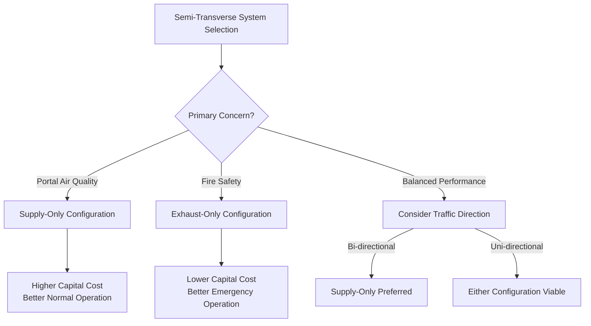

Semi-transverse ventilation systems represent a hybrid approach between full-transverse and longitudinal configurations, employing ducted air distribution on either the supply or exhaust side while allowing natural airflow on the opposite side. These systems provide superior control compared to purely longitudinal systems while requiring less infrastructure investment than full-transverse configurations, making them economically viable for medium-length tunnels (typically 1,000 to 6,000 ft).

## Fundamental Operating Principles

Semi-transverse systems exploit the momentum exchange between ducted airflow and the tunnel environment to establish controlled ventilation patterns. In supply-only configurations, fresh air discharges through duct openings along the tunnel length, creating localized high-pressure zones that drive contaminants toward portal exits. Exhaust-only systems extract contaminated air through distributed openings, inducing fresh air entry through portals via pressure differential.

The effectiveness of semi-transverse ventilation depends on maintaining adequate pressure gradients along the tunnel length. The static pressure profile in the duct must overcome both friction losses and the dynamic pressure required to discharge air into the tunnel space:

$$\Delta P_{total} = \Delta P_{friction} + \Delta P_{discharge} + \Delta P_{portal}$$

where portal pressure effects become significant in tunnels exceeding 3,000 ft in length.

## Supply-Only Semi-Transverse Configuration

Supply-only systems distribute fresh air through a duct running the tunnel length, with discharge openings spaced at regular intervals. Air exits through portals along with vehicle exhaust and contaminated air. This configuration maintains positive pressure along most of the tunnel length, providing natural contaminant dilution.

### Air Flow Dynamics

The discharge velocity from duct openings must be sufficient to penetrate the traffic stream and establish mixing across the tunnel cross-section. The penetration distance depends on the momentum ratio:

$$\frac{x}{d} = K \sqrt{\frac{\rho_{jet} V_{jet}^2}{\rho_{\infty} V_{\infty}^2}}$$

where $x$ is penetration depth, $d$ is opening diameter, $K$ is an empirical constant (typically 1.5-2.0), $\rho$ represents air density, and $V$ denotes velocity (jet discharge and ambient traffic-induced flow).

For effective mixing in tunnels with ceiling heights of 16-20 ft, discharge velocities typically range from 1,500 to 2,500 fpm, requiring pressure differentials of 0.4 to 1.1 in. w.g. between duct and tunnel space.

### Portal Effects in Supply Systems

As fresh air travels toward portals, it accumulates contaminants from traffic. The contamination gradient increases linearly with distance from the last supply opening to the portal:

$$C(x) = C_0 + \frac{E \cdot x}{Q_{supply}}$$

where $C(x)$ is contaminant concentration at distance $x$, $C_0$ is the baseline concentration from supply air, $E$ is the contaminant emission rate from vehicles, and $Q_{supply}$ is the volumetric supply flow rate.

NFPA 502 mandates that CO concentrations not exceed 125 ppm averaged over any 15-minute period under normal operations, which typically limits the unsupplied distance to portal to 400-800 ft depending on traffic density.

## Exhaust-Only Semi-Transverse Configuration

Exhaust-only configurations extract contaminated air through a duct system while fresh air enters naturally through portals. This approach creates a negative pressure gradient that draws fresh air through the tunnel, preventing contaminant stratification at the ceiling level.

### Extraction Point Optimization

The spacing and sizing of exhaust openings directly impact system performance. Each opening creates a zone of influence with radius $r_{influence}$:

$$r_{influence} = 0.35 \sqrt{\frac{Q_{opening}}{V_{traffic}}}$$

where $Q_{opening}$ is the volumetric extraction rate per opening and $V_{traffic}$ is the average traffic-induced longitudinal velocity.

Openings spaced closer than twice the influence radius provide overlapping coverage, ensuring complete contaminant capture. In typical highway tunnels with 55 mph design speeds (traffic-induced velocity approximately 300-500 fpm), extraction openings require 80-150 ft spacing for 800-1,500 cfm per opening.

### Portal Effects in Exhaust Systems

Fresh air entering through portals must travel the entire tunnel length, gradually becoming contaminated. The concentration profile follows:

$$\frac{dC}{dx} = \frac{E}{Q_{portal}} - \frac{Q_{exhaust}(x)}{Q_{portal}} \cdot C(x)$$

This differential equation shows that exhaust extraction along the tunnel path reduces the rate of contamination accumulation. Solving for steady-state conditions:

$$C(x) = \frac{E}{Q_{exhaust}} \left(1 - e^{-\frac{Q_{exhaust} \cdot x}{Q_{portal} \cdot L}}\right)$$

where $L$ is tunnel length.

## Comparative Analysis

| Performance Parameter | Supply-Only | Exhaust-Only |
|----------------------|-------------|--------------|
| Portal air quality (exit) | Inferior | Superior |
| Fire smoke control | Limited | Excellent |
| Capital cost ($/ft) | $1,200-$1,800 | $900-$1,400 |
| Fan power (HP/1000 ft) | 25-40 | 20-35 |
| Ceiling space requirement | 4-6 ft | 4-6 ft |
| Maintenance accessibility | Good | Better |
| CO stratification control | Poor | Excellent |

## Emergency Operation Capabilities

During fire emergencies, semi-transverse systems must transition from normal ventilation to emergency smoke control mode. NFPA 502 Section 6.4.2 requires emergency ventilation systems to maintain tenable conditions for 4,500 ft downstream of a fire for system design fires up to 100 MW.

### Supply-Only Emergency Mode

Supply systems reverse to exhaust mode during fire emergencies, requiring reversible fans or dedicated emergency exhaust fans. The transition time must not exceed 2 minutes per NFPA 502 requirements. Smoke extraction capacity must achieve:

$$Q_{smoke} = \frac{\dot{Q}_{fire}}{c_p \cdot \rho \cdot \Delta T}$$

where $\dot{Q}_{fire}$ is heat release rate (typically 20-100 MW design basis), $c_p$ is specific heat of air (0.24 BTU/lb-°F), and $\Delta T$ is temperature rise (typically 300-500°F above ambient).

For a 50 MW fire, this requires approximately 400,000-600,000 cfm extraction capacity.

### Exhaust-Only Emergency Mode

Exhaust systems operate in their native mode during fires but may require increased extraction rates. The critical velocity to prevent backlayering in the tunnel is:

$$V_{critical} = K \left(\frac{g \cdot \dot{Q}_{fire}}{c_p \cdot T_{\infty} \cdot \rho_{\infty} \cdot A_{tunnel}}\right)^{1/3}$$

where $g$ is gravitational acceleration, $T_{\infty}$ is ambient temperature, $A_{tunnel}$ is tunnel cross-sectional area, and $K$ is an empirical factor (approximately 0.6-0.8).

For a 400 ft² tunnel cross-section with a 50 MW fire, critical velocity ranges from 650-850 fpm, requiring total system capacity of 260,000-340,000 cfm minimum.

## Application Range and Limitations

Semi-transverse systems provide optimal performance in medium-length tunnels where:

- Length ranges from 1,000 to 6,000 ft
- Traffic volume exceeds 1,000 vehicles per hour per lane
- Grade does not exceed 4% (steeper grades favor full-transverse systems)
- Fire protection requirements permit single-sided smoke control

**Advantages:**
- Lower capital cost than full-transverse systems (30-40% reduction)
- Simplified construction with single duct system
- Reduced ceiling space requirements compared to dual-duct systems
- Adequate control for most normal operating conditions
- Proven reliability with fewer mechanical components

**Limitations:**
- Asymmetric ventilation effectiveness (better at one portal than the other)
- Limited flexibility in emergency scenarios compared to full-transverse
- Portal air quality concerns in supply-only configurations
- Potential for dead zones between supply/exhaust points if improperly designed
- Less effective for tunnels with intermediate access points or complex geometries

Selection between supply-only and exhaust-only configurations depends primarily on the relative priority of normal operations air quality versus emergency fire safety performance, with exhaust-only systems generally preferred for tunnels where fire life safety represents the dominant design criterion.
