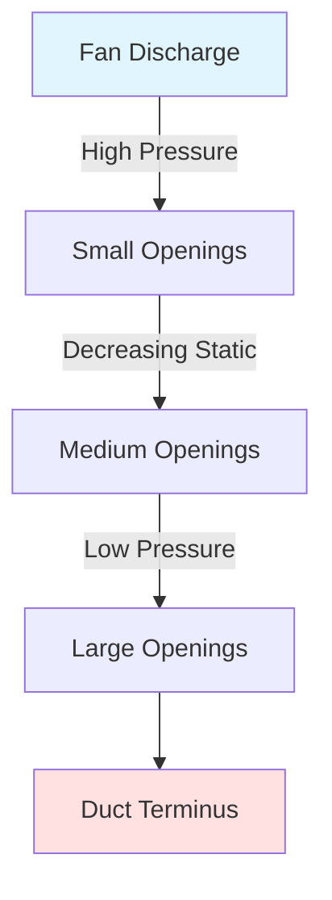
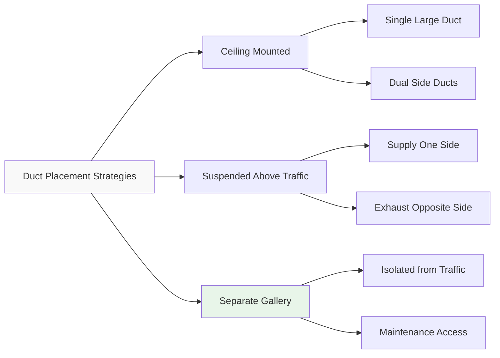
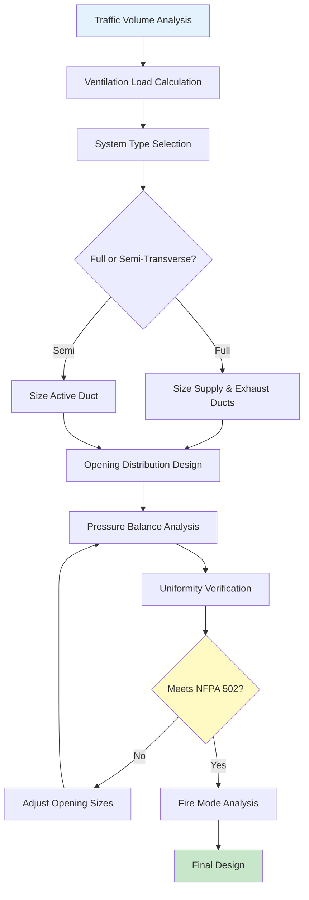

Transverse ventilation systems provide separate pathways for supplying fresh air and exhausting contaminated air in vehicle tunnels through dedicated ductwork. This approach offers superior control over air quality, smoke management, and ventilation uniformity compared to longitudinal systems, particularly in tunnels exceeding 1,000 meters in length.

## System Configurations

Transverse ventilation divides into two primary configurations based on the separation of airflows.

### Full Transverse Systems

Full transverse ventilation employs independent supply and exhaust ducts running the entire tunnel length. Fresh air enters through supply openings distributed along one duct while contaminated air exits through exhaust openings in a separate duct. This configuration eliminates longitudinal air velocity in the traffic space during normal operations.

The mass balance for a full transverse system requires:

$$\dot{m}_{supply} = \dot{m}_{exhaust} + \dot{m}_{portal\ losses}$$

Where portal losses typically account for 5-15% of total supply flow depending on piston effect and wind conditions.

### Semi-Transverse Systems

Semi-transverse ventilation uses either supply-only or exhaust-only ductwork. In supply-only configurations, fresh air distributes through supply ducts while exhaust occurs naturally through portals via induced longitudinal flow. Conversely, exhaust-only systems extract contaminated air through ducts while fresh air enters from portals.

The induced longitudinal velocity in semi-transverse systems follows:

$$V_L = \frac{Q_{net}}{A_t}$$

Where $Q_{net}$ represents the imbalance between supply and exhaust flows and $A_t$ is the tunnel cross-sectional area. Design targets typically limit $V_L$ to 2-3 m/s to prevent excessive drafts while maintaining adequate portal exchange.

## Supply and Exhaust Duct Design

### Duct Sizing Methodology

Supply and exhaust ducts must deliver uniform airflow distribution over the entire tunnel length. The pressure distribution in a perforated duct follows:

$$\frac{dP}{dx} = -\rho \frac{V^2}{2D_h} f - \rho V \frac{dV}{dx}$$

The first term represents friction losses while the second captures the pressure regain as duct velocity decreases due to air discharge. Achieving uniformity requires the regain term to offset friction losses.

For a duct with uniformly spaced openings, the velocity profile is:

$$V(x) = V_0 \sqrt{1 - \frac{x}{L}}$$

Where $V_0$ is the initial velocity at the fan discharge and $L$ is duct length. This square-root relationship enables calculation of the pressure distribution and opening sizing.

### Opening Design

Supply and exhaust openings require careful sizing to maintain velocity uniformity within ±15% per NFPA 502. The discharge coefficient for each opening must account for:

$$Q_i = C_d A_i \sqrt{\frac{2\Delta P_i}{\rho}}$$

Opening areas typically vary along the duct length to compensate for changing static pressure. Common practice places smaller openings near the fan discharge where static pressure is highest and larger openings at the far end.

### Pressure Balancing

Maintaining pressure balance between supply and exhaust ducts prevents uncontrolled longitudinal flows. The pressure differential between ducts at any location should not exceed:

$$|\Delta P_{supply} - \Delta P_{exhaust}| < 25 \text{ Pa}$$

This criterion limits induced longitudinal velocities to acceptable levels during normal ventilation.

## Uniform Air Distribution Requirements

NFPA 502 mandates ventilation uniformity to prevent dead zones and ensure consistent contaminant dilution. The uniformity index is:

$$U = 1 - \frac{\sigma_V}{\bar{V}}$$

Where $\sigma_V$ is the standard deviation of air velocities measured at discrete locations and $\bar{V}$ is the mean velocity. Design targets specify $U \geq 0.85$, corresponding to velocity variations within ±15% of the mean.

### Distribution Analysis

| Parameter | Full Transverse | Semi-Transverse (Supply) | Semi-Transverse (Exhaust) |
|-----------|----------------|--------------------------|---------------------------|
| Longitudinal Velocity | <0.5 m/s | 2-3 m/s | 2-3 m/s |
| Uniformity Index | 0.90-0.95 | 0.80-0.88 | 0.80-0.88 |
| Portal Exchange | Minimal | Significant | Significant |
| CO Control | Excellent | Good | Good |
| Smoke Control | Excellent | Limited | Good |

## Advantages for Long Tunnels

Transverse ventilation becomes increasingly advantageous as tunnel length increases beyond 1,000 meters.

**Contaminant Control**: Longitudinal systems develop concentration gradients that worsen with length. Transverse systems maintain uniform contaminant levels by continuously exchanging air along the entire length.

**Fire Smoke Management**: Full transverse systems can reverse to full exhaust mode during fires, extracting smoke before it spreads into the traffic space. The smoke extraction rate must satisfy:

$$\dot{m}_{smoke} = \frac{Q_{fire}}{c_p \Delta T_{rise}}$$

For typical tunnel fires (20-50 MW), this requires 200-400 m³/s of exhaust capacity.

**Energy Efficiency**: Despite higher installation costs, transverse systems reduce operational energy by eliminating the need to accelerate the entire tunnel air mass, as required in longitudinal jet fan systems.

**Operational Flexibility**: Independent control of supply and exhaust allows optimization for varying traffic loads and ambient conditions.

## Construction and Space Requirements

### Duct Placement Options

### Space Requirements

Supply and exhaust ducts typically occupy 15-25% of the tunnel cross-sectional area. For a tunnel with $A_t = 60$ m², duct areas range from 9-15 m² total. This spatial penalty increases excavation costs by 20-30% compared to longitudinal ventilation.

Separate ventilation galleries reduce traffic space intrusion but require additional excavation. The economic breakpoint occurs around 2,000 meters tunnel length where operational advantages justify construction costs.

### Fan Room Configuration

Transverse systems require centralized or distributed fan rooms housing supply and exhaust fans. Room sizing follows:

$$A_{fan\ room} \geq 2.5 \times A_{fan} + A_{maintenance}$$

Typical installations place fan rooms at tunnel mid-points for long tunnels or at portals for shorter installations.

## Design Process Summary

Transverse ventilation represents the highest level of control for vehicle tunnel air quality and smoke management. The system's complexity and cost are justified in long tunnels, tunnels with high traffic density, or installations where fire safety requirements demand maximum smoke control capability. Proper duct design ensuring uniform distribution and pressure balance is critical to achieving the operational advantages this system offers.
