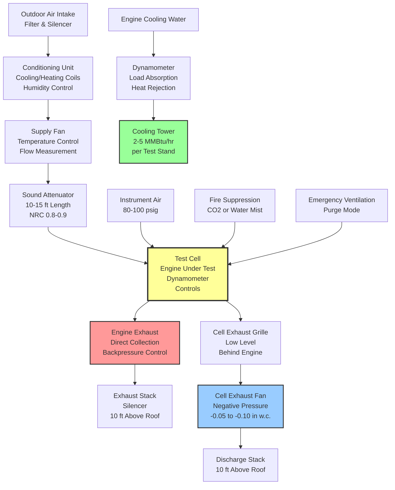

# HVAC Systems for Engine Test Facilities

Engine test facilities require specialized HVAC systems that provide large volumes of conditioned combustion air, manage enormous heat rejection loads, control exhaust gases and noise, and integrate with safety systems to protect personnel and equipment. These facilities test internal combustion engines ranging from small automotive units to large marine and stationary power generation engines, each with unique ventilation and environmental control requirements. The primary HVAC challenges include maintaining test cell thermal conditions within narrow tolerances, supplying filtered combustion air at controlled temperature and humidity, exhausting combustion products safely, managing high noise levels, and accommodating the substantial heat generated by both the engine under test and the dynamometer absorbing its power output.

## Test Cell Environmental Requirements

### Temperature and Humidity Control

Accurate engine performance testing requires precise control of combustion air conditions, as both temperature and humidity directly affect volumetric efficiency, combustion characteristics, and measured power output.

**Test cell conditioning specifications:**

| Facility Type | Combustion Air Temp | Combustion Air RH | Cell Space Temp | Test Accuracy Requirement |
|--------------|-------------------|------------------|----------------|-------------------------|
| Automotive Research | 77°F ± 2°F | 50% ± 5% | 70-75°F | ±0.5% power repeatability |
| Automotive Development | 60-100°F adjustable | 30-80% adjustable | 65-80°F | ±1.0% power repeatability |
| Heavy Duty Diesel | 77°F ± 2°F | 50% ± 5% | 70-80°F | ±1.0% power repeatability |
| Marine Engine | 77°F ± 2°F | 60% ± 5% | 70-85°F | ±1.5% power repeatability |
| Aircraft Engine | 59°F (ISA standard) | Variable | 60-75°F | ±0.3% thrust repeatability |
| Stationary Power | 77°F ± 2°F | 50% ± 5% | 70-85°F | ±2.0% power repeatability |

Standard atmospheric conditions for engine testing follow SAE J1349 (automotive) or ISO 1585 (international), which specify 77°F (25°C) and 29.23 in Hg (99 kPa) barometric pressure. Many research facilities include environmental chambers capable of simulating altitude conditions from sea level to 15,000 feet and temperatures from -40°F to 130°F to evaluate engine performance across the complete operating envelope.

**Combustion air density correction:**

Engine power output varies directly with air density. The relationship between measured power and standard conditions follows:

$$P_{std} = P_{obs} \times \sqrt{\frac{99}{P_{b}}} \times \sqrt{\frac{T_{a}}{298}}$$

Where:
- $P_{std}$ = Power corrected to standard conditions (hp or kW)
- $P_{obs}$ = Observed power at test conditions
- $P_{b}$ = Barometric pressure at test (kPa)
- $T_{a}$ = Absolute temperature of combustion air (K)
- 99 = Standard barometric pressure (kPa)
- 298 = Standard absolute temperature (298K = 25°C = 77°F)

This correction demonstrates why precise control of combustion air temperature and pressure is essential for repeatable testing. A 5°F temperature variation causes approximately 1% change in measured power output.

### Combustion Air Supply Systems

Engine test cells require substantial volumes of combustion air, calculated from engine displacement, operating speed, and volumetric efficiency.

**Combustion air demand calculation:**

$$Q_{eng} = \frac{D \times N \times \eta_{v} \times AFR}{1728}$$

Where:
- $Q_{eng}$ = Engine airflow demand (CFM)
- $D$ = Engine displacement (cubic inches)
- $N$ = Engine speed (RPM)
- $\eta_{v}$ = Volumetric efficiency (typically 0.85-0.95 for naturally aspirated, 1.2-2.0 for turbocharged)
- $AFR$ = Air-fuel ratio (typically 14.7:1 stoichiometric for gasoline, 20-30:1 for diesel)
- 1728 = Cubic inches per cubic foot

**Example for 500 hp turbocharged diesel engine:**
- Displacement: 600 in³
- Speed: 2,100 RPM at rated power
- Volumetric efficiency: 1.8 (turbocharged)
- $Q_{eng} = \frac{600 \times 2100 \times 1.8}{1728} = 1,306$ CFM

**Total cell ventilation requirement:**

$$Q_{cell} = Q_{eng} + Q_{cooling} + Q_{safety}$$

Where:
- $Q_{cooling}$ = Additional ventilation for heat rejection (typically 2-4× engine airflow)
- $Q_{safety}$ = Safety air changes (minimum 30 ACH for test cells)

For the 500 hp diesel example in a 30 ft × 40 ft × 15 ft cell (18,000 ft³):
- Engine combustion air: 1,306 CFM
- Cell cooling ventilation: 4,000 CFM (based on 1.5 million BTU/hr heat rejection)
- Safety air changes: $(30 \times 18000)/60 = 9,000$ CFM
- **Total supply required: 9,000 CFM** (safety requirement governs)

## Exhaust Systems and Ventilation

### Engine Exhaust Collection

Direct exhaust collection prevents combustion products from entering the test cell atmosphere. Exhaust systems must handle high-temperature gases (800-1,200°F at turbine outlet) while maintaining negative pressure at the engine exhaust connection.

**Exhaust system components:**
- Flexible exhaust connection (withstands 1,200°F, accommodates engine movement)
- Exhaust pipe (stainless steel schedule 10, sized for maximum 100 ft/sec velocity)
- Backpressure control valve (simulates vehicle or installation backpressure)
- Exhaust silencer (reduces noise by 20-30 dB)
- Exhaust fan (negative pressure maintenance)
- Stack discharge (minimum 10 feet above roof level)

**Exhaust pipe sizing:**

$$D = \sqrt{\frac{4 \times Q_{exh}}{\pi \times V_{max}}}$$

Where:
- $D$ = Pipe inside diameter (inches)
- $Q_{exh}$ = Exhaust gas flow rate (CFM at exhaust temperature)
- $V_{max}$ = Maximum velocity (6,000 ft/min = 100 ft/sec)

For the 500 hp diesel with 2,000 CFM exhaust flow at 800°F:

$$Q_{exh,hot} = Q_{exh,cold} \times \frac{T_{hot}}{T_{ambient}} = 2000 \times \frac{1260}{530} = 4,755 \text{ CFM}$$

$$D = \sqrt{\frac{4 \times 4755}{\pi \times 6000}} = 1.0 \text{ ft} = 12 \text{ inches}$$

### Test Cell Ventilation Strategy

Test cells employ negative pressure ventilation to contain engine noise and exhaust leakage, with supply air delivered through sound-attenuated inlets and exhaust through high-capacity fans.

**Pressure relationships:**
- Outdoor reference: 0.00 in w.c.
- Supply air plenum: +1.5 to +3.0 in w.c.
- Test cell: -0.05 to -0.10 in w.c. (negative relative to adjacent spaces)
- Exhaust duct: -3.0 to -6.0 in w.c.
- Control room: +0.02 in w.c. (positive relative to test cell)

## Heat Rejection and Cooling Systems

### Thermal Load Analysis

Engine test facilities generate enormous heat loads from three primary sources: engine inefficiency, dynamometer absorption, and auxiliary equipment.

**Total facility heat rejection:**

$$Q_{total} = Q_{engine} + Q_{dyno} + Q_{aux}$$

**Engine heat rejection:**

$$Q_{engine} = P_{brake} \times 2545 \times \left(\frac{1}{\eta} - 1\right)$$

Where:
- $Q_{engine}$ = Engine heat to cooling water and radiation (BTU/hr)
- $P_{brake}$ = Brake power output (hp)
- $\eta$ = Engine thermal efficiency (0.30-0.42 for diesel, 0.25-0.35 for gasoline)
- 2545 = BTU/hr per hp

**Dynamometer heat absorption:**

$$Q_{dyno} = P_{brake} \times 2545 \times 0.95$$

Approximately 95% of absorbed power converts to heat in the dynamometer cooling water (remaining 5% radiates to the cell).

**Example for 500 hp diesel test at full load:**
- Engine efficiency: 0.38
- Engine heat: $500 \times 2545 \times (1/0.38 - 1) = 2.07$ million BTU/hr
- Dynamometer heat: $500 \times 2545 \times 0.95 = 1.21$ million BTU/hr
- Total heat rejection: 3.28 million BTU/hr (960 kW)

This substantial heat load requires dedicated cooling towers or heat exchangers sized for continuous operation at maximum test power levels.

## Acoustical Treatment and Noise Control

### Noise Source Characterization

Operating engines generate intense noise from exhaust pulsations (120-140 dBA), mechanical components (90-110 dBA), and inducted air turbulence (85-100 dBA). Test cell design must attenuate this noise to protect personnel and meet facility noise limits.

**Typical noise levels:**
- Inside test cell during full-load test: 110-120 dBA
- Control room (adjacent): 65-75 dBA (with proper isolation)
- Exterior property line: 55-65 dBA (local ordinance limits)
- Required attenuation: 45-65 dB across frequency spectrum

**Acoustical treatment strategies:**
- Mass barrier walls (12-18 inch concrete or double-stud construction, STC 60-70)
- Sound-rated test cell doors (4-inch thick, automatic drop seals, STC 55)
- Inlet and exhaust silencers (dissipative or reactive, 20-35 dB insertion loss)
- Vibration isolation (engine/dyno mounts, inertia bases)
- Structural decoupling (floating floors, isolated walls)

Inlet silencers must provide acoustical attenuation without excessive pressure drop, as pressure loss reduces combustion air density and affects test results. Maximum acceptable pressure drop is typically 1.0-2.0 in w.c., limiting silencer length and packing density.

## Safety Systems Integration

### Fire Protection and Detection

Engine test cells present significant fire hazards from fuel leaks, hot surfaces, and electrical equipment. HVAC systems integrate with fire suppression through automatic shutdown sequences and emergency purge modes.

**Fire detection and suppression:**
- Heat detectors (rate-of-rise and fixed-temperature, 135°F activation)
- Flame detectors (UV or IR, 5-second response time)
- Manual pull stations (at cell entry and control room)
- CO₂ flooding system (34% concentration, total flooding design)
- Pre-discharge alarm (15-second evacuation warning)
- HVAC shutdown sequence (close supply dampers, maintain exhaust for 5 minutes, then shut down)

**Emergency ventilation purge:**

Following fire suppression activation or fuel spill detection, test cells require emergency purge to remove CO₂ or fuel vapors before personnel reentry.

$$T_{purge} = \frac{V_{cell} \times ln(C_{initial}/C_{safe})}{Q_{purge}} \times 60$$

Where:
- $T_{purge}$ = Purge time (minutes)
- $V_{cell}$ = Cell volume (ft³)
- $C_{initial}$ = Initial contaminant concentration
- $C_{safe}$ = Safe reentry concentration (typically 5% of initial)
- $Q_{purge}$ = Purge ventilation rate (CFM)
- ln = Natural logarithm
- 60 = Seconds to minutes conversion

For a 20,000 ft³ cell with 15,000 CFM purge capacity:

$$T_{purge} = \frac{20000 \times ln(1.0/0.05)}{15000} \times 60 = 120 \text{ minutes}$$

This represents three complete air changes (20,000/15,000 × 60 = 80 minutes per air change) to achieve 95% contaminant reduction.

## Energy Efficiency Strategies

### Heat Recovery Systems

The substantial heat rejection from engine test operations presents opportunities for energy recovery, particularly for facilities requiring space heating or process heat.

**Recoverable energy sources:**
- Engine coolant (180-200°F, sensible heat)
- Engine exhaust (800-1,200°F, sensible heat)
- Dynamometer cooling water (140-160°F, sensible heat)
- Test cell exhaust air (80-100°F during engine operation)

**Heat recovery applications:**
- Preheat combustion air supply (reduces conditioning load in winter)
- Space heating for adjacent buildings (low-grade heat utilization)
- Domestic hot water generation (year-round demand)
- Absorption chiller operation (summer cooling from waste heat)

**Economic analysis considerations:**
- Heat availability schedule (intermittent test operation reduces utilization factor)
- Temperature compatibility (match source temperature to application requirements)
- Distance between source and use point (pumping energy and heat loss penalties)
- Capital cost (heat exchangers, piping, controls)
- Maintenance requirements (fouling potential in exhaust gas heat recovery)

Facilities operating multiple test cells for 16-24 hours per day achieve better economics for heat recovery systems compared to single-cell research facilities with sporadic operation.

### Variable Volume Ventilation

Test cells spend significant time at idle or no-load conditions where full ventilation rates waste energy. Variable volume systems reduce airflow during low-power operation while maintaining safety requirements.

**Control strategy:**
- Full ventilation (30-40 ACH) during rated power testing
- Reduced ventilation (15-20 ACH) during part-load testing
- Minimum ventilation (10-12 ACH) during idle or setup
- Emergency purge (60+ ACH) following automatic shutdown

Cell temperature and CO concentration provide feedback for ventilation rate modulation, with VFD-controlled supply and exhaust fans tracking demand while maintaining negative pressure relationship.

## Conclusion

Engine test facility HVAC systems represent specialized engineering applications requiring integration of large-volume ventilation, precise environmental control, high-temperature exhaust handling, acoustical treatment, and safety system coordination. Successful designs balance test accuracy requirements (precise combustion air conditions), safety mandates (negative pressure, fire protection integration), noise control (intensive acoustical treatment), and operational economics (heat recovery, variable volume operation). The substantial capital and operating costs of these facilities demand careful analysis of test program requirements, future expansion needs, and energy efficiency opportunities during the design phase to achieve optimal long-term performance.

