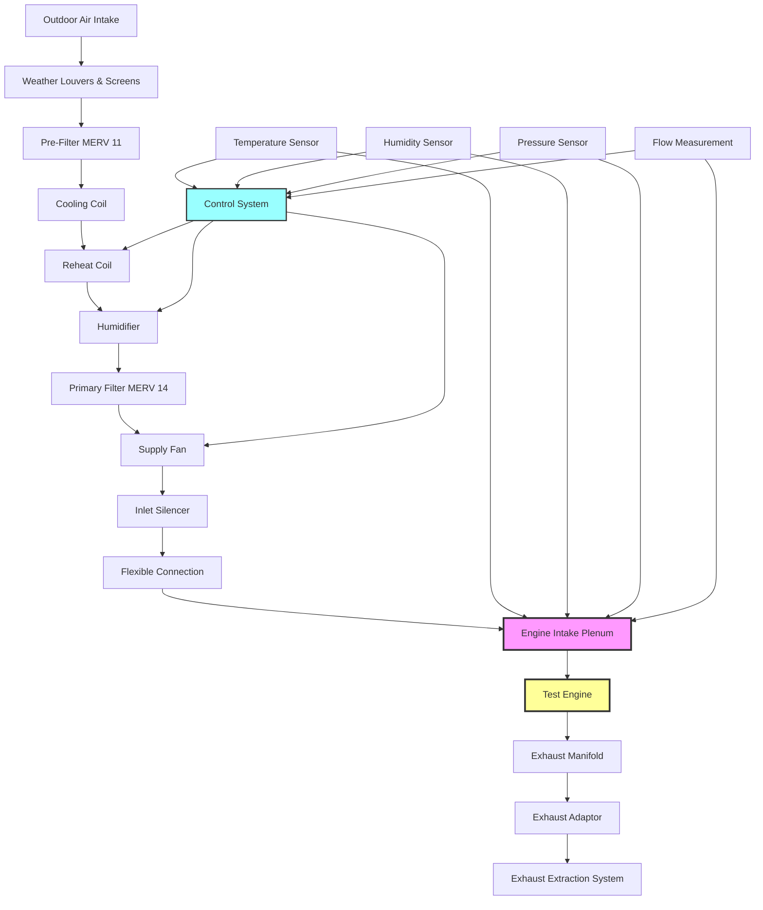

## Overview

Combustion air supply systems for engine test facilities provide the precise volume, quality, and conditioning of intake air required for accurate and repeatable engine testing. The combustion air system must deliver clean, temperature-controlled air at consistent pressure and humidity levels to ensure valid test results while protecting expensive test equipment.

The combustion air supply is separate from the general test cell ventilation and must be designed to meet stringent requirements for air quality, flow rate, and environmental control. Poor combustion air quality or inconsistent supply conditions directly compromise test data accuracy and can damage test engines.

## Air Quality Requirements

Engine test facilities require combustion air that meets or exceeds the quality of typical ambient air to prevent premature engine wear and ensure test validity.

**Particulate Contamination Limits:**
- ISO 8573-1 Class 4 or better (maximum 8 mg/m³)
- Particle size distribution monitoring for >5 μm particles
- Zero oil vapor contamination from compressors or facility equipment
- No cross-contamination from exhaust gases

**Chemical Contaminants:**
- Hydrocarbon levels <1 ppm (as methane equivalent)
- Sulfur dioxide <0.1 ppm
- Nitrogen oxides <0.1 ppm
- Carbon monoxide <5 ppm ambient

Test facilities in industrial areas require activated carbon filtration to remove hydrocarbons and chemical contaminants that affect combustion characteristics and emissions measurements.

## Volume Requirements by Engine Type

Combustion air volume requirements depend on engine displacement, speed, and power output. The supply system must deliver peak airflow with adequate margin for transient loading.


| Engine Type | Displacement | Max Power | Air Flow Rate | Supply Margin |
|-------------|--------------|-----------|---------------|---------------|
| Small Gasoline | 0.5-2.0 L | 50-150 kW | 150-450 m³/hr | 25% |
| Automotive | 2.0-6.0 L | 100-400 kW | 360-1440 m³/hr | 30% |
| Heavy-Duty Diesel | 6.0-15.0 L | 200-500 kW | 720-1800 m³/hr | 35% |
| Large Industrial | 15.0-50.0 L | 500-2000 kW | 1800-7200 m³/hr | 40% |
| Marine/Locomotive | 50.0-200.0 L | 2000-8000 kW | 7200-28800 m³/hr | 50% |


### Airflow Calculation

The theoretical airflow required for complete combustion is calculated from stoichiometric air-fuel ratio and fuel consumption:

$$\dot{m}_{air} = AFR \times \dot{m}_{fuel}$$

where $\dot{m}_{air}$ is air mass flow rate (kg/hr), $AFR$ is the stoichiometric air-fuel ratio (typically 14.7:1 for gasoline, 14.5:1 for diesel), and $\dot{m}_{fuel}$ is fuel consumption rate.

Converting to volumetric flow at standard conditions:

$$\dot{V}_{air} = \frac{\dot{m}_{air}}{\rho_{air}} \times 3600$$

where $\dot{V}_{air}$ is volumetric flow rate (m³/hr) and $\rho_{air}$ is air density at standard conditions (1.225 kg/m³ at 15°C, 101.325 kPa).

For an engine consuming 50 kg/hr of diesel fuel:

$$\dot{V}_{air} = \frac{14.5 \times 50}{1.225} \times 3600 = 2,143 \text{ m³/hr}$$

Adding 35% margin for transient conditions: $\dot{V}_{design} = 2,143 \times 1.35 = 2,893$ m³/hr.

## Filtration Systems

Multi-stage filtration protects engines and ensures consistent air quality throughout testing campaigns.

**Pre-Filtration Stage:**
- MERV 8-11 filters for bulk particulate removal
- Weather louvers and insect screens at intake
- Moisture separators in humid climates
- 30-45% dust spot efficiency

**Primary Filtration:**
- MERV 13-14 filters (85-95% efficiency at 1.0 μm)
- Low pressure drop design (<250 Pa when clean)
- Bag or box-style construction for large airflow
- Differential pressure monitoring for filter loading

**Final Filtration:**
- HEPA filters (H13 or H14) for critical applications
- 99.95-99.995% efficiency at 0.3 μm
- Absolute filtration for emissions testing
- Gel-seal mounting to prevent bypass

Activated carbon beds follow particulate filtration when hydrocarbon or odor removal is required. Carbon bed depth of 50-100 mm provides adequate residence time for chemical adsorption.

## Temperature and Humidity Conditioning

Combustion air temperature and humidity significantly affect engine performance, emissions, and test repeatability. Most test standards specify correction factors, but direct conditioning provides superior results.

**Temperature Control:**
- Standard inlet temperature: 25°C ±2°C (77°F ±3.6°F)
- Range capability: 0-50°C for environmental testing
- Response time: <5 minutes for ±10°C step change
- Uniformity: ±1°C across intake cross-section

**Humidity Control:**
- Standard conditions: 50% RH ±5%
- Dew point control: ±2°C for precision testing
- Dehumidification to 20% RH minimum
- Humidification to 90% RH maximum

The temperature-humidity conditioning system typically uses chilled water cooling coils, hot water or electric heating, and steam injection humidification. A reheat coil follows the cooling coil to provide independent temperature and humidity control.

Humidity correction factor for engine power:

$$P_{corrected} = P_{measured} \times \left(\frac{99}{p_d - \frac{p_v \cdot \phi}{100}}\right)^{0.5}$$

where $P$ is power, $p_d$ is dry air partial pressure (kPa), $p_v$ is water vapor pressure (kPa), and $\phi$ is relative humidity (%).

## Pressure Regulation

Consistent intake pressure ensures repeatable testing and prevents atmospheric pressure variations from affecting results.

**Pressure Control Requirements:**
- Absolute pressure: 98-102 kPa (typical sea level)
- Control accuracy: ±0.5 kPa
- Pressure drop through system: <1.5 kPa total
- Dynamic response: maintain pressure during load transients

**Control Strategy:**
- Variable speed supply fans with PID control
- Pressure measurement at engine intake plenum
- Cascade control with upstream pressure monitoring
- Pressure relief bypass for fan failure protection

The supply fan must overcome system pressure losses:

$$\Delta P_{total} = \Delta P_{filters} + \Delta P_{ductwork} + \Delta P_{conditioning} + \Delta P_{silencer}$$

Typical pressure budget: filters (250-400 Pa), ductwork (150-300 Pa), conditioning coils (200-350 Pa), silencer (100-200 Pa), total 700-1250 Pa.

## Integration with Exhaust Systems

The combustion air supply and exhaust extraction systems must be coordinated to maintain proper test cell pressure and prevent recirculation.

**Pressure Balance:**
- Test cell slightly negative (-10 to -25 Pa) relative to atmosphere
- Prevents hot exhaust gases from leaking into facility
- Makeup air system separate from combustion air supply
- Exhaust extraction capacity exceeds combustion air by 10-15%

**Separation Requirements:**
- Combustion air intake minimum 15 m from exhaust discharge
- Prevailing wind direction consideration in layout
- Exhaust stack height calculation using EPA dispersion models
- CO monitoring near air intake with automatic shutdown

**System Interlocks:**
- Exhaust system must run before engine start permitted
- Loss of combustion air pressure triggers engine shutdown
- High cell temperature alarm reduces engine load
- Fire detection systems trip both supply and exhaust

## Design Considerations

**Ductwork Sizing:**
- Velocity 8-12 m/s in supply ductwork
- Velocity <6 m/s in intake plenum
- Smooth transitions with maximum 15° included angle
- Minimize elbows and obstructions

**Acoustic Treatment:**
- Inlet and outlet silencers for <NC 55 in test cell
- Fan vibration isolation to prevent structure-borne noise
- Ductwork lagging with acoustic insulation
- Avoid resonance at engine firing frequencies

**Instrumentation:**
- Mass airflow measurement (±1% accuracy)
- Temperature measurement (±0.5°C accuracy)
- Humidity measurement (±2% RH accuracy)
- Pressure measurement (±0.1 kPa accuracy)
- All sensors with 4-20 mA output to data acquisition system

The combustion air supply system represents a critical component of engine test facility design, directly affecting test accuracy, repeatability, and equipment protection. Proper design requires coordination with engine specifications, exhaust systems, and test cell environmental control to create an integrated testing environment.
