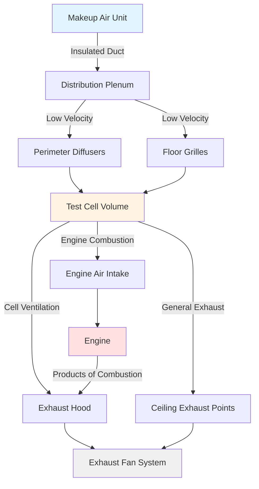

Makeup air systems in engine test facilities replace air exhausted from test cells while maintaining proper pressurization and environmental conditions. These systems must balance high exhaust rates from engine combustion and cooling with controlled air introduction to prevent cell depressurization and ensure safe operating conditions.

## Makeup Air Volume Calculations

The required makeup air volume equals the sum of all air leaving the cell through exhaust systems and combustion processes:

$$Q_{makeup} = Q_{exhaust} + Q_{combustion} + Q_{leakage}$$

Where:
- $Q_{makeup}$ = total makeup air volume (cfm)
- $Q_{exhaust}$ = mechanical exhaust airflow (cfm)
- $Q_{combustion}$ = air consumed by engine combustion (cfm)
- $Q_{leakage}$ = building envelope leakage (cfm)

Engine combustion air consumption relates directly to fuel consumption and air-fuel ratio:

$$Q_{combustion} = \frac{m_{fuel} \times AFR}{\rho_{air} \times 60}$$

Where:
- $m_{fuel}$ = fuel consumption rate (lb/hr)
- $AFR$ = air-fuel ratio (typically 14.7:1 for gasoline, 14.5:1 for diesel)
- $\rho_{air}$ = air density at inlet conditions (lb/ft³)
- 60 = conversion factor (min/hr)

For a 500 hp diesel engine at full load consuming 35 lb/hr fuel:

$$Q_{combustion} = \frac{35 \times 14.5}{0.075 \times 60} = 1,128 \text{ cfm}$$

## Air Balance and Exhaust System Requirements

Makeup air must be carefully balanced against total exhaust to maintain desired cell pressurization:

$$\Delta P_{cell} = K \times (Q_{makeup} - Q_{total\ exhaust})^2$$

Where $K$ is a building-specific coefficient dependent on envelope tightness and leakage characteristics.

**Typical Air Balance Relationships:**

| Cell Condition | Makeup/Exhaust Ratio | Pressure Differential |
|---------------|---------------------|----------------------|
| Positive pressure | 1.05 - 1.10 | +0.02 to +0.05 in wg |
| Neutral pressure | 0.98 - 1.02 | ±0.01 in wg |
| Negative pressure | 0.90 - 0.95 | -0.02 to -0.05 in wg |
| Emergency exhaust | 0.50 - 0.70 | -0.10 to -0.15 in wg |

Most engine test cells operate under slight negative pressure (-0.02 to -0.03 in wg) to prevent hot exhaust gases or fumes from escaping into adjacent spaces.

## Cell Pressurization Requirements

Cell pressurization must be controlled throughout all operating modes:

**Normal Operation:**
- Maintain -0.02 to -0.03 in wg relative to adjacent control rooms
- Prevent backdraft through personnel doors
- Ensure adequate combustion air availability
- Minimize infiltration of unconditioned air

**Engine Startup:**
- Provide makeup air 2-3 minutes before engine ignition
- Establish stable cell pressure before combustion begins
- Gradually increase makeup air with engine load

**Emergency Conditions:**
- Boost makeup air to 150-200% during fire suppression activation
- Maintain minimum -0.05 in wg during emergency exhaust
- Prevent excessive negative pressure that impairs door operation

## Makeup Air Handling Unit Design

Makeup air units for test cells must address extreme thermal and volumetric demands:

**Heating Capacity:**

Winter makeup air heating load accounts for outdoor air temperature rise:

$$Q_{heating} = 1.08 \times Q_{makeup} \times (T_{supply} - T_{outdoor})$$

For 10,000 cfm makeup air from 0°F to 60°F:

$$Q_{heating} = 1.08 \times 10,000 \times (60 - 0) = 648,000 \text{ Btuh}$$

**Cooling Capacity:**

Summer cooling may be required for cell temperature control:

$$Q_{cooling} = 1.08 \times Q_{makeup} \times (T_{outdoor} - T_{supply}) + 0.68 \times Q_{makeup} \times (W_{outdoor} - W_{supply})$$

**MAU Component Selection:**

| Component | Typical Specifications | Design Considerations |
|-----------|----------------------|---------------------|
| Supply fan | 10,000-50,000 cfm | VFD for modulation, 3-5 in wg |
| Heating coil | 400-800 Btuh/cfm | Hot water or gas-fired |
| Cooling coil | 200-400 Btuh/cfm | Chilled water, 6-8 rows |
| Filters | MERV 8-13 | Dual bank for continuous operation |
| Dampers | Modulating outdoor/relief | Minimum position lockouts |
| Controls | DDC with PLC integration | Pressure compensation logic |

## Distribution Within Test Cell

Makeup air distribution prevents short-circuiting to exhaust points and provides uniform cell conditions:

**Distribution Strategies:**

1. **Perimeter Low-Wall Supply:**
   - Diffusers at 3-5 ft above floor
   - Horizontal discharge toward cell center
   - Prevents stratification in high-bay cells

2. **Floor Grille Supply:**
   - Raised floor or underfloor plenum distribution
   - Low-velocity upward discharge (200-400 fpm)
   - Effective for cells with elevated dynamometer platforms

3. **Overhead Distribution:**
   - High-induction diffusers for mixing
   - Used when floor space is constrained
   - Requires careful design to avoid short-circuiting to ceiling exhaust

4. **Displacement Ventilation:**
   - Low-velocity supply at floor level (50-100 fpm)
   - Thermal plume carries contaminants upward
   - Suitable for cells with consistent heat sources

## Emergency Ventilation Integration

Makeup air systems must coordinate with emergency exhaust during fire or hazardous gas events:

**Emergency Mode Requirements:**

| Condition | Makeup Air Response | Target Parameters |
|-----------|-------------------|------------------|
| Fire detection | Increase to 150% normal | Maintain -0.05 in wg minimum |
| Gas detection | Increase to 200% normal | Maximum exhaust effectiveness |
| Suppression activation | Continue operation | Prevent agent depletion |
| Post-incident purge | Maximum volume | 10-15 air changes |

**Control Sequence:**

1. Emergency signal received from fire alarm or gas detection system
2. Makeup air fan ramps to emergency speed (10-20 second acceleration)
3. Heating/cooling coils modulate to prevent thermal shock
4. Cell pressure monitored continuously; makeup air adjusts to maintain minimum -0.05 in wg
5. Emergency exhaust activates with 5-10 second delay after makeup air boost
6. System maintains emergency mode until manual reset

**Safety Interlocks:**

- Makeup air failure triggers engine shutdown and emergency exhaust
- Loss of pressurization control initiates alarm and controlled shutdown
- Makeup air fan proof-of-operation required before engine start permission
- Outdoor air damper position verification prevents recirculation

The makeup air system forms the foundation of test cell environmental control, working in concert with exhaust systems, combustion air supply, and engine cooling to maintain safe, controlled testing conditions across all operating scenarios.
