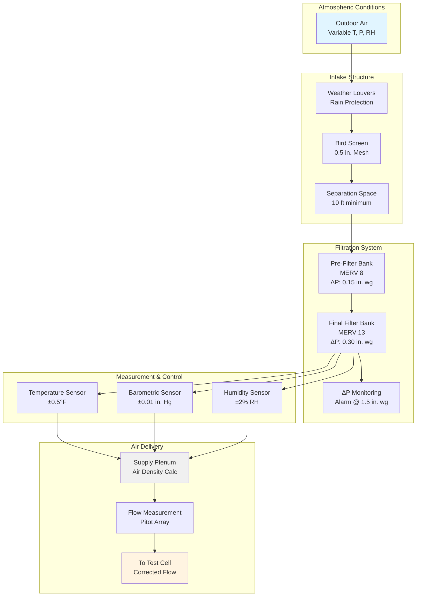

Outdoor air serves as the primary combustion air source for engine test facilities, directly influencing test accuracy and repeatability. The design of outdoor air intake systems must account for varying atmospheric conditions, contamination control, and the fundamental relationship between air density and engine performance.

## Outdoor Air Intake Design and Placement

The location and configuration of outdoor air intakes critically affect air quality and system performance. Intakes should be positioned to minimize contamination from:

- Vehicular exhaust from nearby roads or parking areas
- Building exhaust discharge points
- Industrial emissions sources
- Ground-level dust and debris

**Recommended placement criteria:**

- Minimum 15 feet above grade to avoid ground-level contamination
- 50 feet horizontal separation from exhaust outlets
- Prevailing wind consideration to capture cleanest air
- North-facing orientation where possible to minimize solar heating
- Clear zone of 3× intake face dimension from obstructions

Intake velocity should not exceed 800-1000 fpm at the face to prevent excessive pressure drop and water entrainment. For high-volume test cells requiring 50,000+ CFM, multiple intake points may be necessary to maintain acceptable face velocities.

## Weather Protection and Rain Louvers

Environmental protection prevents water infiltration while maintaining low pressure drop. Louver selection balances these competing requirements.

**Louver performance specifications:**

| Louver Type | Pressure Drop (in. wg) | Water Penetration | Free Area |
|-------------|----------------------|-------------------|-----------|
| Standard drainable blade | 0.08-0.12 @ 500 fpm | 0.02% @ 2500 fpm | 45-50% |
| High-performance drainable | 0.15-0.25 @ 500 fpm | 0.005% @ 2500 fpm | 40-45% |
| Storm-resistant | 0.25-0.35 @ 500 fpm | 0.001% @ 3000 fpm | 35-40% |

Drainable blade louvers with integrated gutters and drain channels are mandatory. The louver bank must include:

- Continuous perimeter flashing with weep holes
- Sloped sill (minimum 15°) draining outward
- Bird screens (0.5-inch mesh) behind louvers
- Separating at least 10 feet from louver face to filter bank

## Filtration Requirements for Ambient Particulates

Combustion air filtration protects test engines from abrasive wear and prevents particulate accumulation in air delivery systems. Filter selection depends on ambient conditions and engine sensitivity.

**Minimum filtration standards:**

- Pre-filter: MERV 8 (35% efficiency on 3-10 μm particles)
- Final filter: MERV 13 (85% efficiency on 3-10 μm particles)

For precision testing or turbocharged engines, MERV 14-15 filtration may be warranted. Industrial environments with heavy particulate loading require pre-filters with lower initial pressure drop (0.15-0.20 in. wg) to extend final filter life.

Filter banks should accommodate 24-inch deep filters to maximize dust-holding capacity and minimize change-out frequency. Pressure drop monitoring with differential pressure switches alerts operators when filters require replacement (typically at 1.0-1.5 in. wg).

## Seasonal Variations in Air Properties

Atmospheric conditions vary significantly with season and weather, directly impacting air density and engine performance. Temperature and humidity changes alter the mass flow rate of air entering the engine at a given volumetric flow rate.

**Typical seasonal variations (40°N latitude):**

| Season | Temperature (°F) | Relative Humidity | Air Density (lbm/ft³) |
|--------|-----------------|-------------------|---------------------|
| Winter | 30 | 60% | 0.0810 |
| Spring | 55 | 55% | 0.0760 |
| Summer | 85 | 70% | 0.0710 |
| Fall | 60 | 60% | 0.0750 |

The mass of air entering the engine directly affects power output, requiring correction factors for accurate performance comparison between test runs conducted under different atmospheric conditions.

## Barometric Pressure Effects on Engine Performance

Barometric pressure variations due to weather systems and altitude significantly influence air density and engine power output. A naturally aspirated engine produces approximately 3% less power per 1000 feet of altitude increase above sea level.

Standard atmospheric pressure is 29.92 inches Hg (101.325 kPa) at sea level. Daily weather variations of ±0.5 inches Hg can cause 1.5-2% changes in air density, directly affecting:

- Volumetric efficiency
- Combustion stoichiometry
- Brake mean effective pressure
- Specific fuel consumption

Precision test facilities install barometric pressure sensors with ±0.01 inches Hg accuracy to enable accurate density corrections.

## Air Density Correction for Test Results

Standardized correction factors normalize test results to reference conditions, enabling valid comparisons between tests. SAE J1349 and ISO 1585 define correction procedures.

**Air density calculation:**

The actual air density is calculated from measured conditions:

$$\rho = \frac{P_b}{R \cdot T} \cdot \left(1 - 0.378 \cdot \frac{P_v}{P_b}\right)$$

Where:
- $\rho$ = air density (lbm/ft³)
- $P_b$ = barometric pressure (psi)
- $R$ = specific gas constant for dry air = 53.35 ft·lbf/(lbm·°R)
- $T$ = absolute temperature (°R = °F + 459.67)
- $P_v$ = partial pressure of water vapor (psi)

**SAE J1349 correction factor:**

$$CF = \left(\frac{99}{P_b}\right)^{0.7} \cdot \left(\frac{T + 460}{537.67}\right)^{1.2}$$

Where $P_b$ is in kPa and $T$ is in °F.

**Air density correction table:**

| Temperature (°F) | Pressure (in. Hg) | Relative Humidity | Density (lbm/ft³) | Correction Factor |
|-----------------|-------------------|-------------------|-------------------|-------------------|
| 59 | 29.92 | 0% | 0.0765 | 1.000 |
| 70 | 29.92 | 50% | 0.0745 | 1.027 |
| 85 | 29.50 | 60% | 0.0712 | 1.074 |
| 95 | 29.20 | 70% | 0.0684 | 1.118 |
| 50 | 30.20 | 40% | 0.0783 | 0.977 |

Measured power is divided by the correction factor to obtain standardized power output at reference conditions (77°F, 29.92 in. Hg, 0% humidity).

## Outdoor Air Intake System Configuration

Proper outdoor air system design ensures consistent, clean combustion air supply while enabling accurate density corrections for repeatable engine performance testing across all atmospheric conditions.
