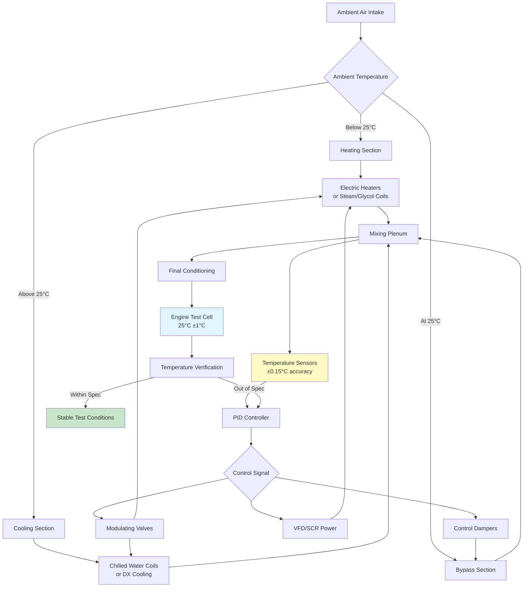

## Standard Test Temperature Conditions

Engine testing requires precise control of combustion air temperature to ensure repeatable, comparable results across different test facilities and environmental conditions. International standards define specific temperature targets that must be maintained throughout testing procedures.

### SAE and ISO Standard Conditions

SAE J1349 and ISO 1585 establish standardized reference conditions for internal combustion engine testing. The standard test temperature is **25°C (77°F)** at sea level atmospheric pressure. This temperature represents a controlled baseline that allows direct comparison of engine performance data regardless of geographic location or ambient conditions.

The standards recognize that actual test conditions may deviate from ideal values. Correction factors are applied when testing occurs at temperatures between **13°C (55°F)** and **35°C (95°F)**. Beyond this range, direct temperature conditioning becomes necessary to maintain test validity and measurement accuracy.


| Standard | Test Temperature | Tolerance | Correction Range | Application |
|----------|-----------------|-----------|------------------|-------------|
| SAE J1349 | 25°C (77°F) | ±2°C | 13-35°C (55-95°F) | Automotive engines |
| ISO 1585 | 25°C (77°F) | ±2°C | 15-35°C (59-95°F) | All IC engines |
| ISO 3046 | 25°C (77°F) | ±3°C | 0-40°C (32-104°F) | Reciprocating engines |
| DIN 70020 | 20°C (68°F) | ±2°C | 10-30°C (50-86°F) | European automotive |
| JIS D 1001 | 25°C (77°F) | ±2°C | 15-35°C (59-95°F) | Japanese standards |


## Temperature Stability Requirements

Test repeatability demands exceptional temperature stability throughout the testing duration. Combustion air temperature must remain within **±1°C (±1.8°F)** of setpoint during continuous operation. More stringent applications, such as emissions certification testing, may require **±0.5°C (±0.9°F)** stability.

Temperature uniformity across the intake plenum is equally critical. Spatial variations exceeding **2°C (3.6°F)** can introduce measurement errors in multi-cylinder engines where individual cylinders draw air from different plenum locations.

Response time to load changes affects test efficiency. Temperature conditioning systems must recover to setpoint within **2-3 minutes** following step changes in engine load or airflow demand to minimize test cycle duration.

## Heating Systems for Cold Ambient Conditions

Facilities located in cold climates require substantial heating capacity to elevate ambient air from winter conditions to standard test temperature. A test cell requiring **10,000 kg/h (22,000 lb/h)** of combustion air must overcome a **40°C (72°F)** temperature differential when ambient conditions reach **-15°C (5°F)**.

The required heating capacity follows the sensible heat equation:

$$Q_h = \dot{m} \times c_p \times \Delta T$$

Where:
- $Q_h$ = heating capacity (kW)
- $\dot{m}$ = mass flow rate (kg/s)
- $c_p$ = specific heat of air ≈ 1.006 kJ/(kg·K)
- $\Delta T$ = temperature rise (K)

For the example above:

$$Q_h = \frac{10000}{3600} \times 1.006 \times (25-(-15)) = 111.8 \text{ kW}$$

### Electric Resistance Heating

Electric heating elements provide clean, oil-free heat without combustion products that could contaminate test air. Finned tubular heaters or open-coil elements deliver **20-40 kW/m²** of heat flux with surface temperatures reaching **650°C (1200°F)**.

Staging multiple heating banks with SCR (silicon-controlled rectifier) power modulation enables precise temperature control. A typical installation uses **three to five stages** with the final stage proportionally controlled for trimming.

### Steam and Hot Water Heating

Facilities with central boiler plants commonly employ steam or hot water coils. Finned tube coils with **150-175 psig (1030-1210 kPa)** steam provide high heat transfer rates in compact configurations. Hot water systems using **120-180°C (250-360°F)** supply temperatures offer better modulation characteristics but require larger coil surface areas.

The heating coil heat transfer is calculated as:

$$Q = U \times A \times \Delta T_{lm}$$

Where:
- $U$ = overall heat transfer coefficient, typically 60-100 W/(m²·K) for air heating
- $A$ = coil face area (m²)
- $\Delta T_{lm}$ = log mean temperature difference (K)

### Glycol Heating Systems

Closed-loop glycol systems provide freeze protection and enable heat recovery from engine cooling circuits. A 50% ethylene glycol solution maintains fluidity to **-37°C (-34°F)** while delivering heating capacity at supply temperatures of **90-120°C (195-250°F)**.

Glycol heat exchangers require **30-40% larger surface area** compared to steam coils due to lower fluid-side heat transfer coefficients. However, the ability to recover waste heat from engine coolant, oil coolers, and exhaust heat recovery systems significantly reduces facility energy consumption.

## Cooling Systems for Hot Ambient Conditions

Test facilities in hot climates require cooling to bring ambient air down to standard conditions. The cooling load calculation includes both sensible and latent heat removal:

$$Q_c = Q_s + Q_l = \dot{m} \times c_p \times \Delta T + \dot{m} \times \Delta \omega \times h_{fg}$$

Where:
- $Q_s$ = sensible cooling load (kW)
- $Q_l$ = latent cooling load (kW)
- $\Delta \omega$ = humidity ratio change (kg/kg)
- $h_{fg}$ = latent heat of vaporization ≈ 2450 kJ/kg

### Direct Expansion (DX) Cooling

Packaged DX systems with multiple compressor stages provide efficient cooling for smaller test cells requiring **50-200 kW** of cooling capacity. Multi-stage scroll or reciprocating compressors with unloading capabilities maintain stable discharge air temperature under varying load conditions.

### Chilled Water Systems

Large test facilities employ central chilled water plants serving multiple test cells. Cooling coils receive **5-7°C (41-45°F)** chilled water supply, producing **10-12°C (50-54°F)** return water. Coil face velocities of **2.5-3.0 m/s (500-600 fpm)** balance pressure drop against heat transfer effectiveness.

Water-side control valves modulate flow rate in response to discharge air temperature. Three-way mixing valves prevent coil freeze-up during low-load conditions, while two-way control valves offer superior energy performance in variable-flow chilled water systems.

### Air-to-Air Heat Exchangers

Indirect evaporative cooling or refrigerant-based air-to-air heat exchangers eliminate the humidity addition associated with direct water evaporation. Plate-frame or tube-in-tube designs transfer heat between incoming combustion air and conditioned return air or refrigerant circuits.

These systems maintain low humidity levels critical for certain testing protocols while providing cooling capacity proportional to the temperature differential between air streams.

## Control Precision and System Architecture

Achieving the required **±1°C** stability demands cascade control strategies with fast-acting final control elements. The master controller maintains discharge air temperature setpoint, while secondary controllers manage heating and cooling equipment staging and modulation.

### Temperature Sensing

Multiple RTD (resistance temperature detector) sensors with **Class A accuracy (±0.15°C at 0°C)** monitor air temperature at the intake plenum, discharge of conditioning equipment, and critical control points. Averaging sensors with **1.5-3.0 m (5-10 ft)** sensing elements provide representative temperature measurement across large duct cross-sections.

### Control Response

PID (proportional-integral-derivative) controllers with properly tuned parameters provide stable temperature control. Typical tuning values include:
- Proportional band: **5-10°C**
- Integral time: **30-60 seconds**
- Derivative time: **5-15 seconds**

Fast-acting control valves with **3-5 second** stroke times and modulating dampers with **10-15 second** travel times enable rapid response to temperature deviations.

## Heat Recovery and Energy Optimization

Modern test facilities integrate heat recovery systems that capture waste heat from engine operation and redirect it to preheat combustion air during cold ambient conditions. Engine exhaust gases at **400-600°C (750-1110°F)** pass through gas-to-air heat exchangers, recovering **40-60%** of available thermal energy.

Recovered heat reduces purchased heating energy substantially. A facility operating **200 hours/month** during winter with **100 kW** average heating load saves approximately **$12,000-15,000 annually** in heating costs with properly designed heat recovery systems.

Temperature control precision directly impacts test result repeatability. Facilities maintaining tight temperature tolerances produce data with **coefficient of variation below 1.5%** for key performance metrics, enabling accurate engine development and certification testing across all ambient conditions.

---

**Related Topics:**
- [Humidity Control](/specialty-applications-testing/specialty-hvac-applications/engine-test-facilities/combustion-air-supply/humidity-control/)
- [Air Filtration Systems](/specialty-applications-testing/specialty-hvac-applications/engine-test-facilities/combustion-air-supply/air-filtration/)
- [Flow Measurement and Control](/specialty-applications-testing/specialty-hvac-applications/engine-test-facilities/combustion-air-supply/flow-measurement/)
