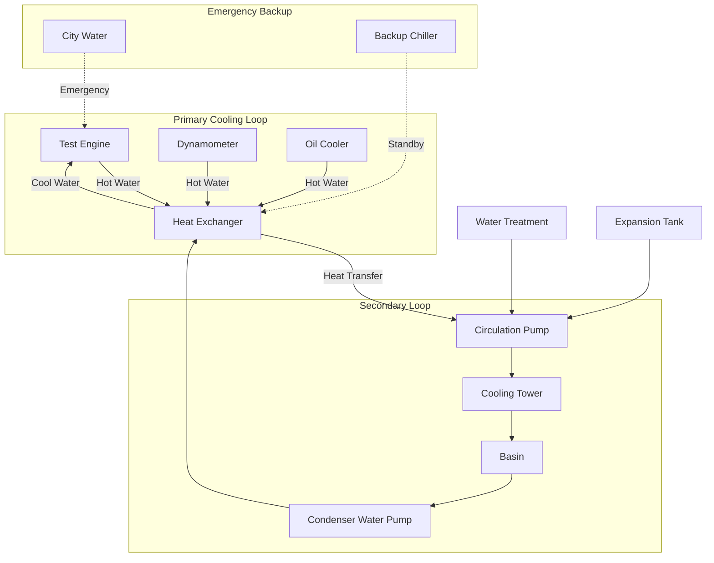

Cooling water systems in engine test facilities must handle extreme and variable heat loads while maintaining precise temperature control for consistent test results. These systems remove heat from test engines, dynamometers, and auxiliary equipment under dynamic operating conditions.

## System Types and Configurations

Engine test facilities typically employ one of three cooling water configurations:

**Once-Through Systems** utilize city water or well water for single-pass cooling, discharging to drain after use. These systems offer simplicity and minimal capital cost but incur high water consumption and disposal costs, making them suitable only for intermittent testing or facilities with abundant low-cost water.

**Closed-Loop Recirculating Systems** with cooling towers provide the most common configuration for continuous testing operations. A primary closed loop circulates treated water through engine jackets and oil coolers, rejecting heat to a secondary loop connected to cooling towers or dry coolers. This arrangement minimizes water consumption while maintaining temperature control.

**Chiller-Based Systems** use mechanical refrigeration for applications requiring cooling water temperatures below ambient wet-bulb conditions or where precise temperature control supersedes energy efficiency concerns. Chillers provide consistent supply temperatures regardless of outdoor conditions but consume significantly more energy than cooling tower systems.

## Heat Load Calculations

Accurate heat rejection calculations ensure adequate cooling system capacity for all test conditions. The total heat load consists of engine rejection, dynamometer losses, and auxiliary equipment:

**Engine Heat Rejection** depends on fuel consumption and thermal efficiency:

$$Q_{engine} = \dot{m}_f \times LHV \times (1 - \eta_{thermal})$$

where $Q_{engine}$ is heat rejection (kW), $\dot{m}_f$ is fuel mass flow rate (kg/s), $LHV$ is lower heating value (kJ/kg), and $\eta_{thermal}$ is thermal efficiency (typically 0.30-0.40 for diesel engines).

For water-cooled engines, jacket cooling typically removes 25-35% of total heat rejection:

$$Q_{jacket} = 0.30 \times Q_{engine}$$

**Dynamometer Heat Rejection** accounts for absorbed power and mechanical losses:

$$Q_{dyno} = P_{brake} + P_{losses}$$

where $P_{brake}$ is brake power absorbed and $P_{losses}$ represents bearing friction and eddy current losses (typically 2-5% of rated capacity).

**Total Cooling Capacity** must include a safety factor for varying test conditions:

$$Q_{total} = (Q_{jacket} + Q_{dyno} + Q_{auxiliary}) \times SF$$

where $SF$ is a safety factor of 1.15-1.25 for design contingency.

## Cooling Requirements by Engine Type

| Engine Type | Power Range | Jacket Heat Rejection | Total Heat Rejection | Supply Temp | Flow Rate |
|-------------|-------------|----------------------|---------------------|-------------|-----------|
| Automotive Gasoline | 100-500 HP | 60-300 kW | 200-1,000 kW | 180-195°F | 20-100 GPM |
| Automotive Diesel | 150-600 HP | 80-400 kW | 250-1,200 kW | 180-200°F | 25-120 GPM |
| Medium Duty Diesel | 200-800 HP | 120-600 kW | 350-1,800 kW | 180-205°F | 40-180 GPM |
| Heavy Duty Diesel | 400-2,000 HP | 300-1,500 kW | 900-4,500 kW | 185-210°F | 90-450 GPM |
| Natural Gas Engine | 500-3,000 HP | 400-2,200 kW | 1,200-6,500 kW | 190-205°F | 120-650 GPM |
| Marine Diesel | 1,000-5,000 HP | 750-3,800 kW | 2,200-11,000 kW | 175-195°F | 225-1,150 GPM |

## Cooling Tower and Chiller Selection

**Cooling Tower Options** for engine test facilities include:

Induced draft counterflow towers provide the highest efficiency and smallest footprint, making them ideal for facilities with limited space. These units achieve approach temperatures of 5-7°F to wet-bulb conditions.

Evaporative fluid coolers combine the cooling tower and heat exchanger in a single unit, eliminating the open secondary loop. This configuration reduces freeze risk and minimizes contamination potential but increases first cost.

Dry coolers eliminate water consumption entirely but require significantly larger heat transfer surface area and can only cool to ambient dry-bulb temperature plus approach (typically 10-15°F). These units suit arid climates or facilities with water restrictions.

**Chiller Systems** serve test cells requiring sub-ambient cooling or precise temperature control:

Air-cooled chillers offer installation flexibility and eliminate cooling tower maintenance but consume more energy and provide lower capacity in hot weather.

Water-cooled chillers with cooling towers deliver superior efficiency and consistent performance but require additional equipment and water treatment.

## Water Treatment Requirements

Proper water treatment prevents scale formation, corrosion, and biological growth that compromise heat transfer and system reliability:

**Closed-Loop Treatment** maintains alkalinity between 8.5-9.5 pH with corrosion inhibitors (molybdate, nitrite, or silicate-based) and biocides for biological control. Glycol addition to 25-40% concentration provides freeze protection and supplemental corrosion inhibition.

**Open-Loop Treatment** for cooling towers controls cycles of concentration to balance water conservation against scale formation, typically maintaining 3-5 cycles. Chemical treatment includes scale inhibitors (phosphonates or polymers), corrosion inhibitors, and algaecides/biocides.

**Filtration Systems** remove particulates that foul heat exchangers, with typical requirements of 50-100 micron filtration for closed loops and continuous side-stream filtration for cooling tower basins.

## Temperature Control Strategies

Test consistency demands cooling water supply temperature stability within ±2-5°F under varying heat loads:

**Modulating Control Valves** on cooling tower bypass lines maintain supply temperature by blending tower water with bypassed warm water. Three-way valves provide better control than two-way configurations for this application.

**Variable Speed Fan Control** on cooling towers matches heat rejection capacity to instantaneous load while minimizing energy consumption and noise during light-load conditions.

**Thermal Storage** using insulated buffer tanks provides thermal mass that dampens temperature fluctuations during rapid load changes, particularly valuable for transient testing protocols.

## Emergency Cooling Provisions

Test cell safety requires backup cooling capable of preventing engine damage during primary system failure:

**City Water Standby** with automatic switchover valves provides immediate emergency cooling, though once-through discharge may violate environmental permits except during genuine emergencies.

**Redundant Mechanical Equipment** including N+1 pump configurations and backup chillers or cooling tower cells ensures continued operation during equipment maintenance or failure.

**Thermal Mass Strategies** such as oversized buffer tanks extend available runtime during cooling system outages, providing time for controlled engine shutdown rather than catastrophic failure.

**Emergency Power** for critical cooling pumps via generator or UPS systems maintains minimum circulation during power failures, preventing thermal shock and engine damage.

Proper cooling system design balances capital cost, operating efficiency, and reliability to support consistent test results while protecting expensive test assets.
