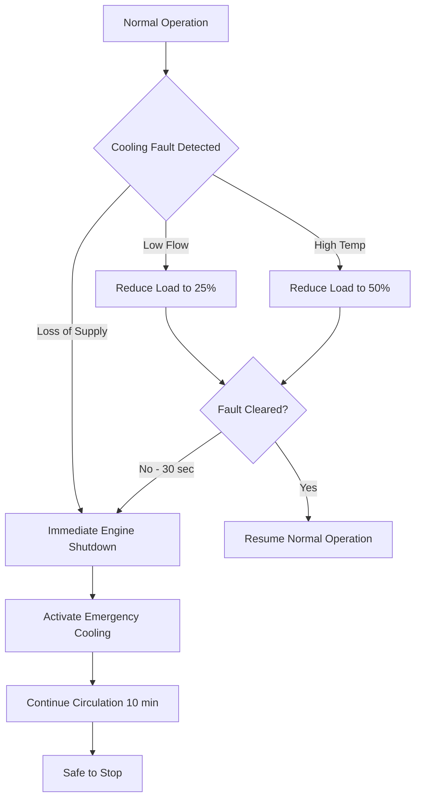
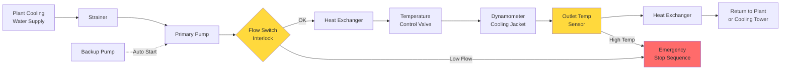

## Water Brake Dynamometer Cooling Requirements

Water brake dynamometers absorb engine power by converting mechanical energy to heat through fluid shear. The cooling water serves dual purposes: it acts as the working fluid for power absorption and the heat transfer medium for thermal management.

**Primary cooling requirements:**

- **Continuous heat absorption capacity:** Must match maximum engine power output
- **Flow rate proportional to torque:** Higher torque demands greater flow
- **Temperature-controlled inlet:** Typically 15-25°C for consistent load characteristics
- **Pressure requirements:** 275-550 kPa to maintain proper rotor clearances
- **Water quality:** Filtered to prevent rotor scoring, hardness controlled to minimize scaling

The total heat load equals engine power output:

$$Q_{total} = P_{engine} = \frac{2\pi \cdot N \cdot T}{60000}$$

where $Q_{total}$ is heat load (kW), $N$ is speed (rpm), and $T$ is torque (N·m).

Water brake dynamometers require significantly higher flow rates than eddy current units because water directly absorbs the mechanical energy. Typical installations require 0.15-0.30 L/s per kW of absorbed power.

## Eddy Current Dynamometer Heat Dissipation

Eddy current dynamometers generate heat through electromagnetic induction in a metal rotor. The heat dissipation occurs entirely through the cooling water circulating through passages in the stator housing.

**Heat dissipation characteristics:**

- **Constant heat rejection:** All absorbed power converts to heat in the stator
- **Localized hot spots:** Electromagnetic field concentrations create thermal gradients
- **Lower flow requirements:** Water only removes heat, not the working medium
- **Precise temperature control:** Electrical characteristics drift with temperature
- **Coolant conductivity limits:** Deionized or low-conductivity water prevents electrical leakage

The heat rejection from eddy current dynamometers:

$$Q_{eddy} = P_{absorbed} \cdot \eta_{conversion}$$

where $\eta_{conversion}$ approaches 1.0 (essentially 100% conversion to heat).

Temperature rise across the dynamometer:

$$\Delta T = \frac{Q_{eddy}}{\dot{m} \cdot c_p} = \frac{Q_{eddy}}{\rho \cdot \dot{V} \cdot c_p}$$

where $\dot{m}$ is mass flow rate (kg/s), $\dot{V}$ is volumetric flow rate (m³/s), $c_p$ is specific heat (4.186 kJ/kg·K for water), and $\rho$ is density (1000 kg/m³).

## Cooling Water Flow Rate Calculations

Proper flow rate determination ensures adequate heat removal while maintaining temperature stability.

**Flow rate calculation methodology:**

$$\dot{V} = \frac{Q_{total}}{\rho \cdot c_p \cdot \Delta T_{allowable}} \times \frac{1}{\eta_{HX}}$$

where $\Delta T_{allowable}$ is the permitted temperature rise (typically 5-10°C) and $\eta_{HX}$ is heat exchanger effectiveness (0.85-0.95).

For a 750 kW dynamometer with 8°C allowable rise:

$$\dot{V} = \frac{750}{1000 \times 4.186 \times 8} \times \frac{1}{0.90} = 0.025 \text{ m}^3\text{/s} = 25 \text{ L/s}$$

**Design considerations:**

- **Safety margin:** Add 15-20% capacity for transient conditions
- **Minimum flow switches:** Prevent dry running and thermal damage
- **Bypass valves:** Maintain flow during low-load conditions
- **Parallel paths:** Ensure uniform cooling across stator sections

## Temperature Rise Limits for Accuracy

Dynamometer accuracy depends critically on thermal stability. Temperature variations affect torque measurement through dimensional changes, electromagnetic properties, and calibration drift.

**Temperature control requirements:**

| Dynamometer Type | Inlet Temp Range | Max ΔT Across Unit | Stability Required |
|------------------|------------------|--------------------|--------------------|
| Water Brake | 15-25°C | 10°C | ±2°C |
| Eddy Current | 20-30°C | 8°C | ±1°C |
| AC Motoring | 25-35°C | 6°C | ±0.5°C |
| DC Motoring | 25-35°C | 6°C | ±0.5°C |

Torque measurement error from temperature drift:

$$\epsilon_{temp} = \alpha_{thermal} \cdot \Delta T \cdot S_{calibration}$$

where $\alpha_{thermal}$ is thermal coefficient (0.001-0.003/°C) and $S_{calibration}$ is calibration sensitivity.

## Heat Exchanger Sizing for Dyno Cooling

Heat exchangers reject absorbed power to plant cooling water or atmospheric cooling systems.

**Sizing methodology:**

Heat exchanger duty:

$$Q_{HX} = UA \cdot LMTD$$

where $U$ is overall heat transfer coefficient (2500-4500 W/m²·K for water-to-water) and $A$ is heat transfer area.

Log mean temperature difference:

$$LMTD = \frac{(T_{h,in} - T_{c,out}) - (T_{h,out} - T_{c,in})}{\ln\left(\frac{T_{h,in} - T_{c,out}}{T_{h,out} - T_{c,in}}\right)}$$

**Heat exchanger types:**

- **Plate and frame:** Compact, high efficiency, easy maintenance (most common)
- **Shell and tube:** Robust, high pressure capability, higher fouling tolerance
- **Brazed plate:** Compact, permanent construction, lower cost
- **Cooling towers:** Atmospheric rejection for sites without plant cooling water

## Emergency Cooling and Safety Interlocks

Dynamometer protection requires multiple cooling system interlocks to prevent catastrophic failure.

**Critical safety interlocks:**

1. **Low flow shutdown:** Flow switch triggers immediate load reduction and engine shutdown
2. **High temperature cutoff:** Temperature sensors (redundant) stop testing at 5°C below damage threshold
3. **Loss of cooling water:** Pressure switch detects supply failure, initiates emergency stop
4. **Strainer differential pressure:** High ΔP indicates blockage requiring attention
5. **Backup cooling pump:** Automatic start on primary pump failure

**Emergency cooling sequence:**

**Typical interlock settings:**

| Parameter | Warning | Alarm | Emergency Stop |
|-----------|---------|-------|----------------|
| Flow Rate | <85% design | <75% design | <60% design |
| Outlet Temp | >45°C | >50°C | >55°C |
| Inlet Pressure | <200 kPa | <150 kPa | <100 kPa |
| ΔP Strainer | >35 kPa | >50 kPa | N/A |

**Cooling System Schematic:**

Post-test cooldown procedures maintain circulation at reduced flow (40-60% of full flow) for 5-15 minutes after engine shutdown to prevent localized overheating and thermal shock to the dynamometer components. This cooldown period is particularly critical for eddy current units where residual magnetic fields can continue generating heat briefly after power absorption ceases.
