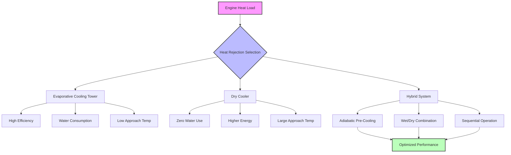

Engine test facilities generate substantial heat loads requiring efficient heat rejection to maintain cooling water temperature within acceptable ranges. The selection of heat rejection equipment directly impacts water consumption, energy efficiency, operating costs, and environmental compliance.

## Cooling Tower Selection and Sizing

Evaporative cooling towers provide the most energy-efficient heat rejection for large continuous loads typical of engine test facilities. The cooling tower must reject both the engine heat load and the heat of compression from dynamometer operation.

**Cooling Tower Capacity Calculation:**

$$Q_{tower} = \dot{m} \cdot c_p \cdot (T_{in} - T_{out})$$

where $Q_{tower}$ is heat rejection capacity (Btu/hr), $\dot{m}$ is water flow rate (lb/hr), $c_p$ is specific heat of water (1.0 Btu/lb·°F), $T_{in}$ is entering water temperature (°F), and $T_{out}$ is leaving water temperature (°F).

**Evaporation Rate:**

$$\dot{m}_{evap} = \frac{Q_{tower}}{h_{fg}}$$

where $\dot{m}_{evap}$ is evaporation rate (lb/hr) and $h_{fg}$ is latent heat of vaporization (~1,050 Btu/lb at typical conditions).

Cooling tower selection considers:

- **Range**: Temperature difference between entering and leaving water (typically 10-20°F for test facilities)
- **Approach**: Temperature difference between leaving water and ambient wet-bulb temperature (5-10°F minimum)
- **Heat load**: Total heat rejection including safety factor (1.15-1.25 multiplier)
- **Flow rate**: Based on range and heat load
- **Wet-bulb temperature**: Design condition typically 1% or 2.5% annual exceedance

For high-capacity installations, multiple cells with variable-speed fans optimize energy consumption across varying loads and ambient conditions.

## Dry Cooler Applications

Dry coolers (air-cooled heat exchangers) eliminate water consumption but require larger temperature differentials and higher fan energy. Applications include:

- **Water-scarce locations**: Where evaporative cooling is prohibited or water costs are prohibitive
- **Freeze protection**: Locations requiring winter operation without glycol addition
- **Small facilities**: Where water treatment complexity outweighs energy penalties
- **Backup systems**: Redundancy for critical operations

Dry cooler capacity follows:

$$Q_{dc} = U \cdot A \cdot \Delta T_{lm}$$

where $Q_{dc}$ is heat rejection (Btu/hr), $U$ is overall heat transfer coefficient (Btu/hr·ft²·°F), $A$ is heat transfer area (ft²), and $\Delta T_{lm}$ is log mean temperature difference.

Dry coolers typically require 15-25°F approach to ambient dry-bulb temperature, compared to 5-10°F approach to wet-bulb for cooling towers. This results in higher cooling water supply temperatures or increased heat exchanger surface area.

## Hybrid Cooling Systems

Hybrid systems combine evaporative and dry cooling, optimizing between water conservation and energy efficiency.

**Adiabatic Pre-Cooling**: Dry cooler with evaporative pre-cooling of inlet air during peak load or high ambient conditions. Water consumption occurs only when needed, typically <30% of full evaporative tower usage.

**Wet/Dry Towers**: Parallel wet and dry sections within single equipment. Dry section handles base load; evaporative section engages during peak demand.

**Sequential Operation**: Separate dry coolers and cooling towers with controls switching between modes based on ambient conditions and load requirements.

## Approach Temperature Considerations

Approach temperature determines cooling water supply temperature and affects:

- **Dynamometer performance**: Lower water temperature increases power absorption capacity
- **Engine testing accuracy**: Stable inlet temperature improves repeatability
- **Heat exchanger sizing**: Lower approach requires larger tower but smaller secondary heat exchangers
- **Energy consumption**: Tighter approach increases fan and pump energy

Economic optimization balances tower first cost, fan energy, and pump energy. For test facilities requiring precise temperature control, 5-7°F approach is typical despite higher capital and operating costs.

## Water Consumption and Conservation

Cooling tower water consumption includes:

**Evaporation**: Primary loss mechanism, approximately 1% of circulation rate per 10°F range.

**Blowdown**: Discharge to control dissolved solids concentration, calculated as:

$$\dot{m}_{bd} = \frac{\dot{m}_{evap}}{(CoC - 1)}$$

where $\dot{m}_{bd}$ is blowdown rate and $CoC$ is cycles of concentration (typically 3-6).

**Drift**: Entrained water droplets leaving tower (<0.001% with modern drift eliminators).

Conservation strategies include:

- High-efficiency drift eliminators minimizing loss
- Conductivity-based blowdown control maximizing cycles of concentration
- Rainwater harvesting for makeup water
- Side-stream filtration reducing bleed-off requirements
- Heat recovery from blowdown for facility heating

## Seasonal Operation Variations

Winter operation introduces challenges:

- **Freezing risk**: Basin heaters, heat tracing, and minimum flow requirements
- **Plume abatement**: Visible plume may require mitigation in populated areas
- **Capacity turndown**: VFD fans and cell isolation maintain stable operation at reduced loads
- **Water treatment**: Adjusted chemical programs for lower temperature operation

Summer peak conditions require:

- **Design verification**: Ensure capacity at maximum wet-bulb temperature
- **Water availability**: Confirm makeup water supply during peak demand
- **Electrical demand**: Peak fan energy coinciding with facility maximum load
- **Backup provisions**: Redundancy for critical testing schedules

## Heat Rejection Method Comparison

| Parameter | Evaporative Tower | Dry Cooler | Hybrid System |
|-----------|------------------|------------|---------------|
| **Approach Temperature** | 5-10°F (WB) | 15-25°F (DB) | 8-15°F |
| **Water Consumption** | 100% | 0% | 20-40% |
| **Relative First Cost** | 1.0x | 2.5-3.5x | 1.8-2.5x |
| **Fan Energy** | Low | High | Medium |
| **Footprint** | Small | Large | Medium |
| **Maintenance** | Water treatment | Minimal | Moderate |
| **Freeze Protection** | Required | Simple | Moderate |
| **Noise Level** | Moderate | High | Moderate |

## Design Recommendations

Select heat rejection equipment based on:

1. **Load profile**: Continuous high loads favor evaporative towers; intermittent operation may justify dry cooling
2. **Water availability**: Local regulations and cost structures
3. **Temperature requirements**: Precision testing demands tight approach temperatures
4. **Climate**: Wet-bulb/dry-bulb relationship affects comparative performance
5. **Environmental concerns**: Plume, noise, and water discharge restrictions
6. **Redundancy**: Critical facilities require N+1 or 2N capacity
7. **Future expansion**: Modular designs accommodate facility growth

Properly sized and selected heat rejection systems ensure reliable engine test operations while minimizing water consumption, energy costs, and environmental impact
