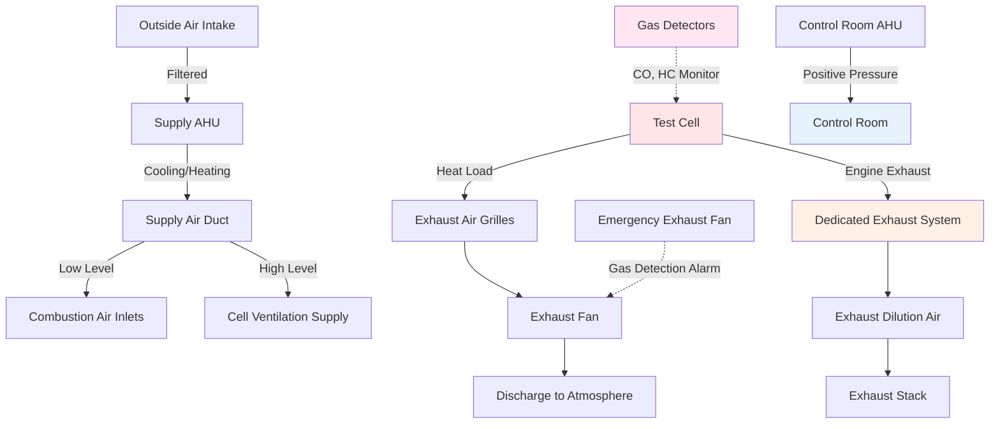

Dynamometer test cells require specialized HVAC systems to handle extreme heat loads, provide combustion air, maintain test conditions, and ensure operator safety during engine testing operations.

## Test Cell Ventilation Requirements

Test cell ventilation serves multiple critical functions: combustion air supply, heat removal, dilution of exhaust leakage, and safety purging.

**Ventilation Design Criteria:**

- Air change rate: 30-60 ACH minimum for heat removal
- Combustion air supply: 150-200% of stoichiometric requirement
- Makeup air for exhaust systems: match exhaust flow rates
- Emergency purge: 100 ACH minimum for gas detection alarm response
- Temperature rise limitation: 10-15°F maximum above ambient

The total ventilation rate combines combustion air, cooling air, and makeup air:

$$Q_{total} = Q_{combustion} + Q_{cooling} + Q_{makeup}$$

where each component is calculated based on specific test requirements.

For heat removal, the required airflow is:

$$Q_{cooling} = \frac{q_{sensible}}{1.08 \times \Delta T}$$

where $q_{sensible}$ is the sensible heat load in Btu/hr, and $\Delta T$ is the allowable temperature rise in °F.

## Heat Load Calculations

Test cells experience massive heat loads from engines, dynamometers, and auxiliary equipment.

**Primary Heat Sources:**

- Engine radiant and convective heat: 30-40% of fuel energy
- Dynamometer losses: 2-5% of absorbed power
- Cooling system heat rejection: 25-35% of fuel energy
- Exhaust system radiation: variable based on insulation
- Control equipment and lighting: typically 10-20 kW

Total sensible heat load calculation:

$$q_{total} = q_{engine} + q_{dyno} + q_{equipment} + q_{radiation}$$

For a 500 HP engine at full load:

$$q_{engine} = 500 \text{ HP} \times 2545 \frac{\text{Btu/hr}}{\text{HP}} \times 0.35 = 445,375 \text{ Btu/hr}$$

Dynamometer heat (assuming 3% loss at 400 HP absorption):

$$q_{dyno} = 400 \text{ HP} \times 2545 \frac{\text{Btu/hr}}{\text{HP}} \times 0.03 = 30,540 \text{ Btu/hr}$$

## Air Supply and Exhaust Balance

Proper air balance prevents exhaust gas infiltration and maintains controlled test conditions.

**Pressure Relationship Strategy:**

1. Test cell: slight negative pressure (-0.02 to -0.05 in. w.c.)
2. Control room: positive pressure (+0.05 to +0.10 in. w.c.)
3. Adjacent spaces: neutral to slight positive

The pressure differential is maintained by:

$$\Delta P = \frac{(Q_{exhaust} - Q_{supply})^2 \times \rho}{2 \times C \times A^2}$$

**Supply Air Distribution:**

- Low-level combustion air inlets near engine intake
- High-level cooling air for upper cell ventilation
- Stratified flow pattern to direct heat upward
- Air velocities: 500-800 fpm at supply outlets

**Exhaust Air Collection:**

- High-level exhaust grilles capture rising heat
- Dedicated engine exhaust removal system
- Separate exhaust for fuel vapor areas
- Emergency exhaust capacity for rapid purge

## Temperature Control for Test Conditions

Many tests require precise temperature control to maintain repeatable conditions.

**Temperature Control Methods:**

- Conditioned combustion air: ±2°F control typical
- Cell ambient control: ±5°F for dynamometer stability
- Seasonal compensation for altitude correction
- Pre-test stabilization period requirements

Supply air temperature calculation for desired cell temperature:

$$T_{supply} = T_{cell} - \frac{q_{total}}{1.08 \times Q_{supply}}$$

For precision testing, dedicated air handling units provide:

- Cooling capacity: 40-60 tons typical for 500 HP cell
- Heating capacity: 200-400 MBH for cold start testing
- Dehumidification to control humidity ratio
- Air filtration to protect engine intake systems

## Safety Ventilation and Gas Detection

Safety systems protect personnel from carbon monoxide, unburned hydrocarbons, and oxygen depletion.

**Gas Detection Requirements:**

- Carbon monoxide: 35 ppm alarm, 100 ppm shutdown
- Combustible gas (LEL): 10% alarm, 25% shutdown
- Oxygen level: <19.5% alarm
- Sensor locations: breathing zone and ceiling level

Emergency response sequence:

1. Gas detection alarm activates
2. Emergency exhaust fans start (100 ACH minimum)
3. Supply air increases to maintain negative pressure
4. Engine shutdown if threshold exceeded
5. Lockout prevents restart until clear

**Ventilation Interlock Requirements:**

- Prove ventilation before engine start
- Maintain minimum airflow during operation
- Post-test purge cycle (5-10 minutes minimum)
- Emergency stop override for evacuation

## Control Room Environmental Requirements

Control rooms require comfortable, quiet environments isolated from test cell conditions.

**Control Room Design Criteria:**

- Temperature: 72°F ± 2°F year-round
- Humidity: 40-60% RH for electronics
- Pressurization: +0.05 to +0.10 in. w.c.
- Air changes: 6-10 ACH minimum
- Noise level: NC-35 to NC-40 maximum

Air supply calculation for control room:

$$Q_{control} = Q_{cooling} + Q_{pressurization} + Q_{occupancy}$$

Typical 200 sq ft control room requires:

- Cooling: 1.5-2.0 tons for equipment and occupants
- Pressurization: 150-300 CFM to overcome door infiltration
- Ventilation: 60 CFM per occupant minimum

**Control Room Isolation:**

- Separate HVAC system from test cell
- HEPA filtration for electronics protection
- Acoustic treatment in supply/return ducts
- Sealed penetrations for cable/conduit
- Observation window with thermal break

## Ventilation Requirements by Cell Type

Different dynamometer applications require varying ventilation approaches.

| Cell Type | Air Changes | Combustion Air | Cooling CFM/HP | Pressure | Special Requirements |
|-----------|-------------|----------------|----------------|----------|---------------------|
| Engine Dyno (Steady-State) | 30-40 ACH | 200% stoich | 60-80 | -0.02 to -0.05 | Temperature control ±5°F |
| Engine Dyno (Transient) | 40-60 ACH | 250% stoich | 80-120 | -0.05 | Rapid heat removal |
| Chassis Dyno (2WD) | 60-80 ACH | 150% stoich | 100-150 | -0.02 | Vehicle exhaust capture |
| Chassis Dyno (4WD/AWD) | 80-100 ACH | 200% stoich | 150-200 | -0.05 | Enhanced cooling |
| High-Performance Racing | 100+ ACH | 300% stoich | 200-300 | -0.10 | Extreme heat loads |
| Electric Motor Dyno | 20-30 ACH | N/A | 40-60 | -0.02 | Precision temperature |
| Emissions Testing | 40-50 ACH | 175% stoich | 80-100 | -0.05 | Conditioned air ±2°F |

**Application-Specific Considerations:**

Transient testing generates peak loads 2-3 times steady-state values, requiring oversized cooling capacity with rapid response. Emissions testing demands precise control of intake air temperature, humidity, and pressure to ensure repeatable results and regulatory compliance. High-performance applications may see instantaneous heat releases exceeding 1,000,000 Btu/hr.

Proper HVAC design ensures accurate test results, equipment protection, and operator safety in these demanding environments.

