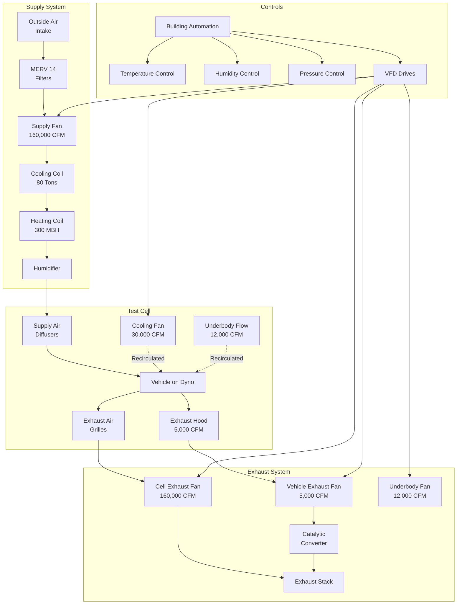

Chassis dynamometer facilities simulate real-world driving conditions while measuring vehicle performance, emissions, and fuel economy. The HVAC systems must manage substantial heat loads from vehicle operation, provide precise environmental control for repeatable testing, and safely remove combustion products while simulating road conditions.

## Large Volume Ventilation Requirements

Chassis dynamometer test cells typically range from 15,000 to 40,000 cubic feet in volume. Ventilation must address multiple simultaneous needs: exhaust gas removal, heat extraction, and fresh air supply for engine combustion.

The minimum ventilation rate follows:

$$Q_{min} = \frac{HP \times 2545 \times 3.41}{(\rho \times c_p \times \Delta T)} + Q_{combustion}$$

Where:
- $Q_{min}$ = minimum ventilation rate (CFM)
- $HP$ = maximum vehicle horsepower being tested
- $2545$ = BTU/hr per horsepower
- $3.41$ = BTU/hr per watt conversion
- $\rho$ = air density (0.075 lb/ft³)
- $c_p$ = specific heat of air (0.24 BTU/lb·°F)
- $\Delta T$ = allowable temperature rise (typically 10-15°F)
- $Q_{combustion}$ = combustion air requirement (100-150 CFM per 100 HP)

For a 500 HP vehicle test with 15°F temperature rise:

$$Q_{min} = \frac{500 \times 2545 \times 3.41}{(0.075 \times 0.24 \times 15)} + (500 \times 1.2) = 151,810 + 600 \approx 152,400 \text{ CFM}$$

Air change rates typically range from 60 to 120 ACH during active testing.

## Vehicle Exhaust Capture Systems

Effective exhaust capture prevents combustion products from entering the test cell atmosphere. Two primary approaches exist:

**Direct Exhaust Connection**

Hard-piped connections to the vehicle tailpipe using flexible stainless steel ductwork (typically 4-6 inch diameter) with quick-disconnect couplings. This system maintains negative pressure of 0.5 to 1.0 inches w.g. at the connection point. Exhaust fans must handle temperatures up to 1200°F and corrosive condensates.

**Overhead Exhaust Capture Hoods**

Used when tailpipe connection proves impractical. Canopy-style hoods positioned 12-18 inches above and behind the vehicle require capture velocities of 200-300 FPM across the hood face. Hood exhaust volume typically equals 3,000-5,000 CFM per vehicle, separate from general ventilation.

## Cooling Fan Simulation Systems

Radiator cooling replicates on-road airflow across the vehicle's heat exchangers. The cooling fan system delivers controlled airflow to the vehicle's front grille area.

**Fan System Design Parameters:**

- Fan diameter: 36-60 inches (sized to cover radiator area)
- Airflow capacity: 15,000-30,000 CFM
- Velocity range: 5-80 MPH equivalent
- Speed control: Variable frequency drive with 0.1 MPH resolution
- Positioning: 18-24 inches from vehicle front, adjustable height

The fan power requirement:

$$P_{fan} = \frac{Q \times SP}{6356 \times \eta_{fan} \times \eta_{motor}}$$

Where:
- $P_{fan}$ = fan motor power (HP)
- $Q$ = airflow (CFM)
- $SP$ = static pressure (inches w.g., typically 0.5-1.0)
- $\eta_{fan}$ = fan efficiency (0.75-0.85)
- $\eta_{motor}$ = motor efficiency (0.90-0.95)

## Road Load Simulation Air Systems

Accurate aerodynamic drag simulation requires controlled airflow around the entire vehicle:

**Underbody Airflow Systems**

Recirculating air systems beneath the dynamometer rollers simulate road-induced turbulence and cooling of underbody components. Typical flow rates: 8,000-15,000 CFM through a plenum beneath the vehicle with adjustable louvers.

**Side Draft Ventilation**

Lateral airflow (1,000-2,000 CFM per side) prevents heat buildup around wheel wells and brake assemblies. This airflow operates independently from the primary ventilation system.

## Temperature and Humidity Control

Precise environmental control ensures repeatable test results and compliance with testing standards.

**Temperature Control Requirements:**

- Operating range: 68-86°F (20-30°C) per SAE J1263
- Stability: ±2°F during test cycles
- Recovery time: Return to setpoint within 10 minutes after test
- Cooling capacity: 50-100 tons for typical installations
- Heating capacity: 200-400 MBH

**Humidity Control Requirements:**

- Range: 30-70% RH
- Stability: ±5% RH during testing
- Dew point control: ±3°F for emissions testing
- Dehumidification: 200-400 pints/day capacity
- Humidification: Steam injection or evaporative (40-80 lbs/hr)

The sensible cooling load calculation:

$$Q_s = 1.1 \times CFM \times \Delta T + Q_{vehicle} + Q_{dyno} + Q_{lighting} + Q_{solar}$$

Where $Q_{vehicle}$ represents heat rejection from the engine, transmission, and brakes (typically 60-80% of rated horsepower as heat).

## Emissions Testing Environmental Requirements

Regulatory emissions testing (EPA, CARB, Euro standards) mandates stringent environmental conditions.

**EPA Federal Test Procedure (FTP-75) Requirements:**

- Temperature: 68-86°F (20-30°C)
- Humidity: 40-70 grains H₂O per lb dry air
- Atmospheric pressure: Corrected to standard conditions
- Background CO: <50 ppm
- Background HC: <5 ppm
- Background NOₓ: <2 ppm

**HVAC System Design for Emissions Compliance:**

- 100% outside air during emissions testing (no recirculation)
- MERV 14 filtration minimum for supply air
- Separate background air sampling system (isolated from test cell)
- Pressurization control: ±0.02 inches w.g. relative to ambient
- Rapid purge capability: Complete cell air change in 3-5 minutes

## Chassis Dynamometer Facility Layout

## Ventilation Requirements by Vehicle Type

| Vehicle Type | Test Cell Volume (ft³) | Supply Air (CFM) | Exhaust Capture (CFM) | Cooling Fan (CFM) | Typical Power (HP) | Air Changes/Hr |
|--------------|------------------------|------------------|------------------------|-------------------|-------------------|----------------|
| Light Duty Passenger | 18,000 | 85,000 | 4,000 | 18,000 | 150-300 | 280 |
| Light Duty Truck/SUV | 22,000 | 110,000 | 5,000 | 22,000 | 250-400 | 300 |
| Heavy Duty Pickup | 26,000 | 140,000 | 6,000 | 26,000 | 350-500 | 320 |
| Medium Duty Commercial | 30,000 | 180,000 | 8,000 | 30,000 | 400-600 | 360 |
| Performance/Racing | 20,000 | 160,000 | 6,000 | 25,000 | 500-800 | 480 |
| Electric Vehicle | 18,000 | 60,000 | — | 18,000 | 200-400 (eq.) | 200 |
| Hybrid Vehicle | 18,000 | 75,000 | 3,000 | 18,000 | 150-250 | 250 |

**Notes:**
- Supply air CFM includes combustion air and heat removal
- Air change rates calculated during maximum power testing
- Electric vehicles require significantly less ventilation (heat rejection only)
- Add 20-30% safety factor for system sizing

## Control Integration

Modern chassis dynamometer HVAC systems integrate with the dynamometer control system to coordinate environmental conditions with test protocols:

- **Test cycle coordination:** Ventilation rates adjust based on dyno load
- **Pre-conditioning:** Automated vehicle and cell temperature stabilization
- **Soak periods:** Reduced ventilation during vehicle temperature soak
- **Emergency shutdown:** Full exhaust upon detection of CO or HC exceedance
- **Data logging:** Environmental parameters recorded with test data

The integration ensures test repeatability, operator safety, and regulatory compliance while optimizing energy consumption during non-testing periods.
