## Overview

Engine test cell HVAC systems must simultaneously provide adequate combustion air, maintain safe environmental conditions, control temperature and humidity, remove heat and exhaust products, and integrate with critical safety systems. The design must accommodate extreme heat loads from engines operating at full load while maintaining precise environmental control for accurate test data.

## Cell Classification by Engine Type

Test cells are classified based on the engine type and power output, which directly influences HVAC system sizing and configuration.

**Small Engine Cells (0-150 HP)**
- Automotive gasoline engines
- Small diesel engines
- Motorcycle and ATV powerplants
- Typical cell volume: 2,000-4,000 ft³
- Heat rejection: 50,000-200,000 BTU/hr

**Medium Engine Cells (150-600 HP)**
- Automotive and light-duty truck engines
- Industrial power units
- Marine engines
- Typical cell volume: 4,000-8,000 ft³
- Heat rejection: 200,000-800,000 BTU/hr

**Large Engine Cells (600+ HP)**
- Heavy-duty diesel engines
- Marine propulsion engines
- Locomotive powerplants
- Typical cell volume: 8,000-20,000+ ft³
- Heat rejection: 800,000-3,000,000+ BTU/hr

**Specialty Cells**
- High-altitude simulation chambers
- Climatic test chambers (-40°F to 140°F)
- Emissions certification cells
- Durability test cells

## Ventilation Rates for Combustion Air and Cooling

Engine test cells require dual-purpose ventilation to supply combustion air and remove heat. The ventilation rate must be the greater of combustion air requirements or cooling load requirements.

### Combustion Air Requirements

The stoichiometric air requirement for combustion is approximately 14.7 lb of air per lb of fuel for gasoline engines and 14.5 lb/lb for diesel. Accounting for excess air and safety factors:

$$Q_{combustion} = \frac{HP \times BSFC \times A/F \times SF}{60 \times \rho_{air}}$$

Where:
- $Q_{combustion}$ = combustion air flow rate (CFM)
- $HP$ = maximum engine horsepower
- $BSFC$ = brake specific fuel consumption (lb/HP-hr), typically 0.45-0.50
- $A/F$ = air-to-fuel ratio (15-18 for actual operation)
- $SF$ = safety factor (1.25-1.50)
- $\rho_{air}$ = air density (0.075 lb/ft³ at standard conditions)

### Cooling Ventilation Requirements

Heat removal ventilation is calculated based on the total heat rejection from the engine, dynamometer, and auxiliary equipment:

$$Q_{cooling} = \frac{Q_{total}}{1.08 \times \Delta T}$$

Where:
- $Q_{cooling}$ = ventilation flow rate (CFM)
- $Q_{total}$ = total heat rejection (BTU/hr)
- $\Delta T$ = allowable temperature rise (typically 20-30°F)
- 1.08 = constant for sensible heat (BTU/CFM·°F·hr)

Total heat rejection includes:
- Engine radiation and convection: 15-25% of fuel energy input
- Dynamometer heat: 100% of brake horsepower (2,545 BTU/HP-hr)
- Electrical equipment: per manufacturer data
- Lighting and solar gains

### Air Change Rate Method

For preliminary sizing, minimum ventilation rates are often expressed as air changes per hour:

$$ACH = \frac{Q_{ventilation} \times 60}{V_{cell}}$$

Typical minimum air change rates:
- Small engine cells: 40-60 ACH
- Medium engine cells: 30-50 ACH
- Large engine cells: 20-40 ACH
- Non-operating (standby): 6-10 ACH

```mermaid
graph TD
    A[Engine Test Cell Layout] --> B[Supply Air System]
    A --> C[Engine Under Test]
    A --> D[Exhaust Removal]
    A --> E[Safety Systems]

    B --> B1[Combustion Air Duct<br/>Low-level inlet]
    B --> B2[Cooling Air Diffusers<br/>High-level distribution]
    B --> B3[Air Handling Unit<br/>Filter, heat, cool]

    C --> C1[Dynamometer]
    C --> C2[Engine Mount]
    C --> C3[Fuel System]
    C --> C4[Cooling Water]

    D --> D1[Tailpipe Capture<br/>Direct connection]
    D --> D2[General Exhaust<br/>Ceiling/wall exhaust]
    D --> D3[Exhaust Fan<br/>Variable speed]

    E --> E1[Fire Suppression<br/>Integration]
    E --> E2[Emergency Shutdown<br/>HVAC interlock]
    E --> E3[Gas Detection<br/>CO, fuel vapor]
    E --> E4[Pressure Relief<br/>Explosion venting]

    style A fill:#f9f,stroke:#333,stroke-width:4px
    style C fill:#bbf,stroke:#333,stroke-width:2px
    style E fill:#fbb,stroke:#333,stroke-width:2px
```

## Fire Suppression System Integration

HVAC systems must be fully integrated with fire suppression systems to prevent fire spread and ensure suppression effectiveness.

### Pre-Suppression Actions

Upon fire detection or suppression system activation:
1. **Immediate engine shutdown** - fuel cutoff and ignition kill
2. **HVAC supply air shutdown** - close motorized dampers within 5 seconds
3. **Exhaust system operation** - may continue or stop per system design
4. **Combustible air handling** - shutdown any recirculation

### Suppression Agent Compatibility

**Water-Based Systems**
- Deluge or sprinkler systems
- HVAC continues operation to clear smoke
- Drainage provisions for water runoff
- Electrical equipment protection

**Gaseous Suppression (CO₂, FM-200, Novec 1230)**
- Complete HVAC shutdown required
- Air-tight dampers to maintain agent concentration
- Minimum hold time: 10-20 minutes
- Pre-discharge alarms with 30-60 second delay
- Exhaust system purge cycle after suppression

**Dry Chemical Systems**
- Primarily for fuel system fires
- HVAC shutdown to prevent powder distribution
- Special cleanup procedures required

### Duct Penetration Fire Dampers

All HVAC duct penetrations through fire-rated cell boundaries require:
- UL 555 rated fire dampers
- Fusible link or electric actuator release
- Access for inspection and testing
- Minimum 1.5-hour fire rating for cell walls

## Fuel System Ventilation Requirements

Dedicated ventilation provisions are required for areas where fuel vapors may accumulate.

### Fuel Storage and Transfer Areas

- Minimum 1 CFM per ft² of floor area
- Continuous operation during facility occupied hours
- Low-level exhaust pickups (fuel vapors heavier than air for gasoline)
- High-level exhaust for natural gas or lighter-than-air fuels
- Exhaust discharge 10 ft above roof level, away from air intakes

### Day Tank Rooms

- 12 air changes per hour minimum
- Dedicated exhaust system (no recirculation)
- Exhaust interlocked with fuel transfer pump operation
- Class I, Division 2 electrical equipment
- Explosion-proof exhaust fans

### Fuel Line Routing

Fuel supply lines within the test cell require:
- Leak detection sensors at low points
- Local exhaust at fuel pump and filter locations
- 100 CFM minimum capture velocity at potential leak sources
- Automatic fuel shutoff on vapor detection

### Combustible Gas Detection

Continuously monitor for fuel vapors:
- Lower explosive limit (LEL) sensors
- Alarm at 25% LEL
- Ventilation increase at 25% LEL
- Fuel shutoff and engine shutdown at 50% LEL
- Sensor locations: ceiling (light gases), floor (heavy vapors), fuel equipment

## Cell Pressure Control

Precise pressure control is critical for combustion air consistency, emissions measurement accuracy, and safety.

### Negative Pressure Operation

Most test cells operate at -0.02 to -0.10 in. w.c. relative to adjacent spaces to prevent fuel vapor or exhaust gas migration.

**Control Strategy:**
- Exhaust CFM = Supply CFM + Differential (500-2,000 CFM)
- Barometric damper on supply or exhaust
- Pressure transmitter with DDC control
- Override capability for emergency conditions

**Pressure Control Equation:**

$$P_{cell} = P_{atm} - \left(\frac{Q_{exhaust} - Q_{supply}}{C_d \times A_{leak}}\right)^2 \times \frac{\rho}{2}$$

Where pressure differential depends on flow imbalance and cell leakage characteristics.

### Positive Pressure Scenarios

Certain test conditions may require positive pressure:
- High-altitude simulation (reduced cell pressure)
- Contamination isolation during non-test periods
- Pressurization for inert gas flooding

### Pressure Relief

Overpressure or vacuum relief provisions:
- Explosion relief panels: 1 ft² per 50-100 ft³ of cell volume
- Relief panel set pressure: 0.5-2.0 psf
- Discharge to safe location
- Automatic closure after relief event

## Emergency Shutdown Integration with HVAC

The test cell emergency shutdown system (ESS) must integrate with HVAC for comprehensive safety.

### Emergency Shutdown Triggers

HVAC responds to these emergency conditions:
- Manual emergency stop (E-stop button activation)
- Fire detection or suppression activation
- Combustible gas detection >50% LEL
- Carbon monoxide >100 ppm
- Cell overpressure or vacuum
- Loss of exhaust system operation
- Cooling water failure
- Electrical power loss

### HVAC Emergency Response Sequence

**Immediate Actions (0-5 seconds):**
1. Close fuel supply solenoid valves
2. Shut down engine ignition and fuel pumps
3. Continue exhaust ventilation at high speed
4. Continue combustion air supply (prevents backfire)

**Secondary Actions (5-30 seconds):**
1. Ramp down combustion air supply
2. Close supply air dampers if fire detected
3. Activate smoke evacuation mode if required
4. Initiate fire suppression pre-action sequence

**Post-Emergency Actions (30+ seconds):**
1. Maintain minimum purge ventilation
2. Monitor atmospheric conditions
3. Prevent restart until manual reset
4. Log event data for analysis

### Fail-Safe Design Principles

- Dampers fail to safe position (closed for supply, open for exhaust)
- Exhaust fans remain operational on loss of normal power
- Emergency power for critical exhaust and controls
- Redundant safety sensors with voting logic
- Manual override capability for emergency personnel

## Test Cell Design Parameters

| Parameter | Small Cells | Medium Cells | Large Cells | Units |
|-----------|-------------|--------------|-------------|-------|
| **Engine Power Range** | 0-150 | 150-600 | 600+ | HP |
| **Cell Volume** | 2,000-4,000 | 4,000-8,000 | 8,000-20,000 | ft³ |
| **Ventilation Rate** | 80,000-240,000 | 120,000-400,000 | 160,000-800,000 | CFM |
| **Air Changes/Hour** | 40-60 | 30-50 | 20-40 | ACH |
| **Supply Air Velocity** | 1,500-2,500 | 2,000-3,000 | 2,500-4,000 | FPM |
| **Cell Static Pressure** | -0.02 to -0.05 | -0.05 to -0.08 | -0.08 to -0.10 | in. w.c. |
| **Temperature Rise** | 20-25 | 25-30 | 30-40 | °F |
| **Exhaust System Capacity** | 110% | 115% | 120% | % of supply |
| **Emergency Purge Rate** | 60 | 50 | 40 | ACH |
| **Fire Rating** | 2-hour | 2-hour | 3-hour | rating |
| **Explosion Relief Area** | 40-80 | 80-160 | 160-400 | ft² |
| **Noise Level (operating)** | 85-95 | 90-100 | 95-105 | dBA |
| **Makeup Air Temperature** | 60-70 | 65-75 | 68-77 | °F |
| **Relative Humidity Range** | 30-60 | 30-60 | 30-60 | % |

## Operational Considerations

**Pre-Test Checklist:**
- Verify ventilation system operation and flow rates
- Confirm cell pressure within specification
- Check fire suppression system status
- Test emergency shutdown interlocks
- Verify gas detection system calibration

**During Testing:**
- Monitor cell temperature and adjust ventilation as needed
- Maintain pressure differential within control band
- Verify exhaust system capture at tailpipe
- Monitor combustible gas and CO levels continuously

**Post-Test Procedures:**
- Continue ventilation for minimum 15-minute purge
- Allow engine and dynamometer cooling period
- Inspect for fuel or coolant leaks
- Reset safety systems for next test

The integration of HVAC systems with engine test cell operations requires careful coordination of combustion air supply, heat removal, pressure control, and safety system integration to ensure accurate test results and personnel safety.
