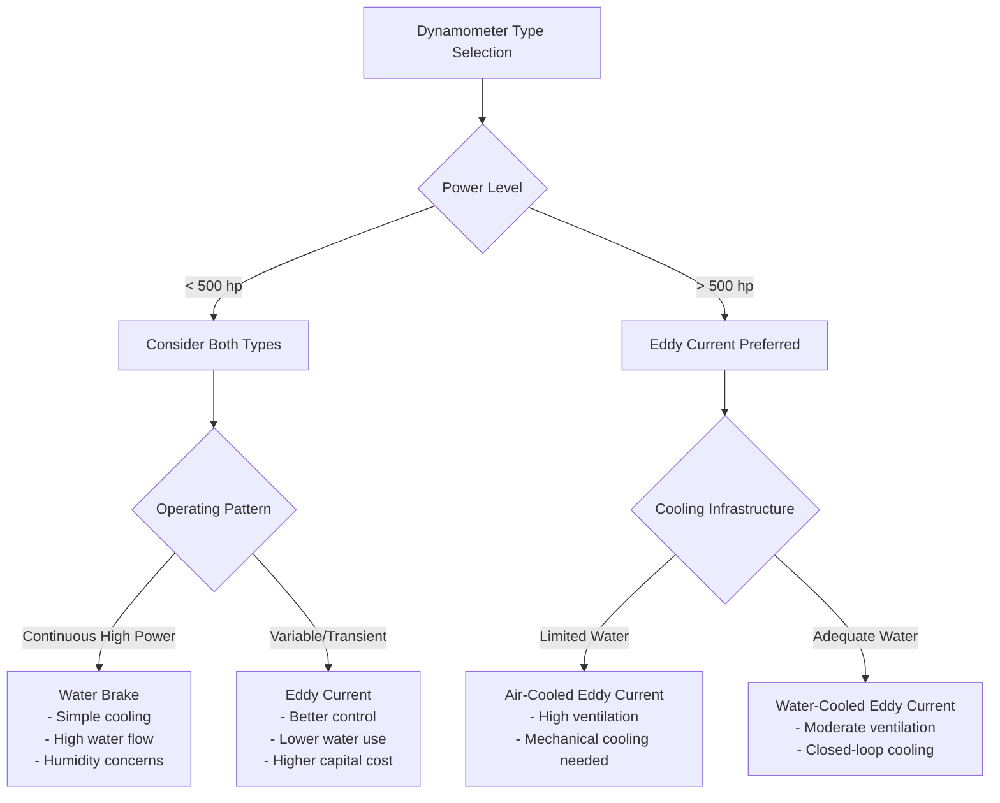

## Overview

Water brake and eddy current dynamometers represent the two most common absorption dynamometer types in engine testing facilities. Each generates substantial heat during power absorption, requiring specialized HVAC design approaches. Water brake dynamometers dissipate energy directly into cooling water through fluid friction, while eddy current dynamometers convert mechanical energy to electrical energy dissipated as heat in electromagnets and rotor assemblies.

## Heat Generation Characteristics

### Water Brake Dynamometers

Water brake dynamometers absorb power through the viscous shear of water between rotating and stationary elements. The total absorbed power converts directly to heat in the cooling water:

$$Q_{water} = P_{absorbed} = T \times \omega$$

where $Q_{water}$ is heat generation (W), $T$ is torque (N·m), and $\omega$ is angular velocity (rad/s).

For a 500 hp (373 kW) dynamometer at full load, essentially all absorbed power appears as heat in the cooling water, requiring immediate removal to prevent boiling. Water temperature rise through the dynamometer follows:

$$\Delta T = \frac{Q_{water}}{\dot{m} \times c_p}$$

where $\dot{m}$ is water flow rate (kg/s) and $c_p$ is specific heat (4.18 kJ/kg·K).

Typical design limits temperature rise to 10-15°C to prevent localized boiling and maintain consistent absorption characteristics.

### Eddy Current Dynamometers

Eddy current dynamometers generate heat in two primary locations: the rotor assembly (typically 60-70% of absorbed power) and the electromagnet windings (30-40% of absorbed power). The rotor heat transfers to cooling water, while electromagnet heat requires separate cooling or direct water cooling of coil assemblies.

Total heat rejection combines both components:

$$Q_{total} = Q_{rotor} + Q_{coil} = P_{absorbed} \times (0.65 + 0.35)$$

Air-cooled electromagnet designs reject coil heat directly to the test cell, significantly increasing room cooling requirements.

## Cooling Water Requirements Comparison

| Parameter | Water Brake | Eddy Current |
|-----------|-------------|--------------|
| Water flow rate (per 100 hp) | 60-80 gpm | 30-40 gpm |
| Inlet temperature | 60-80°F | 60-90°F |
| Temperature rise | 10-15°F | 15-25°F |
| Pressure requirement | 40-60 psi | 30-50 psi |
| Water quality | Moderate | Critical |
| Heat rejection location | 100% to water | 60-70% to water |
| Recirculation feasible | With cooling tower | With heat exchanger |

Water brake systems require higher flow rates due to direct power absorption in the water. Eddy current systems tolerate higher temperature differentials and require superior water quality to prevent scale formation in electromagnet cooling passages.

## Room Ventilation for Heat Dissipation

### Water Brake Test Cells

Room ventilation addresses three heat sources:

1. **Radiated heat from dynamometer housing**: 2-5% of absorbed power
2. **Engine exhaust heat**: Captured by dedicated exhaust system
3. **Auxiliary equipment heat**: Electric motors, controls, instrumentation

Ventilation air quantity calculation:

$$\dot{V}_{air} = \frac{Q_{room}}{1.08 \times \Delta T}$$

where $\dot{V}_{air}$ is airflow (cfm), $Q_{room}$ is room heat gain (Btu/hr), and $\Delta T$ is allowable temperature rise (°F).

For a 500 hp water brake cell, approximately 20,000-30,000 cfm ventilation maintains room temperature within 10°F of outdoor ambient during testing.

### Eddy Current Test Cells

Air-cooled eddy current dynamometers with air-cooled electromagnets reject 30-40% of absorbed power directly to the test cell. For the same 500 hp capacity:

- Rotor radiated heat: 10,000-15,000 Btu/hr
- Electromagnet heat (air-cooled): 60,000-75,000 Btu/hr
- Total room heat: 70,000-90,000 Btu/hr

This requires 50,000-70,000 cfm ventilation or mechanical cooling to maintain acceptable temperatures. Water-cooled electromagnet designs reduce room heat by 60-70%, allowing ventilation-only cooling in many climates.

## Humidity from Water Brake Evaporation

Water brake dynamometers generate humidity through two mechanisms:

**Operational evaporation**: Water temperature elevation increases vapor pressure, causing evaporative losses of 1-2% of circulation rate. For an 80 gpm system, 0.8-1.6 gpm evaporates, adding approximately 80-160 lb/hr moisture to the test cell atmosphere.

**Post-test cooling**: Hot dynamometer surfaces continue evaporating water after shutdown, particularly problematic in closed-loop systems without continuous ventilation.

Humidity control strategies include:

- Continuous ventilation during and 30 minutes post-test
- Dehumidification for test cells requiring consistent conditions
- Drainage of water brake after extended shutdown periods
- Vapor barriers on dynamometer enclosures

Maintain test cell relative humidity below 60% to prevent condensation on cool surfaces and electronic equipment.

## Electrical Room Cooling for Eddy Current

Eddy current dynamometer control systems generate 3,000-8,000 Btu/hr per 100 hp capacity from power electronics, excitation systems, and control cabinets. Electrical rooms require dedicated cooling:

**Design parameters:**
- Internal temperature: 68-77°F maximum
- Relative humidity: 40-55%
- Air filtration: MERV 8 minimum
- Positive pressurization: 0.02-0.05 in. w.c.

Cooling options include:
- Split system air conditioning for rooms under 2,000 ft²
- Computer room air conditioning (CRAC) units for larger installations
- Redundant capacity (N+1) for critical testing facilities

Separate electrical room HVAC from test cell ventilation to maintain clean, controlled conditions for sensitive electronics.

## Selection Criteria for Different Applications

**Water Brake Advantages:**
- Lower capital cost (40-50% less than eddy current)
- Simpler installation and maintenance
- Robust operation with minimal electronics
- Excellent for steady-state testing
- Preferred for marine and industrial applications

**Eddy Current Advantages:**
- Superior transient response and control
- Lower water consumption (50% reduction)
- Minimal humidity generation
- Better suited for automated testing
- Preferred for automotive development testing

**HVAC cost implications:**
- Water brake: Higher operating costs (water treatment, conditioning)
- Eddy current: Higher capital costs (mechanical cooling, dehumidification)
- Air-cooled eddy current: Highest room cooling requirements

Select water brake dynamometers when water availability is adequate, humidity control is not critical, and capital budget is constrained. Choose eddy current systems for precise control requirements, water conservation needs, or automated test sequences despite higher HVAC infrastructure investment
