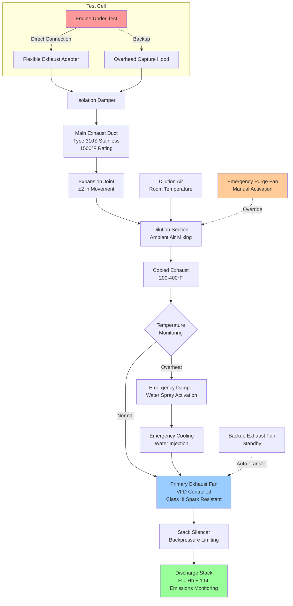

Engine test facilities require specialized exhaust removal systems to safely capture and discharge high-temperature, high-velocity combustion products while maintaining test cell environmental conditions and meeting emissions regulations. Proper exhaust system design prevents backpressure interference with engine performance while protecting personnel and equipment.

## Exhaust Capture Methods and Equipment

Direct connection exhaust capture provides the most effective containment of combustion gases. **Flexible exhaust adapters** connect from the engine exhaust manifold or tailpipe to the fixed ductwork, accommodating engine movement during dynamometer testing. These adapters typically use multi-ply stainless steel bellows construction rated for temperatures up to 1200°F (649°C).

**Telescoping exhaust pipes** allow axial movement for vehicle positioning on chassis dynamometers. Spring-loaded sealing mechanisms maintain gastight connections despite thermal expansion and vehicle motion during testing cycles.

**Overhead capture hoods** serve as backup exhaust collection when direct connection is impractical. Hood capture velocity must overcome the jet momentum of exhaust gases:

$$V_c = V_e \sqrt{\frac{A_e}{A_h}} + 100$$

where $V_c$ is capture velocity (fpm), $V_e$ is exhaust velocity (fpm), $A_e$ is exhaust pipe area (ft²), and $A_h$ is hood face area (ft²). The 100 fpm safety factor accounts for room air currents.

**Quick-disconnect couplings** facilitate rapid changeover between test units. Ball-and-socket configurations accommodate angular misalignment while maintaining seal integrity at elevated temperatures.

## High-Temperature Duct Materials

Material selection depends on maximum gas temperature, chemical exposure, and structural requirements.

**Stainless steel Type 304** provides adequate corrosion resistance for exhaust temperatures below 1000°F (538°C). Wall thickness ranges from 16-gauge for small ducts to 10-gauge for large diameter mains subject to thermal expansion stress.

**Stainless steel Type 310S or 321** extends service temperature to 1500°F (816°C) with improved oxidation resistance. These alloys resist sulfur attack from diesel exhaust and maintain structural integrity through thermal cycling.

**Insulation requirements** prevent heat transfer to occupied spaces and reduce thermal expansion. Calcium silicate board or ceramic fiber blanket insulation maintains exterior surface temperatures below 140°F (60°C). Insulation thickness calculation:

$$t = \frac{k(T_g - T_s)}{q''} - \frac{hD}{2k}$$

where $t$ is insulation thickness (in), $k$ is thermal conductivity (Btu·in/hr·ft²·°F), $T_g$ is gas temperature (°F), $T_s$ is surface temperature limit (°F), $q''$ is heat flux (Btu/hr·ft²), $h$ is film coefficient, and $D$ is duct diameter (ft).

**Expansion joints** accommodate thermal growth in long duct runs. Metallic bellows expansion joints rated for exhaust service typically allow ±2 inches movement per joint. Spacing calculation:

$$L_{max} = \frac{\Delta_{joint}}{\alpha \Delta T}$$

where $L_{max}$ is maximum spacing between joints (ft), $\Delta_{joint}$ is joint movement capacity (in), $\alpha$ is thermal expansion coefficient (6.9×10⁻⁶ in/in·°F for stainless steel), and $\Delta T$ is temperature change (°F).

## Exhaust Fan Selection for Hot Gases

High-temperature exhaust fans must withstand thermal stress while maintaining stable performance across varying engine loads.

**Radial blade fans** handle particulate-laden exhaust with minimal buildup. Backward-curved or airfoil designs offer higher efficiency but require cleaner gas streams. Material construction includes cast aluminum wheels for temperatures below 400°F or welded steel for higher temperatures.

**Fan temperature derating** accounts for reduced air density at elevated temperatures:

$$Q_{actual} = Q_{design} \sqrt{\frac{T_{design}}{T_{actual}}}$$

$$SP_{actual} = SP_{design} \frac{T_{actual}}{T_{design}}$$

where temperatures are absolute (°R = °F + 460). A fan selected for 70°F air operating at 500°F exhaust requires approximately 1.32 times the volumetric flow capacity.

**Variable frequency drives** modulate fan speed to match engine load conditions, preventing excessive negative pressure during idle or light load operation. Control strategies track exhaust gas temperature or test cell pressure.

**Spark-resistant construction** (AMCA Class II or III) prevents ignition of unburned hydrocarbons in diesel exhaust or during rich fuel mixture testing. Non-ferrous impeller materials eliminate spark generation.

## Exhaust Temperature by Engine Type

| Engine Type | Idle Exhaust Temp | Full Load Exhaust Temp | Peak Transient Temp | Recommended Duct Rating |
|-------------|-------------------|------------------------|---------------------|-------------------------|
| Gasoline automotive | 300-400°F | 800-1000°F | 1200°F | 1400°F |
| Diesel automotive | 200-300°F | 600-900°F | 1000°F | 1200°F |
| Heavy-duty diesel | 250-350°F | 700-1100°F | 1300°F | 1500°F |
| Gasoline performance | 400-500°F | 1000-1400°F | 1600°F | 1800°F |
| Natural gas industrial | 350-450°F | 900-1200°F | 1400°F | 1600°F |
| Small aircraft piston | 300-400°F | 700-1000°F | 1200°F | 1400°F |
| Turbocharged diesel | 300-400°F | 800-1200°F | 1500°F | 1700°F |

## Dilution and Cooling Before Discharge

Exhaust gases typically require cooling before atmospheric discharge or emissions analysis sampling.

**Ambient air dilution** mixes room air with exhaust to reduce temperature and concentration. Dilution ratio calculation:

$$DR = \frac{T_e - T_{target}}{T_{target} - T_a} + 1$$

where $DR$ is dilution ratio, $T_e$ is exhaust temperature (°F), $T_{target}$ is target mixed temperature (°F), and $T_a$ is ambient air temperature (°F). Achieving 200°F discharge from 1000°F exhaust at 70°F ambient requires approximately 6.4:1 dilution.

**Venturi dilution systems** use exhaust gas momentum to induce ambient air through radial slots. These passive systems require no external power but increase backpressure by 2-4 inches water column.

**Water spray cooling** provides rapid temperature reduction with minimal dilution air. Evaporative cooling capacity:

$$\dot{m}_w = \frac{\dot{m}_e c_p (T_e - T_{target})}{h_{fg}}$$

where $\dot{m}_w$ is water flow rate (lb/hr), $\dot{m}_e$ is exhaust mass flow (lb/hr), $c_p$ is specific heat of exhaust (0.26 Btu/lb·°F), and $h_{fg}$ is heat of vaporization (970 Btu/lb at atmospheric pressure).

**Heat recovery systems** extract thermal energy for space heating or process use. Shell-and-tube heat exchangers with exhaust on tube side facilitate cleaning and inspection. Gas-side pressure drop typically limits heat recovery to 40-60% of available energy.

## Environmental Compliance Requirements

Emissions regulations govern both concentration and total mass discharge.

**Opacity limits** restrict visible emissions, typically to 20% opacity or less. Diesel exhaust during acceleration or high-load testing may require filtration or aftertreatment to meet local air quality permits.

**VOC and NOx reporting** applies to facilities with aggregate emissions exceeding threshold quantities. Continuous emissions monitoring systems (CEMS) may be required for major sources.

**Stack height requirements** ensure adequate dispersion. EPA good engineering practice formula:

$$H_{stack} = H_b + 1.5L$$

where $H_{stack}$ is minimum stack height (ft), $H_b$ is building height (ft), and $L$ is lesser of building height or maximum projected building width (ft).

**Odor control** addresses nuisance complaints even when emissions meet regulatory limits. Carbon adsorption or catalytic oxidation systems remove hydrocarbons responsible for objectionable odors.

## Emergency Exhaust Provisions

Test facilities require redundant exhaust capacity for safety.

**Backup exhaust fans** maintain minimum ventilation during primary fan maintenance or failure. Automatic damper control transfers exhaust flow to standby equipment upon pressure deviation or fan status change.

**Emergency purge systems** rapidly evacuate test cells following catastrophic engine failure or fire. High-volume fans sized for complete air changes within 2-3 minutes prevent hazardous gas accumulation.

**Fire dampers** in exhaust ducts close upon high-temperature detection to prevent fire spread through ductwork. Fusible link release at 286°F provides fail-safe operation independent of power availability.

**Manual override controls** located at emergency exit allow occupants to activate maximum exhaust during evacuation scenarios.

