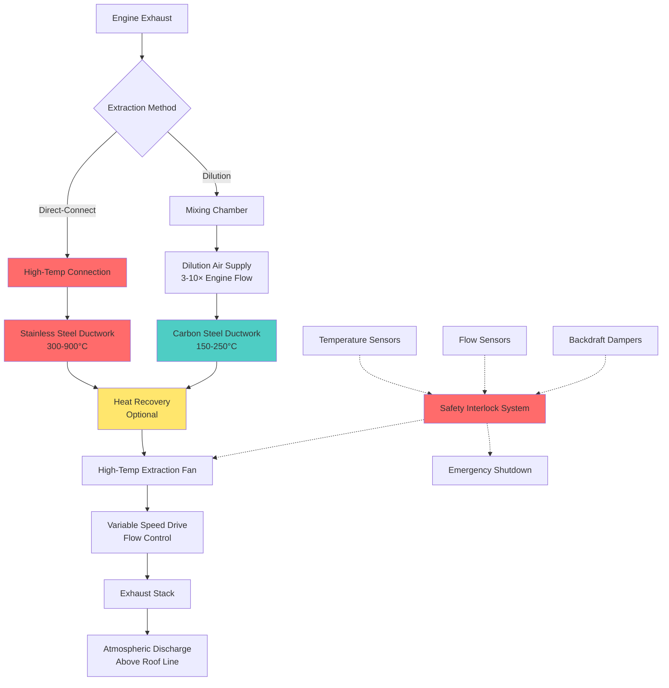

## Direct-Connect vs Dilution Extraction Methods

Exhaust extraction systems for engine test cells employ two fundamental approaches: direct-connect and dilution extraction. The selection depends on engine type, test duration, exhaust temperature, and facility constraints.

**Direct-Connect Extraction** couples the engine exhaust directly to the extraction ductwork with minimal air dilution. This method handles the full exhaust temperature (300-650°C for diesel engines, up to 900°C for gas turbines during transient conditions) and requires high-temperature materials and construction. The extraction rate equals the engine air consumption plus fuel mass flow:

$$Q_{extract} = Q_{engine} + Q_{fuel} = \dot{m}_{air} + \dot{m}_{fuel}$$

where $\dot{m}_{air}$ is the engine combustion air mass flow (kg/s) and $\dot{m}_{fuel}$ is the fuel mass flow (kg/s).

**Dilution Extraction** introduces ambient or conditioned air into the exhaust stream immediately after the engine outlet, reducing gas temperature to 150-250°C before entering the extraction ductwork. This permits standard construction materials but requires significantly higher volumetric flow rates. The dilution ratio typically ranges from 3:1 to 10:1:

$$Q_{dilution} = Q_{exhaust} \times (DR - 1)$$

where $DR$ is the dilution ratio. Total extraction flow becomes:

$$Q_{total} = Q_{exhaust} + Q_{dilution}$$

Dilution air may be introduced through annular mixing chambers, venturi dilutors, or dedicated injection nozzles arranged to promote turbulent mixing and prevent stratification.

## Extraction Method Comparison

| Parameter | Direct-Connect | Dilution Extraction |
|-----------|---------------|---------------------|
| **Duct Material** | Stainless steel 304/316 | Carbon steel, aluminized steel |
| **Operating Temperature** | 300-900°C | 150-250°C |
| **Volumetric Flow** | Minimum (engine displacement) | 3-10× engine flow |
| **Fan Power** | Lower (smaller volume) | Higher (larger volume) |
| **Heat Recovery** | Excellent potential | Limited potential |
| **Installation Cost** | Higher (specialty materials) | Lower (standard materials) |
| **Flexibility** | Limited to design conditions | Adaptable to various engines |
| **Startup Response** | Fast thermal response | Slower, requires dilution air |

## Extraction Fan Specifications for Hot Gases

Extraction fans must withstand continuous exposure to elevated temperatures, corrosive combustion products, and cyclic thermal stress. Critical specifications include:

**Temperature Rating**: Fans handling direct-connect exhaust require Class III construction (400°C continuous, 600°C intermittent) per AMCA 99. Dilution systems typically operate at 150-250°C, permitting Class I construction (200°C maximum).

**Materials of Construction**: Fan wheels for high-temperature service use austenitic stainless steel (304, 316) or high-nickel alloys. Bearings are externally mounted with extended shafts and water-cooled or air-cooled pedestals to maintain lubricant below 90°C.

**Fan Selection**: Backward-inclined or airfoil centrifugal fans provide stable operation across varying engine loads. Static pressure requirements account for:
- Duct friction losses (typically 500-1500 Pa)
- Exhaust backpressure limits (critical for engine performance)
- Stack discharge velocity (15-25 m/s minimum for plume dispersion)

Pressure rise capability:

$$\Delta P_{fan} = \Delta P_{duct} + \Delta P_{stack} + \Delta P_{accessories} + P_{velocity}$$

where $P_{velocity} = \frac{1}{2}\rho V^2$ at stack outlet.

## Variable Speed Drives for Flow Control

Variable frequency drives (VFDs) modulate extraction fan speed to match engine operating conditions, maintaining optimal exhaust backpressure and minimizing energy consumption. Control strategies include:

**Backpressure Control**: Pressure transmitters monitor engine exhaust backpressure, adjusting fan speed to maintain setpoint (typically 50-500 Pa gauge, depending on engine specifications). Exceeding maximum backpressure triggers alarms and may limit engine load.

**Temperature Compensation**: For dilution systems, VFDs regulate dilution air quantity based on measured exhaust temperature, maintaining safe duct operating conditions.

**Energy Savings**: Operating fans at 80% speed reduces power consumption to approximately 51% of full-speed power (affinity law: Power ∝ speed³), yielding substantial savings during partial-load testing.

## Heat Recovery Opportunities

Engine exhaust represents a significant energy stream suitable for heat recovery. A 1 MW diesel engine operating at 35% thermal efficiency rejects approximately 500 kW through exhaust at 400-500°C.

**Heat Recovery Methods**:
- Shell-and-tube exhaust heat exchangers for hot water generation (70-90°C supply)
- Exhaust gas boilers producing low-pressure steam (150-200°C saturated)
- Organic Rankine cycle (ORC) systems for electricity generation
- Absorption chillers for cooling production

Recoverable heat:

$$Q_{recoverable} = \dot{m}_{exhaust} \times c_p \times (T_{in} - T_{out})$$

where $c_p \approx 1.1$ kJ/(kg·K) for combustion products and $T_{out}$ is limited by acid dewpoint (typically 150-180°C for diesel fuel).

## Stack Design for Exhaust Discharge

Exhaust stacks disperse combustion products above occupied areas and prevent re-entrainment into building air intakes.

**Stack Height**: Determined by dispersion modeling (AERMOD, SCREEN3) to maintain ground-level concentrations below regulatory limits. Minimum height typically exceeds building height by 3-6 meters or 1.5× building height dimension, whichever is greater.

**Discharge Velocity**: Minimum 15 m/s prevents downdrafts; 20-25 m/s provides adequate plume rise. Stack diameter:

$$D_{stack} = \sqrt{\frac{4Q}{\pi V}}$$

where $Q$ is volumetric flow (m³/s) at stack temperature and $V$ is discharge velocity (m/s).

**Rain Protection**: Weather caps or conical deflectors prevent water ingress while maintaining unrestricted discharge.

## Monitoring and Safety Interlocks

Comprehensive monitoring prevents equipment damage and ensures safe operation:

**Temperature Monitoring**: Thermocouples at extraction duct inlet, mid-run, and fan inlet trigger alarms at preset thresholds and initiate emergency dilution or shutdown sequences.

**Flow Verification**: Differential pressure sensors or anemometers confirm adequate extraction flow before engine start permission.

**Backdraft Prevention**: Motor-operated or gravity dampers prevent reverse flow during fan shutdown, protecting facility from exhaust intrusion.

**Interlock Sequence**: Engine start inhibited unless extraction fan proven running with adequate flow. High exhaust temperature, low extraction flow, or fan failure initiate immediate engine shutdown and emergency dilution air activation.