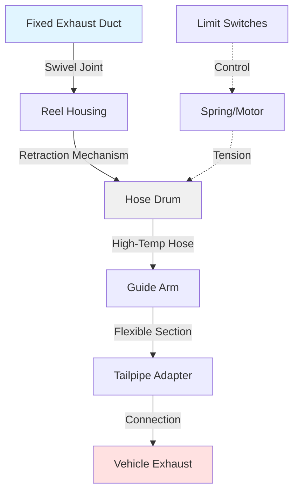

Exhaust hose reel systems provide flexible, retractable connections between engine exhaust outlets and fixed ventilation ductwork in test cells. These systems must accommodate vehicle positioning variations while maintaining leak-free connections and withstanding extreme exhaust temperatures.

## Retractable Hose Reel Designs

Ceiling-mounted reel assemblies position the hose storage mechanism overhead, maximizing floor space in the test cell. The reel housing contains the winding drum, retraction mechanism, and swivel connection to the fixed exhaust duct. Hose lengths typically range from 20 to 40 feet depending on cell dimensions and vehicle positioning requirements.

Wall-mounted configurations locate the reel on the cell perimeter, routing the hose horizontally to the vehicle. This arrangement suits narrow cells or facilities with overhead crane interference concerns. The horizontal deployment requires careful hose support to prevent sagging and maintain proper exhaust flow.

Articulating arm systems combine a rigid telescoping arm with a flexible hose section at the vehicle connection point. The arm provides coarse positioning while the hose accommodates final alignment to the exhaust outlet. This hybrid approach reduces hose wear from repeated extension cycles.

## High-Temperature Hose Materials

Exhaust gas temperatures at the tailpipe range from 300°F during idle to 1200°F under full load conditions. Hose construction must withstand these extremes while maintaining flexibility for retraction.

| Material | Max Temperature | Flexibility | Service Life |
|----------|----------------|-------------|--------------|
| Silicone-coated fiberglass | 600°F continuous | Good | 2-3 years |
| Stainless steel wire helix | 1200°F continuous | Moderate | 5-7 years |
| Inconel fabric | 1400°F continuous | Fair | 7-10 years |
| Ceramic fiber composite | 1800°F continuous | Poor | 3-5 years |
| PTFE-impregnated fiberglass | 500°F continuous | Excellent | 2-4 years |

Silicone-coated fiberglass hoses provide the best balance of temperature resistance, flexibility, and cost for most applications. The outer silicone layer protects the fiberglass substrate from abrasion while the woven construction maintains dimensional stability during thermal cycling.

Stainless steel wire helix hoses offer superior temperature ratings but require larger bend radii and exert higher forces on retraction mechanisms. These hoses suit high-performance engine testing where exhaust temperatures exceed 1000°F regularly.

## Hose Sizing and Flow Calculations

Proper hose diameter ensures adequate exhaust evacuation without excessive backpressure. The required diameter depends on engine displacement and maximum RPM:

$$Q = \frac{V_{d} \times RPM \times VE}{3456}$$

Where $Q$ is exhaust flow in CFM, $V_{d}$ is displacement in cubic inches, $RPM$ is maximum test speed, and $VE$ is volumetric efficiency (typically 0.85 for naturally aspirated engines, 1.2-1.5 for turbocharged).

The minimum hose diameter follows from the allowable velocity:

$$D = \sqrt{\frac{4Q}{\pi V_{max}}}$$

Where $D$ is diameter in inches and $V_{max}$ is maximum velocity, limited to 4000 fpm to prevent excessive noise and pressure drop.

## Connection Methods to Engine Exhaust

Telescoping tailpipe adapters slide over the vehicle exhaust outlet and lock with spring-loaded pins or cam latches. The adapter snout includes a conical reducer that accommodates different tailpipe diameters from 2 to 4 inches. A flexible bellows section between the adapter and rigid hose connection absorbs vibration from the engine.

Magnetic coupling systems use rare-earth magnets embedded in the adapter flange to achieve quick attachment without mechanical fasteners. The magnetic force holds the connection against exhaust backpressure while allowing rapid disconnection when the vehicle moves. These couplings require smooth, ferrous exhaust tips for reliable seating.

Capture hoods position a flanged bell mouth around the exhaust outlet without direct contact. The hood diameter exceeds the tailpipe by 4-6 inches, creating an air gap that entrains surrounding air into the exhaust stream. This method prevents contamination from exhaust leaks but requires higher ventilation rates to handle the dilution air.

## Reel Mounting and Positioning

Ceiling-mounted reels install to structural steel beams or reinforced roof decking using vibration-isolated brackets. The mounting height positions the fully retracted hose at least 8 feet above the floor to provide clearance for vehicles and personnel. A 360-degree swivel at the duct connection allows the hose to follow vehicle movement without twisting.

The reel centerline should align with the typical vehicle exhaust location to minimize hose extension angles. Offset mounting causes the hose to deploy at an angle, increasing wear on the first wrap and creating uneven tension on the drum.

## Spring Versus Motorized Retraction

Constant-force spring reels use a coiled flat spring that exerts uniform tension throughout the extension range. The spring mounts concentrically with the hose drum and unwinds as the hose deploys. This passive system requires no electrical power but limits hose weight and length due to spring force constraints. Maximum hose lengths typically remain below 30 feet with 6-inch diameter construction.

Motorized retraction systems employ electric or pneumatic motors controlled by limit switches and variable speed drives. The motor engages when a retraction signal occurs, winding the hose at a controlled rate. Overtravel protection prevents excessive drum tension that could damage the hose. These systems handle heavier hoses and longer runs but require power and periodic motor maintenance.

Hybrid designs combine a motor for retraction with a mechanical brake or clutch to prevent unwanted extension. The motor provides controlled winding while the brake eliminates the need for continuous power to hold the hose in position.

## Maintenance and Replacement Intervals

Inspect hoses monthly for tears, abrasion, or thermal degradation. The first three feet of hose near the vehicle connection experiences the highest temperatures and wear, often requiring replacement before the remainder shows damage. Some facilities install a sacrificial leader section with quick-disconnect fittings to simplify partial hose replacement.

Lubricate swivel joints and reel bearings quarterly using high-temperature grease rated for 400°F minimum. The swivel experiences continuous rotation during vehicle positioning and seizes without proper lubrication.

Replace spring mechanisms every 5 years or 10,000 extension cycles, whichever occurs first. Spring fatigue reduces retraction force over time, allowing the hose to sag and creating tripping hazards.

Clean hose interiors annually using compressed air to remove carbon deposits and condensate. Accumulated deposits restrict airflow and create localized hot spots that accelerate material breakdown. Record all maintenance activities and track extension cycles through mechanical or electronic counters to establish replacement schedules based on actual usage patterns.
