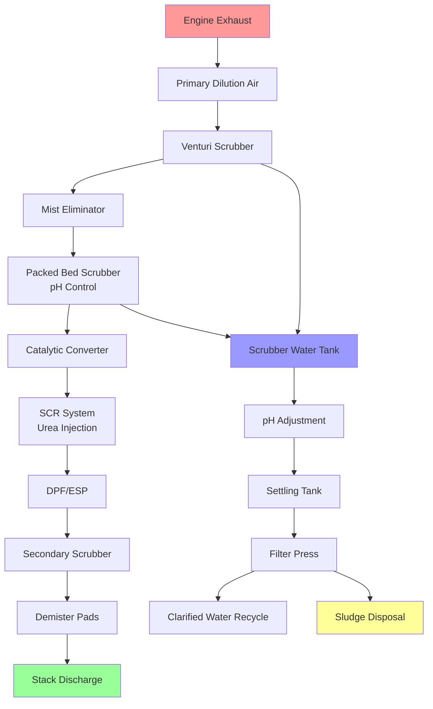

## Wet Scrubber Designs for Particulate Removal

Wet scrubbers represent the primary technology for removing particulates and gaseous pollutants from engine test cell exhaust streams. These systems use liquid spray (typically water or chemical solutions) to capture and neutralize contaminants before atmospheric discharge.

**Venturi Scrubbers** provide the highest efficiency for fine particulate removal. The exhaust stream accelerates through a converging section, atomizing the scrubbing liquid into fine droplets. Collection efficiency follows:

$$\eta = 1 - e^{-\frac{KL}{d_p^2 v_g}}$$

where $\eta$ is collection efficiency, $K$ is an empirical constant (0.1-0.4), $L$ is liquid-to-gas ratio (L/m³), $d_p$ is particle diameter (μm), and $v_g$ is gas velocity (m/s).

**Packed Bed Scrubbers** utilize structured or random packing media to maximize gas-liquid contact area. The pressure drop across the packing is:

$$\Delta P = \frac{f \cdot L \cdot \rho_g \cdot v_g^2}{2 \cdot d_h}$$

where $f$ is the friction factor, $L$ is packing depth (m), $\rho_g$ is gas density (kg/m³), and $d_h$ is hydraulic diameter (m). Typical packing depths range from 1.5-3.0 m for engine test applications.

**Spray Tower Scrubbers** employ multiple spray nozzle levels to create a counter-current flow pattern. While offering lower pressure drop (250-750 Pa), they require higher liquid flow rates (0.5-2.0 L/m³ of gas) and achieve moderate efficiency for particles above 2-5 μm.

## Catalytic Converters for Emission Control

Catalytic oxidation systems convert carbon monoxide and unburned hydrocarbons to carbon dioxide and water vapor. Three-way catalysts simultaneously reduce NOx emissions in stoichiometric exhaust streams.

**Catalyst Substrate Materials** include ceramic honeycomb monoliths (400-900 cells per square inch) and metallic foil substrates. The active catalyst coating contains platinum, palladium, and rhodium in precise ratios optimized for the exhaust temperature range.

Operating temperature windows are critical: 300-450°C for light-off, with optimal conversion at 400-800°C. For diesel engine testing, diesel oxidation catalysts (DOC) require exhaust temperatures exceeding 200°C for 90% CO and HC conversion.

**Space Velocity Considerations** determine catalyst sizing. The gas hourly space velocity (GHSV) typically ranges from 30,000-80,000 hr⁻¹:

$$\text{GHSV} = \frac{Q}{V_{cat}}$$

where $Q$ is volumetric flow rate (m³/hr at standard conditions) and $V_{cat}$ is catalyst volume (m³).

## NOx and SOx Treatment Methods

**Selective Catalytic Reduction (SCR)** systems inject urea solution (diesel exhaust fluid) to reduce NOx to nitrogen and water:

$$4\text{NO} + 4\text{NH}_3 + \text{O}_2 \rightarrow 4\text{N}_2 + 6\text{H}_2\text{O}$$

$$2\text{NO}_2 + 4\text{NH}_3 + \text{O}_2 \rightarrow 3\text{N}_2 + 6\text{H}_2\text{O}$$

SCR systems achieve 70-95% NOx reduction at 300-450°C with ammonia slip below 10 ppm. Urea dosing rate is:

$$\dot{m}_{urea} = \frac{\text{NSR} \cdot \dot{m}_{NOx} \cdot M_{urea}}{M_{NH_3} \cdot c_{urea}}$$

where NSR is the normalized stoichiometric ratio (typically 1.0-1.1), $\dot{m}_{NOx}$ is NOx mass flow rate, and $c_{urea}$ is urea solution concentration (32.5% by mass).

**SOx Removal** requires alkaline scrubbing solutions. Sodium hydroxide or sodium carbonate solutions neutralize sulfur dioxide:

$$\text{SO}_2 + 2\text{NaOH} \rightarrow \text{Na}_2\text{SO}_3 + \text{H}_2\text{O}$$

Scrubbing efficiency depends on pH (optimal range 8-10), liquid-to-gas ratio, and contact time. Two-stage scrubbers separate particulate removal (first stage) from acid gas neutralization (second stage).

## Particulate Filtration Systems

**Diesel Particulate Filters (DPF)** capture soot particles on ceramic wall-flow substrates. Filtration efficiency exceeds 95% for particles above 0.1 μm. Regeneration cycles oxidize accumulated soot at 550-650°C through active (fuel injection) or passive (catalyst coating) methods.

Pressure drop across a clean DPF is approximately:

$$\Delta P_{clean} = \frac{8 \mu L v_w}{\varepsilon d_p^2} + \frac{\rho v_w^2}{2 \varepsilon^2}$$

where $\mu$ is gas viscosity (Pa·s), $L$ is filter wall thickness (m), $v_w$ is wall velocity (m/s), $\varepsilon$ is porosity, and $d_p$ is mean pore diameter (μm).

**Electrostatic Precipitators (ESP)** for test cells handling high particulate loads provide collection efficiencies of 95-99.9%. Corona discharge electrodes charge particles, which migrate to collection plates under the influence of a 30-60 kV electric field.

## Pollutant Removal Efficiencies

| Pollutant | Technology | Removal Efficiency | Operating Conditions |
|-----------|------------|-------------------|---------------------|
| **Particulate Matter (PM10)** | Venturi Scrubber | 95-99% | L/G = 0.7-1.5 L/m³, ΔP = 5-15 kPa |
| **Particulate Matter (PM2.5)** | Venturi + ESP | 98-99.9% | ESP voltage 40-60 kV |
| **Carbon Monoxide (CO)** | Catalytic Converter | 90-98% | T = 400-800°C, sufficient O₂ |
| **Hydrocarbons (HC)** | Catalytic Converter | 85-95% | T = 350-750°C |
| **Nitrogen Oxides (NOx)** | SCR System | 70-95% | T = 300-450°C, NSR = 1.0-1.1 |
| **Sulfur Dioxide (SO₂)** | Alkaline Scrubber | 90-99% | pH 8-10, L/G = 5-15 L/m³ |
| **Volatile Organic Compounds** | Thermal/Catalytic Oxidizer | 95-99.9% | T = 750-1000°C (thermal) |
| **Ammonia Slip** | Oxidation Catalyst | 80-95% | Downstream of SCR |

## Environmental Permit Requirements

Test facility scrubbing systems must comply with federal, state, and local air quality regulations. **Title V Operating Permits** apply to major sources (potential emissions >100 tons/year of any criteria pollutant or >10/25 tons/year of HAPs).

**Emission Limits** vary by jurisdiction but typically include:
- Particulate matter: 0.01-0.05 gr/dscf (23-115 mg/dscm)
- NOx: 0.5-2.0 lb/MMBtu (215-860 mg/MJ)
- CO: 1.0-5.0 lb/MMBtu (430-2150 mg/MJ)
- Opacity: 10-20% (6-minute average)

**Continuous Emission Monitoring Systems (CEMS)** measure NOx, CO, CO₂, O₂, and opacity when emission rates exceed thresholds. Quarterly Relative Accuracy Test Audits (RATA) verify CEMS performance within ±10% of reference methods.

**Stack Testing** validates scrubber performance annually or biennially using EPA reference methods (Method 5 for particulates, Method 7E for NOx, Method 10 for CO).

## Scrubber Water Treatment and Disposal

Closed-loop scrubber water systems minimize water consumption and wastewater discharge. Key treatment processes include:

**pH Control** maintains optimal scrubbing efficiency and prevents corrosion. Automated dosing systems add sodium hydroxide (raises pH) or sulfuric acid (lowers pH) based on continuous pH monitoring. Target ranges: 6.5-8.5 for particulate scrubbers, 8.0-10.0 for acid gas scrubbers.

**Solids Separation** removes accumulated particulates through settling tanks (detention time 2-4 hours) and filter presses or centrifuges. Sludge typically contains 15-25% solids after dewatering.

**Chemical Precipitation** treats dissolved metals using lime, ferric chloride, or polymer flocculants. Heavy metals (lead, cadmium, zinc from engine wear) precipitate as hydroxides at pH 8-11.

**Blowdown Treatment** prevents buildup of dissolved solids (TDS). When TDS exceeds 3000-5000 mg/L, blowdown rates of 1-5% of recirculation flow maintain system water quality. Discharge must meet local pretreatment standards:
- Total Suspended Solids (TSS): <100 mg/L
- Oil and Grease: <50 mg/L
- Heavy Metals: Varies by element and jurisdiction
- pH: 6.0-9.0

**Sludge Characterization** determines disposal requirements. Non-hazardous sludge disposal occurs at approved landfills, while hazardous sludge (exceeding RCRA Toxicity Characteristic Leaching Procedure limits) requires treatment or disposal at permitted hazardous waste facilities.

Water makeup rates typically range from 0.5-2.0% of scrubber recirculation flow, accounting for evaporation (dominant loss), drift (0.001-0.02% of gas flow), and blowdown. For a 5000 CFM exhaust system with 1000 GPM scrubber recirculation, makeup requirements approximate 5-20 GPM continuous.