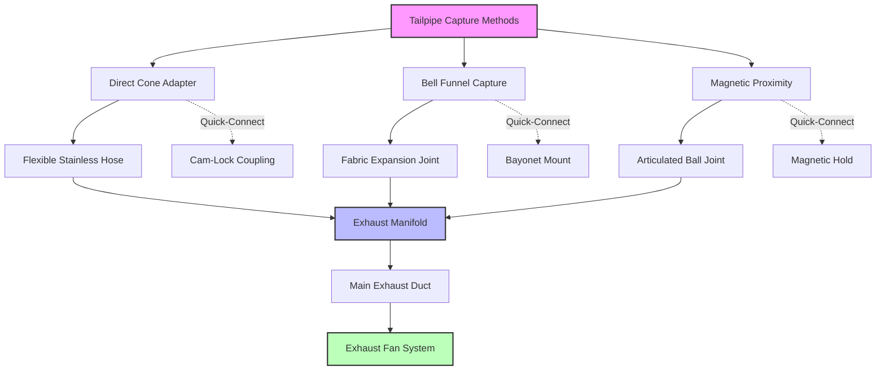

Tailpipe capture systems provide direct connection to engine exhaust outlets for efficient removal of combustion gases during dynamometer testing, emission certification, and development work. Proper design maintains near-atmospheric exhaust back-pressure while achieving complete capture of toxic combustion products.

## Tailpipe Adapter Designs

Adapter configurations accommodate diverse exhaust outlet geometries across vehicle platforms:

**Cone adapters** use graduated tapered sections to match various pipe diameters. Standard automotive cones span 1.5–4 inches (38–102 mm) to cover passenger vehicle exhaust pipes. Heavy-duty versions extend to 6 inches (152 mm) for diesel trucks. The cone angle typically measures 15–20 degrees to balance insertion depth with sealing effectiveness.

**Bell adapters** feature expanding entrance sections that funnel exhaust flow into the capture system. These designs tolerate lateral misalignment up to ±0.5 inches (±13 mm), critical for vehicles positioned on chassis dynamometers where exact tailpipe location varies.

**Slotted capture heads** employ spring-loaded mechanical grips that clamp around exhaust pipes. Adjustable jaw spacing accommodates diameter variations without adapter changes. Release mechanisms allow rapid vehicle connection and disconnection during test sequences.

**Magnetic attachment adapters** use rare-earth magnets to secure lightweight capture funnels to ferrous exhaust components. These non-contact systems prevent back-pressure addition but require close positioning tolerance (gap <0.25 inches or 6 mm) for effective capture.

## Flexible Connection Methods

Flexible hose sections between tailpipe adapters and rigid exhaust ductwork accommodate vehicle movement during dynamometer operation:

**Corrugated stainless steel hose** provides temperature resistance to 1200°F (649°C) with excellent flexibility. Multiple convolutions allow bending radius of 3–5 times hose diameter. Wall thickness of 0.012–0.020 inches (0.3–0.5 mm) balances flexibility with pressure rating.

**Fabric expansion joints** use fiberglass cloth with silicone coating for temperatures to 500°F (260°C). These lightweight connections compress and extend 2–4 inches (50–100 mm) to follow vehicle chassis motion. Fabric joints introduce minimal flow restriction but require annual inspection for degradation.

**Articulated ball joints** couple rigid pipe sections with spherical bearing assemblies allowing ±30-degree angular deflection. Typical installations use two ball joints in series to accommodate complex motion patterns during acceleration testing.

**Wire-reinforced rubber hose** serves lower-temperature applications (continuous 350°F/177°C). Embedded steel wire prevents collapse under vacuum conditions. These economical connections suit gasoline engine testing where exhaust temperatures remain moderate.

## Capture Efficiency Requirements

Complete exhaust capture prevents laboratory contamination with carbon monoxide and nitrogen oxides:

**Face velocity** at the adapter entrance must exceed exhaust jet velocity to prevent spillage. Minimum face velocity of 2000 fpm (10.2 m/s) provides adequate capture margin for passenger vehicles at idle. High-performance testing requires 3000–4000 fpm (15.2–20.3 m/s) to capture high-velocity exhaust pulses.

**Enclosure capture** supplements tailpipe connection with overhead canopy hoods rated for 200–400 cfm (340–680 m³/h) to collect fugitive emissions from leaks or disconnection events. Positioning the canopy within 12 inches (305 mm) of the exhaust outlet maximizes effectiveness.

**Tracer gas testing** verifies capture performance using sulfur hexafluoride injected at the tailpipe. Real-time SF₆ monitoring in the laboratory breathing zone confirms <10 ppm leakage, corresponding to >99.9% capture efficiency.

## Back-Pressure Considerations

Exhaust system resistance affects engine performance and emission characteristics:

The total back-pressure comprises adapter resistance, flexible connection losses, and duct friction:

$$\Delta P_{total} = \Delta P_{adapter} + \Delta P_{flex} + \Delta P_{duct}$$

Adapter pressure drop follows:

$$\Delta P_{adapter} = K_a \cdot \frac{\rho V^2}{2}$$

where $K_a$ = adapter loss coefficient (0.1–0.3 for well-designed cones), $\rho$ = exhaust gas density (kg/m³), and $V$ = velocity (m/s).

**Maximum allowable back-pressure** typically limits to 1.5–3.0 inches H₂O (0.37–0.75 kPa) above atmospheric to prevent engine power loss. Certification testing per EPA and CARB protocols mandates back-pressure within ±0.5 inches H₂O (±0.12 kPa) of on-road conditions.

**Pressure monitoring** uses differential pressure transmitters referenced to laboratory ambient pressure. Continuous recording during test cycles verifies compliance with back-pressure specifications.

Flexible hose contributes pressure drop based on length and diameter:

$$\Delta P_{flex} = f \cdot \frac{L}{D} \cdot \frac{\rho V^2}{2}$$

where $f$ = friction factor (0.02–0.04 for corrugated stainless), $L$ = hose length (m), and $D$ = diameter (m).

## Quick-Connect Systems

Rapid adapter attachment reduces test cell turnaround time:

**Cam-lock couplings** use quarter-turn rotation to engage adapter to vehicle tailpipe. Grooved profiles provide positive retention resisting separation forces up to 100 lbf (445 N). Connection time averages 3–5 seconds per tailpipe.

**Bayonet mounts** employ pin-and-slot mechanisms allowing push-and-twist installation. Spring-loaded pins automatically engage detent positions. Typical mounting torque of 5–10 ft-lbf (7–14 N⋅m) ensures secure attachment.

**Pneumatic clamps** activate through air cylinder actuators controlled by foot switches. Clamping force of 50–200 lbf (220–890 N) accommodates varying pipe wall thicknesses. Pressure regulators adjust force to prevent exhaust component damage.

**Magnetic quick-connect** systems position rare-earth magnet arrays around exhaust outlets, automatically centering capture funnels. Pull-away force exceeds 30 lbf (133 N) to prevent accidental disconnection during testing.

## Multi-Exhaust Configurations

Vehicles with dual or quad exhaust outlets require coordinated capture:

**Manifold collection** combines multiple tailpipe connections into single duct runs. Y-fittings merge dual exhausts with included angles of 30–45 degrees minimizing turbulence. Manifold sizing follows:

$$A_{manifold} \geq 1.2 \sum A_{tailpipes}$$

where $A$ represents cross-sectional area. The 20% oversizing prevents excessive velocity increase.

**Independent capture** maintains separate exhaust streams for cylinder bank analysis during development testing. Dual extraction systems with dedicated fans prevent cross-contamination of emission samples.

**Synchronized positioning** uses linkage mechanisms to simultaneously position multiple adapters. Parallelogram linkages maintain equal spacing between capture heads as the assembly translates to vehicle centerline.

## Adapter Types and Applications

| Adapter Type | Diameter Range | Temperature Limit | Typical Application | Connection Time |
|--------------|---------------|-------------------|---------------------|-----------------|
| Tapered Cone | 1.5–4 in (38–102 mm) | 1200°F (649°C) | Passenger vehicles | 10–15 seconds |
| Heavy-Duty Cone | 3–6 in (76–152 mm) | 1400°F (760°C) | Diesel trucks | 15–20 seconds |
| Bell Funnel | 2–5 in (51–127 mm) | 500°F (260°C) | Misalignment tolerance | 5–8 seconds |
| Slotted Clamp | 1.5–3.5 in (38–89 mm) | 1000°F (538°C) | Rapid vehicle change | 3–5 seconds |
| Magnetic Capture | 2–4 in (51–102 mm) | 400°F (204°C) | Zero back-pressure | 2–3 seconds |
| Bayonet Mount | 2–3 in (51–76 mm) | 800°F (427°C) | Standardized fleet | 3–5 seconds |
| Cam-Lock | 1.5–4 in (38–102 mm) | 1200°F (649°C) | High-throughput testing | 3–5 seconds |

**Material selection** addresses corrosive exhaust constituents. Type 304 stainless steel serves gasoline engines adequately. Type 316 or 321 stainless steel provides superior sulfur compound resistance for diesel applications. Inconel 625 handles extreme-temperature racing engine development.

**Sealing interfaces** use high-temperature gaskets (ceramic fiber or graphite) rated to 1500°F (816°C). Compression-style seals eliminate adhesive deterioration. Metal-to-metal conical seats provide leak-tight sealing without gaskets in extreme applications.

**Maintenance protocols** include weekly adapter inspection for carbon buildup, monthly flexible hose examination for cracks or degradation, and quarterly pressure drop verification. Documentation maintains calibration traceability for certification testing compliance.
