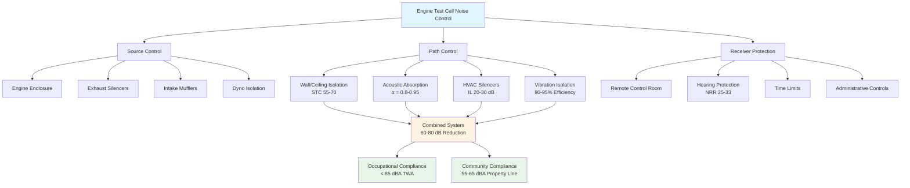

Engine test cells generate extreme noise levels that pose challenges for worker safety, equipment operation, and community relations. Proper acoustic design integrates sound isolation, absorption, and HVAC system noise control to create safe, compliant testing environments.

## Sound Sources in Engine Test Environments

Engine test cells contain multiple high-intensity noise sources operating simultaneously.

### Primary Noise Sources

**Engine Mechanical Noise:**
- Piston slap and connecting rod impacts: 95-105 dBA
- Valve train clatter: 85-95 dBA
- Gear mesh noise: 90-100 dBA
- Turbocharger whine: 100-110 dBA

**Exhaust System Noise:**
- Raw exhaust discharge: 120-140 dBA
- Exhaust pulsations at firing frequency
- Resonances in exhaust piping
- Aftertreatment system regeneration

**Intake Air Noise:**
- Air cleaner inlet turbulence: 80-95 dBA
- Turbocharger compressor surge
- Throttle body flow noise
- Intake manifold resonances

**Dynamometer Noise:**
- Water brake cavitation: 95-110 dBA
- Eddy current cooling fans: 85-100 dBA
- Coupling vibration transmission
- Bearing noise at high speeds

**HVAC System Contributions:**
- Supply air diffuser discharge: 60-75 dBA
- Return air grille turbulence: 55-70 dBA
- Duct breakout radiation: 50-65 dBA
- Fan noise transmitted through ductwork

## Noise Control Requirements and Regulations

### OSHA Occupational Exposure Limits

OSHA 29 CFR 1910.95 establishes permissible exposure limits:

- 90 dBA for 8-hour time-weighted average (TWA)
- 5 dB exchange rate for duration halving
- 115 dBA maximum impulse noise limit
- Hearing conservation program required at 85 dBA TWA

**Permissible Exposure Duration:**

$$T = \frac{8}{{2^{(L-90)/5}}}$$

where $T$ = permissible hours and $L$ = sound level (dBA).

### Community Noise Ordinances

Most jurisdictions limit property line noise:

- Daytime (7 AM - 10 PM): 55-65 dBA
- Nighttime (10 PM - 7 AM): 45-55 dBA
- Industrial zones: 70-80 dBA maximum

**Distance Attenuation:**

$$L_2 = L_1 - 20\log_{10}\left(\frac{r_2}{r_1}\right)$$

where $L_1$ and $L_2$ are sound levels at distances $r_1$ and $r_2$.

### Industry Standards

- ANSI/ASA S12.19: Measurement of occupational noise exposure
- ISO 362: Vehicle pass-by noise measurement
- SAE J1074: Engine sound level measurement procedure

## Acoustic Design Principles for Test Cells

### Sound Isolation Construction

**Wall and Ceiling Assemblies:**
- Target Sound Transmission Class (STC): 55-70
- Double-wall construction with air gap: 8-16 inches
- Mass-loaded vinyl barriers: 1-2 lb/ft²
- Decoupled stud framing to prevent flanking

**Sound Transmission Loss:**

$$TL = 20\log_{10}(f \cdot m) - 47$$

where $f$ = frequency (Hz) and $m$ = surface density (lb/ft²).

### Acoustic Absorption Treatment

Interior surfaces require high-absorption coefficients across broad frequency ranges.

**Absorption Coefficient Targets:**
- 125 Hz (low frequency): α ≥ 0.40
- 500 Hz (mid frequency): α ≥ 0.80
- 2000 Hz (high frequency): α ≥ 0.95

**Reverberation Time Control:**

$$T_{60} = \frac{0.049V}{A}$$

where $V$ = room volume (ft³) and $A$ = total absorption (sabins).

Target reverberation time: 0.5-1.0 seconds for test cells.

### Specialized Acoustic Enclosures

**Anechoic Chambers:**
- Wedge absorbers 24-48 inches deep
- Free-field conditions above 80 Hz
- Used for precision sound quality testing

**Semi-Anechoic Cells:**
- Reflective floor, absorptive walls/ceiling
- Simulates vehicle over road surface
- Lower construction cost than full anechoic

## HVAC System Noise Contributions

HVAC systems must provide massive airflow without degrading acoustic performance.

### Airflow Velocity Limits

To maintain NC-45 to NC-55 criteria:

| Location | Max Velocity | Expected NC Level |
|----------|--------------|-------------------|
| Main supply duct | 2500-3000 fpm | NC-50 |
| Branch ducts | 1500-2000 fpm | NC-45 |
| Diffusers | 400-600 fpm | NC-40 |
| Return grilles | 600-800 fpm | NC-45 |

### Duct Silencer Application

**Insertion Loss Requirements:**
- 63 Hz octave band: 10-15 dB
- 125 Hz octave band: 15-20 dB
- 250-2000 Hz: 20-30 dB
- 4000-8000 Hz: 15-25 dB

**Silencer Pressure Drop:**

$$\Delta P = \frac{\rho V^2}{2} \cdot K_L$$

where $\rho$ = air density, $V$ = velocity, and $K_L$ = loss coefficient (0.5-2.0 for silencers).

### Vibration Isolation

All HVAC equipment requires isolation:
- Fan vibration isolators: 90-95% efficiency
- Flexible duct connectors: 12-24 inches minimum
- Spring hangers for ducts penetrating test cell
- Neoprene gaskets at wall/ceiling penetrations

## Worker Hearing Protection Considerations

### Exposure Assessment

Continuous monitoring required due to variable test conditions:
- Personal dosimeters for technicians
- Area monitoring during full-load testing
- Frequency analysis for hearing protection selection

### Hearing Protection Devices (HPD)

**Noise Reduction Rating (NRR) Derating:**

$$Actual\ Attenuation = \frac{NRR - 7}{2}$$

**Required Protection:**
- Foam earplugs: NRR 29-33 (15-20 dB actual)
- Earmuffs: NRR 22-31 (12-18 dB actual)
- Dual protection: Combined 25-30 dB reduction

### Administrative Controls

- Limit time in cell during operation: 2-4 hours maximum
- Remote observation rooms: STC-60 windows
- Intercom systems with noise-canceling microphones
- Warning lights indicating high noise periods

## Community Noise Impact Mitigation

### Building Orientation

- Position test cells away from property lines
- Locate exhaust discharge points strategically
- Use building mass as barrier for adjacent areas

### Outdoor Silencing Systems

**Exhaust Stack Silencers:**
- Reactive chambers: 20-30 dB insertion loss
- Absorptive baffle sections: 15-25 dB
- Combined systems: 30-40 dB total reduction

### Operational Restrictions

- Limit full-load testing to daytime hours
- Coordinate high-noise activities
- Maintain log of complaints and response actions

## Noise Level Reference Table

| Engine Type | Peak Sound Level | Dominant Frequency | Required Attenuation |
|-------------|------------------|-------------------|----------------------|
| Small gasoline (< 2L) | 100-110 dBA | 500-2000 Hz | 40-50 dB |
| Large gasoline (> 4L) | 105-115 dBA | 125-1000 Hz | 45-55 dB |
| Light-duty diesel | 105-120 dBA | 250-1000 Hz | 50-60 dB |
| Medium-duty diesel | 110-125 dBA | 125-500 Hz | 55-65 dB |
| Heavy-duty diesel | 115-130 dBA | 63-500 Hz | 60-70 dB |
| Turbocharged diesel | 120-135 dBA | 500-4000 Hz | 65-75 dB |
| Racing engine | 125-140 dBA | 1000-8000 Hz | 70-80 dB |

## Noise Control Strategy Integration

## Design Integration Considerations

Acoustic performance depends on comprehensive system integration. Wall and ceiling construction establishes baseline isolation, requiring STC-55 minimum for light-duty applications and STC-70 for heavy-duty diesel testing. Interior absorption treatments reduce reverberant buildup, targeting reverberation times below 1.0 seconds.

HVAC systems present particular challenges due to required airflow rates of 50-150 air changes per hour. Duct silencers must provide adequate insertion loss without excessive pressure drop penalties. Locating air handling equipment outside test cells prevents equipment noise contamination of measurements.

Vibration isolation prevents structure-borne transmission through building elements. Engine foundations, dynamometer mounting, and HVAC equipment all require analysis of natural frequencies and isolation efficiency to prevent resonance amplification.

Worker protection combines engineering controls (isolation, absorption), administrative controls (time limits, rotation), and personal protective equipment (dual hearing protection). Regular audiometric testing verifies program effectiveness and identifies exposure deficiencies requiring corrective action.
