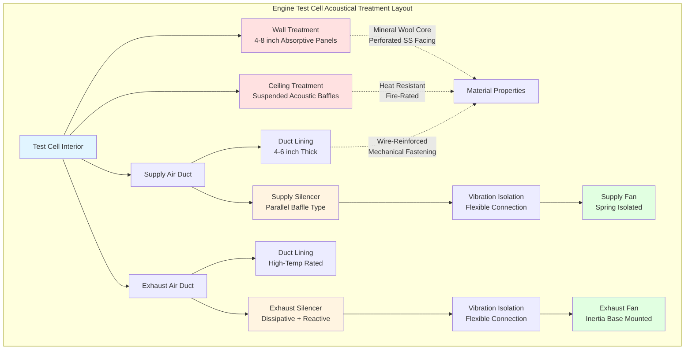

Engine test cells generate extreme sound pressure levels exceeding 120 dBA during full-power testing. Proper acoustical treatment protects both test equipment precision and personnel safety while maintaining the controlled environmental conditions necessary for accurate performance measurements.

## Wall and Ceiling Absorptive Treatment

Absorptive treatment reduces reverberation within the test cell, preventing reflected sound energy from interfering with instrumentation and creating hazardous noise conditions. The effective absorption coefficient $\alpha_{eff}$ for a multi-layer system is:

$$\alpha_{eff} = 1 - \left(1 - \alpha_1\right)\left(1 - \alpha_2\right)\left(1 - \alpha_3\right)$$

where $\alpha_1$, $\alpha_2$, and $\alpha_3$ represent individual layer absorption coefficients.

Wall assemblies typically consist of perforated metal facings over fiberglass or mineral wool cores ranging from 4 to 8 inches thick. The percent open area of perforated facings directly affects absorption performance:

$$\alpha = \frac{4r}{(1+r)^2}$$

where $r$ is the acoustic resistance ratio, related to open area percentage and air gap depth.

Ceiling treatments require special consideration due to radiated heat from engines. Suspended acoustic baffles or clouds positioned 18 to 36 inches below the structural ceiling provide absorption while allowing heat stratification. This arrangement maintains acoustic performance without thermal degradation of materials.

## Duct Lining and Silencers

HVAC systems serving test cells require aggressive acoustic treatment to prevent sound transmission through supply and exhaust ductwork. Internal duct lining provides 3 to 8 dB attenuation per foot depending on frequency and duct dimensions.

The insertion loss $IL$ for lined rectangular ducts is:

$$IL = 1.05 \cdot P \cdot \alpha \cdot \frac{L}{A} \text{ (dB)}$$

where $P$ is the perimeter (ft), $\alpha$ is the lining absorption coefficient, $L$ is the lined length (ft), and $A$ is the cross-sectional area (ft²).

Dissipative silencers installed in supply and exhaust mains provide 15 to 40 dB insertion loss across critical frequency ranges. Parallel baffle silencers with 4 to 6-inch airway passages balance acoustic performance with acceptable pressure drop, typically 0.5 to 1.5 inches w.g. at design airflow.

Reactive silencers using expansion chambers and resonators address low-frequency noise components below 250 Hz where absorptive treatments lose effectiveness. The transmission loss $TL$ for an expansion chamber is:

$$TL = 10 \log_{10}\left[1 + \frac{1}{4}\left(\frac{S_2}{S_1} - \frac{S_1}{S_2}\right)^2 \sin^2(kL)\right]$$

where $S_1$ and $S_2$ are inlet and chamber cross-sections, $k$ is the wave number, and $L$ is chamber length.

## Vibration Isolation for HVAC Equipment

All HVAC equipment serving test cells requires vibration isolation to prevent structure-borne noise transmission. Supply and exhaust fans mounted on inertia bases with spring or elastomeric isolators achieve 90 to 95 percent isolation efficiency.

The required isolation efficiency $\eta$ is:

$$\eta = 1 - \left(\frac{f_n}{f_d}\right)^2$$

where $f_n$ is the natural frequency of the isolated system and $f_d$ is the disturbing frequency. Isolation systems must maintain $f_d/f_n > 3$ for adequate performance.

Flexible duct connections at all equipment interfaces prevent short-circuiting of vibration isolation. Connections should provide 1.5 to 2 times the expected deflection range and maintain airtight seals under dynamic loading.

## Material Selection for High-Temperature Environments

Test cells experience elevated temperatures from engine heat rejection and exhaust gases. Acoustic materials must maintain performance and structural integrity under these conditions.

Mineral wool insulation rated for continuous exposure to 1200°F serves high-temperature zones near exhaust systems. Glass fiber materials handle moderate temperatures up to 450°F for general cell treatment. Metal facings must be stainless steel or aluminum to resist thermal cycling and corrosion from combustion byproducts.

Temperature-induced changes in absorption coefficient follow:

$$\alpha_T = \alpha_0 \left(1 + \beta \Delta T\right)$$

where $\alpha_0$ is the baseline coefficient, $\beta$ is the temperature coefficient (typically -0.002 to -0.005 per °F), and $\Delta T$ is temperature rise above reference conditions.

## Fire-Rated Acoustic Materials

Test cells require fire-resistant construction due to fuel presence and high-temperature operation. All acoustic materials must meet ASTM E84 Class A ratings with flame spread index less than 25 and smoke developed index less than 50.

Noncombustible mineral wool core materials inherently satisfy fire requirements. Metal facings provide additional fire resistance while maintaining acoustic transparency through perforations. Adhesives and mechanical fasteners must also carry appropriate fire ratings.

Fire-rated duct lining systems use wire-reinforced mineral wool secured with mechanical fasteners rather than adhesives. This construction withstands thermal shock from fire exposure without releasing materials into airstreams.

## Maintenance and Replacement Considerations

Acoustic treatment in test cells degrades from thermal cycling, vibration exposure, and contamination from engine emissions. Inspection intervals of 6 to 12 months identify material deterioration before performance suffers.

Common failure modes include:

- **Facing perforation clogging** from oil mist and particulate accumulation reducing absorption
- **Insulation compression** from repeated thermal expansion cycles decreasing effective thickness
- **Fastener corrosion** leading to material sagging or detachment
- **Duct lining erosion** at high velocities exposing bare metal surfaces

Modular panel construction facilitates replacement of damaged sections without complete system renovation. Access panels positioned strategically allow inspection and maintenance of concealed ductwork treatment.

Material replacement schedules depend on operating intensity, with high-utilization facilities requiring renewal every 3 to 5 years while moderate-use cells may extend service to 7 to 10 years.

## Acoustic Material Properties

| Material Type | NRC | Temperature Limit (°F) | Density (lb/ft³) | Fire Rating | Typical Application |
|---------------|-----|------------------------|------------------|-------------|---------------------|
| Mineral Wool Board | 0.85-0.95 | 1200 | 4-8 | Class A | Wall/ceiling panels, high-temp zones |
| Glass Fiber Board | 0.80-0.90 | 450 | 3-6 | Class A | Wall/ceiling panels, moderate zones |
| Perforated Metal (15% open) | 0.65-0.75 | 2000+ | N/A | Noncombustible | Facing material |
| Wire-Reinforced Mineral Wool | 0.75-0.85 | 1200 | 6-10 | Class A | Duct lining |
| Acoustic Foam (Melamine) | 0.90-1.00 | 300 | 0.7-1.2 | Class A | Low-temp applications only |
| Fiberglass Duct Liner | 0.70-0.80 | 450 | 1.5-3 | Class A | Standard ductwork |
| Ceramic Fiber Blanket | 0.60-0.70 | 2300 | 4-8 | Noncombustible | Extreme high-temp exhaust |

**Note:** NRC (Noise Reduction Coefficient) is the arithmetic average of absorption coefficients at 250, 500, 1000, and 2000 Hz.

The combination of properly designed absorptive treatment, effective duct silencers, and comprehensive vibration isolation creates test cell environments meeting both acoustic performance requirements and operational durability demands. Material selection emphasizing fire resistance and temperature tolerance ensures long-term reliability in these severe service conditions.
