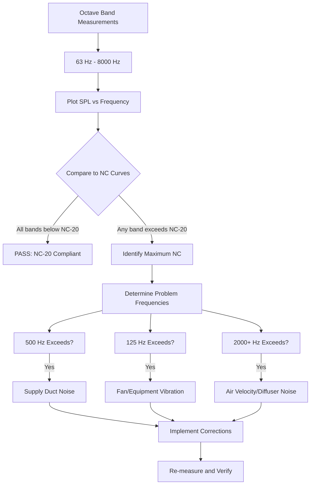

## Noise Criteria Standards

Engine test facilities require stringent background noise control to enable accurate measurement of engine acoustic performance. HVAC systems must meet specific Noise Criteria (NC) ratings to prevent interference with precision testing equipment and ensure measurement validity.

### NC Rating Framework

The NC rating system evaluates HVAC-generated noise across octave bands from 63 Hz to 8000 Hz. The rating corresponds to the highest octave band curve that the measured sound pressure level touches or exceeds.

The relationship between NC rating and octave band sound pressure level follows:

$$SPL_{NC} = NC + K_f$$

where $K_f$ is the frequency-dependent coefficient from standardized NC curves, and $SPL_{NC}$ represents the maximum allowable sound pressure level at each octave band center frequency.

For calculating composite NC ratings:

$$NC_{composite} = 10 \log_{10} \left( \sum_{i=1}^{n} 10^{NC_i/10} \right)$$

where $NC_i$ represents individual octave band NC contributions.

## Target NC Ratings by Area

Different zones within engine test facilities require specific acoustic environments:

| Area Type | Target NC Rating | Maximum NC | Critical Frequencies |
|-----------|-----------------|------------|---------------------|
| Precision Test Cells | NC-15 | NC-20 | 125-500 Hz |
| Standard Test Cells | NC-20 | NC-25 | 125-1000 Hz |
| Control Rooms | NC-25 | NC-30 | 250-2000 Hz |
| Data Acquisition Rooms | NC-20 | NC-25 | 125-1000 Hz |
| Instrumentation Calibration | NC-15 | NC-18 | 63-4000 Hz |
| Observation Areas | NC-30 | NC-35 | 500-2000 Hz |
| Mechanical Equipment Rooms | NC-50 | NC-55 | All bands |

### Control Room Requirements

Control rooms demand NC-25 or better to support:

- Clear verbal communication during testing
- Accurate monitoring of audio feedback systems
- Minimal operator fatigue during extended test sessions
- Reliable data interpretation without acoustic interference

The target spectrum ensures:

$$SPL_{500Hz} \leq NC + 5 \text{ dB}$$
$$SPL_{1000Hz} \leq NC + 2 \text{ dB}$$

These relationships prioritize speech frequency clarity.

## Octave Band Analysis Requirements

Comprehensive acoustic verification requires octave band measurements at center frequencies: 63, 125, 250, 500, 1000, 2000, 4000, and 8000 Hz.

### Measurement Protocol

**Spatial Sampling:**
- Minimum 5 measurement positions per test cell
- Grid spacing not exceeding 3 meters
- Heights at 1.2 m (seated) and 1.5 m (standing)
- Exclude positions within 1 m of reflective surfaces

**Temporal Sampling:**
- Minimum 30-second integration time per position
- Fast time-weighting (125 ms) for equipment identification
- Slow time-weighting (1 s) for NC compliance verification

**Background Conditions:**
- All test equipment shutdown
- HVAC systems at normal operating flow
- External doors closed and sealed
- No personnel in test cell during measurement

### Analysis Methodology

The octave band sound pressure level calculation:

$$SPL_{octave} = 10 \log_{10} \left( \frac{1}{T} \int_0^T \left(\frac{p(t)}{p_{ref}}\right)^2 dt \right)$$

where $p_{ref} = 20 \times 10^{-6}$ Pa, and $T$ is the integration period.

## HVAC Equipment Noise Specifications

### Supply Air Systems

**Air Handling Units:**
- Casing radiated noise: 10 dB below target NC at discharge
- Fan sound power level: $LW \leq 85$ dBA for NC-20 spaces
- Plenum attenuation factor: minimum 15 dB at 500 Hz

**Ductwork Specifications:**
- Lined duct sections minimum 6 m length upstream of terminal devices
- 50 mm fiberglass lining, 48 kg/m³ density
- Maximum air velocity: 4 m/s in final 10 m before test cell
- Acoustic lining insertion loss:

$$IL_{duct} = \alpha L_{eff} P/A$$

where $\alpha$ is the absorption coefficient, $L_{eff}$ is effective length, $P$ is perimeter, and $A$ is cross-sectional area.

**Terminal Devices:**
- Diffusers rated for NC-20 at 150% of operating airflow
- Dampers positioned minimum 3 m upstream of diffusers
- No volume dampers in last 5 m of ductwork

### Exhaust Systems

Maximum sound power levels at test cell exhaust grilles:

$$LW_{grille} \leq NC_{target} + 10 \log_{10}(A) - 10$$

where $A$ is test cell floor area in square meters.

## Background Noise Requirements for Testing

Engine acoustic testing requires background noise at least 10 dB below the minimum expected engine noise levels:

$$\Delta L_{min} = L_{engine,min} - L_{background} \geq 10 \text{ dB}$$

For precision measurements:
- Low-frequency testing (< 250 Hz): 15 dB separation
- Mid-frequency testing (250-2000 Hz): 10 dB separation
- High-frequency testing (> 2000 Hz): 8 dB separation

## Measurement and Verification Methods

### Instrumentation Requirements

**Sound Level Meters:**
- Type 1 precision per IEC 61672-1
- Frequency range: 20 Hz to 20 kHz (±1 dB)
- Dynamic range: minimum 80 dB
- Calibration within 12 months

**Microphones:**
- Free-field response, 12.7 mm diameter
- Sensitivity: 50 mV/Pa typical
- Field calibration before and after measurements using Class 1 acoustic calibrator (1000 Hz, 94 dB or 114 dB)

### Verification Protocol

1. **Pre-commissioning baseline:** Measure with construction complete, HVAC inactive
2. **HVAC contribution:** Measure with systems at design flow, no engine operation
3. **Octave band compliance:** Verify all bands meet target NC
4. **Spatial uniformity:** Confirm ±3 dB variation across measurement positions
5. **Temporal stability:** Verify ±2 dB variation over 24-hour period

## Compliance Documentation

Required deliverables include:

**Measurement Reports:**
- Facility layout with measurement grid
- Octave band data tables for each position
- NC curve overlay plots
- Equipment operating conditions during testing
- Ambient temperature and humidity

**Acoustic Certification:**
- Statement of compliance with target NC ratings
- Identification of any non-conforming areas
- Corrective action plans for deficiencies
- Professional engineer seal and signature

**As-built Verification:**
- Confirmation of installed duct lining
- Diffuser model and NC ratings
- Silencer specifications and locations
- Vibration isolation details

Proper documentation ensures the test facility meets contractual acoustic requirements and provides baseline data for future comparisons if acoustic performance degrades.

