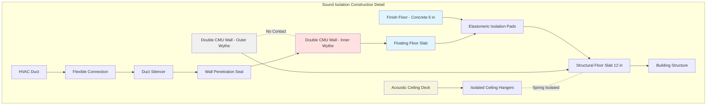

Engine test cells generate extreme sound pressure levels (110-130 dBA) requiring comprehensive acoustic isolation to protect adjacent spaces and meet regulatory noise limits. Effective sound isolation combines high-transmission-loss barriers, decoupled construction, and meticulous attention to flanking paths.

## Wall and Partition STC Requirements

Sound Transmission Class (STC) ratings quantify the sound-blocking performance of partitions. Engine test cell walls typically require STC 60-70 depending on adjacent space requirements and source noise levels.

The sound transmission loss at a specific frequency follows:

$$TL = 20 \log_{10}(m \cdot f) - 47$$

where $m$ is surface mass (kg/m²) and $f$ is frequency (Hz). This mass law relationship demonstrates that doubling wall mass increases transmission loss by approximately 6 dB.

For multi-layer constructions with an air gap, the theoretical transmission loss becomes:

$$TL_{total} = TL_1 + TL_2 + 20 \log_{10}(d \cdot f) - 29$$

where $TL_1$ and $TL_2$ are individual layer transmission losses and $d$ is cavity depth (m).

### Construction Performance Table

| Construction Type | STC Rating | Typical Application |
|------------------|------------|-------------------|
| 8" CMU, painted | 48 | Low-power test cells |
| 12" CMU, filled cores | 55 | Medium-power cells |
| Double 8" CMU, 4" air gap | 65 | High-power engine cells |
| Double 6" CMU + resilient isolation | 70 | Extreme noise sources |
| 8" concrete + 6" CMU, 6" gap | 72 | Maximum isolation |
| Triple-leaf construction | 75+ | Research facilities |

Critical construction details:
- **Mass**: Minimum 150 lb/ft² (732 kg/m²) surface mass for primary barrier
- **Decoupling**: Separate structural frames for each wythe in double-wall systems
- **Cavity absorption**: 3-6" mineral fiber batts in air gaps to control resonance
- **Seal integrity**: Acoustical caulk at all penetrations and joints

## Duct Penetration Acoustic Sealing

HVAC ductwork creates the most significant flanking path if not properly isolated. Sound breaks through three mechanisms: duct wall breakout, duct-borne transmission, and penetration leakage.

### Penetration Treatment Strategy

1. **Duct wall thickness**: Minimum 16 gauge (1.5 mm) steel for first 10 ft from cell
2. **Wrap isolation**: 2" minimum density mass-loaded vinyl (2 lb/ft²) wrapped around duct
3. **Penetration sleeve**: Steel sleeve 6" larger than duct, filled with acoustical sealant
4. **Flexible connections**: Neoprene or fiber-glass fabric connections both sides of wall
5. **Internal silencers**: Dissipative or reactive silencers within 5 ft of penetration

The insertion loss required for duct silencers:

$$IL_{required} = NR_{wall} - TL_{duct} + 10 \log_{10}(S_{duct}/S_{wall})$$

where $NR_{wall}$ is wall noise reduction, $TL_{duct}$ is duct transmission loss, and $S$ represents surface areas.

## Door and Window Sound Isolation

Access doors represent weak points in the acoustic barrier. Sound-rated door assemblies must match or exceed wall STC ratings.

**Door construction requirements:**
- **Core**: Solid core with internal damping (honeycomb + lead sheet)
- **Seals**: Continuous perimeter compression seals (bulb or magnetic)
- **Threshold**: Automatic drop seal or spring-loaded sweep
- **Hardware**: Substantial latching with 8+ engagement points
- **Mass**: Minimum 8 lb/ft² (39 kg/m²) surface density

Double-door sound locks provide superior isolation:
- Two STC-50 doors separated by 4-6 ft vestibule achieve effective STC 65-70
- Vestibule walls match test cell construction
- Interlock prevents simultaneous door opening during testing
- Interior surfaces treated with 2" acoustical absorption

**Observation windows** require:
- Laminated glass construction: two 1/2" tempered panes + 0.060" PVB interlayer
- Different pane thicknesses (e.g., 1/2" + 3/8") to avoid resonance
- Minimum 4" air space between panes
- Resilient mounting in frame with acoustical caulk
- Achievable STC 48-52 for double-pane, up to STC 60 for triple-pane

## Floating Floor Design Concepts

Structure-borne vibration transmission requires mass-spring isolation systems to prevent coupling between test cell and building structure.

### Floating Floor Design Parameters

The natural frequency of the isolated floor system:

$$f_n = \frac{1}{2\pi}\sqrt{\frac{k}{m}}$$

where $k$ is spring stiffness (N/m) and $m$ is supported mass (kg). Target natural frequency: 8-12 Hz for engine test cells.

Isolation efficiency at operating frequencies:

$$Efficiency = 1 - \left(\frac{f_n}{f}\right)^2$$

where $f$ is the disturbing frequency. A 10 Hz natural frequency provides 96% isolation efficiency at 50 Hz.

**Construction layers (bottom to top):**
1. Structural building slab (reference level)
2. Elastomeric pads (density 0.10-0.15 in deflection at load)
3. Floating reinforced concrete slab (12-18" thick, 150-225 lb/ft²)
4. Resilient underlayment (1/4" cork or rubber)
5. Finish floor (epoxy coating or steel plate)

**Critical details:**
- Complete perimeter isolation gap (1-2" minimum)
- No rigid connections between floating and structural slabs
- Resilient closure strips at gap filled with acoustical caulk
- Isolated drains and utility penetrations

## Structure-Borne Sound Prevention

Beyond floor isolation, all structural connections require decoupling:

**Wall-to-structure connections:**
- Resilient clips or channels supporting double-wall inner wythe
- Neoprene bearing pads under wall bases
- No direct ties between wythes except resilient connectors at 6 ft o.c.

**Ceiling isolation:**
- Spring hangers (1.5-2" deflection) supporting acoustic ceiling
- Isolated from test cell walls with 1" perimeter gap
- Internal bracing independent of ceiling system

**Equipment mounting:**
- Inertia bases on isolation mounts (separate from floor system)
- Flexible connections for all utilities
- No rigid piping within 20 ft of isolated structures

## Adjacent Space Noise Requirements

Target noise levels in spaces surrounding engine test cells depend on occupancy and function:

| Adjacent Space Type | Design Level (NC) | Design Level (dBA) |
|--------------------|-------------------|-------------------|
| Offices | NC 35-40 | 40-45 |
| Control rooms | NC 30-35 | 35-40 |
| Laboratories | NC 40-45 | 45-50 |
| Corridors | NC 45-50 | 50-55 |
| Mechanical rooms | NC 50-55 | 55-60 |
| Exterior property line | -- | 55-65 (daytime) |

The required wall noise reduction:

$$NR = SPL_{source} - SPL_{receiver} + 10 \log_{10}(S/A)$$

where $SPL_{source}$ is test cell sound pressure level, $SPL_{receiver}$ is acceptable receiver level, $S$ is wall area (m²), and $A$ is receiver room absorption (m² sabins).

For a test cell at 120 dBA with adjacent office requiring 40 dBA:
- Required NR = 120 - 40 + 10 log(S/A) ≈ 80 + adjustment factor
- Typical adjustment: +5 to +15 dB depending on geometry
- Design target: STC 65-70 minimum

Verification through acoustic testing confirms isolation performance before commissioning high-power engine operations.
