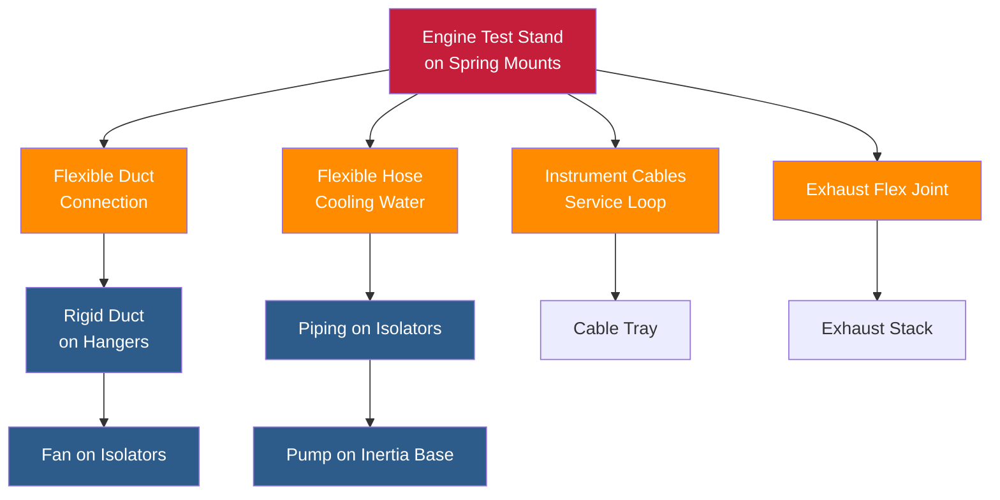

Vibration isolation in engine test facilities prevents test-generated vibrations from compromising measurement accuracy and structural integrity while protecting sensitive instrumentation. Engine testing produces severe cyclic forces from combustion events, rotating imbalance, and dynamometer operation that require sophisticated isolation to maintain measurement precision and protect adjacent areas.

## Vibration Sources in Engine Testing

Engine test facilities generate multiple vibration sources that operate simultaneously across a broad frequency spectrum. Understanding these sources drives isolation system design.

### Primary Vibration Generators

**Combustion forces** produce the dominant excitation in fired engine tests. Cylinder firing events generate impulsive forces at frequencies determined by engine speed and configuration:

$$f_{firing} = \frac{N \times RPM}{60 \times 2}$$

Where:
- $f_{firing}$ = firing frequency (Hz)
- $N$ = number of cylinders
- $RPM$ = engine speed (revolutions per minute)
- Division by 2 accounts for four-stroke cycle

A 6-cylinder engine at 3000 RPM produces firing pulses at 150 Hz, with harmonics extending to 600 Hz and beyond.

**Rotating imbalance** from crankshafts, flywheels, and dynamometer rotors generates sinusoidal forces at rotational frequency. Even precision-balanced components produce residual imbalance creating forces proportional to the square of rotational speed:

$$F_{imbalance} = m \times e \times \omega^2$$

Where:
- $F_{imbalance}$ = unbalanced force (N)
- $m$ = unbalanced mass (kg)
- $e$ = eccentricity (m)
- $\omega$ = angular velocity (rad/s)

**Dynamometer operation** introduces additional vibration from electromagnetic forces in eddy current units, hydraulic pulsations in water brakes, and gear meshing in mechanical absorbers. AC dynamometers generate twice-line-frequency torque ripple (100 Hz or 120 Hz) superimposed on test frequency components.

### Secondary Sources

HVAC equipment serving test cells contributes background vibration that can interfere with measurements. Ventilation fans, cooling pumps, and compressors operating at 900-3600 RPM produce vibration in the 15-60 Hz range that requires isolation from test cell structures.

## Effects on Measurement Accuracy

Vibration contamination degrades measurement precision through multiple mechanisms that affect both steady-state and transient test data.

### Measurement Interference

**Torque measurement** systems using strain gauge load cells detect vibration as spurious signals overlaying true torque. Floor vibration transmitting through dynamometer mounts appears as oscillating torque, particularly problematic during low-load tests where signal-to-noise ratios decrease.

**Emissions sampling** requires stable probe positioning within exhaust streams. Vibration causes probe motion relative to flow patterns, producing fluctuating sample concentrations that increase measurement uncertainty. Regulations specify maximum probe displacement to ensure representative sampling.

**Pressure transducers** measuring cylinder pressure, intake manifold pressure, and exhaust backpressure exhibit acceleration sensitivity. Mounting transducers on vibrating surfaces induces piezoelectric or strain-based signals indistinguishable from pressure variations.

**Flow measurement** accuracy deteriorates when vibration causes turbine meters to over-register, vortex shedding patterns to become irregular, or Coriolis meters to generate false phase shifts. Manufacturer specifications typically limit installation vibration to 0.5 g RMS.

### Frequency-Dependent Sensitivity

Measurement systems exhibit maximum sensitivity when vibration frequencies coincide with sensor resonances, typically 100-1000 Hz for industrial transducers. Isolation systems must provide 20-30 dB attenuation at these critical frequencies to maintain specified accuracy.

## Isolation System Design Principles

Engine test cell isolation requires a multi-level approach addressing different frequency ranges and protecting both measurement accuracy and structural integrity.

### Test Stand Isolation

The primary isolation level supports the engine-dynamometer assembly on resilient mounts that decouple test stand mass from floor structure. Design objectives include:

**Natural frequency selection** places system resonance well below operating frequencies. For engines operating 1000-6000 RPM (17-100 Hz), natural frequency should remain below 5 Hz:

$$f_n = \frac{1}{2\pi} \sqrt{\frac{k}{m}} < 5 \text{ Hz}$$

This requires static deflection exceeding 10 mm:

$$\delta = \frac{g}{(2\pi f_n)^2} = \frac{9.81}{(2\pi \times 5)^2} \approx 10 \text{ mm}$$

**Inertia base design** provides rigid mounting for engine and dynamometer while concentrating mass at the isolation plane. Reinforced concrete bases 300-600 mm thick ensure the engine-base assembly acts as a rigid body below 50 Hz, preventing internal flexural modes that compromise isolation.

### Multi-Stage Isolation

Combining isolation elements targets different frequency ranges:

- **Primary stage**: Steel springs (25-50 mm deflection) isolate 10-100 Hz from firing frequency and imbalance
- **Secondary stage**: Elastomeric pads beneath inertia base attenuate 100-500 Hz from mechanical impacts
- **Tertiary isolation**: Individual sensor mounting on damped masses reduces 200-2000 Hz structure-borne noise

### Foundation Design

Test cell foundations require isolation from building structure to prevent vibration transmission to adjacent spaces. Approaches include:

**Separated slabs**: Test cell floor constructed on independent foundations separated from building slab by 50-100 mm isolation joints filled with resilient material. This architectural separation prevents low-frequency transmission through continuous concrete paths.

**Floating floors**: Entire test cell floor supported on springs or air mounts creates mass-spring system with natural frequency 3-8 Hz. Total floor mass 50,000-200,000 kg provides sufficient inertia to remain stable under test loads while achieving isolation ratios exceeding 10:1 above 15 Hz.

## Natural Frequency Considerations

Proper natural frequency selection balances isolation efficiency against system stability and maintains adequate separation from excitation frequencies.

### Frequency Ratio Requirements

Transmissibility theory shows isolation begins when disturbing frequency exceeds $\sqrt{2}$ times natural frequency (frequency ratio > 1.414). Practical isolation requires higher ratios:

| Frequency Ratio | Transmissibility | Isolation Efficiency |
|-----------------|------------------|---------------------|
| 1.5 | 0.92 | 8% |
| 2.0 | 0.50 | 50% |
| 3.0 | 0.14 | 86% |
| 4.0 | 0.07 | 93% |
| 5.0 | 0.04 | 96% |
| 10.0 | 0.01 | 99% |

Engine test facilities targeting 90% isolation efficiency require frequency ratios exceeding 3.0, placing natural frequency at one-third the lowest operating speed or below.

### Multi-DOF Analysis

Test stand isolation functions as six-degree-of-freedom system with distinct natural frequencies for vertical, horizontal, and rotational modes. Complete analysis requires:

$$\omega_{vertical} = \sqrt{\frac{k_v}{m}}$$

$$\omega_{rocking} = \sqrt{\frac{k_v \times d^2 + k_h \times h^2}{I}}$$

Where:
- $k_v$, $k_h$ = vertical and horizontal stiffness (N/m)
- $d$ = isolator spacing
- $h$ = center of gravity height
- $I$ = mass moment of inertia (kg⋅m²)

Proper isolator placement ensures all natural frequencies remain below one-third the minimum excitation frequency.

## Transmissibility Requirements

Test facility vibration criteria specify maximum allowable vibration levels in adjacent spaces and at measurement locations.

### Test Cell Criteria

| Location | Velocity (mm/s RMS) | Displacement (μm) | Frequency Range |
|----------|---------------------|-------------------|-----------------|
| Test stand (on base) | 5.0-10.0 | 50-100 | 10-1000 Hz |
| Cell floor | 0.5-1.0 | 5-10 | 10-1000 Hz |
| Adjacent office | 0.15-0.30 | 2-5 | 8-100 Hz |
| Precision lab | 0.05-0.10 | 0.5-1.0 | 5-500 Hz |

### Calculation Methodology

Required transmissibility determined from source vibration and allowable receiver vibration:

$$T_{required} = \frac{V_{allowable}}{V_{source}}$$

For test stand generating 8.0 mm/s and adjacent office limit 0.2 mm/s:

$$T_{required} = \frac{0.2}{8.0} = 0.025 \text{ (97.5% isolation)}$$

Achieving this transmissibility requires frequency ratio:

$$\frac{f}{f_n} = \sqrt{\frac{1}{T} + 1} = \sqrt{\frac{1}{0.025} + 1} \approx 6.4$$

## Integration with HVAC Systems

HVAC systems serving test cells require careful integration to avoid creating vibration transmission paths that bypass test stand isolation.

### Flexible Connections

All services connecting to isolated test stands require flexible elements that accommodate motion without transmitting vibration:

**Ductwork connections** use fabric expansion joints (300-600 mm length) with minimum 25 mm amplitude capability. Canvas or neoprene-coated fiberglass construction provides flexibility while maintaining air seal. Joints must support duct weight without restricting motion.

**Piping connections** employ flexible hoses, metal bellows, or rubber expansion joints depending on pressure and temperature. Engine cooling systems operating at 90°C and 350 kPa use EPDM hoses with stainless steel braiding, minimum 500 mm length for adequate flexibility.

**Electrical services** require service loops providing 150-200 mm slack. Cable carriers protect conductors during motion while preventing tension on terminations.

### HVAC Equipment Isolation

Ventilation fans, pumps, and compressors serving test cells require isolation preventing them from contaminating measurement environment:

- Supply/exhaust fans: Spring isolators, 25 mm deflection minimum
- Cooling pumps: Inertia bases with spring mounts
- Air compressors: Separate foundation with structural gap
- Ductwork: Isolated hangers at 2-3 m spacing
- Piping: Riser isolation and flexible branch connections

### Instrumentation Protection

Measurement equipment mounted separate from test stand benefits from additional isolation:

- Data acquisition systems: Rack-mounted shock mounts
- Emissions analyzers: Bench-mounted vibration pads
- Conditioning equipment: Isolated equipment racks
- Control panels: Wall-mounted with resilient pads

Proper vibration isolation transforms engine test facilities from vibration-contaminated environments into precision measurement laboratories capable of resolving fractional horsepower changes and parts-per-million emissions variations. Multi-level isolation addressing different frequency ranges, combined with meticulous attention to eliminating rigid transmission paths, delivers the measurement accuracy demanded by modern engine development and certification testing.
