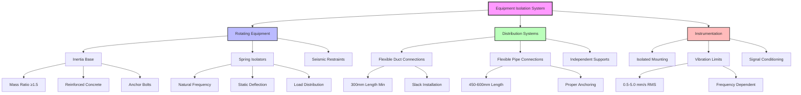

Equipment isolation in engine test facilities protects HVAC systems from engine-generated vibrations while preventing HVAC equipment from contributing to test cell vibration. Proper isolation maintains measurement accuracy, extends equipment life, and ensures reliable test data.

## HVAC Equipment Vibration Isolation

HVAC equipment serving engine test cells requires isolation from both building structure vibrations and self-generated mechanical vibrations.

### Fan and Blower Isolation

Supply and exhaust fans must be mounted on isolation systems matched to their operating characteristics:

**Natural frequency requirements:**

$$f_n = \frac{1}{2\pi}\sqrt{\frac{k}{m}}$$

where $f_n$ is natural frequency (Hz), $k$ is spring stiffness (N/m), and $m$ is supported mass (kg).

**Isolation efficiency:**

$$\eta = 1 - \frac{1}{1 + \left(\frac{f}{f_n}\right)^2}$$

where $f$ is disturbing frequency and $f_n$ is isolator natural frequency. For 95% isolation efficiency, the frequency ratio $f/f_n$ must exceed 4.5.

### Pump Isolation

Cooling water pumps, refrigerant pumps, and hydraulic pumps require rigorous isolation:

- Close-coupled pumps: neoprene pad isolators or spring mounts
- Base-mounted pumps: inertia base with spring isolators
- High-speed pumps: isolation efficiency >98% at operating speed
- Thrust loads: lateral restraints without short-circuiting isolation

## Flexible Connections for Piping and Ducts

Flexible connections prevent vibration transmission through fluid and air distribution systems while accommodating thermal expansion and equipment movement.

### Duct Flexible Connections

Canvas or elastomeric connectors installed at equipment connections:

- Length: minimum 150 mm (6 in), preferably 300 mm (12 in)
- Material: neoprene-coated fabric for HVAC applications
- Temperature rating: match duct service temperature
- Pressure rating: 125% of maximum system pressure
- Installation: slack loop to avoid tension

**Connector stiffness limitation:**

$$k_{conn} < \frac{k_{iso}}{10}$$

where $k_{conn}$ is connector stiffness and $k_{iso}$ is isolator stiffness. Connector stiffness must not degrade isolation performance.

### Pipe Flexible Connections

Stainless steel braided hoses or rubber expansion joints:

- Hose length: 450-600 mm (18-24 in) minimum
- Bend radius: >10× pipe diameter to minimize pressure drop
- Support: independent pipe supports, not suspended from equipment
- Anchors: properly located to control system forces

## Inertia Base Design for Fans and Pumps

Inertia bases provide mass and rigidity for rotating equipment, lowering system natural frequency and improving isolation effectiveness.

### Design Criteria

**Minimum mass ratio:**

$$R_m = \frac{M_{base}}{M_{equip}} \geq 1.5$$

where $M_{base}$ is base mass and $M_{equip}$ is equipment mass. Heavy-duty applications require $R_m \geq 2.0$.

**Base stiffness:**

- Minimum thickness: 150 mm (6 in) for small fans (<5 kW)
- Standard thickness: 200-300 mm (8-12 in) for most HVAC equipment
- Heavy equipment: 300-450 mm (12-18 in) for large fans and pumps

### Construction Methods

- Reinforced concrete: most common, mass-efficient
- Steel frame: fabricated for equipment access requirements
- Combined: steel frame with concrete infill for optimal mass distribution
- Anchor bolts: epoxy-grouted, sized for equipment torque and thrust

## Dynamometer Isolation Requirements

Dynamometers generate significant dynamic forces that must be isolated from the building structure and HVAC systems.

### Isolation System Design

**Dynamic force magnitude:**

$$F_d = m \cdot e \cdot \omega^2$$

where $m$ is rotating mass, $e$ is eccentricity, and $\omega$ is angular velocity (rad/s).

**Required static deflection:**

$$\delta_{st} = \frac{g}{\omega_n^2} = \frac{9.81}{(2\pi f_n)^2}$$

For isolation from 600 RPM (10 Hz) operation with frequency ratio of 5:

$$\delta_{st} = \frac{9.81}{(2\pi \cdot 2)^2} = 62 \text{ mm (2.4 in)}$$

### Installation Considerations

- Separate foundation: dynamometer on isolated foundation
- Clearances: minimum 50 mm (2 in) seismic gap around foundation
- Utilities: all connections through flexible connectors
- Alignment: precision mounting without pre-stressing isolators

## Instrumentation Isolation for Accuracy

Measurement instruments require vibration levels below manufacturer specifications to ensure data accuracy.

### Vibration Limits

| Instrument Type | Maximum Vibration | Frequency Range |
|-----------------|-------------------|-----------------|
| Precision torque transducers | 0.5 mm/s RMS | 10-1000 Hz |
| Load cells | 1.0 mm/s RMS | 10-1000 Hz |
| Pressure transducers | 2.0 mm/s RMS | 10-500 Hz |
| Flow meters (turbine) | 0.3 mm/s RMS | 10-1000 Hz |
| Temperature sensors (precision) | 5.0 mm/s RMS | 10-500 Hz |

### Mounting Methods

- Independent mounting: separate instrument supports from vibrating equipment
- Dampened brackets: elastomeric isolation for sensor mounting
- Shielded cables: prevent electrical interference from vibration-induced cable movement
- Signal conditioning: low-pass filtering to remove vibration artifacts

## Isolation Effectiveness Verification

Post-installation testing confirms isolation system performance.

### Measurement Procedures

**Transmissibility measurement:**

$$T = \frac{V_{transmitted}}{V_{source}}$$

where $V_{transmitted}$ is vibration velocity at receiver and $V_{source}$ is velocity at source.

**Insertion loss:**

$$IL = 20 \log_{10}\left(\frac{V_{before}}{V_{after}}\right) \text{ dB}$$

### Test Protocol

1. **Baseline measurement**: vibration at equipment mounting points with isolators locked or rigid
2. **Operational measurement**: vibration with isolators active under normal operation
3. **Frequency analysis**: identify resonances and verify frequency ratios
4. **Acceptance criteria**: transmissibility <0.25 (75% isolation) at operating frequencies

### Equipment Isolation Requirements

| Equipment Type | Isolator Type | Deflection | Efficiency | Inertia Base |
|----------------|---------------|------------|------------|--------------|
| Centrifugal fans (<5 kW) | Neoprene pads | 6-10 mm | >85% | Optional |
| Centrifugal fans (5-20 kW) | Springs | 25-40 mm | >90% | Recommended |
| Centrifugal fans (>20 kW) | Springs | 40-75 mm | >95% | Required |
| Vaneaxial fans | Springs | 25-50 mm | >90% | Required |
| Centrifugal pumps (<10 kW) | Neoprene/springs | 10-25 mm | >85% | Optional |
| Centrifugal pumps (>10 kW) | Springs | 25-50 mm | >90% | Required |
| Cooling towers | Springs/air | 50-100 mm | >95% | Optional |
| Chillers (reciprocating) | Springs | 50-75 mm | >95% | Required |
| Chillers (centrifugal) | Springs/pads | 25-40 mm | >90% | Recommended |

## Design Integration

Successful equipment isolation requires coordination across mechanical, structural, and instrumentation disciplines:

- **Structural**: foundation design for isolated equipment loads
- **Mechanical**: equipment selection considering isolation requirements
- **Controls**: sensor placement minimizing vibration exposure
- **Commissioning**: verification testing of isolation effectiveness

Properly designed equipment isolation systems protect HVAC equipment, maintain test measurement accuracy, and ensure long-term facility reliability in the demanding engine test environment.
