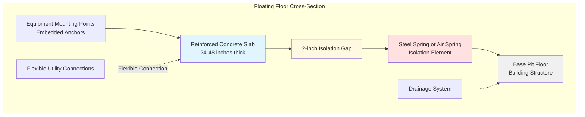

Floor isolation systems represent the foundation of vibration control in engine test facilities, preventing transmission of dynamic loads from test equipment into the building structure. Properly designed floating floor systems achieve vibration isolation frequencies below 5 Hz while supporting static and dynamic loads exceeding 100,000 lb.

## Floating Floor Design Concepts

A floating floor consists of a massive concrete slab supported on isolation elements, mechanically decoupled from the surrounding building structure. The isolated mass acts as an inertia block, reducing the amplitude of vibrations transmitted to the base structure.

The fundamental isolation principle follows:

$$T = \frac{1}{\sqrt{(\frac{f}{f_n})^2 - 1}}$$

where $T$ is transmissibility, $f$ is the forcing frequency, and $f_n$ is the natural frequency of the isolation system.

The natural frequency depends on the isolated mass and spring stiffness:

$$f_n = \frac{1}{2\pi}\sqrt{\frac{k}{m}}$$

For effective isolation at engine operating speeds (1200-6000 RPM or 20-100 Hz), the natural frequency must be below 5 Hz, requiring:

$$\frac{f}{f_n} > 4.5$$

The floating floor must maintain a minimum 2-inch isolation gap from all adjacent structures, including walls, columns, and utility penetrations. This gap accommodates dynamic deflections while preventing structure-borne vibration transmission.

## Inertia Block Requirements

The inertia block mass determines isolation system effectiveness. Mass requirements follow:

$$M_{block} = (8 \text{ to } 12) \times M_{equipment}$$

For a 50,000 lb dynamometer installation, the floating floor mass should exceed 400,000 lb minimum. Typical concrete thickness ranges from 24 to 48 inches, with reinforcement designed for both static loads and dynamic stresses.

The center of gravity of the combined equipment and floor mass must align with the geometric center of the isolation elements to prevent rocking modes. Asymmetric equipment placement requires additional concrete mass or relocating isolation springs.

Load distribution across isolation elements should remain uniform within 10 percent. Unequal loading induces tilting and reduces isolation effectiveness.

## Spring and Air Spring Isolation Systems

### Steel Spring Isolators

Steel springs provide reliable, maintenance-free isolation with deflections from 2 to 6 inches. Spring selection requires:

$$\delta = \frac{g}{(2\pi f_n)^2}$$

where $\delta$ is static deflection and $g$ is gravitational acceleration.

For $f_n = 3$ Hz, required deflection equals 4.3 inches. Spring stiffness then equals:

$$k = \frac{W}{\delta}$$

Open-coil helical springs resist corrosion and tolerate temperature variations. Multiple springs in parallel increase load capacity while maintaining the required deflection.

### Air Spring Systems

Air springs offer several advantages:

- Adjustable spring rate through pressure regulation
- Self-leveling capability compensating for mass changes
- Lower natural frequencies (1.5-2.5 Hz achievable)
- Damping through controlled air flow

Air spring systems require continuous air supply, pressure regulation, and leveling controls. Backup systems ensure isolation during power failures. Installation in sealed pits protects components from contamination.

## Pit Design for Isolation Systems

Isolation system pits must accommodate:

- Full deflection range including dynamic excursions
- Installation and maintenance access
- Drainage and moisture protection
- Utility routing without rigid connections

Pit depth equals static deflection plus dynamic deflection plus 6-inch clearance:

$$D_{pit} = \delta_{static} + \delta_{dynamic} + 6"$$

For systems with 4-inch static deflection and 2-inch dynamic range, minimum pit depth equals 12 inches.

Pit walls must isolate from the floating floor using compressible materials. Drainage systems remove water without creating rigid connections. Access panels permit spring inspection and replacement.

## Load Capacity Calculations

Total load on the isolation system includes:

- Floating floor dead load: $W_{floor} = \rho_{concrete} \times V$
- Equipment static weight: $W_{equipment}$
- Dynamic loads from thrust: $F_{dynamic}$
- Thermal expansion forces: $F_{thermal}$

Combined vertical load per isolation element:

$$P_{element} = \frac{W_{total} + F_{dynamic,max}}{N_{elements}}$$

where $N_{elements}$ represents the number of isolation points.

Safety factors of 1.5 to 2.0 apply to static capacity. Dynamic capacity must exceed static capacity by 50 percent minimum to accommodate peak dynamic loads.

## Floor Isolation System Types

| System Type | Frequency Range | Deflection | Advantages | Applications |
|-------------|----------------|------------|------------|--------------|
| Steel coil springs | 2.5-5 Hz | 2-6 inches | Maintenance-free, reliable | Medium dynamometer cells |
| Air springs | 1.5-3 Hz | 4-10 inches | Adjustable, self-leveling | Large engine test stands |
| Rubber-in-shear | 5-8 Hz | 0.5-1 inch | Low profile, economical | Light equipment |
| Combined spring-damper | 2-4 Hz | 3-5 inches | Controlled damping | High dynamic loads |
| Pneumatic leveling | 1.5-2.5 Hz | 6-12 inches | Excellent low-frequency isolation | Precision testing |

## Coordination with Building Structure

Floating floor systems require coordination with:

### Structural Design
- Foundation capacity for increased dead loads
- Floor-to-floor heights accommodating pit depth
- Column spacing supporting floor edges
- Seismic restraint systems

### Utility Routing
- Flexible connections for all utilities crossing isolation gaps
- Coolant lines with expansion loops
- Electrical conduit with flexible sections
- Exhaust ducting with flexible joints

### Construction Sequencing
- Pit excavation and base slab installation
- Isolation element installation and leveling
- Floating floor placement with construction joints
- Equipment installation after concrete curing (minimum 28 days)

Proper coordination prevents rigid connections that bypass isolation systems and compromise vibration control effectiveness. Success requires collaboration between structural engineers, HVAC designers, and test cell operators from initial design through commissioning.
