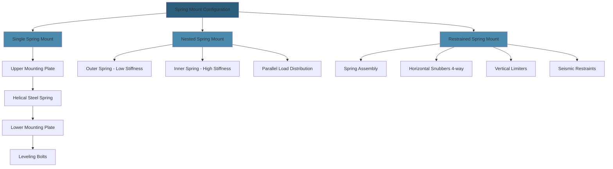

Steel spring isolators provide robust, reliable vibration isolation for heavy engine test equipment and structural foundations. The elastic behavior of coil springs delivers effective isolation across a broad frequency range while supporting substantial static loads with minimal maintenance requirements.

## Steel Spring Isolator Design

Spring isolators consist of helical steel coils engineered to deflect under load while maintaining controlled stiffness characteristics. The spring geometry—wire diameter, coil diameter, number of active coils, and free height—determines the isolator's load capacity and natural frequency.

Material selection typically specifies high-carbon spring steel (ASTM A229) for light-to-medium duty applications or chrome-silicon alloy steel (ASTM A401) for severe service conditions involving elevated temperatures or corrosive environments. Spring surfaces receive protective coatings (powder coat, zinc plating, or epoxy) to prevent corrosion in humid test cell atmospheres.

Housing assemblies incorporate upper and lower mounting plates with leveling bolts for installation adjustment. Lateral stability devices—either integral wind restraints or external snubbers—prevent excessive horizontal motion during transient events.

## Static Deflection Calculations

Static deflection under load determines the natural frequency of the isolated system. The relationship between deflection and frequency follows:

$$f_n = \frac{1}{2\pi}\sqrt{\frac{g}{\delta}}$$

where $f_n$ is natural frequency (Hz), $g$ is gravitational acceleration (386 in/s²), and $\delta$ is static deflection (inches).

For effective isolation, the natural frequency must remain well below the disturbing frequency. The isolation efficiency increases with the frequency ratio:

$$\eta = \frac{f_d^2 - f_n^2}{f_d^2} \times 100\%$$

where $f_d$ is the disturbing frequency and $f_n$ is the natural frequency.

Spring constant relates applied load to deflection:

$$k = \frac{W}{\delta}$$

where $k$ is spring constant (lb/in), $W$ is applied load (lb), and $\delta$ is deflection (in).

Standard deflections for engine test applications:

| **Application** | **Static Deflection** | **Natural Frequency** | **Isolation Efficiency at 600 RPM** |
|---|---|---|---|
| Light-duty test stands | 0.5–1.0 in | 5.0–7.0 Hz | 90–94% |
| Medium-duty dynamometer foundations | 1.0–2.0 in | 3.5–5.0 Hz | 94–96% |
| Heavy-duty engine mounts | 2.0–3.0 in | 2.9–3.5 Hz | 96–97% |
| Critical isolation systems | 3.0–4.0 in | 2.5–2.9 Hz | 97–98% |

## Snubber Requirements for Stability

Snubbers limit horizontal displacement during startup transients, emergency stops, or seismic events while permitting normal vibratory motion. Design considerations include:

**Clearance Gap**: Horizontal clearance between snubber components typically ranges from 0.25 to 0.50 inches, allowing ±0.125 to ±0.25 inches of lateral motion before engagement.

**Snubber Material**: Elastomeric pads or cushioning elements absorb impact energy when the snubber engages, preventing metal-to-metal contact that would create shock loads and noise transmission.

**Restraint Configuration**: Four-way horizontal restraint prevents motion in all lateral directions. Vertical restraint may incorporate uplift limiters for equipment subject to vertical forces or seismic uplift.

**Seismic Design**: In high-seismic zones, snubbers must restrain motion to prevent spring overload while maintaining spring functionality. Seismic snubbers engage at larger displacements (0.5–1.0 in) than operational snubbers.

## Spring Constant and Load Rating

Proper spring selection requires accurate load distribution analysis across all mounting points. Uneven loading reduces isolation effectiveness and may overstress individual springs.

**Load Rating**: Springs should operate at 80–90% of rated capacity under maximum static load, providing reserve capacity for dynamic loads and uneven weight distribution. Safety factor of 1.5–2.0 applies to ultimate spring strength.

**Spring Nesting**: Heavy loads may require nested spring configurations—outer and inner springs working in parallel—to achieve target deflection within space constraints. The combined spring constant equals:

$$k_{total} = k_1 + k_2$$

**Variable Rate Springs**: Some applications use progressive-rate springs where coil spacing varies, providing soft initial response with increased stiffness at larger deflections for overload protection.

## Multi-Directional Isolation

Spring isolators primarily resist vertical loads but provide limited horizontal stiffness. The horizontal-to-vertical stiffness ratio typically ranges from 0.8:1 to 1.2:1, providing near-equal isolation in all directions.

For applications requiring specific directional characteristics:

- **Vertical-only isolation**: Springs mounted within rigid lateral constraints isolate vertical forces while blocking horizontal motion
- **Enhanced lateral isolation**: Springs with reduced horizontal stiffness (achieved through geometric design) improve horizontal isolation for equipment with significant lateral forces
- **Six-degrees-of-freedom isolation**: Combined spring-pendulum systems provide independent control of isolation characteristics in all translational and rotational modes

## Spring Mount Specifications

| **Parameter** | **Light Duty** | **Medium Duty** | **Heavy Duty** | **Critical Service** |
|---|---|---|---|---|
| Load range (per mount) | 100–500 lb | 500–2,000 lb | 2,000–10,000 lb | 10,000–50,000 lb |
| Static deflection | 0.5–1.0 in | 1.0–2.0 in | 2.0–3.0 in | 3.0–4.0 in |
| Spring constant | 200–1,000 lb/in | 500–2,000 lb/in | 1,000–5,000 lb/in | 3,000–15,000 lb/in |
| Natural frequency | 5.0–7.0 Hz | 3.5–5.0 Hz | 2.9–3.5 Hz | 2.5–2.9 Hz |
| Isolation efficiency (600 RPM) | 90–94% | 94–96% | 96–97% | 97–98% |
| Horizontal stiffness ratio | 1.0:1 | 0.9:1 | 0.85:1 | 0.8:1 |
| Snubber clearance | ±0.125 in | ±0.25 in | ±0.375 in | ±0.5 in |
| Safety factor | 2.0 | 1.75 | 1.5 | 1.5 |

## Maintenance and Inspection

Spring isolators require periodic inspection to verify continued performance and structural integrity:

**Visual Inspection (Quarterly)**:
- Spring condition—corrosion, coating degradation, permanent set
- Mounting hardware—looseness, wear, alignment
- Snubber clearance—verify proper gap dimensions
- Leveling—check for settlement or shifting

**Performance Testing (Annually)**:
- Static deflection measurement under operating load
- Natural frequency verification through impact testing or forced vibration
- Horizontal restraint functionality check
- Load distribution across all mounting points

**Corrective Actions**:
- Replace springs showing permanent set exceeding 5% of design deflection
- Restore protective coatings on corroded surfaces
- Adjust leveling to restore proper load distribution
- Tighten hardware to specified torque values

Spring replacement should occur as complete sets when any isolator shows degradation, maintaining uniform stiffness characteristics across the isolation system. Mixing old and new springs creates uneven load distribution and reduces isolation effectiveness.

Record keeping tracks deflection measurements, natural frequency, and visual condition, establishing baseline data for trend analysis. Deviation from baseline values indicates degradation requiring corrective action before system performance deteriorates significantly.
