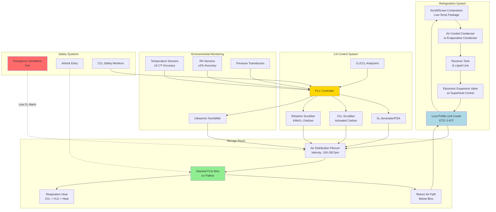

## Physical Principles of Fruit Storage HVAC

Fruit storage facilities require precise environmental control to slow respiration, minimize moisture loss, and prevent microbial growth. The fundamental challenge is managing the metabolic heat generation of living tissue while maintaining tight tolerances on temperature (±0.5°F), relative humidity (90-95%), and in controlled atmosphere (CA) storage, gas composition (O₂, CO₂, N₂).

### Fruit Respiration and Heat Generation

Living fruit tissue continues cellular respiration after harvest, consuming oxygen and generating heat, carbon dioxide, and water vapor. The respiration rate follows temperature-dependent kinetics described by the Arrhenius equation:

$$R_T = R_{ref} \cdot Q_{10}^{(T-T_{ref})/10}$$

Where:
- $R_T$ = respiration rate at temperature T (mg CO₂/kg·hr)
- $R_{ref}$ = respiration rate at reference temperature (typically 0°C)
- $Q_{10}$ = temperature coefficient (typically 2.0-4.0 for fruit)
- $T$ = storage temperature (°C)
- $T_{ref}$ = reference temperature (°C)

The metabolic heat generation rate from respiration:

$$q_{resp} = \frac{R_T \cdot m_{fruit} \cdot h_{fg,CO_2}}{M_{CO_2}}$$

Where:
- $q_{resp}$ = respiration heat load (W)
- $m_{fruit}$ = mass of stored fruit (kg)
- $h_{fg,CO_2}$ = heat of combustion per mole CO₂ produced (≈ 450 kJ/mol for glucose oxidation)
- $M_{CO_2}$ = molecular weight of CO₂ (44 g/mol)

For apples at 0°C, typical respiration heat is 3-5 W/tonne. At 10°C, this increases to 15-25 W/tonne, demonstrating why precise temperature control is critical.

### Total Cooling Load Calculation

The total refrigeration load for fruit storage combines multiple heat sources:

$$Q_{total} = Q_{resp} + Q_{product} + Q_{transmission} + Q_{infiltration} + Q_{equipment} + Q_{lights} + Q_{people}$$

**Product cooling load** (field heat removal):

$$Q_{product} = \frac{m_{fruit} \cdot c_p \cdot (T_{initial} - T_{storage})}{\Delta t_{cooling}}$$

Where:
- $c_p$ = specific heat of fruit (typically 3.6-3.9 kJ/kg·K for high-water-content fruit)
- $\Delta t_{cooling}$ = cooling time period (hours)

**Transmission load** through insulated walls:

$$Q_{transmission} = U \cdot A \cdot (T_{ambient} - T_{storage})$$

For fruit storage facilities, wall U-values should not exceed 0.15 W/m²·K (R-38 minimum insulation).

### Storage Condition Requirements by Fruit Type

| Fruit Type | Temperature (°C) | RH (%) | O₂ (%) | CO₂ (%) | Max Storage (months) | Respiration at 0°C (mg CO₂/kg·hr) |
|------------|------------------|--------|--------|---------|----------------------|-----------------------------------|
| Apples (CA) | -1 to 0 | 90-95 | 1-3 | 1-3 | 8-12 | 2-5 |
| Pears (CA) | -1.5 to -0.5 | 90-95 | 2-3 | 0-1 | 5-7 | 2-4 |
| Oranges | 3 to 9 | 85-90 | Air | Air | 3-4 | 4-8 |
| Grapes | -1 to 0 | 90-95 | 2-5 | 1-3 | 3-6 | 3-6 |
| Strawberries | 0 | 90-95 | 5-10 | 15-20 | 0.5 | 15-25 |
| Bananas | 13 to 15 | 90-95 | Air | Air | 1-2 | 12-20 |
| Blueberries | -0.5 to 0 | 90-95 | 2-5 | 12-20 | 2-3 | 8-12 |

*Data based on USDA Agriculture Handbook 66 and ASHRAE Refrigeration Handbook Chapter 37*

## HVAC System Design for Fruit Storage

### Refrigeration System Selection

Unit coolers for fruit storage must deliver high refrigeration capacity while minimizing air velocity across fruit surfaces to prevent desiccation. Design criteria:

- **Evaporator temperature difference (ETD):** 5-8°F maximum to maintain high humidity
- **Air velocity:** 100-200 fpm maximum across stored fruit
- **Coil face velocity:** 300-400 fpm
- **Defrost cycle:** Hot gas or electric with minimized off-cycle duration

The required evaporator capacity accounts for the pull-down load plus steady-state loads:

$$Q_{evap} = \frac{Q_{total}}{\eta_{system}} \cdot SF$$

Where $\eta_{system}$ is system efficiency (0.85-0.90) and SF is safety factor (1.15-1.25).

### Controlled Atmosphere System Integration

CA storage reduces respiration by limiting oxygen availability. The HVAC system must integrate with:

1. **Nitrogen generators or pressure swing adsorption (PSA) systems** to reduce O₂ from 21% to target levels
2. **CO₂ scrubbers** (activated carbon or lime beds) to prevent toxic accumulation
3. **Ethylene scrubbers** (potassium permanganate oxidizers) for ethylene-sensitive varieties
4. **Gas-tight construction** with airlocks and pressure monitoring

The air exchange rate for CA rooms must be minimized:

$$ACH = \frac{Q_{infiltration}}{V_{room} \cdot \rho_{air} \cdot c_{p,air} \cdot \Delta T} \times 3600$$

Target: < 0.5 air changes per 24 hours for effective CA maintenance.

### Humidity Control Strategy

Maintaining 90-95% RH prevents fruit weight loss while avoiding surface condensation that promotes fungal growth. The equilibrium humidity is achieved through:

- **High evaporator temperature** (small ETD reduces moisture removal)
- **Evaporative humidifiers** or ultrasonic foggers for humidity supplementation
- **Proper air circulation** to maintain uniform conditions without dead zones

The moisture loss rate from stored fruit:

$$\dot{m}_{loss} = h_m \cdot A_{fruit} \cdot (w_{surface} - w_{air})$$

Where:
- $h_m$ = mass transfer coefficient (kg/m²·s)
- $A_{fruit}$ = surface area of stored fruit (m²)
- $w_{surface}$, $w_{air}$ = humidity ratios at fruit surface and bulk air (kg water/kg dry air)

## Fruit Storage Facility HVAC System Diagram

## Control Strategies and Optimization

### Temperature Control Loop

Fruit storage requires precise PI or PID control with:

- **Proportional band:** 2-4°F
- **Integral time:** 5-10 minutes
- **Derivative time:** 1-2 minutes (if used)

The electronic expansion valve modulates refrigerant flow to maintain constant superheat (8-12°F) while the evaporator fan cycles or modulates to control space temperature.

### Staged Pull-Down Protocol

After harvest, fruit enters storage at field temperature (60-80°F). Rapid cooling causes condensation and potential chill injury. The recommended staged pull-down:

1. **Stage 1:** Cool to 40°F at 2-4°F per hour
2. **Stage 2:** Hold at 40°F for 12-24 hours (equilibration)
3. **Stage 3:** Cool to final storage temperature at 1-2°F per hour

This protocol minimizes internal temperature gradients while preventing surface condensation.

### CA Establishment Sequence

For controlled atmosphere storage:

1. **Seal room** and verify leak rate < 2% volume per 24 hours
2. **Pull down O₂** from 21% to target at 0.5-1% per day using N₂ injection
3. **Monitor CO₂ rise** from fruit respiration
4. **Activate CO₂ scrubbing** when concentration exceeds target + 1%
5. **Maintain steady-state** with continuous monitoring and minor adjustments

## Energy Efficiency Considerations

Fruit storage represents 30-40% of post-harvest energy use in commercial operations. Optimization strategies:

- **Variable-speed compressors and evaporator fans** reduce parasitic loads during steady-state operation
- **Heat recovery** from compressor discharge for defrost or facility heating
- **Night setback** for storage rooms between loading cycles (temperature can drift 1-2°F overnight without impacting quality)
- **Economizer cooling** in cold climates when ambient temperature falls below storage temperature

The coefficient of performance for low-temperature fruit storage:

$$COP = \frac{Q_{evap}}{W_{comp}} = \frac{h_1 - h_4}{h_2 - h_1}$$

Typical COP values range from 2.0-3.5 for evaporator temperatures of 25-35°F.

## Design Checklist and Common Failures

**Critical design elements:**

- Insulation R-value ≥ R-38 for walls, R-50 for ceilings
- Vapor barriers on warm side of all insulated surfaces
- Floor insulation and heating to prevent frost heave in below-grade construction
- Redundant refrigeration capacity (N+1 configuration for critical storage)
- Emergency power for compressors and controls
- Airflow patterns that eliminate hot spots and dead zones

**Common failure modes:**

- Inadequate air circulation causing temperature stratification (ΔT > 2°F top to bottom)
- Excessive air velocity causing fruit dehydration and weight loss
- Insufficient defrost capacity leading to coil icing and capacity loss
- Gas leakage in CA rooms preventing stable atmosphere control
- Condensation on ceiling and walls from thermal bridging at structural penetrations

The successful fruit storage HVAC system balances competing requirements: sufficient heat removal capacity, minimal moisture extraction, uniform temperature distribution, and for CA storage, gas-tight construction with integrated atmosphere control. Design based on accurate load calculations and adherence to ASHRAE and USDA guidelines ensures optimal fruit quality preservation and maximum storage duration.
