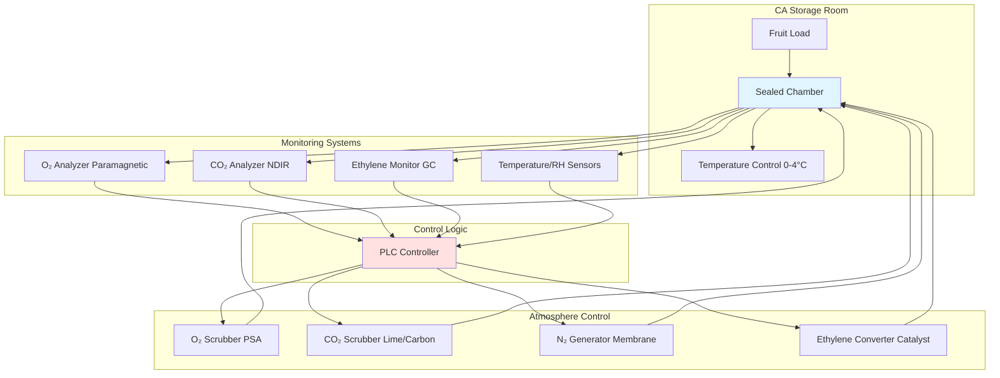

## Fundamental Principles of CA Storage

Controlled atmosphere (CA) storage extends fruit shelf life by manipulating atmospheric composition to reduce metabolic activity. Unlike conventional refrigerated storage operating at standard atmospheric conditions (20.95% O₂, 0.04% CO₂), CA storage deliberately alters gas concentrations to suppress respiration, delay ripening, and minimize quality degradation.

The respiratory quotient governs fruit metabolism:

$$RQ = \frac{\text{CO}_2 \text{ produced}}{\text{O}_2 \text{ consumed}} = \frac{n_{\text{CO}_2}}{n_{\text{O}_2}}$$

For most fruits undergoing aerobic respiration, RQ approaches 1.0, indicating complete carbohydrate oxidation. By reducing oxygen availability, CA storage shifts metabolism toward lower respiration rates without triggering anaerobic fermentation pathways that produce off-flavors.

## Gas Concentration Management

The respiration rate follows Michaelis-Menten kinetics with respect to oxygen concentration:

$$R = \frac{R_{\max} [\text{O}_2]}{K_m + [\text{O}_2]}$$

Where:
- $R$ = actual respiration rate (mg CO₂/kg·h)
- $R_{\max}$ = maximum respiration rate at atmospheric O₂
- $[\text{O}_2]$ = oxygen concentration (%)
- $K_m$ = Michaelis constant (typically 2-5% for most fruits)

Below the Michaelis constant, respiration rate decreases proportionally with oxygen concentration. The lower oxygen limit (LOL) represents the threshold below which anaerobic metabolism initiates, producing ethanol and acetaldehyde.

Elevated carbon dioxide provides additional metabolic suppression through competitive inhibition of oxidative enzymes:

$$R_{\text{CO}_2} = R_{\text{O}_2} \cdot \left(1 - \frac{[\text{CO}_2]}{[\text{CO}_2]_{\text{crit}}}\right)$$

The critical CO₂ concentration varies by species and cultivar, ranging from 1% for CO₂-sensitive fruits to 10% for tolerant varieties.

## CA Storage System Components

## CA Requirements by Fruit Type

| Fruit Type | Temperature (°C) | O₂ (%) | CO₂ (%) | Relative Humidity (%) | Storage Duration (months) |
|------------|------------------|--------|---------|----------------------|---------------------------|
| Apples (Delicious) | 0 to 1 | 1.0-2.0 | 1.0-2.0 | 90-95 | 6-8 |
| Apples (Granny Smith) | 0 to 1 | 1.5-2.5 | 3.0-5.0 | 90-95 | 9-12 |
| Pears (Bartlett) | -1 to 0 | 2.0-3.0 | 0.5-1.0 | 90-95 | 2-3 |
| Pears (Anjou) | -1 to 0 | 1.0-2.0 | 0.5-1.0 | 90-95 | 5-7 |
| Peaches | -0.5 to 0 | 1.0-2.0 | 3.0-5.0 | 90-95 | 1-2 |
| Nectarines | -0.5 to 0 | 1.0-2.0 | 3.0-5.0 | 90-95 | 1-2 |
| Cherries (sweet) | -1 to 0 | 3.0-10.0 | 10.0-15.0 | 90-95 | 1-2 |
| Kiwifruit | 0 to 1 | 1.0-2.0 | 3.0-5.0 | 90-95 | 5-6 |

## Oxygen Reduction Benefits

Reducing oxygen concentration from atmospheric 20.95% to 1-3% decreases respiration rate by 60-80%. This reduction directly correlates with extended storage life through several mechanisms:

**Enzymatic Activity Suppression**: Oxygen-dependent enzymes including polyphenol oxidase (browning), lipoxygenase (membrane degradation), and ascorbic acid oxidase (vitamin C loss) exhibit reduced activity under low O₂ conditions.

**Ethylene Production Inhibition**: The ethylene biosynthesis pathway requires oxygen for ACC oxidase activity. At O₂ concentrations below 8%, ethylene production decreases exponentially, delaying climacteric ripening in responsive fruits.

**Chlorophyll Retention**: Low oxygen slows chlorophyll degradation, maintaining green color in pome fruits and delaying yellowing.

## Carbon Dioxide Elevation Effects

Elevated CO₂ (1-15% depending on species) provides benefits independent of oxygen reduction:

**Membrane Stabilization**: Carbon dioxide alters membrane fluidity and reduces ion leakage, maintaining cellular integrity.

**Enzymatic Inhibition**: High CO₂ competitively inhibits ethylene binding sites and directly suppresses polygalacturonase (softening enzyme) and other ripening-associated enzymes.

**Fungal Growth Suppression**: Carbon dioxide concentrations above 5% inhibit spore germination and mycelial growth of common postharvest pathogens including Botrytis, Penicillium, and Monilinia species.

The mass balance for CO₂ accumulation in a sealed storage room:

$$\frac{d[\text{CO}_2]}{dt} = \frac{M \cdot R}{V \cdot \rho_{\text{air}}} - Q_{\text{scrubber}}$$

Where:
- $M$ = fruit mass (kg)
- $R$ = respiration rate (mg CO₂/kg·h)
- $V$ = room volume (m³)
- $\rho_{\text{air}}$ = air density (kg/m³)
- $Q_{\text{scrubber}}$ = CO₂ removal rate (mg/h)

## Ethylene Control in CA Storage

Ethylene concentration must remain below 1 ppm for optimal storage of climacteric fruits. At concentrations exceeding 1 ppm, ethylene triggers ripening cascades even under optimal CA conditions. Catalytic converters oxidize ethylene at 200-300°C:

$$\text{C}_2\text{H}_4 + 3\text{O}_2 \xrightarrow{\text{catalyst}} 2\text{CO}_2 + 2\text{H}_2\text{O}$$

Potassium permanganate scrubbers provide chemical oxidation for smaller installations, achieving removal efficiencies of 90-95%.

## Storage Life Extension Quantification

The Q₁₀ temperature coefficient combined with CA effects predicts storage life extension:

$$\text{Storage Life}_{\text{CA}} = \text{Storage Life}_{\text{air}} \times \frac{R_{\text{air}}}{R_{\text{CA}}} \times Q_{10}^{(T_{\text{air}}-T_{\text{CA}})/10}$$

Typical CA storage extends apple storage life from 3-4 months (refrigerated air) to 9-12 months, representing a 3-fold improvement primarily through respiration suppression.

## Quality Maintenance Mechanisms

CA storage preserves quality attributes through physiological control:

**Firmness Retention**: Reduced polygalacturonase and pectin methylesterase activity maintains cell wall integrity. Firmness loss rates decrease from 1-2 N/week in air storage to 0.2-0.4 N/week in CA.

**Acidity Preservation**: Organic acid catabolism decreases proportionally with respiration rate, maintaining titratable acidity and flavor balance.

**Scald Prevention**: Low oxygen conditions suppress oxidation of α-farnesene to conjugated trienol oxidation products responsible for superficial scald in apples and pears.

## Standards and Implementation

ASHRAE Refrigeration Handbook Chapter 37 provides CA storage recommendations. Commercial installations follow protocols from Washington State University's Postharvest Information Network and USDA Agricultural Handbook 66 for commodity-specific requirements.

Pressure swing adsorption (PSA) systems extract oxygen from ambient air, delivering 95-99% nitrogen to reduce O₂ concentration to target levels. Membrane separation systems offer lower capital cost for installations requiring moderate O₂ reduction (3-5%).

## Components

- Controlled Atmosphere Apples
- Controlled Atmosphere Pears
- Controlled Atmosphere Stone Fruit
- Oxygen Reduction Benefits
- Carbon Dioxide Elevation Effects
- Ethylene Control Ca Storage
- Storage Life Extension Ca
- Quality Maintenance Ca
