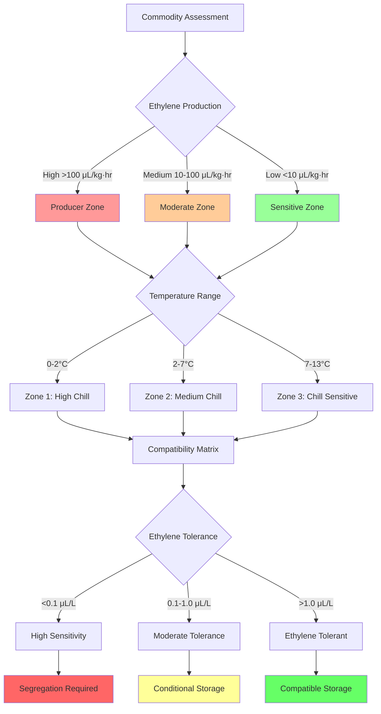

## Commodities Integration

Mixed commodity storage in fruit facilities requires precise integration of thermal and atmospheric requirements. Compatibility analysis centers on three physical parameters: ethylene production rates, optimal storage temperature ranges, and respiratory metabolism coefficients. Improper integration accelerates senescence through ethylene-induced ripening cascades and metabolic heat accumulation.

## Ethylene Sensitivity Physics

Ethylene (C₂H₄) acts as a plant hormone triggering autocatalytic ripening through receptor-mediated signal transduction. Sensitivity varies by commodity based on receptor density and membrane permeability characteristics.

The ethylene dose-response relationship follows Michaelis-Menten kinetics:

$$R_{ripening} = \frac{R_{max} \cdot [C_2H_4]}{K_m + [C_2H_4]}$$

Where:
- $R_{ripening}$ = ripening rate (dimensionless, 0-1 scale)
- $R_{max}$ = maximum ripening response
- $[C_2H_4]$ = ethylene concentration (μL/L)
- $K_m$ = half-saturation constant (commodity-specific)

The cumulative ethylene exposure damage index integrates concentration over time:

$$D_{ethylene} = \int_0^t [C_2H_4](\tau) \cdot S_c \cdot e^{-E_a/(RT(\tau))} \, d\tau$$

Where:
- $D_{ethylene}$ = damage index (μL·hr/L)
- $S_c$ = commodity sensitivity coefficient (species-dependent)
- $E_a$ = activation energy for receptor binding (kJ/mol)
- $R$ = universal gas constant (8.314 J/mol·K)
- $T$ = absolute temperature (K)

Temperature exponentially modulates ethylene sensitivity through enzyme kinetics. A 10°C increase typically doubles receptor activity, described by the Q₁₀ coefficient:

$$Q_{10} = \left(\frac{k_{T+10}}{k_T}\right)$$

For most fruits, $Q_{10}$ ranges from 2.0-3.5 for ethylene-induced processes.

## Commodity Compatibility Zones

Storage compatibility depends on overlapping optimal ranges for temperature, relative humidity, and maximum tolerable ethylene concentration.

## Fruit Compatibility Groupings

Commodities segregate into compatibility groups based on temperature requirements, ethylene production, and ethylene sensitivity.

| Compatibility Group | Representative Commodities | Temperature Range (°C) | Ethylene Production (μL/kg·hr) | Ethylene Sensitivity | Storage Separation |
|---------------------|---------------------------|------------------------|-------------------------------|---------------------|-------------------|
| **Group A: High-Chill Sensitive** | Kiwifruit, apples (most cultivars), Asian pears | 0-2 | 0.1-2.0 | High (<0.1 μL/L) | Separate from producers |
| **Group B: High-Chill Tolerant** | European pears (Bartlett, Anjou), apples (Granny Smith) | 0-2 | 2.0-10.0 | Moderate (0.1-1.0 μL/L) | Compatible with Group A |
| **Group C: Medium-Chill Sensitive** | Blueberries, sweet cherries, grapes | 2-7 | 0.05-0.5 | Very High (<0.05 μL/L) | Maximum isolation required |
| **Group D: Medium-Chill Producers** | Apricots, plums, nectarines | 2-7 | 10-50 | Low (>1.0 μL/L) | Isolate from A, B, C |
| **Group E: Chill-Sensitive Climacteric** | Avocados (ripe), tomatoes, bananas | 7-13 | 50-200 | Moderate (0.5-2.0 μL/L) | Separate facility recommended |
| **Group F: Chill-Sensitive Non-Climacteric** | Citrus, pineapples, mangoes (some cultivars) | 7-13 | 0.1-1.0 | Low (>2.0 μL/L) | Compatible with Group E |

## Mixed Storage Compatibility Analysis

The compatibility index for two commodities quantifies storage feasibility:

$$CI_{ij} = \left(1 - \frac{|\Delta T_{opt}|}{T_{tolerance}}\right) \cdot \left(1 - \frac{E_{production,i}}{E_{tolerance,j}}\right) \cdot \left(1 - \frac{|\Delta RH|}{RH_{tolerance}}\right)$$

Where:
- $CI_{ij}$ = compatibility index (0-1, >0.7 acceptable)
- $\Delta T_{opt}$ = temperature optimum difference (°C)
- $T_{tolerance}$ = temperature tolerance band (°C)
- $E_{production,i}$ = ethylene production rate of commodity i (μL/kg·hr)
- $E_{tolerance,j}$ = ethylene tolerance threshold of commodity j (μL/L)
- $\Delta RH$ = relative humidity difference (%)
- $RH_{tolerance}$ = humidity tolerance band (%)

## Segregation Strategies

Physical separation methods address incompatibility through atmospheric isolation. Vertical stratification exploits density differences, as ethylene (molecular weight 28.05 g/mol) exhibits slight positive buoyancy relative to air (28.97 g/mol average) at storage temperatures. Horizontal segregation with dedicated air handling prevents cross-contamination through independent circulation loops.

Scrubber systems provide chemical compatibility enhancement. Potassium permanganate oxidation converts ethylene through:

$$C_2H_4 + KMnO_4 \rightarrow CO_2 + H_2O + MnO_2 + K^+$$

Catalytic oxidation at 150-300°C achieves >95% removal efficiency:

$$C_2H_4 + 3O_2 \xrightarrow{catalyst} 2CO_2 + 2H_2O$$

Scrubber capacity requirements scale with ethylene generation rate and air circulation volume:

$$Q_{scrubber} = \frac{m_{fruit} \cdot E_{production} \cdot 22.4}{M_{C_2H_4} \cdot \eta_{removal} \cdot 1000}$$

Where:
- $Q_{scrubber}$ = volumetric scrubber capacity (L/hr)
- $m_{fruit}$ = fruit mass (kg)
- $E_{production}$ = production rate (μL/kg·hr)
- $M_{C_2H_4}$ = ethylene molecular weight (28.05 g/mol)
- $\eta_{removal}$ = scrubber efficiency (fraction)
- 22.4 = molar volume at STP (L/mol)

## Controlled Atmosphere Integration

CA storage modifies commodity compatibility through respiratory suppression. Reduced O₂ (1-3%) and elevated CO₂ (1-5%) decrease ethylene biosynthesis by inhibiting ACC synthase and ACC oxidase enzymes in the ethylene production pathway.

The modified respiratory quotient under CA conditions:

$$RQ_{CA} = \frac{CO_2 \, produced}{O_2 \, consumed} = f([O_2], [CO_2], T)$$

Typical RQ values shift from 1.0 (normal air) to 1.2-1.5 under CA, indicating altered metabolic pathways. This reduces ethylene production by 40-70% for climacteric fruits, expanding compatibility between otherwise incompatible commodities.

## Implementation Protocols

Facility design must accommodate segregation through:

1. **Dedicated rooms**: Group A and C commodities require isolation from Groups D and E
2. **Airflow barriers**: Positive pressure differentials (5-15 Pa) prevent ethylene migration
3. **Scrubber staging**: Position scrubbers upstream of sensitive commodities
4. **Temperature zoning**: Separate refrigeration circuits for incompatible temperature bands
5. **Monitoring density**: Ethylene sensors at 1 per 200 m² for mixed storage, 1 per 500 m² for uniform loads

The economic optimization balances segregation costs against commodity degradation losses, quantified through net present value analysis of storage duration, commodity value, and quality retention rates under various integration scenarios.

## Components

- Apple Varieties Storage Requirements
- Pear Storage Conditions
- Stone Fruit Storage
- Kiwifruit CA Storage
- Avocado Storage Conditions
- Commodity Specific Protocols
- Mixed Storage Compatibility
