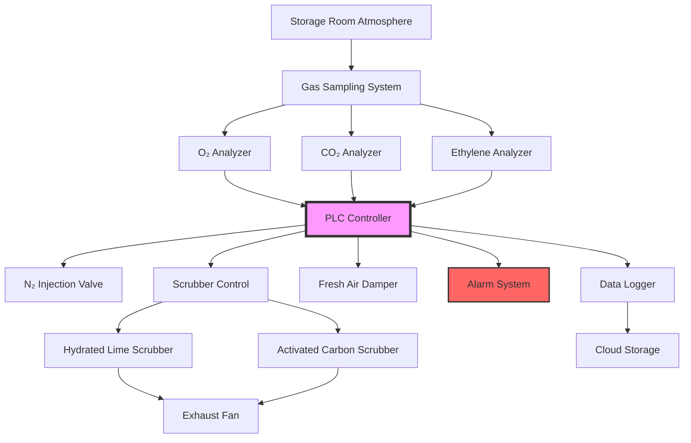

## Fundamentals of Atmospheric Control

Controlled atmosphere (CA) storage extends fruit shelf life by manipulating gas concentrations. Fruit respiration consumes oxygen and produces carbon dioxide and ethylene, requiring continuous atmospheric management. The respiration process follows:

$$C_6H_{12}O_6 + 6O_2 \rightarrow 6CO_2 + 6H_2O + \text{heat}$$

Target atmospheric conditions for CA storage typically maintain oxygen at 1-3% and CO₂ at 1-5%, depending on commodity. Without active scrubbing, CO₂ accumulates to toxic levels (>10%) within days.

## CO₂ Scrubbing Technologies

### Hydrated Lime Scrubbers

Hydrated lime (calcium hydroxide) scrubbers operate on the chemical absorption principle:

$$Ca(OH)_2 + CO_2 \rightarrow CaCO_3 + H_2O$$

The scrubbing capacity calculation derives from stoichiometric relationships. One mole of Ca(OH)₂ (74 g) reacts with one mole of CO₂ (44 g):

$$Q_{CO_2} = \frac{m_{lime} \times M_{CO_2}}{M_{Ca(OH)_2}} \times \eta$$

Where:
- $Q_{CO_2}$ = CO₂ removal capacity (kg)
- $m_{lime}$ = mass of hydrated lime (kg)
- $M_{CO_2}$ = molecular weight CO₂ (44 g/mol)
- $M_{Ca(OH)_2}$ = molecular weight Ca(OH)₂ (74 g/mol)
- $\eta$ = scrubber efficiency (0.85-0.95)

For a storage room generating 20 kg CO₂ per day, required lime mass:

$$m_{lime} = \frac{20 \times 74}{44 \times 0.90} = 37.4 \text{ kg/day}$$

Air flow through the scrubber must provide adequate contact time. Typical design velocities range from 0.3-0.5 m/s through the lime bed, with minimum contact time of 2-3 seconds.

### Activated Carbon Scrubbers

Activated carbon removes ethylene and volatile organic compounds through physical adsorption. Surface area exceeds 1000 m²/g, providing extensive adsorption sites. The Langmuir isotherm describes equilibrium capacity:

$$q_e = \frac{q_m K_L C_e}{1 + K_L C_e}$$

Where:
- $q_e$ = equilibrium adsorption capacity (mg/g)
- $q_m$ = maximum adsorption capacity
- $K_L$ = Langmuir constant
- $C_e$ = equilibrium concentration (ppm)

Carbon bed depth sizing requires breakthrough analysis. For ethylene removal from 100 ppm to <1 ppm with 500 kg carbon at 200 CFM:

$$t_b = \frac{m_c \times q_e}{Q \times C_0 \times \rho}$$

Where:
- $t_b$ = breakthrough time (hours)
- $m_c$ = carbon mass (kg)
- $Q$ = air flow rate (m³/hr)
- $C_0$ = inlet concentration (mg/m³)
- $\rho$ = air density (kg/m³)

## Monitoring System Architecture

## Scrubber Technology Comparison

| Technology | CO₂ Removal | Ethylene Removal | Operating Cost | Regeneration | Typical Capacity |
|-----------|-------------|------------------|----------------|--------------|------------------|
| Hydrated Lime | Excellent | None | Low | None (disposable) | 0.6 kg CO₂/kg lime |
| Activated Carbon | Poor | Excellent | Medium | Heat (300-400°C) | 0.3 kg C₂H₄/kg carbon |
| Molecular Sieves | Good | Good | High | Heat + vacuum | 0.4 kg CO₂/kg sieve |
| Membrane Separation | Excellent | None | High | None (continuous) | Variable by pressure |
| PSA Systems | Excellent | None | Medium | Pressure swing | 0.5 kg CO₂/kg adsorbent |

## Gas Analyzer Selection

### Oxygen Measurement

Paramagnetic analyzers exploit oxygen's paramagnetic properties. Oxygen molecules experience force in magnetic fields:

$$F = \chi V \frac{dB}{dx}$$

Where:
- $F$ = force on gas sample
- $\chi$ = magnetic susceptibility
- $V$ = sample volume
- $dB/dx$ = magnetic field gradient

Accuracy: ±0.1% O₂, range 0-25%, response time <10 seconds.

Electrochemical sensors provide cost-effective alternatives. Galvanic cells generate current proportional to oxygen partial pressure. Typical lifespan: 18-24 months, accuracy ±0.5%.

### Carbon Dioxide Measurement

Non-dispersive infrared (NDIR) analyzers measure CO₂ absorption at 4.26 μm wavelength. Beer-Lambert law governs absorption:

$$I = I_0 e^{-\alpha C L}$$

Where:
- $I$ = transmitted intensity
- $I_0$ = incident intensity
- $\alpha$ = absorption coefficient
- $C$ = CO₂ concentration
- $L$ = path length

Accuracy: ±0.1% CO₂, range 0-20%, minimal drift, no consumables.

### Ethylene Detection

Photoionization detectors (PID) or gas chromatography measure ethylene at ppb levels. Ethylene accelerates ripening even at 0.1 ppm, requiring sensitive detection. PID ionizes molecules with UV lamp (10.6 eV):

Detection limit: 0.05 ppm ethylene, response time <30 seconds.

## System Integration

Programmable logic controllers (PLCs) maintain setpoints through proportional-integral-derivative (PID) control:

$$u(t) = K_p e(t) + K_i \int_0^t e(\tau)d\tau + K_d \frac{de(t)}{dt}$$

Where:
- $u(t)$ = control output
- $e(t)$ = error (setpoint - measured)
- $K_p, K_i, K_d$ = tuning parameters

Typical tuning values for CA storage:
- $K_p$ = 0.5-1.0 (proportional gain)
- $K_i$ = 0.1-0.3 (integral time constant)
- $K_d$ = 0.05-0.1 (derivative time constant)

Data logging records conditions every 5-15 minutes. Historical data enables trend analysis and equipment optimization. Cloud connectivity allows remote monitoring and alarm notification.

## Operational Considerations

Calibration intervals follow manufacturer specifications, typically quarterly for NDIR CO₂, monthly for electrochemical O₂. Span gas certification traceable to NIST standards ensures accuracy.

Scrubber maintenance includes:
- Hydrated lime: replace when 80% carbonated (weight increase 1.35×)
- Activated carbon: regenerate or replace when breakthrough occurs
- Filters: replace at 0.5" w.c. pressure drop

Alarm setpoints protect product quality:
- O₂ <0.5% or >5%
- CO₂ >8%
- Temperature deviation ±1°C
- Power failure
- Analyzer fault

Redundant analyzers on critical rooms prevent false alarms and ensure continuous operation during maintenance.
