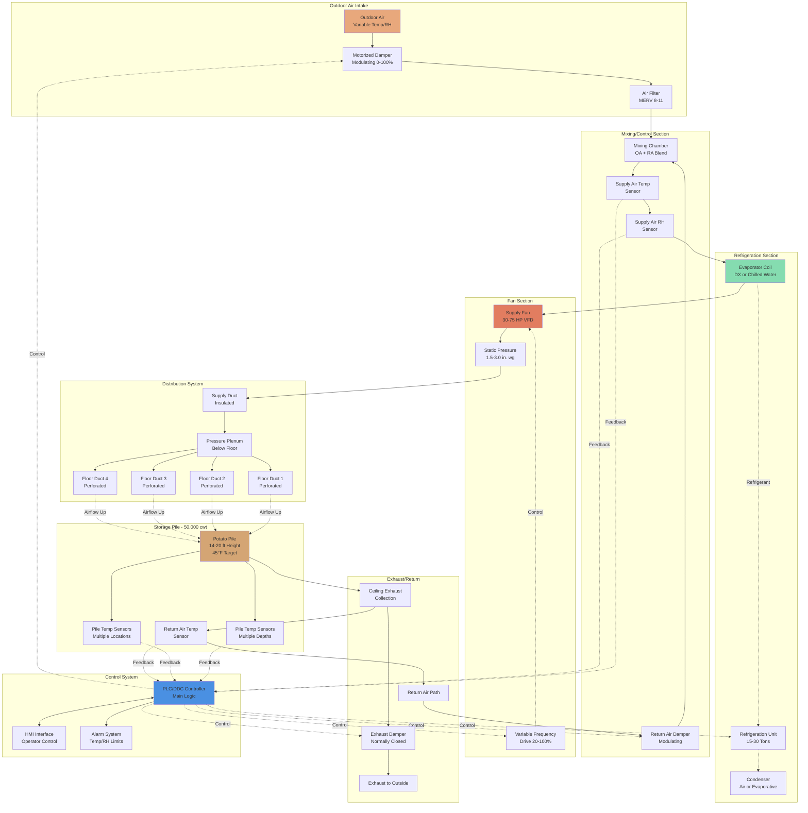

# Potato Storage HVAC Systems

Commercial potato storage requires precision environmental control to maintain tuber quality, prevent sprouting, minimize disease, and reduce storage losses during extended holding periods of 6-10 months. Effective HVAC design integrates temperature management, high-humidity maintenance, and strategic ventilation to create optimal conditions for different storage phases and end-use applications.

## Storage Requirements by End Use

Storage temperature varies significantly based on intended use, driven by the relationship between temperature and sugar accumulation in potato tissue. Cold-induced sweetening occurs below 45°F as starch converts to reducing sugars, creating undesirable browning during frying or processing.

| End Use | Temperature Range | Relative Humidity | Storage Duration | Curing Temp | Ventilation Rate |
|---------|-------------------|-------------------|------------------|-------------|------------------|
| Processing (chips/fries) | 45-50°F (7.2-10°C) | 90-95% | 6-10 months | 55-60°F | 0.05-0.15 cfm/cwt |
| Fresh market (table stock) | 38-42°F (3.3-5.6°C) | 90-95% | 3-6 months | 50-55°F | 0.05-0.20 cfm/cwt |
| Seed potatoes | 38-40°F (3.3-4.4°C) | 90-95% | 6-9 months | 50-55°F | 0.10-0.25 cfm/cwt |
| Short-term holding | 50-55°F (10-12.8°C) | 85-90% | 1-3 months | Not required | 0.20-0.50 cfm/cwt |

**Temperature Control Rationale:**

Processing potatoes require warmer storage to prevent sugar accumulation that causes dark fry colors and off-flavors. The critical threshold is 45°F (7.2°C), below which reducing sugars (glucose and fructose) accumulate rapidly through the enzymatic conversion of starch. Fresh market potatoes tolerate lower temperatures since browning during cooking is less problematic for consumers. Seed potatoes require the coldest storage to maintain dormancy and prevent premature sprouting before planting season.

## Respiration Heat Generation and Thermal Load Analysis

Potato tubers are living organisms that continue cellular respiration during storage, generating metabolic heat that must be removed to maintain target temperatures. The respiration rate is exponentially dependent on temperature, following van't Hoff's law.

**Respiration Rate Model:**

The respiration heat generation rate follows an exponential temperature relationship:

$$Q_{resp} = Q_0 \cdot e^{k(T - T_0)}$$

Where:
- $Q_{resp}$ = respiration heat rate (Btu/h·cwt)
- $Q_0$ = base respiration rate at reference temperature
- $k$ = temperature coefficient (typically 0.08-0.12 per °F)
- $T$ = storage temperature (°F)
- $T_0$ = reference temperature (typically 32°F)

**Typical Respiration Rates by Temperature:**

| Storage Temperature | Respiration Heat (Btu/h·cwt) | CO₂ Production (mg/kg·h) |
|---------------------|-------------------------------|--------------------------|
| 38°F (3.3°C) | 0.15-0.20 | 1.5-2.0 |
| 42°F (5.6°C) | 0.20-0.28 | 2.0-2.8 |
| 45°F (7.2°C) | 0.25-0.35 | 2.5-3.5 |
| 50°F (10°C) | 0.35-0.50 | 3.5-5.0 |
| 55°F (12.8°C) | 0.50-0.70 | 5.0-7.0 |

**Total Cooling Load Calculation:**

For a 50,000 cwt storage facility with field heat removal:

$$Q_{total} = Q_{sensible} + Q_{resp} + Q_{infiltration} + Q_{structure}$$

**Sensible heat removal:**

$$Q_{sensible} = m \cdot c_p \cdot \Delta T$$

- Tuber mass: $m = 50,000 \text{ cwt} \times 100 \text{ lb/cwt} = 5,000,000 \text{ lb}$
- Specific heat: $c_p = 0.85 \text{ Btu/lb·°F}$ (79% moisture content)
- Temperature reduction: $\Delta T = 65°F - 45°F = 20°F$
- Sensible heat: $Q_s = 5,000,000 \times 0.85 \times 20 = 85,000,000 \text{ Btu}$
- Cooling period: 14-21 days (gradual cooling requirement)
- Average rate: $85,000,000 \div (14 \times 24) = 253,000 \text{ Btu/h}$

**Respiratory heat (continuous load):**

At 45°F storage temperature:
$$Q_{resp} = 50,000 \text{ cwt} \times 0.30 \text{ Btu/h·cwt} = 15,000 \text{ Btu/h}$$

**Peak refrigeration capacity requirement:**

During initial cooling phase: 253,000 + 15,000 = **268,000 Btu/h (22.3 tons)**

During long-term storage: **15,000 Btu/h (1.25 tons)** plus structural and infiltration loads.

## Curing Phase Requirements and Suberization Process

The curing phase immediately following harvest is critical for wound healing, skin set, and disease prevention through the biological process of suberization. This phase requires dramatically different environmental conditions than long-term storage and represents the most critical HVAC control period for maintaining tuber quality.

**Optimal Curing Parameters:**

| Parameter | Specification | Tolerance | Impact of Deviation |
|-----------|--------------|-----------|---------------------|
| Temperature | 50-60°F (10-15.6°C) | ±2°F | Reduced suberization rate |
| Optimal point | 55°F (12.8°C) | ±1°F | Maximum wound healing |
| Relative humidity | 90-95% | ±3% | Moisture loss >0.5%/day |
| Duration | 10-14 days | Variety dependent | Incomplete wound closure |
| Air velocity | <15 fpm over pile | Critical | Desiccation of wounds |
| Ventilation rate | 0.01-0.05 cfm/cwt | Minimal | Heat/moisture retention |

**Suberization Physiology:**

Suberization is the formation of wound periderm (corky layer) through the deposition of suberin, a complex lipid-aromatic polyester that creates a waterproof barrier. The process involves:

1. **Cellular response (0-48 hours):** Wound-induced ethylene production triggers cellular differentiation beneath damaged tissue.

2. **Phellogen formation (2-5 days):** Cork cambium develops from cortical parenchyma cells immediately below wound surface.

3. **Suberin deposition (5-14 days):** Newly formed phellem cells deposit suberin in cell walls, creating impermeable barrier.

**Suberization Rate Model:**

The wound healing rate follows an exponential approach to completion:

$$H(t) = H_{max} \left(1 - e^{-kt}\right)$$

Where:
- $H(t)$ = healing completion percentage at time $t$
- $H_{max}$ = maximum achievable healing (typically 95-98%)
- $k$ = healing rate constant (function of temperature and RH)
- $t$ = time (days)

At optimal conditions (55°F, 95% RH): $k \approx 0.25 \text{ day}^{-1}$

**Temperature Dependency of Suberization:**

$$k(T) = k_0 \cdot Q_{10}^{(T-T_0)/10}$$

Where:
- $Q_{10}$ = temperature coefficient (typically 2.0-2.5 for suberization)
- $T_0$ = reference temperature (50°F)
- $k_0$ = rate constant at reference temperature

This relationship demonstrates that suberization proceeds twice as fast at 60°F compared to 50°F, but excessive temperature (>65°F) promotes pathogen growth and decay.

**HVAC System Response During Curing:**

The ventilation system must shift from active cooling to passive heat retention mode. Respiratory heat from the tuber mass (0.50-0.70 Btu/h·cwt at 55°F) provides natural warming, typically raising pile temperature 5-10°F above ambient if ventilation is minimized.

**Curing phase control strategy:**

1. **Seal storage:** Close all ventilation dampers and doors to trap respiratory heat and moisture.

2. **Monitor temperature rise:** Respiratory heat naturally warms pile from harvest temperature (65-70°F) or maintains 55°F target.

3. **Minimal circulation:** Operate fans at 0.01-0.02 cfm/cwt (5% of cooling rate) to prevent stratification without heat loss.

4. **Humidity management:** Respiratory moisture from tubers typically provides adequate humidity. Each cwt generates approximately 0.02-0.03 lb water/day through transpiration and respiration.

5. **Temperature supplementation:** In cold climates or late-season harvest, supplemental heat may be required to reach 55°F. Heat input:

$$Q_{heat} = Q_{structure\ loss} + Q_{infiltration} - Q_{respiration}$$

For typical construction with R-20 walls and 40°F outdoor temperature:
- Structure loss: ~80,000 Btu/h per 50,000 cwt facility
- Respiration gain: 35,000 Btu/h at 55°F
- Net heating: 45,000 Btu/h required

6. **Monitoring wound healing progress:** Visual inspection of representative tubers at days 7 and 14 to verify skin set and wound closure. Incomplete healing requires extended curing period.

## Temperature Management and Gradual Cooling

Abrupt temperature changes stress tubers and increase condensation risk. Industry best practice mandates gradual cooling at 0.5-1.0°F per day from curing temperature to target storage temperature.

**Cooling Schedule Example:**
1. Harvest to curing: 65°F → 55°F over 3-5 days
2. Curing phase: Hold at 55°F for 10-14 days
3. Gradual cooling: 55°F → 45°F at 0.5°F/day = 20 days
4. Long-term storage: Hold at 45°F for 6-10 months

Total transition time from harvest to stable storage: 33-39 days.

**Heat Transfer Analysis:**

During gradual cooling, the ventilation system removes both field heat and respiratory heat while carefully controlling the rate. The psychrometric process involves:
- Outdoor air at ambient conditions (variable)
- Mixed with return air from storage (45-55°F, 90-95% RH)
- Controlled airflow rate to achieve target cooling rate

For 0.5°F/day cooling in 50,000 cwt storage:
- Daily heat removal: 5,000,000 lb × 0.85 Btu/lb·°F × 0.5°F = 2,125,000 Btu/day
- Average rate: 2,125,000 ÷ 24 h = 88,500 Btu/h
- Plus respiratory heat: 15,000 Btu/h
- Total cooling requirement: 103,500 Btu/h during transition

## Humidity Control and Moisture Management

Maintaining 90-95% RH is essential to prevent weight loss, skin dehydration, and quality deterioration. At this humidity level, the vapor pressure deficit between tuber surface and ambient air is minimized, reducing transpirational moisture loss.

**Weight Loss Prevention:**

At 45°F storage temperature:
- 90% RH: Weight loss rate approximately 0.1-0.2% per month
- 80% RH: Weight loss rate approximately 0.5-0.8% per month
- 70% RH: Weight loss rate approximately 1.5-2.5% per month

For 5,000,000 lb storage at 80% RH vs. 95% RH over 8 months:
- Additional loss at 80% RH: 0.6% × 8 months = 4.8%
- Weight loss: 5,000,000 × 0.048 = 240,000 lb
- Economic impact at $0.12/lb: $28,800 in shrinkage losses

**Humidity Control Strategies:**

High-humidity maintenance relies on:
1. Minimal outdoor air ventilation during storage phase (reduces dry air infiltration)
2. Tight building envelope to prevent infiltration
3. Respiratory moisture contribution from tuber mass
4. Humidification systems (fogging, evaporative pads) when supplemental moisture is needed
5. Avoidance of over-ventilation that strips humidity

**Condensation Prevention:**

While high humidity is required, condensation on tuber surfaces promotes disease. Prevention strategies include:
- Uniform temperature throughout the pile (eliminates cold spots)
- Adequate air circulation to prevent stratification
- Insulated walls and ceiling to maintain surface temperatures above dew point
- Gradual temperature changes to prevent transient condensation

## Ventilation System Design

Forced-air ventilation through the potato pile is the cornerstone of effective storage management. System design must accommodate variable airflow requirements across storage phases.

**Ventilation Rates by Phase:**

| Storage Phase | Airflow Rate (cfm/cwt) | Purpose |
|---------------|------------------------|---------|
| Initial cooling | 1.0-2.0 | Rapid field heat removal |
| Curing | 0.01-0.05 | Minimal air movement |
| Gradual cooling | 0.3-0.8 | Controlled temperature reduction |
| Long-term storage | 0.05-0.2 | Temperature maintenance |
| Warming for shipping | 0.5-1.5 | Controlled temperature increase |

**Pressure Drop and Fan Selection:**

Airflow through bulk-stored potatoes encounters resistance. Static pressure drop depends on pile height, airflow rate, and tuber size distribution.

Empirical relationship (Shedd equation):
- ΔP = k × (V/D)^n × H
- Where: ΔP = pressure drop (in. w.g.), V = superficial velocity (fpm), D = tuber diameter (in.), H = pile height (ft), k and n are empirical constants

For typical storage conditions:
- Pile height: 14-20 ft
- Airflow: 1.0 cfm/cwt during cooling
- Pressure drop: 1.5-3.0 in. w.g.

**Fan sizing calculation for 50,000 cwt storage:**
- Airflow required: 50,000 cwt × 1.5 cfm/cwt = 75,000 cfm (peak cooling)
- Static pressure: 2.5 in. w.g. (through 16 ft pile)
- Fan horsepower: (75,000 × 2.5) ÷ (6,356 × 0.65 efficiency) = 45.4 hp
- Installed capacity: 50 hp motor with VFD control

Variable frequency drives are essential for efficient operation across the wide airflow range required throughout the storage season.

**Distribution System Configurations:**

Three primary configurations are used:

1. **Pressure plenum with floor ducts:** Air forced upward through perforated ducts embedded in or below the floor, traveling upward through the pile.

2. **Suction system:** Perforated ceiling ducts pull air downward through the pile. Provides better uniformity but higher energy use.

3. **Cross-flow ventilation:** Horizontal airflow through the pile width. Requires careful duct spacing and design to prevent dead zones.

Pressure systems are most common due to lower static pressure requirements and ease of temperature control at the inlet.

**Potato Storage Ventilation System Diagram:**

**Airflow Pattern Description:**

The forced-air pressure system delivers conditioned air through floor-level distribution ducts with perforations spaced 12-24 inches on center. Air travels upward through the potato pile at velocities of 5-15 fpm (based on 0.5-2.0 cfm/cwt), removing respiratory heat and maintaining uniform temperature. The 14-20 ft pile height creates 1.5-3.0 in. w.g. static pressure drop per ASABE D272.3 airflow resistance data.

Return air exits at the pile surface, travels to ceiling collection points, and returns to the mixing chamber where it blends with outdoor air. The control system modulates outdoor air damper position to maximize free cooling when ambient conditions permit, reducing mechanical refrigeration runtime.

## Sprout Inhibition and Dormancy Management

Sprouting reduces marketability, increases weight loss (sprouts consume 2-3% of tuber dry matter), and degrades tuber quality through nutrient depletion and increased susceptibility to pathogens. Environmental control is the primary non-chemical sprout suppression method, supplemented by chemical or physical inhibitors when necessary.

**Physiological Dormancy Period:**

Potatoes undergo natural endodormancy controlled by abscisic acid (ABA) and gibberellin balance within the tuber. Dormancy duration varies by variety:

| Variety Type | Dormancy Period | Examples | Storage Strategy |
|-------------|-----------------|----------|------------------|
| Very short | 60-75 days | Norchip, Snowden | Chemical inhibitors required |
| Short | 75-100 days | Russet Burbank, Superior | Temperature + inhibitors |
| Medium | 100-130 days | Russet Norkotah, Ranger Russet | Temperature control sufficient |
| Long | 130-150 days | Shepody, Goldrush | Minimal intervention |

**Temperature-Dependent Sprout Growth:**

After dormancy break, sprout elongation rate follows an exponential temperature relationship:

$$R_{sprout} = R_0 \cdot e^{k_s(T - T_{min})}$$

Where:
- $R_{sprout}$ = sprout elongation rate (mm/day)
- $R_0$ = base rate at threshold temperature
- $k_s$ = sprout growth coefficient (0.08-0.12 per °F)
- $T$ = storage temperature (°F)
- $T_{min}$ = minimum sprouting temperature (~35°F)

**Sprout Growth Rates by Temperature:**

| Storage Temperature | Sprout Growth Rate | Time to 5mm Sprouts | Suppression Method |
|---------------------|-------------------|---------------------|-------------------|
| 38°F (3.3°C) | 0.1-0.2 mm/day | 25-50 days | Temperature adequate |
| 42°F (5.6°C) | 0.3-0.5 mm/day | 10-17 days | Temperature + monitoring |
| 45°F (7.2°C) | 0.8-1.2 mm/day | 4-6 days | Chemical inhibitors required |
| 50°F (10°C) | 2.0-3.5 mm/day | 1.4-2.5 days | Inhibitors essential |
| 55°F (12.8°C) | 4.0-6.0 mm/day | 0.8-1.2 days | Rapid intervention |

**Environmental Sprout Suppression Strategy:**

**For fresh market (table stock):**
Maintain 38-42°F throughout storage. Cold temperature inhibits sprout growth sufficiently for 3-6 month storage without chemical inhibitors. Monitor for cold-induced sweetening in sensitive varieties.

**For processing potatoes:**
Temperature alone (45-50°F) is insufficient. Multi-faceted approach required:

1. **Initial dormancy period:** Maintain 45-50°F, no intervention needed during first 60-120 days.

2. **Post-dormancy management:** Apply sprout inhibitors before visible sprout emergence:
   - Chemical: Chlorpropham (CIPC), 1,4-dimethylnaphthalene (1,4-DMN)
   - Physical: Ethylene application, repeated debudding
   - Natural: Essential oils (spearmint, caraway), maleic hydrazide

**Chemical Inhibitor Application and HVAC Coordination:**

Sprout inhibitor effectiveness depends on uniform vapor distribution throughout the storage pile, requiring careful ventilation control.

**Application protocol:**

1. **Pre-application preparation (days 10-14 post-harvest):**
   - Complete curing phase with good wound healing
   - Achieve target storage temperature (45-50°F)
   - Verify uniform temperature distribution (within 2°F)

2. **Application phase:**
   - Introduce inhibitor via thermal fogging or ULV spray
   - Shut down all ventilation fans to trap vapor
   - Seal doors and dampers to prevent vapor loss
   - Application occurs during evening/night for stable conditions

3. **Distribution period (12-24 hours post-application):**
   - Zero ventilation to allow vapor deposition on tuber surfaces
   - Monitor pile temperature (may rise 2-5°F from trapped respiration heat)
   - Ensure temperature stays below 55°F to prevent accelerated respiration

4. **Ventilation resumption:**
   - Gradually restart ventilation at 0.05-0.10 cfm/cwt
   - Return to normal storage ventilation over 48 hours
   - Monitor for temperature uniformity recovery

**HVAC Design Requirements for Inhibitor Application:**

- **Airtight dampers:** Motor-operated dampers with inflatable seals to prevent vapor leakage during application shutdown.

- **Recirculation capability:** Internal circulation fans to distribute inhibitor vapor without outdoor air introduction.

- **Temperature override controls:** Automatic ventilation restart if pile temperature exceeds 58°F during application shutdown.

- **Sector isolation:** Large facilities benefit from zoned ventilation allowing section-by-section treatment.

**Repeated Application Strategy:**

Most chemical inhibitors require reapplication every 60-90 days to maintain efficacy. HVAC system must accommodate 3-5 application cycles per storage season without quality degradation.

## Refrigeration and Heat Rejection Systems

Large commercial storages require mechanical refrigeration to supplement ventilation-based cooling, particularly in warm climates or during initial cooling when outdoor temperatures exceed storage targets.

**Cooling System Options:**

1. **Direct-expansion (DX) systems:** Evaporator coils in supply airstream, typically using R-404A or R-448A refrigerants. Common in smaller facilities (10,000-30,000 cwt).

2. **Chilled water systems:** Central chiller with distributed cooling coils. Preferred for large multi-room facilities due to operational flexibility and efficiency.

3. **Evaporative cooling supplementation:** In arid climates, evaporative pre-cooling of outdoor air reduces mechanical refrigeration load by 30-50%.

**Evaporator Coil Design Considerations:**

- Large face area and low air velocity (300-400 fpm) to minimize dehumidification
- Temperature differential: Supply air only 2-5°F below storage temperature to prevent over-drying
- Defrost strategy: Time-clock or demand defrost to prevent ice buildup without excessive heating

**Energy Efficiency Optimization:**

Refrigeration represents 60-80% of total storage energy consumption. Efficiency strategies include:
- Free cooling when outdoor conditions permit (outdoor air economizer)
- Variable-speed compressors matching load variation
- Floating head pressure control on condensers
- Heat recovery for facility heating or warm-up operations

## System Integration and Control Strategy

Automated control systems integrate temperature, humidity, and ventilation management to optimize storage conditions while minimizing energy consumption.

**Control Architecture:**

Modern storage facilities employ PLC or DDC systems monitoring:
- Multiple temperature sensors throughout pile (vertical and horizontal distribution)
- Humidity sensors in supply and return air
- Outdoor air temperature and humidity
- Fan status and VFD feedback
- Refrigeration system status

**Operational Control Logic:**

The control sequence prioritizes free cooling over mechanical refrigeration:

1. **Outdoor air economizer mode:** When outdoor air temperature is below storage temperature and humidity is acceptable, 100% outdoor air is used.

2. **Mixed air mode:** Outdoor air is blended with return air to achieve target supply temperature while maintaining humidity.

3. **Refrigeration mode:** When outdoor air provides no benefit, recirculated air is mechanically cooled.

4. **Minimum ventilation:** During long-term storage, periodic ventilation (1-2 times per week) maintains oxygen levels and removes accumulated CO2 from respiration.

**Temperature Uniformity Requirements:**

The control system must maintain temperature variation within 2-3°F throughout the storage pile. This requires:
- Strategic sensor placement at multiple depths and locations
- Monitoring of both supply and return air temperatures
- Adjustment of airflow rates to compensate for hot spots
- Periodic pile temperature mapping to verify distribution

## Agricultural Engineering Standards and Best Practices

Design and operation of potato storage facilities should reference established agricultural engineering standards to ensure proper airflow resistance calculations, ventilation system design, and thermal load analysis.

**ASABE (American Society of Agricultural and Biological Engineers) Standards:**

**ASABE D272.3 - Resistance to Airflow of Grains, Seeds, Other Agricultural Products:**

This standard provides empirical equations for pressure drop through bulk agricultural products, including potatoes. The Shedd equation form:

$$\Delta P = \frac{k \cdot V^n \cdot H}{D^m}$$

Where:
- $\Delta P$ = static pressure drop (in. w.g.)
- $V$ = superficial air velocity (fpm)
- $H$ = depth of product (ft)
- $D$ = average particle diameter (in.)
- $k$, $n$, $m$ = empirical constants from ASABE data

For potatoes (2-4 inch diameter):
- $k = 0.0456$ (dimensionless constant)
- $n = 1.84$ (velocity exponent)
- $m = 0.52$ (diameter exponent)

**Example calculation for 16 ft pile with 1.0 cfm/cwt ventilation:**

Assuming 50,000 cwt in 40,000 ft² footprint:
- Airflow: $50,000 \times 1.0 = 50,000$ cfm
- Superficial velocity: $V = 50,000 \div 40,000 = 1.25$ fpm
- Average tuber diameter: $D = 3.0$ inches
- Pile height: $H = 16$ ft

$$\Delta P = \frac{0.0456 \times 1.25^{1.84} \times 16}{3.0^{0.52}} = \frac{0.0456 \times 1.46 \times 16}{1.64} = 0.65 \text{ in. w.g.}$$

This pressure drop guides fan selection and motor sizing per ASABE EP268.5 (fan performance standards).

**ASABE D245.7 - Moisture Relationships of Plant-based Agricultural Products:**

Provides psychrometric relationships for moisture content and equilibrium relative humidity. Potatoes maintain 78-82% moisture content in equilibrium with 90-95% RH storage environments.

**ASABE EP413.2 - Heating, Cooling, and Ventilating Greenhouses:**

While focused on greenhouse applications, the ventilation rate calculation methodology applies to agricultural storage facilities requiring precise environmental control.

**ASHRAE Applications:**

**ASHRAE Handbook—Refrigeration, Chapter 37: Fruits and Vegetables:**

Provides comprehensive data for potato storage:
- Specific heat above freezing: 0.85 Btu/lb·°F
- Specific heat below freezing: 0.42 Btu/lb·°F
- Latent heat of fusion: 114 Btu/lb
- Freezing point: 28.7°F (-1.8°C)
- Respiration rates by temperature
- Recommended storage conditions by variety and end use

**ASHRAE Handbook—HVAC Applications, Chapter 25: Industrial Drying Systems:**

Addresses heat and mass transfer in bulk agricultural products, applicable to potato pile thermal analysis.

**Industry Guidelines and Research:**

**University Extension Publications:**

- **University of Idaho Extension Bulletin 778:** "Commercial Potato Storage Design and Management" - Comprehensive design guide covering structural design, ventilation systems, refrigeration equipment, and management practices.

- **Washington State University Extension Manual EM057:** "Potato Storage Management" - Detailed operational guidance for temperature management, humidity control, and sprout suppression.

- **University of Wisconsin Extension Publication A3654:** "Storage Management of Potatoes" - Focus on disease management integration with environmental control.

- **Michigan State University Extension Bulletin E-2954:** "Potato Storage" - Regional adaptation for Great Lakes climate conditions.

**USDA Standards:**

**USDA Agricultural Marketing Service:**
- United States Standards for Grades of Potatoes (effective 1997, amended 2011)
- Defines quality parameters affected by storage conditions including pressure bruising, freezing damage, sprouting severity
- Storage-related defects that downgrade market value

**International Potato Center (CIP) Guidelines:**

Research-based recommendations for storage in developing regions and alternative storage methods for regions without refrigeration infrastructure.

**Compliance Considerations:**

**Building Codes:**
- International Building Code (IBC) Chapter 3: Agricultural building exemptions for structures used exclusively for crop storage
- NFPA 101: Life Safety Code - Reduced occupancy requirements for agricultural storage
- Local jurisdictions may require structural engineer certification for deep-pile storage (>18 ft)

**Fire Protection:**
- NFPA 13: Sprinkler system requirements (often exempted for agricultural commodity storage)
- NFPA 70: National Electrical Code Article 547 (Agricultural Buildings) - Dust-ignition-proof equipment in ventilation systems
- Ammonia refrigeration systems: IIAR 2 compliance, PSM/RMP if >10,000 lb charge

**Electrical Codes:**
- NEC Article 547: Agricultural Buildings - addresses corrosive environments, dust accumulation, and equipment grounding
- Class II, Division 2 hazardous location classification for potato dust in ventilation system areas
- Motor controllers and VFDs rated for agricultural environments (NEMA 4X recommended)

**Worker Safety:**
- OSHA 1910.146: Permit-Required Confined Space - storage structures require entry permits
- OSHA 1910.147: Lockout/Tagout - mandatory for maintenance in ventilation systems
- Refrigerant safety: IIAR training for ammonia systems, EPA Section 608 certification for halocarbon systems
- Respiration-generated CO₂ accumulation (0.5-1.0% in sealed storage) requires atmospheric testing before entry

**Environmental Regulations:**
- EPA Section 608: Refrigerant handling and disposal during system service
- State-specific regulations on sprout inhibitor application (CIPC registration status varies)
- Wastewater discharge permits if evaporative condensers or humidification systems generate significant discharge

---

Effective potato storage HVAC design requires understanding the physiological requirements of tubers across harvest, curing, cooling, and long-term storage phases. Systems must provide precise temperature control, maintain high humidity without condensation, deliver flexible ventilation rates, and integrate with sprout management programs. When properly designed and operated, these systems preserve tuber quality, minimize storage losses, and enable year-round market supply from seasonal harvest.
