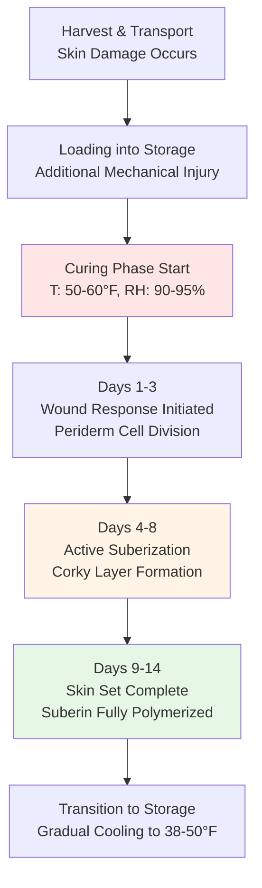

## Physical Basis of Potato Curing

Potato curing is a controlled environmental process that accelerates wound healing through suberization—the formation of a protective corky layer (suberin) over cut and abraded surfaces. This biochemical process depends critically on temperature and relative humidity, making precise HVAC control essential for economic storage success.

### Wound Healing Kinetics

The rate of suberin deposition follows temperature-dependent enzymatic kinetics. The wound healing rate can be modeled using a modified Arrhenius relationship:

$$
r_{healing} = A \cdot e^{-\frac{E_a}{RT}} \cdot f(RH)
$$

Where:
- $r_{healing}$ = wound healing rate (μm/day)
- $A$ = pre-exponential factor (variety-dependent)
- $E_a$ = activation energy for suberization (typically 45-55 kJ/mol)
- $R$ = universal gas constant (8.314 J/mol·K)
- $T$ = absolute temperature (K)
- $f(RH)$ = humidity correction factor

The humidity correction factor exhibits a threshold response:

$$
f(RH) = \begin{cases}
0.2 & \text{if } RH < 85\% \\
1.0 & \text{if } 90\% \leq RH \leq 95\% \\
0.6 & \text{if } RH > 98\%
\end{cases}
$$

At 50-60°F (10-15.6°C), optimal conditions yield healing rates of 8-12 μm/day, completing skin set in 10-14 days for wounds up to 100-150 μm depth.

### Thermodynamic Considerations

The curing environment must balance three competing requirements:

1. **Metabolic Heat Generation**: Respiration produces 3-5 BTU/hr per 100 lb of potatoes at curing temperatures
2. **Evaporative Cooling**: Water loss cools tubers but reduces marketable weight
3. **Condensation Prevention**: Surface moisture promotes bacterial soft rot

The sensible heat ratio during curing is typically 0.4-0.5, indicating substantial latent load from both respiration and necessary surface moisture maintenance.

## HVAC System Design Requirements

### Temperature Control

Maintain 50-60°F throughout the storage volume with spatial uniformity of ±2°F. The optimal curing temperature represents a compromise:

- **Below 50°F**: Enzymatic activity slows, extending curing time beyond economic feasibility
- **Above 60°F**: Respiration rates increase, promoting sprouting and pathogen growth

Supply air temperature should be within 3-5°F of storage setpoint to prevent local overcooling at air discharge points.

### Humidity Control

Target relative humidity of 90-95% creates the saturated boundary layer required for suberin synthesis without free water accumulation. The psychrometric requirement:

$$
RH_{target} = \frac{p_{v,air}}{p_{sat}(T_{surface})} \times 100\%
$$

Where:
- $p_{v,air}$ = vapor pressure in bulk air
- $p_{sat}(T_{surface})$ = saturation pressure at potato surface temperature

Achieve this through:
- **Humidification systems** (steam or evaporative) when outdoor air dewpoint is low
- **Minimal air changes** (0.5-1.0 ACH) to retain moisture
- **Recirculation mode** (90-95% recirculated air)

### Ventilation Strategy

Air velocity over potato piles should be 15-25 FPM to:
- Distribute temperature uniformly
- Prevent CO₂ accumulation (maintain <5000 ppm)
- Avoid excessive evaporative drying

The required airflow rate:

$$
CFM = \frac{Q_{total}}{1.08 \times \Delta T}
$$

For a 1000-ton storage with 4000 BTU/hr total load and 3°F temperature rise:

$$
CFM = \frac{4000}{1.08 \times 3} = 1235 \text{ CFM}
$$

## Curing Process Stages

## Comparison of Curing Protocols

| Parameter | Rapid Cure | Standard Cure | Extended Cure | Inadequate |
|-----------|-----------|---------------|---------------|------------|
| **Temperature** | 60-65°F | 50-60°F | 45-50°F | <45°F |
| **Relative Humidity** | 95-98% | 90-95% | 85-90% | <85% |
| **Duration** | 7-10 days | 10-14 days | 14-21 days | Variable |
| **Healing Depth** | 80-100 μm | 100-150 μm | 100-120 μm | <50 μm |
| **Energy Cost** | Low | Moderate | High | Very Low |
| **Disease Risk** | Elevated | Minimal | Low | High |
| **Sprouting Risk** | High | Low | Very Low | Low |
| **Storage Life** | 4-5 months | 6-8 months | 6-8 months | 2-3 months |
| **Weight Loss** | 2-3% | 1.5-2.5% | 1-2% | 0.5-1% |

## Equipment Specifications

### Refrigeration Capacity

Total cooling load consists of:

$$
Q_{total} = Q_{product} + Q_{respiration} + Q_{ambient} + Q_{equipment}
$$

For a 500-ton facility:
- Product cooling (60°F to 55°F over 14 days): 12,000 BTU/hr average
- Respiration heat: 7,500 BTU/hr
- Transmission losses (6" insulation, R-30): 8,000 BTU/hr
- Fan heat and infiltration: 3,500 BTU/hr
- **Total design load**: 31,000 BTU/hr (2.6 tons refrigeration)

### Humidification Requirements

Moisture addition rate to maintain 90-95% RH:

$$
W_{add} = \frac{CFM \times 4.5 \times \Delta W}{60}
$$

Where $\Delta W$ = difference between outdoor and target humidity ratio (lb/lb).

For 1200 CFM with outdoor conditions at 40°F, 60% RH entering storage at 55°F target:
- Outdoor humidity ratio: 0.0032 lb/lb
- Target humidity ratio (55°F, 92% RH): 0.0085 lb/lb
- $\Delta W$ = 0.0053 lb/lb
- Required humidification: 0.48 lb/min or 28.8 lb/hr

### Control System

Implement a staged control sequence:

1. **Primary control**: Modulating cooling to maintain 55°F ± 1°F
2. **Secondary control**: Humidifier stages on/off based on 90-95% RH setpoint
3. **Safety override**: High temperature alarm (>62°F) triggers maximum cooling
4. **Ventilation**: Time-based fresh air introduction (2-4 hours daily) for CO₂ management

## Performance Monitoring

Track these parameters continuously:
- **Temperature**: Multiple sensors at top, middle, bottom of pile
- **Relative humidity**: Aspirated sensors in return air stream
- **CO₂ concentration**: Weekly grab samples or continuous monitoring
- **Weight loss**: Periodic sampling to verify <3% total loss during cure

Successful curing produces firm, dry tubers with complete skin set, ready for transition to long-term storage at 38-50°F depending on intended use (fresh market, processing, or seed).

## Common Design Errors

Avoid these pitfalls:
- **Undersized humidification**: Leads to excessive weight loss and incomplete healing
- **Poor air distribution**: Creates temperature stratification and variable cure quality
- **Excessive fresh air**: Removes moisture faster than humidifiers can replace
- **Rapid cooling**: Initiates storage phase before wound healing completes
- **Inadequate monitoring**: Fails to detect equipment malfunctions during critical cure period

The curing phase determines storage success for the entire season. Proper HVAC design ensures uniform wound healing, minimizes disease development, and maximizes marketable yield.
